# 在 Python 中加载不同的数据文件

> 原文：<https://pub.towardsai.net/loading-different-data-files-in-python-b6385320c0f5?source=collection_archive---------0----------------------->

## [数据科学](https://towardsai.net/p/category/data-science)，[编程](https://towardsai.net/p/category/programming)， [Python](https://towardsai.net/p/category/programming/python)

## 来自 Excel、Pickle、Parquet、Stata、MATLAB、HDF5 和 Sas7bdat 文件


来源: [Pixabay](https://cdn.pixabay.com/photo/2014/04/05/11/28/internet-315799_1280.jpg)

Don not we all just love***PD . read _ CSV()***…这可能是我们亲爱的*熊猫*图书馆里最惹人喜爱的一句台词了。

> 毫无疑问，说到表格数据文件， [*CSV*](https://en.wikipedia.org/wiki/Comma-separated_values) s 是‘群里最酷的猫’。

事实是，数据文件有不同的类型和扩展名，作为数据专家，我们必须处理它们。

**ETL***(*[*提取、转换、加载*](https://en.wikipedia.org/wiki/Extract,_transform,_load) *)* 是主流数据处理的核心。所以今天我们将探索在 *Python* 中加载一些不同的数据类型。

我们列表中的第一项是在 *NumPy:* 中导入数据

# 目录

1.  [**在 Numpy 中导入数据**](#c3d9)
2.  [**从 Excel 文件导入数据**](#51b1)
3.  [**从 SAS 文件导入数据**](#c00d)
4.  [**从 STATA 文件导入数据**](#4347)
5.  [**从 HDF5 文件导入数据**](#3355)
6.  [**从 MATLAB 文件导入数据**](#b4b2)
7.  [**从 Pickle 文件导入数据**](#f6ca) **。**
8.  [**从拼花文件导入数据**](#d275)
9.  [**总结**](#78b1)

# 在 Numpy 中导入数据:


[img_credit](https://www.gautamkrishnar.com/an-intro-to-numpy/)

如果给定平面文件中的所有数据都是数字，或者如果我们打算只导入数字特征，Numpy 是理想的。因此得名 *Numpy* (数值- *Python* )。

**但是为什么 *Numpy* ？**

Numpy 数组是存储数字数据的 python 标准。它们高效、快速、干净。 *Numpy* 提供了核心多维数组对象，这是 *Python* 中大多数科学计算任务所必需的。这就是它位于 SciPy 堆栈的根的原因。

让我们探索一下加载数据的 NumPy 函数。

1.  **numpy.loadtxt()函数:**

该函数最适合纯数字数据。让我们让它发挥作用。首先，让我们在没有`***np*.*loadtxt()***`函数的情况下导入 titanic 数据集。


泰坦尼克号的前五行 _df

现在，让我们用`***np.loadtxt()***`函数导入它，并且只选择数字行和数字列。

所以在传递`***skiprows=1****,*` 时我们跳过了列标题。和 passing，`***usecols=*[0,1,4],**`我们只选择第 0、1、4 列，都是数值。

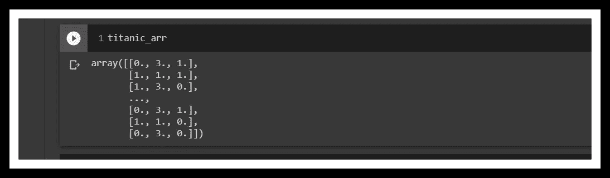

所以我们得到了一个好的、坚固的 numpy 数组，没有标题，只有 3 列。

> 注意 numpy 可以处理混合类型的数据…

**2。numpy.genfromtxt()函数:**

这个 *NumPy* 函数可以更好地处理混合数据类型。通过参数，`***dtype=None,***`,它将为每一列找出正确的数据类型。

缺点是它返回一个 **1D 数组**，其中每个元素都是导入的平面文件的一行。让我们使用`***np.genfromtxt()***` *导入相同的数据。*

所以我们传递数据集，然后我们传递`***delimiter=’,’***`告诉 *NumPy* 这是一个逗号分隔值文件。然后我们通过`***names=True***` 告诉 NumPy 数据集有列标题*。*

最后，我们通过`***dtype=None***` 和`***encoding=’utf8'***` *。*前者允许 NumPy 自己推断数据类型，后者强制执行`**‘utf8’**` 编码以避免任何转换问题，以防字节在转换过程中损坏或丢失。参见 [*链接*](https://docs.python.org/3/howto/unicode.html)

所以这个 **1D 数组**允许我们通过调用列名来索引数组。例如，如果我们想从这个数组中看到泰坦尼克号数据集上的前 10 个*票价*成本，我们可以简单地做:

```
**data[’fare’][:10]**
>>
# And the output is:**array([  7.25  ,  71.2833,   7.925 ,  53.1   ,   8.05  ,   8.4583,    51.8625,  21.075 ,  11.1333,  30.0708])**
```

> 将混合类型的数据传递给 numpy 不是最佳做法。请将混合数据类型放在 pandas 数据框中。

**3。numpy.recfromcsv()函数:**

该功能与`***np.genfromtxt()***` 功能完全相同。只是默认情况下它拥有所有的参数。意，我们不需要传递，`**names, delimiter**` **或** `***dtype***` **args。**

```
# function *np.recfromcsv()* has the defaults delimiter=',' and names=True in addition to dtype=None.# So we only pass it the file to read.**data = np.recfromcsv('titanic.csv')**# This returns the exact same array we saw from *np.genfromtxt(*).
```

# 从 Excel 文件导入数据:


来源:[谷歌搜索](https://www.google.com/url?sa=i&url=https%3A%2F%2Ftealtek.co.za%2Fbenefits-of-microsoft-excel-in-the-work-place%2F&psig=AOvVaw3f2K2gW6LWJo_lF--OGbjb&ust=1591018529508000&source=images&cd=vfe&ved=0CAIQjRxqFwoTCPCxzoWc3ukCFQAAAAAdAAAAABAD)

Excel 文件有点棘手，因为它们可能包含几个工作表。所以解析数据并选择相关的工作表是最理想的。

从上面的 Git-gist 中，我们提取了`***battle_link***` excel 文件，并使用``***pd.ExcelFile()`***` 函数将其作为`***pandas.io.excel***` 对象加载。然后我们打印出工作表名称，`**`*print(xls.sheet_names)`***`，并得到工作表名称的列表:-**[‘2002’，‘2004’]**。

这告诉我们，这个文件中只有两张表。

1.  **pd.parse()函数:**

我们可以使用`***parse()***` ***的方法，按名称或索引选择任何一个工作表。*** 让我们按其名称载入一张表…

```
# Load a sheet into a Data Frame by name: df1**df1 = xls.parse('2004')**# Print the head of the DataFrame df1**df1.head()
>>**
```

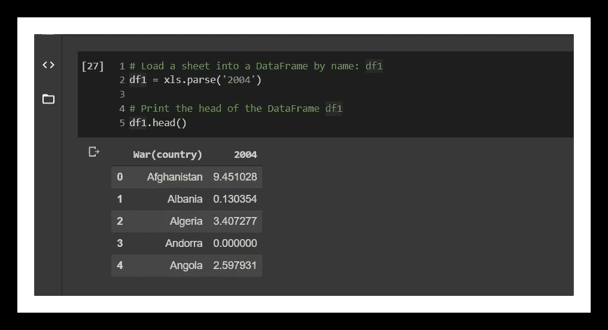

将 Excel 表格按表格名称加载到 pandas。

接下来，让我们通过索引加载另一个工作表…

```
# Load a sheet into a DataFrame by index: df2**df2 = xls.parse(0)**# Print the head of the DataFrame df2**print(df2.head())
>>**
```

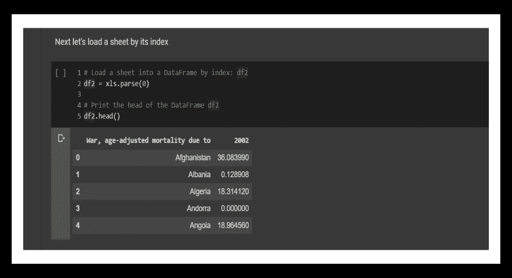

将 Excel 表格中的表格索引加载到 pandas 中。

**在 pandas 中自定义您的 Excel 电子表格导入:**

就像我们在 *NumPy* 中所做的一样，我们可以使用额外的参数来跳过行、重命名列，并且也可以使用 *Excel* 文件只选择特定的列。

和以前一样，我们将使用方法`***pd.parse()***`。不过这一次，我们将添加附加参数`***skiprows***, ***names***` 和`***usecols***`。注意，传递给这些参数的值必须是类型**列表**。

**A.** 让我们解析第一个工作表(‘2002’或索引 0)并重命名它的列

```
# Parse the first sheet and rename all the columns:**df1 = xls.parse(0, skiprows=[1], names=['Country','AAM due to War (2002)'])**# Print the head of the DataFrame df1**print(df1.head())
>>**
```

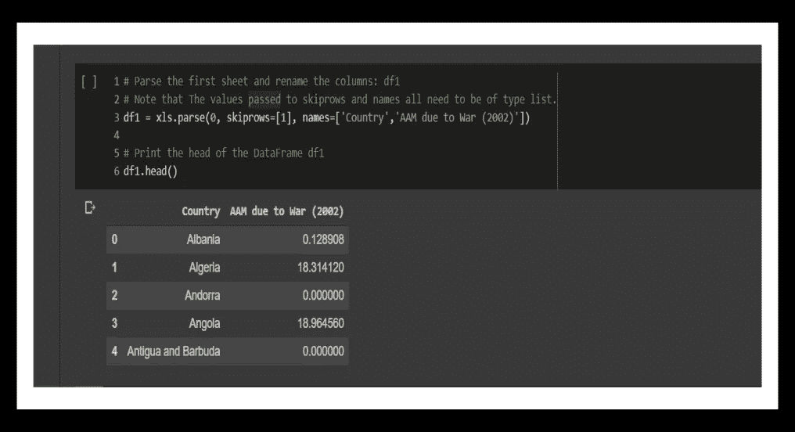

应用 skiprows 和 names 参数自定义 Excel 导入。

**B.** 让我们只解析第二个工作表的第一列，并将其重命名。

```
# Parse the first column of the second sheet and rename the column:**df2 = xls.parse(1, usecols=[0], skiprows=[1], names=['Country'])**# Print the head of the DataFrame df2**print(df2.head())
>>**
```

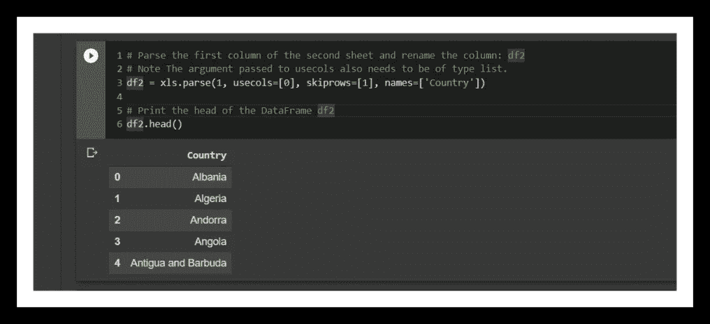

应用 usecols、skiprows 和 names 参数自定义 Excel 导入。

2. **pd.read_excel()函数:**

这个函数更常用于加载 Excel 文件。 pandas 将 Excel 数据直接读入 *Pandas 数据框*对象，而不是先 [*解析数据*](https://en.wikipedia.org/wiki/Parsing) *。而像*`***pd.parse()***`*我们完全可以用`***pd.read_excel()***` *定制进口。****

*有了这个函数，我们不必将所有参数都限制在列表中。我们可以将一个字符串传递给`***sheet_name***`，将一个 int 传递给`***skiprows***`，但是`***names***`和`***usecols***`*必须有一个列表。**

**例如，让我们只从名为“2004”的工作表中选择第一列，跳过第一行，在一行代码中将该列重命名为`**‘war_Country’**` …。**

```
****data_2 = pd.read_excel(battle_link, sheet_name='2004', usecols=[0], skiprows=0, names=['War_Country'])****data_2.head()
>>****
```

**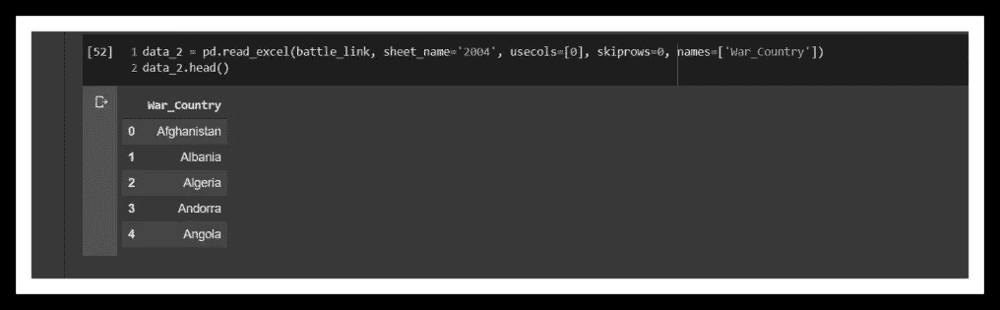**

**这是一行程序的输出…**

# **从 SAS 文件导入数据:**

****

**来源: [SAS](https://www.sas.com/en_us/_jcr_content/socialShareImage.img.png)**

**SAS 代表 [***统计分析系统***](https://www.sas.com/en_us/company-information/profile.html)**SAS*是使用 [SAS 编程语言对数据进行挖掘、修改、管理和执行统计分析的软件套件。](https://en.wikipedia.org/wiki/SAS_language) *SAS* 是一家值得信赖的分析公司，拥有超过 40 年的分析创新经验。SAS 数据文件的扩展名为`***.sas7bdat***`。***

**所以我们在熊猫里导入一个 *SAS* 文件。**

**根据上面的要点，我们将*熊猫作为 pd* 导入。然后我们安装`***sas7bdat***` (全小写)包，这是 *SAS* 中默认的数据集文件包。**

**从这个包中，我们导入`***SAS7BDAT***`(全部大写)，它类似于上下文管理器，我们可以使用它来读入并绑定`***sales.sas7bdat***` 文件到 *Pandas* 数据帧。**

**注意，在上下文管理器中，我们将`***sales.sas7bdat***`文件读入为`***files***` ，并使用`***.to_data_frame()***` 方法… `***`df_sas = files.to_data_frame()`***` *将其绑定到一个*熊猫*数据帧。***

*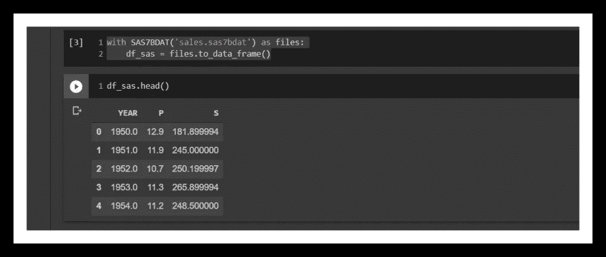*

*熊猫数据框中 sales.sas7bdat 文件的前五行。*

*让我们看看 SAS 数据帧的`**P-values**`特征的直方图。*

```
***df_sas.P.hist()
plt.ylabel('count')
plt.title('Histogram of P-Values')
plt.show()***
```

*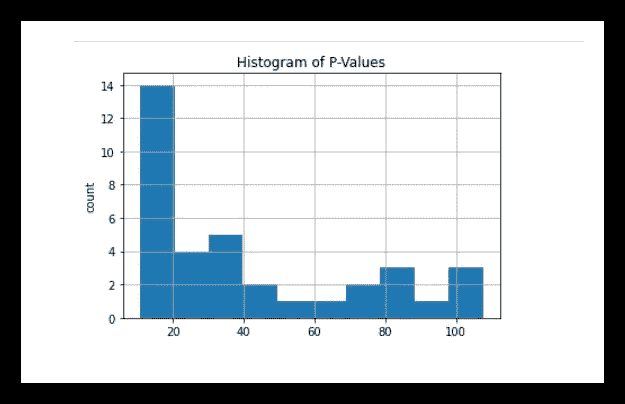*

*SAS 销售数据框架中的 P 值直方图。*

# *从 Stata 文件导入数据:*

**

*[来源:谷歌搜索](https://www.google.com/url?sa=i&url=https%3A%2F%2Flibguides.napier.ac.uk%2Fstats%2Fstata&psig=AOvVaw3mZOZuWyfFmnudNVuCw_eC&ust=1591278874774000&source=images&cd=vfe&ved=0CAIQjRxqFwoTCPCev_fl5ekCFQAAAAAdAAAAABAU)*

*[***Stata***](https://www.stata.com/)是对统计数据的缩写。 *Stata* 文件流行于学术社会科学研究。 *Stata* 文件的扩展名为 `***.dta***`。*

*好消息是*熊猫*有一个读取 *Stata* 文件的内置函数。所以我们不需要像处理 *SAS* 文件那样的上下文管理器。让我们导入一个 *Stata* 文件，其中包含某些国家的传染病范围…*

*所以我们简单地使用 *wget* 命令下载数据集，然后我们通过将它传递给 *pandas* `***read_stata()***`函数来创建一个数据框。*

*让我们看看前五行和`***disa10***`特征的直方图。*

*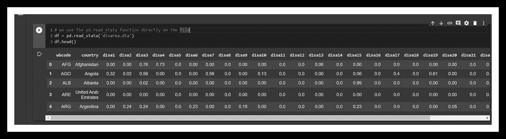*

*的数据帧的前五行。dta 文件。*

*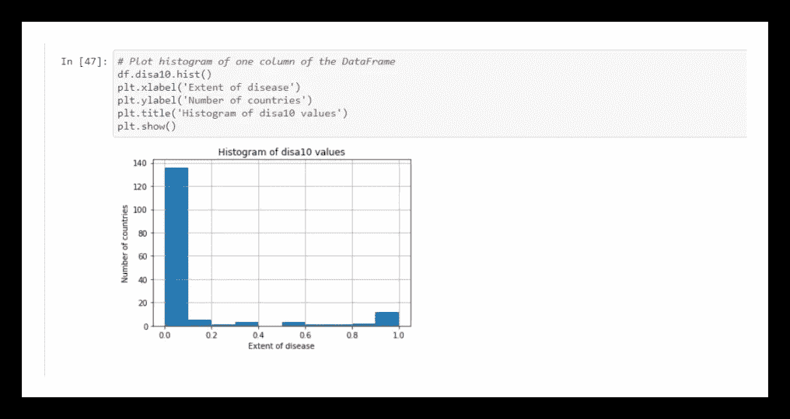*

*disa10 特征的历史图。*

*我们可以通过将参数传递给该函数的几个参数来自定义导入。比如:- `**pd.read_stata(*index_col=*, *convert_missing=*, *preserve_dtypes=*, *chunksize=*, *iterator=*)**` **。参见** [***链接***](https://pandas.pydata.org/pandas-docs/stable/reference/api/pandas.read_stata.html)*

# *从 HDF5 文件导入数据:*

*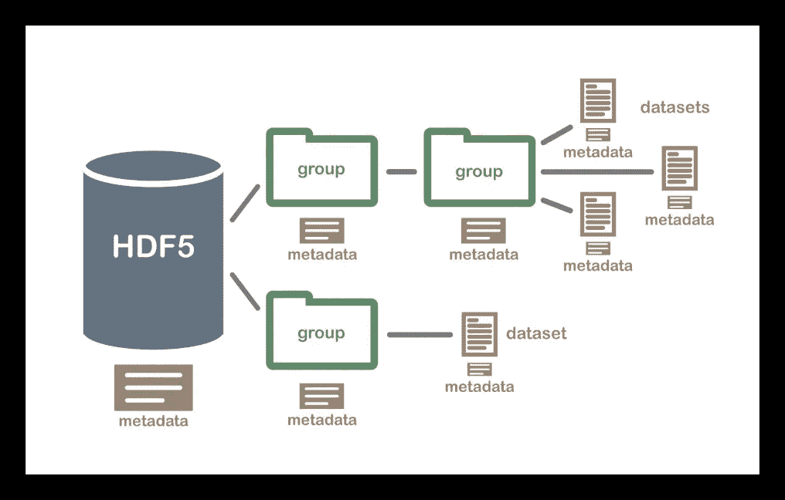*

*HDF5 数据结构… [img_credit](https://www.google.com/url?sa=i&url=https%3A%2F%2Fwww.neonscience.org%2Fabout-hdf5&psig=AOvVaw0pAlqoBUlhQmf_-W-YwjKS&ust=1591281018926000&source=images&cd=vfe&ved=0CAIQjRxqFwoTCKiwgvTt5ekCFQAAAAAdAAAAABAD)*

*在 Python 世界中，一种共识正在迅速汇聚到作为存储大量数字数据的标准机制的`**Hierarchical Data Format Version 5**`上。现在，处理数百千兆字节或万亿字节大小的数据集变得越来越常见。`**HDF5**`本身可以扩展到**艾字节**的数据量。*

## *HDF5 文件的结构是什么？*

*我们可以像 Python 字典一样使用 ***keys()*** 的方法来探索它的层次结构。*

```
***for key in data.keys():
    print(key)***
```

*这将返回数据集中现有的键。这些都是 HDF 集团。它们就像目录。请注意， **HDF5** 项目由位于伊利诺伊州香槟市的 **HDF** 小组积极维护，该小组以前是伊利诺伊大学香槟分校的一部分。*

*让我们加载 ***LIGO HDF5*** 数据集。 ***LIGO*** 代表`**Laser Interferometer Gravitational-Wave Observatory Project**`。这个项目验证了爱因斯坦的引力波理论。*

## *使用 h5py 导入 HDF5 文件。*

***h5py** 包是`**HDF5**`二进制数据格式的 Pythonic 接口。它可以让你存储大量的数字数据，并轻松地操作这些数据。参见 [***链接***](https://www.h5py.org/) ***。****

*因此，根据上面的 Git-gist，我们将`***LIGO***`数据集下载到我们的工作区。然后使用 h5py 上下文管理器，我们将`**LIGO**`数据读入一个名为`***data***`的`***h5py.File***`对象。该对象具有嵌套 Python 字典的树状结构。这意味着父关键字有一些值，而这些值又可能包含压缩数据的其他嵌套值。*

*比如我们来探究一下`***data***` 对象的`**‘strain’**` 键。*

```
***type(data['strain'])
>> h5py._hl.group.Group***
```

*所以我们可以看到它是一个`***h5py.Group***` 的物体，让我们看看，它有子键吗？*

```
***data['strain'].keys()
>> 'Strain'** # So it has a 'Strain' sub-key...*
```

*现在让我们提取 `**‘Strain’**`子键中的值并保存到一个数组中*

```
***strain = data['strain']['Strain'].value** **print(type(strain))
>> numpy.ndarray***
```

*让我们看看数组的形状*

```
***array.shape
>>(131072,)** # It has 131072 elements...*
```

*最后，让我们画出`***strain***`的前 10000 个元素，比如时序数据…*

```
***import matplotlib.pyplot as plt**# Set number of time points to sample: num_samples
**num_samples = 10000**# Set time vector
**time = np.arange(0, 1, 1/num_samples)**# Plot data**plt.plot(time, strain[:num_samples])
plt.xlabel('GPS Time (s)')
plt.ylabel('strain')
plt.title('Time/Strain Chart')
plt.show()***
```

*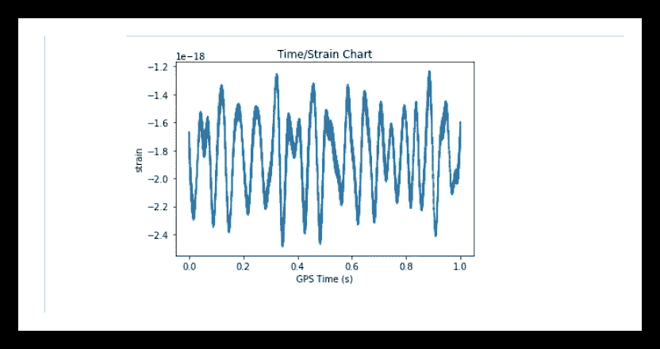*

*来自 LIGO HDF5 数据集的 10000 个数据点的时间序列图。*

# *从 MATLAB 文件导入数据:*

**

*[img_credit](https://www.electronicshub.org/wp-content/uploads/2014/10/MATLAB-Logo.png)*

****MATLAB*** 无需介绍。Cleve Moler 教授是 Fortran 编程语言的专家，他的一个发明。作为新墨西哥大学 T49 的*数学 T43 和 T44 计算机科学 T45 的教授，他很快发现 Fortran*对学生来说在语法上是多么沉重和困难。于是他在 1984 年创造了*MATLAB*(Matrix Laboratory 的缩写)，剩下的就是历史了。*

***如何用 Python 导入 MATLAB 文件…***

**MATLAB* 文件的扩展名为`***.mat***`，我们从*阿尔贝克实验室*的*加州大学戴维斯分校*导入一个 *MATLAB* 文件。它包含基因表达数据。*

*我们将使用*Python*[***scipy***](https://www.scipy.org/)库来读取 *MATLAB* 文件。因此，我们通过 *wget* 下载``'***ja_data2.mat***'``文件，然后使用`***scipy.io.loadmat()***` 函数将其加载到一个名为`***mat***`的变量中。*

> *你猜怎么着…这个变量 mat，只是一个 Python 字典。所以再一次，我们能看到字典有多强大吗？*

*我们有了另一个嵌套字典的树状数据结构，就像我们对`**HDF5**`文件所做的那样。*

*让我们探索一下`***mat***` 对象，从它的关键点开始。*

```
*# It's a dictionary so let's see the keys **for key in mat.keys():
    print(key)****>>**
***__header__ 
__version__ 
__globals__ 
rfpCyt 
rfpNuc 
cfpNuc 
cfpCyt 
yfpNuc 
yfpCyt 
CYratioCyt****
```

**(* `***CYratioCyt***` *)* 上面最后一个键，看看它有什么价值…*

```
*# Let's see what type of object the CyratioCyt object is**print(type(mat['CYratioCyt']))
>>
<class 'numpy.ndarray'>***
```

*它包含一个 *numpy* 数组。太棒了！所以我们可以检查它的形状，甚至用它制作一个数据框，像平常一样探索。让我们这样做吧…*

```
*# Since it's a numpy array, lets see its shape**print(mat['CYratioCyt'].shape)
>>
*(200, 137)***# Next, let's make a Data Frame out of it.**import pandas as pd
Cy_df = pd.DataFrame(mat['CYratioCyt'])**# Let's see the first five rows
**Cy_df.head()
>>***
```

*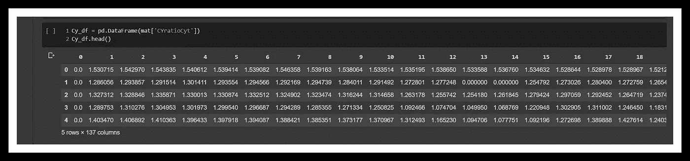*

*Cy_df 数据帧的头…*

*最后，让我们子集化`***Cy_df***` 并绘制第 25 行的第 5 列到最后一列。*

```
***data = mat['CYratioCyt'][25, 5:]****fig = plt.figure()
plt.plot(data)
plt.xlabel('time (min.)')
plt.ylabel('normalized fluorescence (measure of expression)')
plt.show()***
```

*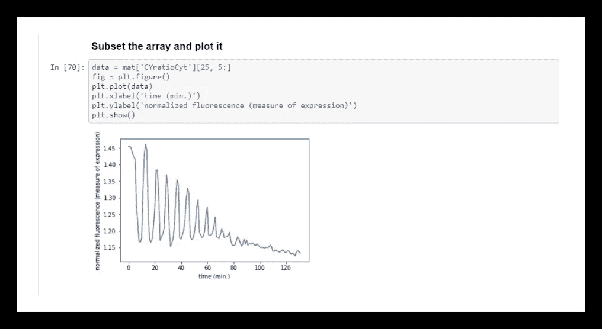*

*CyratioCyt 数据子集的图。*

# *从 Pickle 文件导入数据:*

*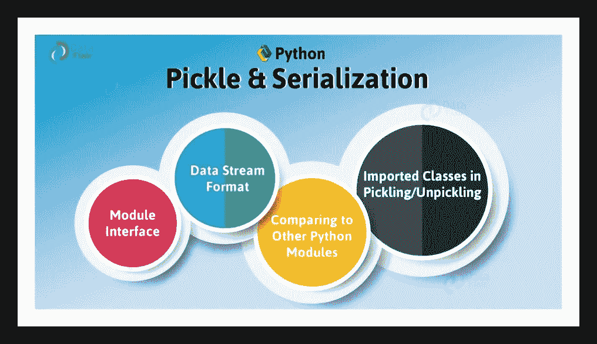*

*[img_credit](https://data-flair.training/blogs/wp-content/uploads/sites/2/2018/03/Serialization-in-Python-01.jpg)*

## *那么什么是腌制呢？*

> *[*【酸洗】*](https://docs.python.org/3/library/pickle.html) 是将 Python 对象层次转换成字节流的过程，*【解酸洗】*是逆操作，将字节流(来自[二进制文件](https://docs.python.org/3/glossary.html#term-binary-file)或[类字节对象](https://docs.python.org/3/glossary.html#term-bytes-like-object))转换回对象层次。*

*在某些编程语言中，它被称为 ***串行化*** 、 ***编组*** 或 ***扁平化*** 。但是在 *Python* 中，我们称之为*酸洗*。*

*我们可以保存 *Python 列表*、*字典*、*训练过的机器学习*模型，甚至数据集，以及几乎所有 *Python* 对象到 *pickle* 。*

*例如，处理*非常大的数据集很有意义，而不是每次运行分析时都将它们加载到内存中。酸洗速度更快，内存效率更高。速度快 50 到 1000 倍。有时候远的多，看大小……[***链接***](https://pythonprogramming.net/python-pickle-module-save-objects-serialization/)**

***那么我们如何用 Python 加载 Pickle 文件……***

1.  *先来看一下**[*ratings . CSV*](http://moviedataset.zip https://s3-api.us-geo.objectstorage.softlayer.net/cf-courses-data/CognitiveClass/ML0101ENv3/labs/moviedataset.zip)dataset 来自**[***group lens***](https://grouplens.org/)***。*** 这个数据集有超过 2200 万行的电影分级数据。*****

****从上面的 Git-gist，我们通过`***wget***`下载了 `***ratings.csv***`文件。然后我们创建了一个名为`***ratings.pickle***`的 pickle 字节流占位符对象。最后，我们将`***ratings.csv***`文件转储到`***ratings.pickle***` 对象中，使用`***pickle.dump()***` 函数，然后我们关闭连接。****

****现在，我们可以看到保存在工作区中的`***ratings.pickle***`文件。****

****2.接下来，让我们 ***取消拾取*** 对象并将其加载到熊猫数据框中…****

****所以，在这里，我们把`***ratings.pickle***`二进制文件读作 ***f*** 。然后我们使用`***pickle.load()***`函数对*进行拆包，并将*加载到一个名为`***ratings_data***` *的变量中，*****f****被转换回拆包后的 *ratings.csv* 文件*。*********

> ****因此，我们基本上已经将 ratings.csv 文件提取为 ratings.pickle 对象，并将 ratings.pickle 对象提取回 ratings.csv 文件，保存为变量 ratings_data。****

****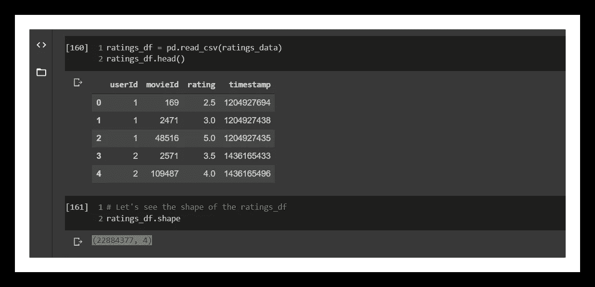****

****pickle_df 数据帧的前五行****

******腌制的真正魔力……******

****让我们仔细看看我们做的*腌制*练习。让我们比较一下`***ratings.csv***`文件和`***ratings.pickle***`文件的大小。****

****令人惊讶的是，`***ratings.pickle***`只有 **21 字节**的数据，而`***ratings.csv***`却有超过**6.2 亿字节**的数据。简直太神奇了！通过将数据集应用于 *pickle* ，我们将其缩小了超过***2950 万倍于其原始大小*** 。****

> ****请注意，除了`***.pickle***`之外，pickle 文件还有扩展名`***.pkl***`。前者在 python 2 中很常见。参见 [***链接***](https://stackoverflow.com/questions/40433474/preferred-or-most-common-file-extension-for-a-python-pickle)****

# ****从拼花文件导入数据:****

********

****[img_credit](https://www.google.com/url?sa=i&url=https%3A%2F%2Fwww.slideshare.net%2Fmegrhihaikel%2Fapache-parquet&psig=AOvVaw07eMhr2ydinOu5wK9IE7--&ust=1591618396258000&source=images&cd=vfe&ved=0CAIQjRxqFwoTCJifr-XW7-kCFQAAAAAdAAAAABAW)****

****[***Apache Parquet***](http://parquet.apache.org/)项目提供了一种标准化的开源列存储格式，用于数据分析系统。它最初是为在[***Apache Hadoop***](http://hadoop.apache.org/)中使用而创建的。****

*******拼花*** 文件里写满了大数据处理。事实上，我第一次使用它是在 ***Pyspark*** 的一个项目中。****

******那么为什么要用*拼花*文件呢？******

****基本上， ***Parquet*** 是一种列文件格式，而 *CSV* 是基于行的。对于大多数分析查询，列式文件格式更有效。您可以通过转换 CSV 文件和处理 *Parquet* 文件来加速许多数据帧查询。另外，*拼花*文件比 *CSV* 文件更节省内存。****

****好，让我们从我们一直使用的`***ratings.csv***`文件创建一个*拼花*文件对象。****

****熊猫来救援了！我们定义了一个简单的方法，它接受一个文件名(一个字符串)并创建一个数据帧*(****df****)*，我们使用 *Pandas* 的`***df.to_parquet()***`函数将它转换成一个 *Parquet* 文件。该方法将一个*拼花*文件保存到当前工作目录。****

****所以我们将`**‘*ratings.csv’***`文件传递给方法，并创建了`***ratings.parquet***`。****

****接下来，我们比较了 `***ratings.parquet***`和`***ratings.csv***` 的大小，正如所料，`***ratings.csv***` 的大小是`***ratings.parquet***` *的四倍多。*****

******在 Pandas 中加载拼花文件…******

****最后，我们简单地将`**‘*ratings.parquet’***` 作为参数传递给`**pd.read_parquet()**`函数。这将创建一个 DataFrame 对象。请注意，这个函数有自己的一组参数，我们可以自定义这些参数。发现于 [**熊猫**](https://pandas.pydata.org/pandas-docs/stable/reference/api/pandas.read_parquet.html) 。****

****`**parquet_df = pd.read_parquet(‘/content/ratings.parquet’)**`****

****`**parquet_df.head()**`****

****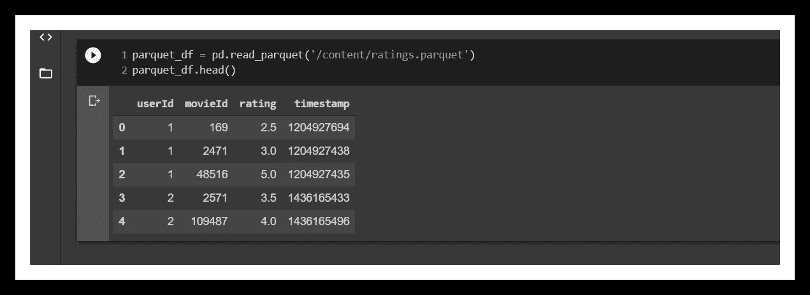****

****parquet_df 数据帧的头。****

# ****总结:****

****这是一篇非常详细的文章，有些概念可能相对较新。最好把这个保存在你的阅读清单里，以备将来参考。****

****我们已经看到了如何从各种格式读取数据，如 ***、MATLAB*** 、 ***SAS*** 、 ***Stata*** 、 ***Pickle、Parquet、Excel、HDF5 和 NumPy*** 。我们已经探索了来自 ***pandas、scipy*** 和 ***Python*** 模块的各种函数，最重要的是，我很高兴我已经能够展示作为 ***数据专业人员*** ，我们可以处理几乎所有类型的数据文件。****

****见本文 [***这里***](https://github.com/Lawrence-Krukrubo/Effective_Python) 包含笔记本的 Git-Repo。它还包含一个关于在 python 中使用关系数据库的教程。****

****最后，请随意查看来自`**Datacamp**`的课程“[python](https://learn.datacamp.com/courses/introduction-to-importing-data-in-python)导入数据简介”。****

******干杯！******

## ****关于我:****

****劳伦斯是技术层的数据专家，对公平和可解释的人工智能和数据科学充满热情。我持有 IBM 的 ***数据科学专业*** *和* ***高级数据科学专业*** *证书。我已经使用 ML 和 DL 库进行了几个项目，我喜欢尽可能多地编写函数代码，即使现有的库比比皆是。最后，我从未停止学习和实验，是的，我拥有几个数据科学和人工智能认证，并且我已经写了几篇强烈推荐的文章。*****

****请随时在以下网址找到我****

****[**Github**](https://github.com/Lawrence-Krukrubo)****

****[**领英**](https://www.linkedin.com/in/lawrencekrukrubo/)****

****[**推特**](https://twitter.com/LKrukrubo)****