# 贷款偿还 ML 建模

> 原文：<https://pub.towardsai.net/loan-repayment-ml-modeling-d8b0212f6a90?source=collection_archive---------2----------------------->

## [机器学习](https://towardsai.net/p/category/machine-learning)

## 构建最佳模型

图片由 [Nattanan Kanchanaprat](https://pixabay.com/users/nattanan23-6312362/?utm_source=link-attribution&utm_medium=referral&utm_campaign=image&utm_content=2696229) 来自 [Pixabay](https://pixabay.com/?utm_source=link-attribution&utm_medium=referral&utm_campaign=image&utm_content=2696229)

随着通货膨胀率的上升，贷款申请在过去的十年里有了很大的增长。对于一个普通男人来说，生活成本总是在努力寻找与辛苦挣来的工资的平衡。为了在更短的时间内实现梦想或抱负，如今人们严重依赖贷款。在这个过程中，用户总是试图在市场上找到可以以非常低的利率给他们贷款的贷款人。借款人很有可能卷入与欺诈相关的案件，导致偿还巨额贷款。为了防止市场上的骗局，并确保借款人可以接触到值得信赖的贷款人，我决定提出这个 Kaggle 项目。

# 介绍

在这里，我们建立了一个模型，允许贷方根据借款人的财务历史来分析借款人，并得出是否必须向他们提供贷款的结论。该模型考虑了如此多的因素，然后根据该模型计算出客户是否值得信任以提供贷款，以及他是否能够及时偿还贷款。最初，我们对提供的数据进行分析，以根据数据集得出各种结论。之后，我们使用不同的算法建立模型，并选择最适合的模型。

我已经使用了以下来自 Kaggle 的数据集来驱动这个项目。

 [## kiran _ 贷款

### 数据集由各种字段的贷款描述组成

www.kaggle.com](https://www.kaggle.com/kirankarri/kiran-loans) 

以下是数据集中每个特征的简短描述:

*   **credit_policy** :如果客户符合 LendingClub.com 的信用核保标准，则为 1，否则为 0。
*   **用途**:借款用途，如信用卡、债务合并等。
*   **int_rate** :贷款的利率(比例)。
*   **分期付款**:如果贷款有资金支持，借款人所欠的每月分期付款($)。
*   **log_annual_inc** :借款人年收入的自然对数。
*   **dti** :借款人的债务收入比。
*   **fico** :借款人的 fico 信用评分。
*   **days_with_cr_line** :借款人拥有信用额度的天数。
*   **循环余额**:借款人的循环余额。
*   **:借款人的循环额度使用率。**
*   ****inq_last_6mths** :借款人最近 6 个月被债权人查询的次数。**
*   ****de inq _ 2 yers**:在过去的 2 年中，借款人超过 30 天未付款的次数。**
*   ****pub_rec** :借款人的贬损公开记录数。**
*   ****not _ fully _ payed**:表示贷款是否未全部偿还(借款人违约或借款人被认为不可能偿还)。**

# **步骤 1 加载数据并执行一些基本分析**

**使用熊猫的命令提取数据。大约有 14 列 9578 行代表数据。**

****

**作者图片**

**对存在多少空值以及 describe 函数向用户指示了什么进行一些分析。**

**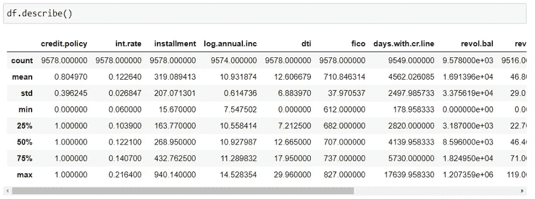**

**作者图片**

**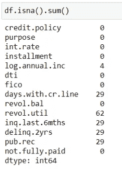**

**作者图片**

# **步骤 2 选择使用 Word Cloud 贷款的最常见原因是什么？**

**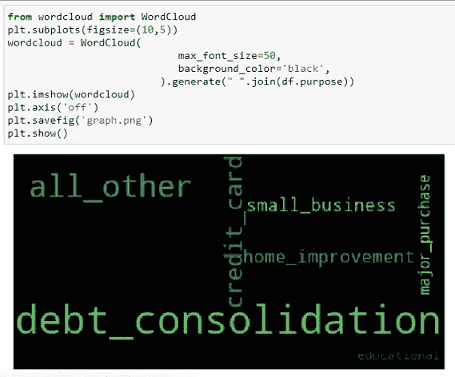**

**作者图片**

# **步骤 3-通过用 mean()替换空值来执行数据清理**

**我们用列的平均值替换每一列的空值。**

**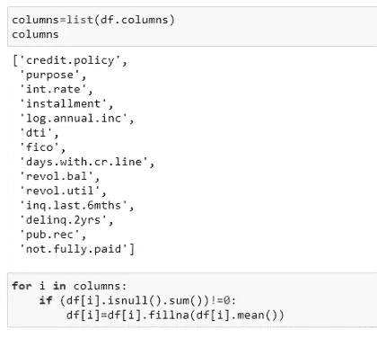**

**作者图片**

# **第 4 步:根据贷款偿还情况对贷款用途进行分类，从而分析贷款用途**

**我们检查贷款使用和购买贷款的目的之间的相关性，然后根据贷款偿还产出对它们进行分类。**

**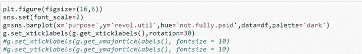**

**作者图片**

**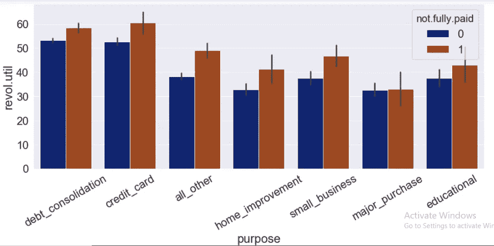**

**作者图片**

# **第五步基于债务收入比与年收入的分析**

**从下面的分析中可以清楚地看到，中等收入的人大多是负债累累。这一切都表明了这样一个事实:富人越来越富，穷人越来越穷。**

********

**作者图片**

**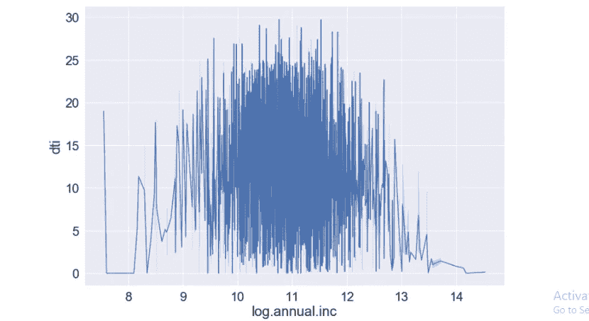**

**作者图片**

# **第 6 步:确定贷方通常向客户收取的利率**

**首先，我们将利率乘以 100，转换成百分比。稍后，我们使用直方图分析目标的最高频率范围。**

**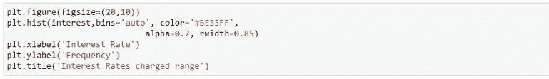**

**作者图片**

**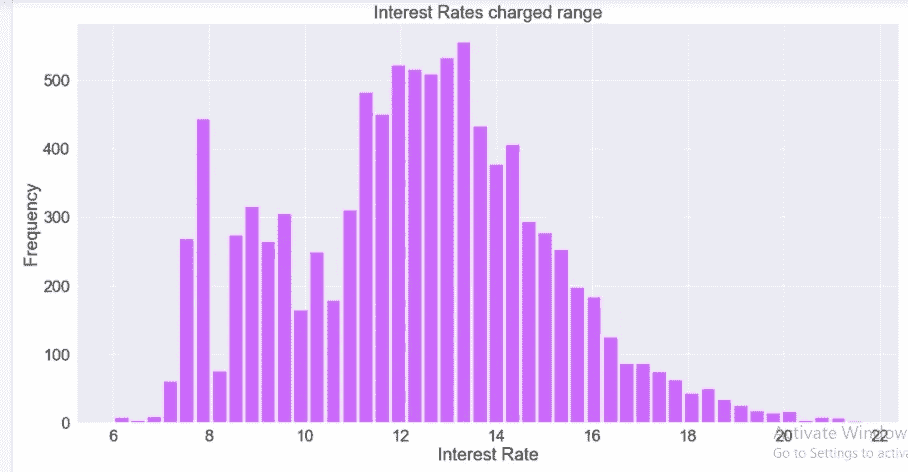**

**作者图片**

# **第 7 步:基于贷款偿还的已完成查询与分期付款**

**在这里，我们尝试绘制过去 6 个月与他们每月支付的分期付款的相对互动图。必须指出的是，有时高分期付款的客户可能会跳过付款，这可能会导致查询电话。此外，上述分析可以映射到该人是否及时完成了贷款偿还。**

******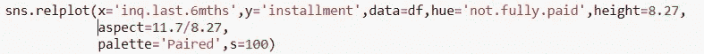**

**作者图片**

**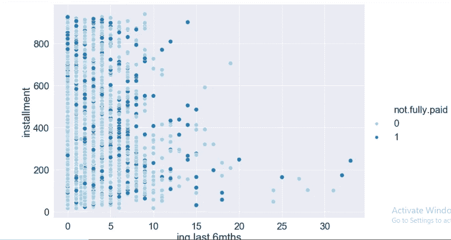**

**作者图片**

# **步骤 8 对目的列进行分类编码**

**由于“目的”列包含的值是字符串，因此我们需要在定型模型之前对它们进行分类编码。**

**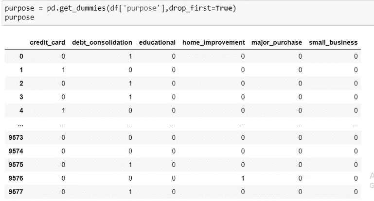**

**作者图片**

**新创建的表示目的列的数据帧需要用原始数据帧进行编码。**

**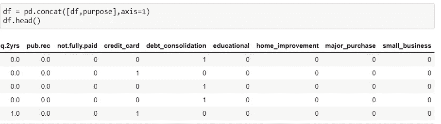**

**作者图片**

# **第 9 步:可视化特征之间的相关性**

**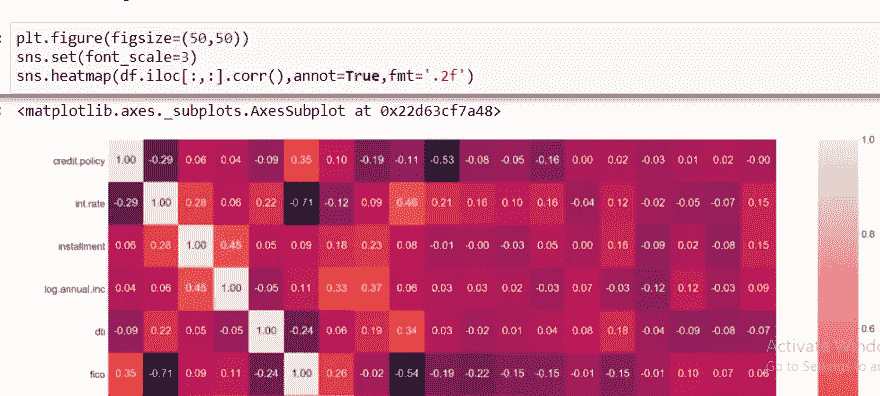**

**作者图片**

# **步骤 10:可视化分布图**

**我们找到 14 个特征中的几个特征的分布图，并验证它们是否遵循正态分布图。**

**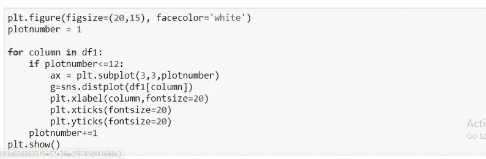**

**作者图片**

****

**作者图片**

# **步骤 11:对独立特征应用标准归一化**

**由于每个特征在不同的比例上，我们需要应用标准化技术来确保所有特征都存在于同一平面上。因此，最初我们将数据集分为独立要素和相关要素。**

**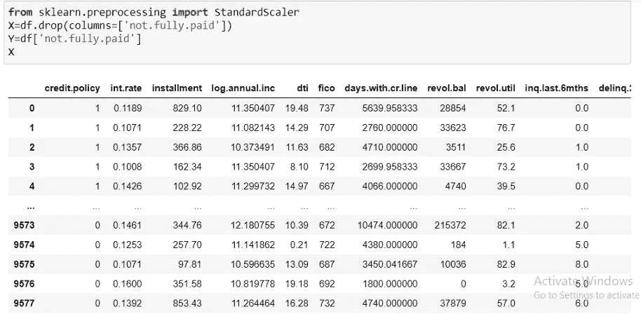**

**作者图片**

**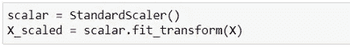**

**作者图片**

# **步骤 12:建立逻辑回归模型**

**最初，我们将数据分为训练和测试数据，然后将模型与训练数据相匹配。一旦模型适合训练数据，我们就用测试数据来测试它。一旦预测了测试数据的输出，我们就通过比较预测结果和实际结果来检查准确性。**

**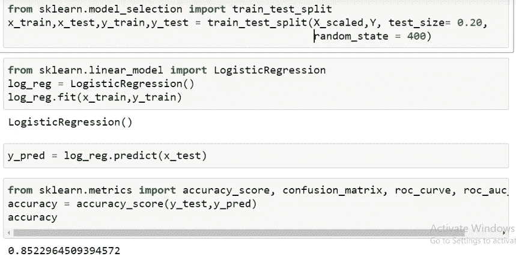**

**作者图片**

# **步骤 13 构建决策树分类器**

**与上面类似，我们将数据分为训练集和测试集，然后使用训练集创建一个模型。**

**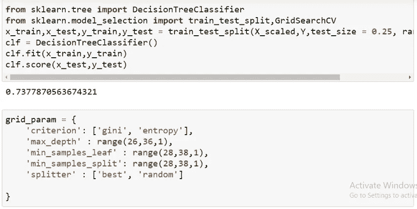**

**作者图片**

**我们在这里引入的唯一变化是使用 GridSearchCV 增加了超参数调整。**

****

**作者图片**

**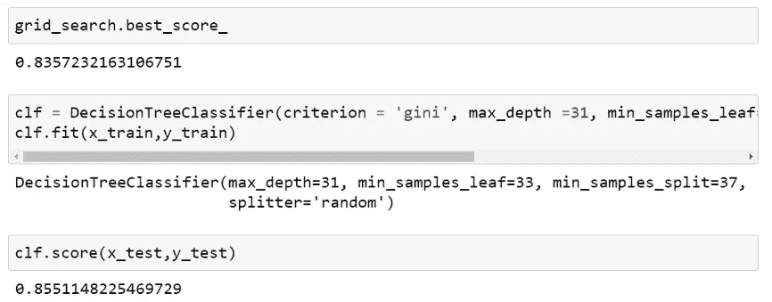**

**作者图片**

# **步骤 14 构建 XGB 分类器**

**XGB 模型也是使用 GridSearch CV 以与决策树分类器相同的方式构建的。我们获得了比决策树分类器稍低的准确度。**

**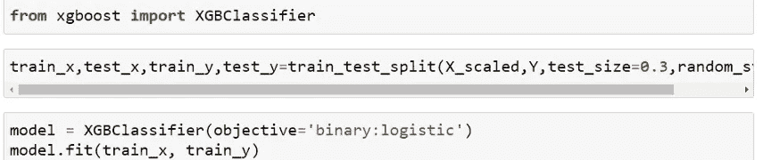**

**作者图片**

**正如我们在下图中看到的，对于未知或测试数据集，精度会迅速下降。所以我们需要进行参数调整**

**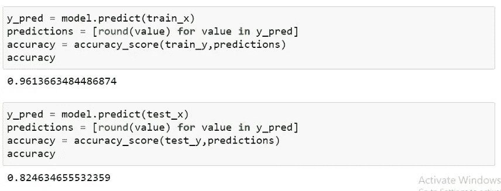**

**作者图片**

**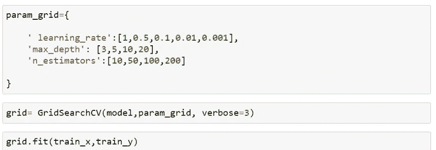**

**作者图片**

**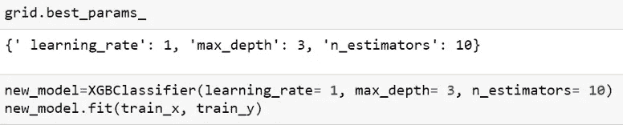**

**作者图片**

****

**作者图片**

# **步骤 15 构建 KNN 模型**

**我们在 KNN 模型构建的上下文中执行与上面相同的操作。**

**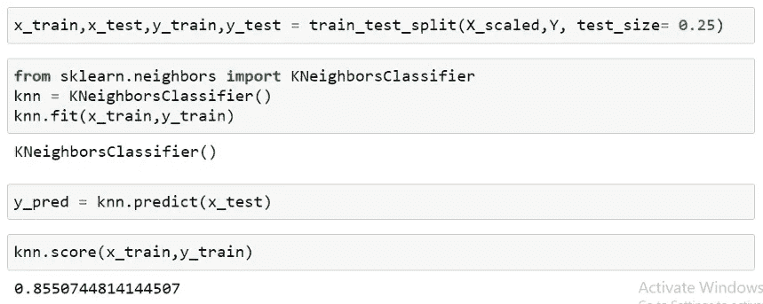**

**作者图片**

**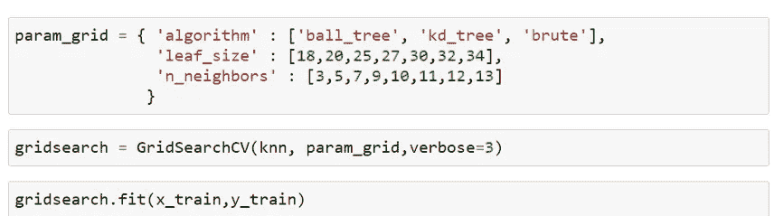**

**作者图片**

**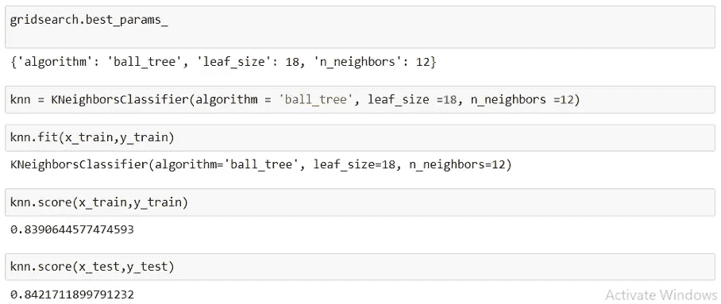**

**作者图片**

**正如我们可以从所有给定的模型中看到的，最佳结果是从决策树分类器中获得的，因此我们得出结论，决策树模型可以使用 pickle 文件存储，然后应用于未知数据集以产生最准确的结果。**

**感谢您朗读文章！！**

**对于模型的烧瓶集成，请参考下面描述中的 GitHub 链接。**

**参考资料:**

** [## 使用机器学习算法的贷款偿还预测

### 作者:韩，常|顾问:吴，应年|摘要:在贷款行业，投资者提供贷款给…

escholarship.org](https://escholarship.org/uc/item/9cc4t85b)  [## 预测贷款偿还

### 介绍

towardsdatascience.com](https://towardsdatascience.com/predicting-loan-repayment-5df4e0023e92)  [## kiran _ 贷款

### 数据集由各种字段的贷款描述组成

www.kaggle.com](https://www.kaggle.com/kirankarri/kiran-loans) 

# Github 链接

 [## charan Raj 2411/贷款偿还

### 在 GitHub 上创建一个帐户，为 charan Raj 2411/贷款偿还开发做贡献。

github.com](https://github.com/charanraj2411/Loan-Repayment/tree/main/Loan_Repayment) 

# 商务化人际关系网

 [## Charanraj Shetty -技术作家-走向人工智能| LinkedIn

### Pilani BITS 软件系统(数据科学)在职硕士综合学习计划。正在寻找…

www.linkedin.com](https://www.linkedin.com/in/charanraj-shetty-a74831b2/)**