# 异种搅拌摩擦焊接头表面质量评价的局部二元模式

> 原文：<https://pub.towardsai.net/local-binary-pattern-for-the-evaluation-of-surface-quality-of-dissimilar-friction-stir-welded-1e40939757a4?source=collection_archive---------2----------------------->

## [工程](https://towardsai.net/p/category/engineering)，[机器学习](https://towardsai.net/p/category/machine-learning)

搅拌摩擦焊工艺是一种先进的固态连接工艺，可应用于各种行业，如汽车、制造、航空航天和铁路公司。输入参数如工具转速、焊接速度、轴向力和倾斜角决定了搅拌摩擦焊接头的质量。这些参数的不适当选择还会导致接头制造质量差，导致凹槽边缘、毛边形成和各种其它表面缺陷。在目前的工作中，基于纹理的解析机器学习算法被称为局部二进制模式(LBP ),用于提取搅拌摩擦焊接头的纹理特征，这些接头是在不同的旋转速度下焊接的。观察到 LBP 算法可以精确地检测搅拌摩擦焊接头表面上存在的任何不规则性。

## **简介**

搅拌摩擦焊是一种固态连接工艺，由焊接研究所(TWI)开发，主要用于连接轻质材料，如铝和镁合金(Mishra 和 Ma，2005；普拉蒂克和维什维什，2019；Ramona 和 Santos Jorge，2013)。铝合金的搅拌摩擦焊接性与图 1 所示的其他传统熔焊工艺进行了比较。摩擦搅拌焊接工艺产生高质量的焊缝，但是焊接性能主要取决于各种输入参数的适当选择，例如销温度、工具旋转速度、进给速率、焊接速度、温度分布、旋转工具扭矩、施加在工具肩部上的向下锻造力等。

摩擦搅拌焊接工艺的工作机理如图 2 所示。

搅拌摩擦焊工艺的主要优点在于它使用了一种非自耗金属工具，这种工具比要连接的基材更硬(Rai *等*)。, 2011).该工具包括如图 3b)所示的肩部和销。通过施加向下的力，将工具插入基材内部。摩擦搅拌焊接工具具有两种速度，即旋转速度和在焊接方向上的横向速度。由于旋转工具的旋转，在工件和旋转工具之间产生摩擦，这导致工件的塑性变形，如图 3c)所示。

由于所产生的局部热量，探针或针区域周围的工件变得软化，这导致软化或塑化材料从探针的前部移动到探针的后部。焊接接头是在低于母材熔点的温度下使材料变形而形成的(Mijajlovi 和 Milč ić，2012 年)。在极冷的焊接条件下，可能会出现孔隙形成和未结合等缺陷，而在极热的焊接条件下，可能会出现接头强度下降等问题，并且在搅拌区内会形成可塌陷的熔核(Rudrapati，2019)。

在目前的工作中，开发了一种称为局部二元模式(LBP)的机器学习算法，用于评估不同搅拌摩擦焊超细晶 1050 和 6061-T6 铝合金的表面缺陷，如未焊透和焊瘤形成。

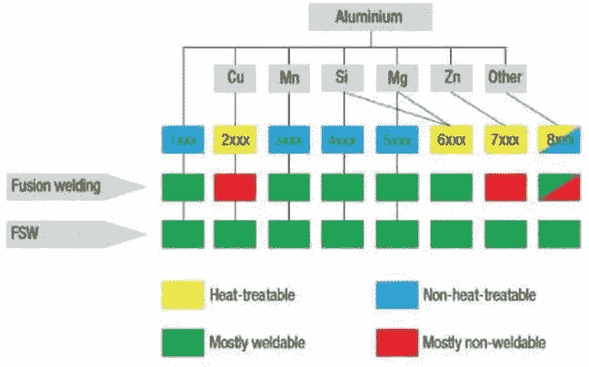

不同铝合金通过传统和搅拌摩擦焊工艺的可焊性比较(Pratik 和 Vishvesh，2019 年)

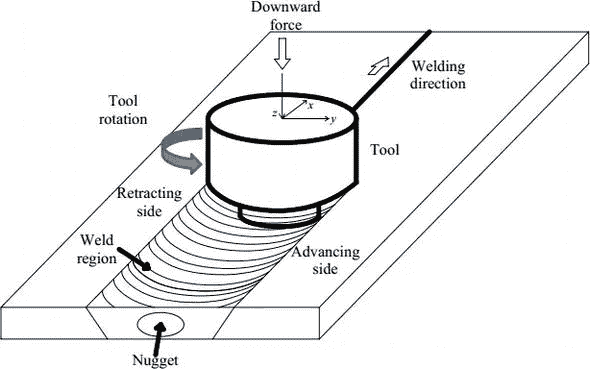

搅拌摩擦焊过程的机理(Ramona 和 Santos Jorge，2013 年)

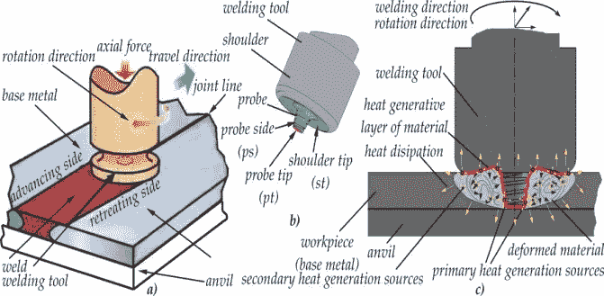

(a)搅拌摩擦焊装置，(b)工具术语，(c)FSW 过程中的热量产生和塑性变形(Mijajlovi，2012 年)

## **本地二进制模式的工作**

局部二进制模式是一种重要的图像纹理分析机器视觉算法，在实时应用中可以容忍任何类型的光照变化(蔡*等*)。, 2020).局部二进制模式在采样区域的邻域像素和中心像素之间产生灰度值差异。在大小为 3×3 的矩形邻域中，定义了局部二进制模式。首先，彩色图像到灰度图像的转换是用 0~255 的灰度值完成的。作为采样点，使用矩形区域的像素。 *f* 0 是中心像素的灰度值， *f* 1， *f* 2， *f* 3…， *f* 8 是其周围 8 个像素的灰度值。当 *fi* 大于等于 *f* 0 时，对应位置编码为 1。如图 4 所示，当 *fi* < *f* 为 0 时，对应位置编码为 0。

等式 1 描述了局部二进制模式算法的编码公式:

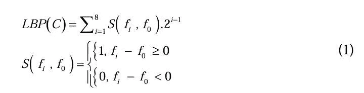

卡玛尼*等人*。(2011)使用局部二进制模式进行车身分类和自动油漆缺陷检测。据观察，缺陷的识别和分类可以高精度地完成。马赫拉姆*等人*。(2012)检测裂缝和木节，以便通过使用局部二进制模式算法对稳定和坚固的木材进行分类。阿格达姆*等人*。(2012)使用决策树对基于 LBP 的特征进行缺陷检测。结果表明，与其他传统方案相比，该分类系统速度更快。罗*等人*。(2018)对于时效钢表面缺陷分类，使用了广义完整局部二元模式。结果表明，该方法可应用于热轧带钢在线监测系统。

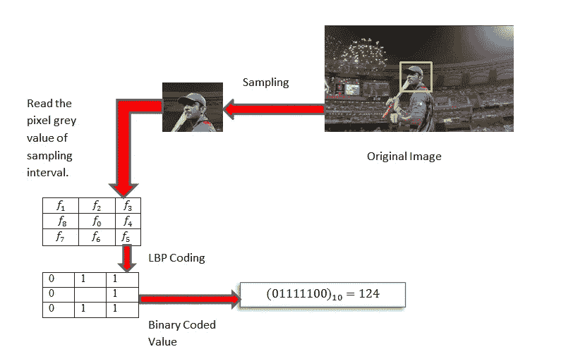

表示局部二元运算符工作的示意图

## **实验程序**

在 2 mm 厚的商用 AA 6061-T6 板和超细晶 1050 铝合金板上进行搅拌摩擦焊(孙*等人*)。, 2016).用于搅拌摩擦焊工具的材料是工具钢，其肩部几何形状为凹形。在焊接操作过程中，以 800 rpm 的恒定转速和 400、600、800、1000 mm/min 的变化横移速度施加 8000 KN 的恒定载荷。图 5a 示出了在 800 rpm 和 600 mm/min 的工具转速下获得的不同的搅拌摩擦焊接头，而图 5b 示出了在 800 rpm 的工具转速和 800 mm/min 的工具横移速度下获得的不同的搅拌摩擦焊接头。类似地，图 6a 示出了在 800 rpm 的工具转速和 400 mm/min 的工具横移速度下获得的异种搅拌摩擦焊接头，图 6b 示出了在 800 rpm 的工具转速和 600 mm/min 的工具横移速度下获得的接头，图 6c 示出了在 800 rpm 的工具转速和 800 mm/min 的工具横移速度下获得的接头，图 6d 示出了在 800 rpm 的工具转速和 1000 mm/min 的工具横移速度下获得的接头。

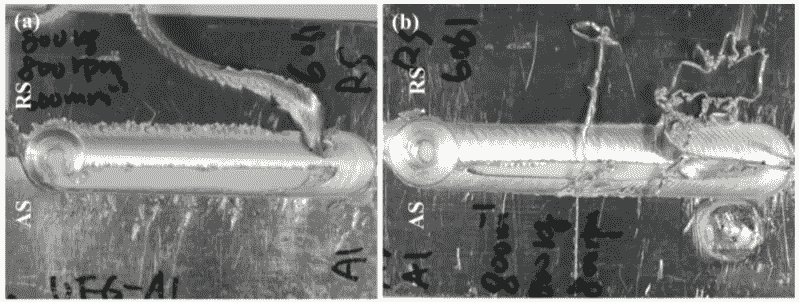

在 800 rpm 的恒定工具转速和 600 mm/min 和 800 mm/min 的工具横移速度下获得的搅拌摩擦焊接头(孙*等人*)。, 2016)

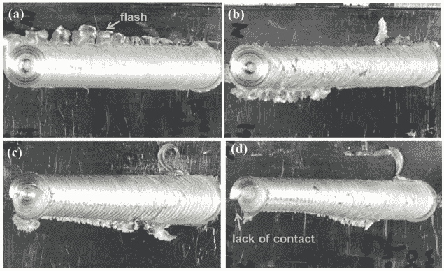

在 800 rpm 的恒定转速和 400、600、800、1000 mm/min 的不同横移速度下获得的搅拌摩擦焊接头(孙*等*)。, 2016)

如图 7 所示，对获得的图像进行裁剪并进行各种操作

Python 编程用于算法编码和建模。

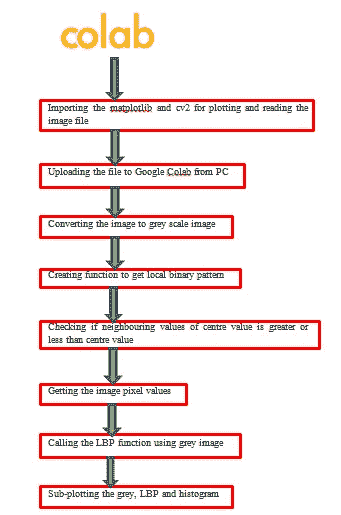

采取步骤获得搅拌摩擦焊接头的灰度图像、LBP 和直方图

## **结果和讨论**

获得了搅拌摩擦焊的灰度图像、局部二元模式和直方图，如图 8-11 所示。局部二值模式可以很容易地显示图像的非均匀性。因此，摩擦搅拌焊接接头中存在的各种表面缺陷，如飞边形成、沟槽边缘和接触不良，可以通过实施局部二元模式轻松检测出来。

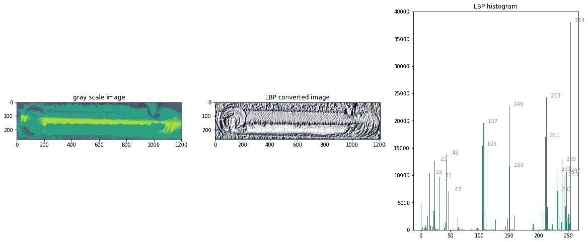

在工具转速为 800 rpm 和工具横移速度为 600 mm/min 时获得的搅拌摩擦焊接头(后退侧的 6061-T6)的灰度图像、LBP 转换图像和直方图

在工具转速为 800 rpm 和工具横移速度为 800 mm/min 时获得的搅拌摩擦焊接头(后退侧的 6061-T6)的灰度图像、LBP 转换图像和直方图

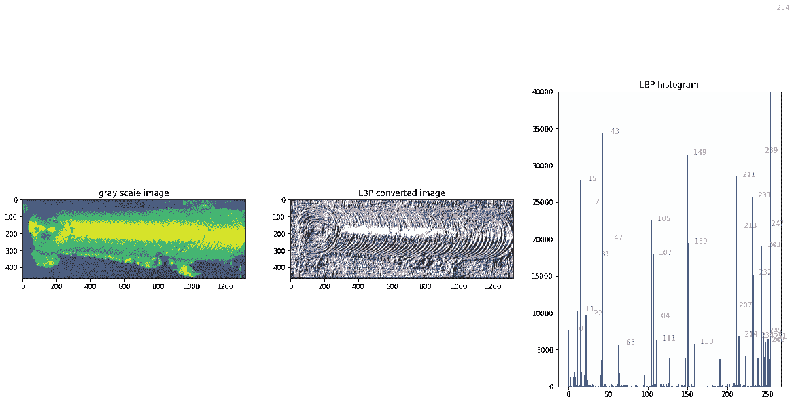

在 800 rpm 的工具转速和 800 mm/min 的工具横移速度下获得的搅拌摩擦焊接头(前进侧的 6061-T6)的灰度图像、LBP 转换图像和直方图

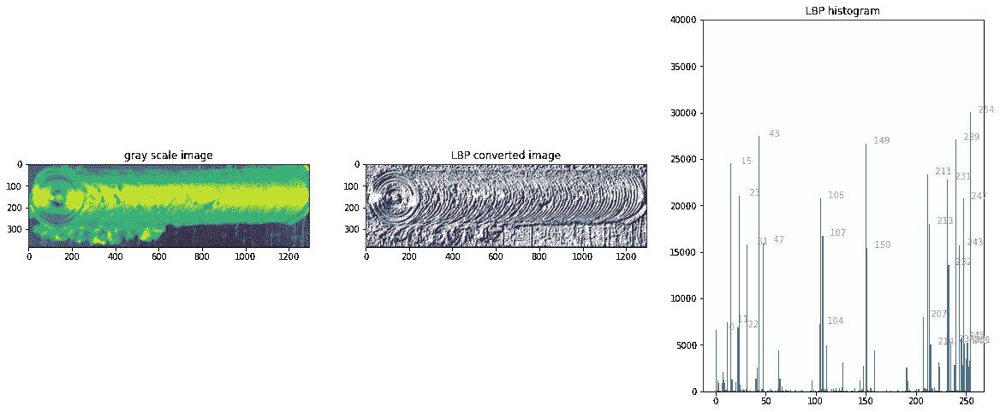

在工具转速为 800 rpm 和工具横移速度为 600 mm/min 时获得的搅拌摩擦焊接头(前进侧的 6061-T6)的灰度图像、LBP 转换图像和直方图

## **结论**

本研究提出局部二值模式演算法来评估搅拌摩擦焊接头的表面品质。局部二进制模式算法很容易验证表面缺陷的检测，如搅拌摩擦焊接头中的接触不良和焊瘤形成。可以观察到，当 6061-T6 在后退侧时，与 6061-T6 在前进侧时的布置相比，LBP 转换的图像显示出更不均匀的性质，并且前者的布置在直方图中显示更少的峰值。因此，局部二值模式(LBP)算法可以成功地应用于视觉检测和实时监控。

## ***参考文献***

Aghdam，S. R .、Amid，e .、Imani，M. F. (2012 年 7 月)。基于 LBP 特征的决策树钢材表面缺陷快速检测方法。2012 年第 7 届 IEEE 工业电子与应用会议(ICIEA)(第 1447-1452 页)。IEEE。

蔡，杨，徐，郭，李，王等(2020)。一种新的改进局部二元模式及其在柴油机故障诊断中的应用。冲击与振动，2020。

kamani p .、Noursadeghi e .、Afshar a .、& Towhidkhah f .(2011 年 11 月)。车身油漆缺陷的自动检测和分类。2011 年第七届伊朗机器视觉和图像处理会议(第 1-6 页)。IEEE。

罗，孙，杨，李平，辛普森，欧，田，李，何，杨(2018)。时效钢表面缺陷分类的广义完全局部二元模式。IEEE 仪器和测量汇刊，68(3)，667–679。

马赫拉姆，a .，沙耶斯泰，M. G .，，贾法普尔，S. (2012 年 7 月)。混合使用统计和纹理特征的木材表面缺陷分类。2012 年第 35 届国际电信和信号处理会议(TSP)(第 749-752 页)。IEEE。

米贾耶洛维奇(2012 年)。研究和开发估算 FSW 期间产生热量的分析模型(塞尔维亚尼什尼什大学尼什机械工程系博士论文)。

米贾耶洛维奇(m .)和米尔契奇(d .)(2012 年)。估算搅拌摩擦焊过程中产生热量的分析模型:在铝合金 2024 T351 板材上的应用。焊接工艺，247–274。

米什拉，R. S .，，马，Z. Y. (2005)。搅拌摩擦焊接和加工。材料科学与工程:报告，50(1-2)，1-78。

Pratik，H.S .，& Vishvesh，J. B. (2019)。铝合金的搅拌摩擦焊:试验结果综述——过程、变量、发展和应用。机械工程师学会会报，第一部分:材料杂志:设计与应用，233(6)，1191–1226。

Rai，r .，De，a .，Bhadeshia，H. K. D. H .，& DebRoy，T. (2011 年)。搅拌摩擦焊工具。焊接和连接的科学与技术，16(4)，325–342 页。

ramona g .和 Santos Jorge f . d .(2013 年)。结构连接用铝合金的搅拌摩擦焊进展。罗马尼亚科学院会议录，A 辑，14(1)，64-71。

Rudrapati，R. (2019 年)。铝合金搅拌摩擦焊连接的新进展。在大规模生产过程中。IntechOpen。

孙 y，土井 n .，，藤井 H. (2016)。超细晶 1050 和 6061-t6 铝合金异种搅拌摩擦焊的组织和力学性能。金属，6(10)，249。