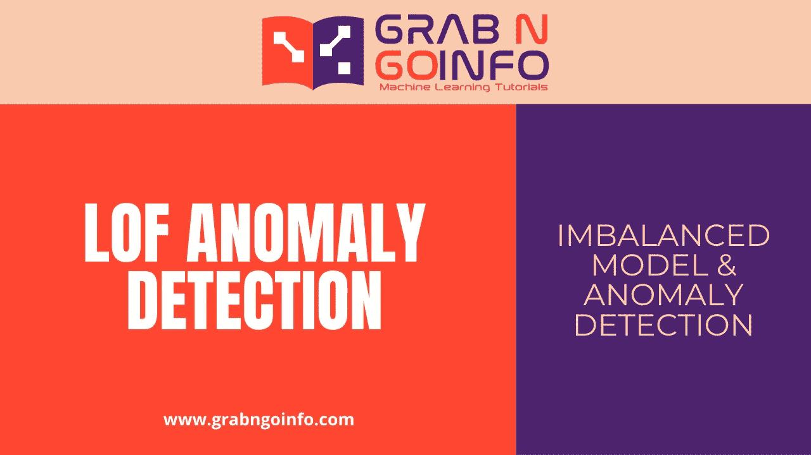
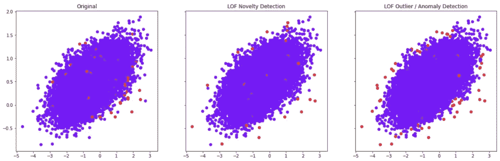

# 用于异常检测的局部异常因子(LOF)

> 原文：<https://pub.towardsai.net/local-outlier-factor-lof-for-anomaly-detection-b4fdaebc98fe?source=collection_archive---------0----------------------->

## LOF 新奇和异常检测奖



图像归 GrabNGoInfo.com 所有

局部异常因子(LOF)是一种无监督的异常检测模型。它将每个数据点的局部密度与其邻居进行比较，并将密度较低的数据点识别为异常值或离群值。

在本教程中，我们将讨论

*   新奇感检测和离群点检测有什么区别？
*   什么时候使用新颖性检测和异常值检测？
*   如何使用局部离群因子(LOF)进行新颖性检测？
*   如何使用局部异常因子(LOF)进行异常或异常检测？

**本帖资源:**

*   本教程的视频在 [YouTube 上](https://www.youtube.com/watch?v=CiJ95in4KQc&list=PLVppujud2yJo0qnXjWVAa8h7fxbFJHtfJ&index=8)
*   Python 代码在帖子最后。点击[此处](https://mailchi.mp/8b577b6aa257/wf8l4w4tlv)查看笔记本。
*   更多关于[异常检测的视频教程](https://www.youtube.com/playlist?list=PLVppujud2yJo0qnXjWVAa8h7fxbFJHtfJ)
*   更多关于[异常检测](https://medium.com/@AmyGrabNGoInfo/list/imbalanced-classification-and-anomalies-detection-dc908de4382d)的博文

我们开始吧！

# 步骤 1:导入库

第一步是导入库。我们需要从`sklearn`导入`make_classification`来创建建模数据集，导入`pandas`和`numpy`进行数据处理，`Counter`会帮助我们统计记录的数量。

`Matplotlib`是为了可视化。

我们还需要`train_test_split`来创建一个训练和验证数据集。`LocalOutlierFactor`用于建模，`classification_report`用于模型性能评估。

```
# Synthetic dataset
from sklearn.datasets import make_classification# Data processing
import pandas as pd
import numpy as np
from collections import Counter# Visualization
import matplotlib.pyplot as plt# Model and performance
from sklearn.model_selection import train_test_split
from sklearn.neighbors import LocalOutlierFactor
from sklearn.metrics import classification_report
```

# 步骤 2:创建带有异常的数据集

使用 sklearn 库中的 make_classification，我们创建了两个类，多数类和少数类的比率为 0.995:0.005。两个信息特征被作为预测因子。我们没有在该数据集中包含任何冗余或重复的要素。

```
# Create an imbalanced dataset
X, y = make_classification**(**n_samples=100000, n_features=2, n_informative=2,n_redundant=0, n_repeated=0,  n_classes=2,n_clusters_per_class=1, weights=**[**0.995, 0.005**]**,class_sep=0.5, random_state=0**)**# Convert the data from numpy array to a pandas dataframe
df = pd.DataFrame**({**'feature1': X**[**:, 0**]**, 'feature2': X**[**:, 1**]**, 'target': y**})**# Check the target distribution
df**[**'target'**]**.value_counts**(**normalize = True**)**
```

输出显示，我们有大约 1%的数据属于少数类，99%属于多数类，这意味着我们有大约 1%的异常。

# 步骤 3:训练测试分割

在这一步中，我们将数据集分成 80%的训练数据和 20%的验证数据。random_state 确保我们每次都有相同的训练测试分割。random_state 的种子号不一定是 42，可以是任何数字。

```
# Train test split
X_train, X_test, y_train, y_test = train_test_split**(**X, y, test_size=0.2, random_state=42**)**# Check the number of records
print**(**'The number of records in the training dataset is', X_train.shape**[**0**])**print**(**'The number of records in the test dataset is', X_test.shape**[**0**])**print**(**f"The training dataset has {sorted(Counter(y_train).items())[0][1]} records for the majority class and {sorted(Counter(y_train).items())[1][1]} records for the minority class."**)**
```

训练测试拆分为我们提供了 80，000 条训练数据集记录和 20，000 条验证数据集记录。因此，在训练数据集中，我们有来自多数类的 79，183 个数据点和来自少数类的 817 个数据点。

```
The number of records in the training dataset is 80000The number of records in the test dataset is 20000The training dataset has 79183 records for the majority class and 817 records for the minority class.
```

# 步骤 4:异常值/异常检测与新颖性检测

局部异常因子(LOF)算法可用于异常/异常检测和新奇检测。离群/异常检测和新奇检测之间的区别在于训练数据集。

异常值/异常检测包括训练数据集中的异常值。该算法适用于高密度数据区域，忽略了异常值和异常值。

新颖性检测只包括训练模型时的正常数据点。然后，该模型将采用具有异常值/异常值的新数据集进行预测。新颖性检测中的异常值也称为新颖性。

什么时候使用新颖性检测和异常值检测？这取决于有什么数据可用。如果我们有带有异常值标签的数据集，我们可以使用其中任何一个。否则，我们只能使用离群点检测，因为我们无法获得仅含正常数据的训练数据集。

# 步骤 5:使用局部异常因子(LOF)的新颖性检测

Python 的`sklearn`库实现了本地离群因子(LOF)。要使用新颖性检测，我们需要将超参数新颖性设置为 True。`fit_predictfit`不可用，因为该算法适合并预测不同的数据集。我们需要用所有正常数据拟合训练数据集，并预测包含异常值的测试数据集。

```
# Keep only the normal data for the training dataset
X_train_normal = X_train**[**np.where**(**y_train == 0**)]**# Train the local outlier factor (LOF) model for novelty detection
lof_novelty = LocalOutlierFactor**(**n_neighbors=5, novelty=True**)**.fit**(**X_train_normal**)**# Predict novelties
prediction_novelty = lof_novelty.predict**(**X_test**)**# Change the anomalies' values to make it consistent with the true values
prediction_novelty = **[**1 if i==-1 else 0 for i in prediction_novelty**]**# Check the model performance
print**(**classification_report**(**y_test, prediction_novelty**))**
```

我们可以看到，局部异常值因子(LOF)新颖性检测捕获了 2%的异常值/异常值。

```
 precision    recall  f1-score   support 0       0.99      1.00      0.99     19787 1       0.05      0.02      0.03       213accuracy                           0.99     20000macro avg       0.52      0.51      0.51     20000weighted avg       0.98      0.99      0.98     20000
```

# 步骤 6:使用局部异常值因子(LOF)的异常值检测

用于异常值检测的局部异常值因子(LOF)在同一数据集上训练和预测。因此，如果我们想要比较新奇检测和离群点检测之间的模型性能，我们需要在测试数据集上进行拟合和预测。我们还需要设置`novelty to`为假，以启用异常值检测算法。

```
# The local outlier factor (LOF) model for outlier detection
lof_outlier = LocalOutlierFactor**(**n_neighbors=5, novelty=False**)**# Predict novelties
prediction_outlier = lof_outlier.fit_predict**(**X_test**)**# Change the anomalies' values to make it consistent with the true values
prediction_outlier = **[**1 if i==-1 else 0 for i in prediction_outlier**]**# Check the model performance
print**(**classification_report**(**y_test, prediction_outlier**))**
```

我们可以看到，局部异常值因子(LOF)异常值/异常值检测捕获了 3%的异常值/异常值，这略好于新颖性检测结果。

```
 precision    recall  f1-score   support 0       0.99      0.99      0.99     19787 1       0.06      0.03      0.04       213accuracy                           0.98     20000macro avg       0.53      0.51      0.52     20000weighted avg       0.98      0.98      0.98     20000
```

# 第七步:视觉化

这一步将绘制数据点，并检查实际、LOF 新奇检测和 LOF 异常值检测之间的差异。

```
# Put the testing dataset and predictions in the same dataframe
df_test = pd.DataFrame**(**X_test, columns=**[**'feature1', 'feature2'**])** df_test**[**'y_test'**]** = y_test
df_test**[**'prediction_novelty'**]** = prediction_novelty
df_test**[**'prediction_outlier'**]** = prediction_outlier# Visualize the actual and predicted anomalies
fig, **(**ax0, ax1, ax2**)**=plt.subplots**(**1,3, sharey=True, figsize=**(**20,6**))**# Ground truth
ax0.set_title**(**'Original'**)** ax0.scatter**(**df_test**[**'feature1'**]**, df_test**[**'feature2'**]**, c=df_test**[**'y_test'**]**, cmap='rainbow'**)**# Local Outlier Factor (LOF) Novelty Detection
ax1.set_title**(**'LOF Novelty Detection'**)** ax1.scatter**(**df_test**[**'feature1'**]**, df_test**[**'feature2'**]**, c=df_test**[**'prediction_novelty'**]**, cmap='rainbow'**)**# Local Outlier Factor (LOF) Outlier / Anomaly Detection
ax2.set_title**(**'LOF Outlier / Anomaly Detection'**)**ax2.scatter**(**df_test**[**'feature1'**]**, df_test**[**'feature2'**]**, c=df_test**[**'prediction_outlier'**]**, cmap='rainbow'**)**
```

我们可以看到，在这个例子中，异常值检测比新颖性检测识别出更多的异常值。



GrabNGoInfo.com LOF 新奇检测与异常检测

# 步骤 8:将所有代码放在一起

```
###### Step 1: Import Libraries# Synthetic dataset
from sklearn.datasets import make_classification# Data processing
import pandas as pd
import numpy as np
from collections import Counter# Visualization
import matplotlib.pyplot as plt# Model and performance
from sklearn.neighbors import LocalOutlierFactor
from sklearn.model_selection import train_test_split
from sklearn.metrics import classification_report###### Step 2: Create Dataset With Anomalies# Create an imbalanced dataset
X, y = make_classification(n_samples=100000, n_features=2, n_informative=2,
                           n_redundant=0, n_repeated=0, n_classes=2,
                           n_clusters_per_class=1,
                           weights=[0.995, 0.005],
                           class_sep=0.5, random_state=0)# Convert the data from numpy array to a pandas dataframe
df = pd.DataFrame({'feature1': X[:, 0], 'feature2': X[:, 1], 'target': y})# Check the target distribution
df['target'].value_counts(normalize = True)###### Step 3: Train Test Split# Train test split
X_train, X_test, y_train, y_test = train_test_split(X, y, test_size=0.2, random_state=42)# Check the number of records
print('The number of records in the training dataset is', X_train.shape[0])
print('The number of records in the test dataset is', X_test.shape[0])
print(f"The training dataset has {sorted(Counter(y_train).items())[0][1]} records for the majority class and {sorted(Counter(y_train).items())[1][1]} records for the minority class.")###### Step 4: Local Outlier Factor (LOF) Algorithm# No code in this step###### Step 5: Outlier / Anomaly Detection vs. Novelty Detection# No code in this step###### Step 6: Novelty Detection Using Local Outlier Factor (LOF)# Keep only the normal data for the training dataset
X_train_normal = X_train[np.where(y_train == 0)]# Train the local outlier factor (LOF) model for novelty detection
lof_novelty = LocalOutlierFactor(n_neighbors=5, novelty=True).fit(X_train_normal)# Predict novelties
prediction_novelty = lof_novelty.predict(X_test)# Change the anomalies' values to make it consistent with the true values
prediction_novelty = [1 if i==-1 else 0 for i in prediction_novelty]# Check the model performance
print(classification_report(y_test, prediction_novelty))###### Step 7: Outlier Detection Using Local Outlier Factor (LOF)# The local outlier factor (LOF) model for outlier detection
lof_outlier = LocalOutlierFactor(n_neighbors=5, novelty=False)# Predict novelties
prediction_outlier = lof_outlier.fit_predict(X_test)# Change the anomalies' values to make it consistent with the true values
prediction_outlier = [1 if i==-1 else 0 for i in prediction_outlier]# Check the model performance
print(classification_report(y_test, prediction_outlier))###### Step 8: Visualization# Put the testing dataset and predictions in the same dataframe
df_test = pd.DataFrame(X_test, columns=['feature1', 'feature2'])
df_test['y_test'] = y_test
df_test['prediction_novelty'] = prediction_novelty
df_test['prediction_outlier'] = prediction_outlier# Visualize the actual and predicted anomalies
fig, (ax0, ax1, ax2)=plt.subplots(1,3, sharey=True, figsize=(20,6))# Ground truth
ax0.set_title('Original')
ax0.scatter(df_test['feature1'], df_test['feature2'], c=df_test['y_test'], cmap='rainbow')# Local Outlier Factor (LOF) Novelty Detection
ax1.set_title('LOF Novelty Detection')
ax1.scatter(df_test['feature1'], df_test['feature2'], c=df_test['prediction_novelty'], cmap='rainbow')# Local Outlier Factor (LOF) Outlier / Anomaly Detection
ax2.set_title('LOF Outlier / Anomaly Detection')
ax2.scatter(df_test['feature1'], df_test['feature2'], c=df_test['prediction_outlier'], cmap='rainbow')
```

# 摘要

本教程演示了如何使用局部异常因子(LOF)进行异常和新奇检测。

使用 Python 中的`sklearn`库，我们涵盖了

*   新奇感检测和离群点检测有什么区别？
*   什么时候使用新颖性检测和异常值检测？
*   如何使用局部离群因子(LOF)进行新颖性检测？
*   如何使用局部异常因子(LOF)进行异常或异常检测？

更多教程可以在我的 [YouTube 频道](https://www.youtube.com/channel/UCmbA7XB6Wb7bLwJw9ARPcYg)和 GrabNGoInfo.com[频道](https://grabngoinfo.com/tutorials/)上找到

# 推荐教程

*   [GrabNGoInfo 机器学习教程盘点](https://medium.com/grabngoinfo/grabngoinfo-machine-learning-tutorials-inventory-9b9d78ebdd67)
*   [用于异常检测的单级 SVM](https://medium.com/p/one-class-svm-for-anomaly-detection-6c97fdd6d8af)
*   [使用 Python 中的 Prophet 进行多时间序列预测的 3 种方法](https://medium.com/p/3-ways-for-multiple-time-series-forecasting-using-prophet-in-python-7a0709a117f9)
*   [使用 Python 实现不平衡分类的四种过采样和欠采样方法](https://medium.com/p/four-oversampling-and-under-sampling-methods-for-imbalanced-classification-using-python-7304aedf9037)
*   [利用 Python 中的 Prophet 进行具有季节性和假日效应的多元时间序列预测](https://medium.com/p/multivariate-time-series-forecasting-with-seasonality-and-holiday-effect-using-prophet-in-python-d5d4150eeb57)
*   [如何检测离群值|数据科学面试问答](https://medium.com/p/how-to-detect-outliers-data-science-interview-questions-and-answers-1e400284f6b4)
*   [利用 Python 中的 Prophet 进行时间序列异常检测](https://medium.com/p/time-series-anomaly-detection-using-prophet-in-python-877d2b7b14b4)
*   [如何配合谷歌 Colab 笔记本使用 R](https://medium.com/p/how-to-use-r-with-google-colab-notebook-610c3a2f0eab)

# 参考

*   [Sklearn 本地离群因子(LOF)](https://scikit-learn.org/stable/modules/generated/sklearn.neighbors.LocalOutlierFactor.html#sklearn.neighbors.LocalOutlierFactor)
*   [Sklearn 新颖性和异常值检测](https://scikit-learn.org/stable/modules/outlier_detection.html#outlier-detection)
*   [LOF 论文](http://citeseerx.ist.psu.edu/viewdoc/summary?doi=10.1.1.35.8948)
*   [LOF 算法](https://www.youtube.com/watch?v=CePgbdVdLvg)

[](https://medium.com/@AmyGrabNGoInfo/membership) [## 通过我的推荐链接加入媒体-艾米 GrabNGoInfo

### 作为一个媒体会员，你的会员费的一部分会给你阅读的作家，你可以完全接触到每一个故事…

medium.com](https://medium.com/@AmyGrabNGoInfo/membership)