# LogBERT 深入解释:第一部分

> 原文：<https://pub.towardsai.net/logbert-explained-in-depth-part-i-771463d7beda?source=collection_archive---------0----------------------->

原文链接:[https://arxiv.org/pdf/2103.04475.pdf](https://arxiv.org/pdf/2103.04475.pdf)

IT 和系统管理的最大前沿之一是处理应用程序和系统故障。有时失败的原因很难找到。当系统技术人员和应用程序开发人员需要找到他们的应用程序失败的原因时，他们通常会读取由所述系统生成的日志文件。然后，技术人员将找到与崩溃相关的日志，并使用此信息从故障中恢复。这种技术的问题是，有时系统和应用程序会生成几十万甚至几百万个日志。寻找预测崩溃的单个日志消息的工作可能会花费很长时间，而且任务本身可能会令人精疲力尽。

多年来，已经提出了许多方法来处理寻找相关日志消息的任务。这些方法中的许多使用了来自异常检测领域的思想。正如我们可以先验地假设的那样，预测崩溃并给出崩溃原因的日志本身应该是异常的。这是因为如果它不是异常的，我们就不能区分正常的系统活动和可以预测即将到来的故障的活动。

直到最近，异常检测主要涉及不同的特征提取技术，这些技术被实现用于经典的异常检测模型，如 IsolationForest 或 OneClassSVM 等等。其基本思想是，我们从文本中提取相关特征，这些特征可能与区分正常和异常日志相关。这种技术的问题是，我们假设了许多关于数据分布的事情。此外，这种技术并不像我们希望的那样普遍。一种特征提取技术可能与 HDFS 日志相关，另一种可能与 SQL 日志相关。这意味着日志异常检测没有“通用模型”。

最近，涉及深度学习的技术变得流行起来。使用诸如 LSTM 或 GRU 的递归神经网络已经成为检测序列中异常的流行方法，例如系统日志中存在的文本序列。不幸的是，rnn 缺少我们对系统日志进行复杂分析所需的内存。

在本文中，我将解释并简化用于检测日志序列异常的 LogBERT 方法。

为了开始深入分析，我们将分解变压器模块，它是 BERT 的主要组成部分。

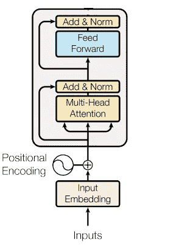

变压器组

首先，我们将进入嵌入层。大多数处理自然语言的神经网络中的一个重要组件。那么嵌入层是如何工作的呢？

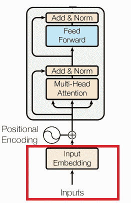

嵌入——确切地说，单词嵌入是某些向量空间中的记号的表示。我们希望这些向量表示能够捕捉到单词本身的意思。Word2Vec 就是一个典型的单词嵌入方法。Word2Vec 的目标是最大化一个句子中同一上下文中出现的单词嵌入的余弦相似度【我真的很喜欢吃苹果。我喜欢吃金枪鱼。= >金枪鱼和苹果应该有类似的表示]。我们不会在这里深入讨论这个问题，但是你会明白的。目标是找到一个单词的某种表示，当作为神经网络的输入时，该表示足够有意义。

那么我们如何把一个句子加工成有意义的东西呢？在我们的例子中，我们如何将日志消息中的一系列单词处理成有意义的东西呢？让我们深入研究一下。

好吧，从我们将在整个系列文章中使用的运行示例开始。

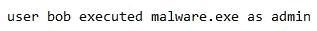

我们从标记这个句子开始，每个单词都被认为是一个标记。然后我们得到一个令牌列表。当然，在一个日志文件中，有更多的单词，但是只考虑这个例子中的单个日志消息。每个单词都将被放入一个字典或一个列表中，用一个数字来表示它(对于这个例子，我没有去掉所有的停用词并做其他预处理步骤):

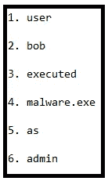

现在，嵌入层看起来像这样:

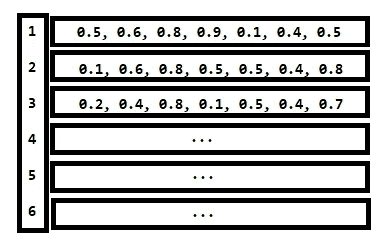

嵌入矩阵

我们在这里看到的是一个数组，数组中的每个单元格都包含向量。实际上，当给定单词序列[1，2，3，4，5，6]作为神经网络的输入时，嵌入层使用嵌入层将每个单词索引翻译成向量表示。所以神经网络本身看到的不是单词序列，也不是索引序列，而是向量序列！嵌入层本身具有可配置的嵌入大小(单词表示的维度)。为了好玩，另一个例子是:

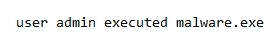

这将被转换为序列[1，6，3，4]，这将意味着我们的嵌入层获取嵌入矩阵中索引 1 的向量，然后是索引 6 的向量，然后是索引 3 的向量，最后是索引 4 的向量。当然，填充是必要的，因为我们应该在序列中有一个恒定的长度。结果将会是一个代表我们的句子或序列的矩阵。

既然知道了，那就总结一下吧:

嵌入层包含嵌入矩阵，该嵌入矩阵基本上包含对应该表示该单词的向量的引用。当单词被输入到嵌入层中时，它们作为索引序列被输入，该索引序列引用应该在嵌入矩阵中表示它们的向量。

数学上可以表示为两个矩阵的矩阵乘法。矩阵 A 是句子中**单词的一键向量表示，矩阵 B 是包含语料库中每个单词的向量表示的嵌入矩阵本身。所以 A×B 应该给我们以向量表示的单词的完整序列。**

变换模块的下一部分是位置编码。这是 transformer 块的一部分，我们在这里对单词在序列中的位置信息进行编码。这是怎么做到的？

给定一个向量 V = ，它表示某个单词 X 的嵌入，我们想表示这个单词在序列本身中的位置。

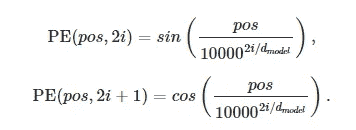

位置编码功能

正如我们所看到的，这个函数用于对单词的位置进行编码。这是怎么做到的？给定一个单词序列，单词 X 可以出现在序列中的不同位置。比方说，在一个句子的实例中，这个词可以这样放在中间:

鲍勃今天早上吃了两颗 X。

在这种情况下，X 在句子的中间，X 的位置是 4，将使用上面的函数进行编码。如果 V 被嵌入到一个 4 维空间中，如上所述 V = ，那么 V 的变换将是:

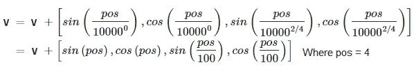

最后，我们用嵌入层和位置编码层捕捉单词在序列中的位置，将单词 X 表示在四维空间中。

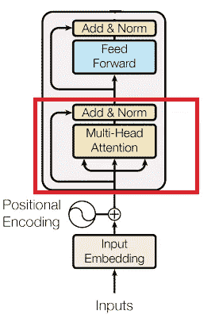

注意力和正常化

接下来，我们的序列被表示为 DxN 维矩阵，其中 D 表示我们的嵌入维数，N 表示我们的序列大小，该序列被馈送到多头关注层。让我们深入研究一下。

什么是多头注意力？让我们从一个简单的自我关注层开始:

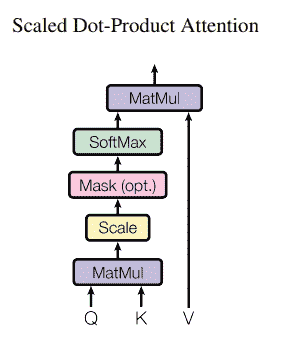

自我关注

本质上，自我关注是我们在输入矩阵上执行的功能:

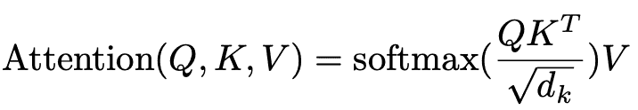

自我关注

我们将分解这个函数，但是在这篇文章中，我们将忽略分母，因为它用于标准化，并且对于理解注意力背后的思想不是核心。

我们在这里有我们的**自我关注**。这个过程由几个阶段组成。第一个是我们对我们的**输入矩阵**应用线性变换 3 次——一次用于**查询**矩阵，另一次用于**键，**以及另一次用于**值**(我们将它们称为 **Q，K，V** )。同样，**我们的输入矩阵本质上是编码为向量的输入序列。所以我们的输入矩阵被转换成三个不同的矩阵。**

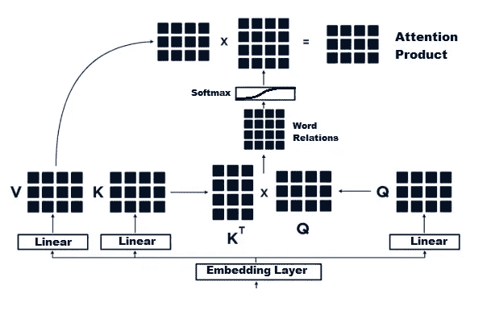

在上图中，我们可以看到矩阵乘法应用于键和值矩阵。这产生了一个表示我们的双向单词关系的矩阵(当然，在矩阵中的权重被正确学习之后)。这个单词关系矩阵使我们能够以一种我们在之前的序列学习神经网络(如 LSTM 或 GRU)中无法捕捉的方式捕捉句子的结构和含义。这是因为这些类型的神经网络缺乏长期记忆，而自我注意力则关注整个句子中单词之间的关系，就像这样:

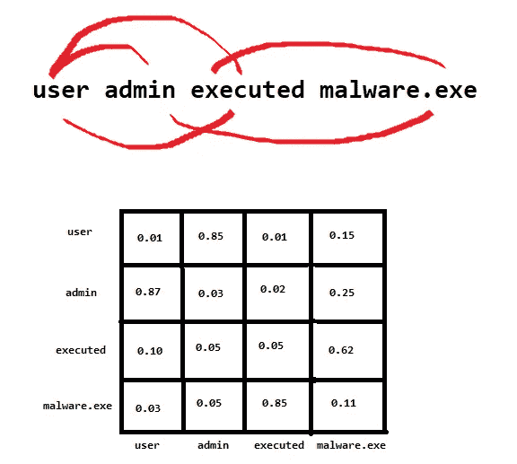

捕捉单词关系的注意力矩阵最后乘以价值矩阵。请注意，每个单词都有一个“分数”,表示它与句子中其他单词的相关程度。在上面的例子中，用户和管理员有很高的关系分数。

论文中提到([神经机器翻译通过联合学习对齐和翻译](https://arxiv.org/abs/1409.0473))注意力，从定义上来说，只是一个值的加权平均值，

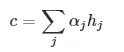

在哪里

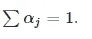

如果我们将α限制为一个热码向量，那么这个操作就变成了从一组索引为α的元素 h 中检索。去除限制后，注意力操作可以认为是根据概率向量α进行“比例提取”。

应该清楚的是，这个上下文中的 h 是**值(在我们的例子中，是值矩阵)**。

注意到这一点后，我们可以看到值矩阵与查询和键相乘得到的矩阵相乘。这就是注意力的确切定义，因为我们使用了加权检索技术，权重α来自单词关系矩阵。

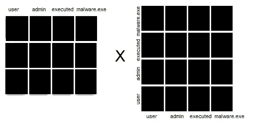

如果我们在这里应用矩阵乘法，我们将看到左边矩阵中序列的编码乘以每个单词与所有其他单词的比例关系。

接下来，我们有多头关注。这类似于我们在卷积神经网络中使用的多个滤波器。原因是我们使用多种过滤器来捕捉图片中的不同模式，这些模式可以指示我们在该图片中寻找的任何内容。在多头注意力中，我们捕捉句子中不同的可能关系，这些关系可能导致完全不同的意思。一旦我们掌握了注意力的诀窍，多头注意力实际上是非常简单的。本质上，我们所做的就是像这样连接注意力的结果矩阵:

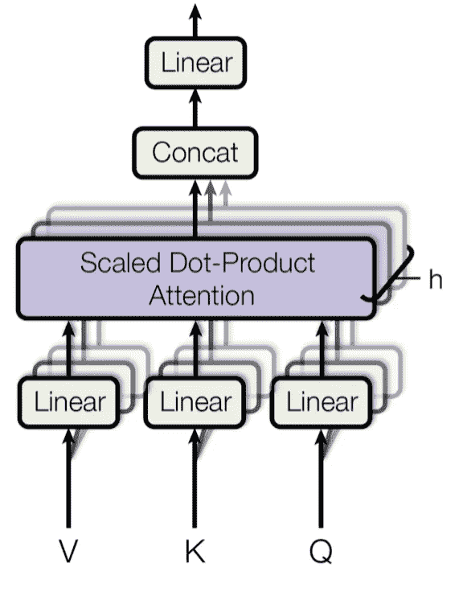

串联意味着我们只是把所有的矩阵连接在一起。最终产品应该是一个大矩阵。

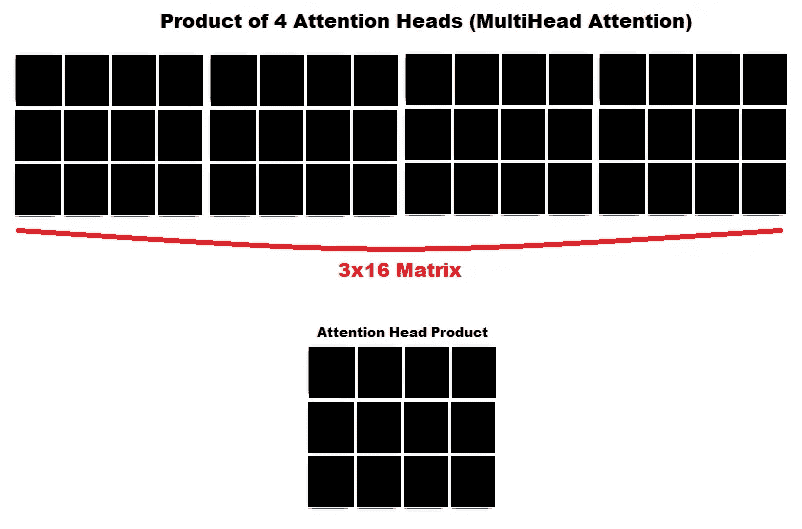

这一部分应该已经总结了对数伯特和伯特结构的主要组成部分。我没有进入所有的标准化层和缩放，因为我认为这不是一个关键的细节，不想浪费时间写它。如果有人对此感到困惑，他们可以在其他地方阅读。

在下一部分，我想介绍最终的 LogBERT 架构和损耗函数，这样我们就可以看到它们是如何结合在一起的。感谢阅读到目前为止。

我们邀请您观看下一部分:

[深度日志:第二部分](https://medium.com/@davidschiff_35251/logbert-explained-in-depth-part-ii-f659abde9ebf)