# LogBERT 深入解释:第二部分

> 原文：<https://pub.towardsai.net/logbert-explained-in-depth-part-ii-f659abde9ebf?source=collection_archive---------2----------------------->

在上一篇文章中，我介绍了注意力机制的基础知识，一般来说，我介绍了 transformer 块。在本系列的这一部分，我将介绍 LogBERT 如何训练，以及我们如何使用它来检测日志序列中的异常。

让我们进入洛波特的本质细节。

在论文中(链接:[https://arxiv.org/pdf/2103.04475.pdf](https://arxiv.org/pdf/2103.04475.pdf))一个对数序列被定义为:

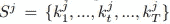

其中 S 是对数序列中的一系列关键字(单词)。注意我们的日志关键字是如何用上标 j 来表示它们所属的序列，用 k 上的下标来表示单词序列中的索引。

像往常一样，当训练一个变压器时，我们要添加一个标记来标记序列的开始，该标记将是文中提到的“DIST”。我们将添加的另一个特殊令牌是“MASK”令牌。掩码标记将用于覆盖句子中的单词。

如果你看一下最后一部分，你会记得我们运行的例子:

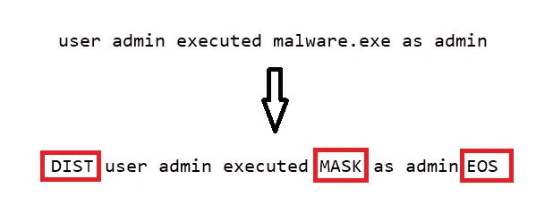

预处理我们的日志序列

如您所见，我们的日志序列经过预处理，以包含不同的特殊标记。

**DIST** —句子的开始

**屏蔽** —掩盖序列中的一个键

**EOS** —一句话的结尾(虽然文中没有提到，但是在 GitHub 上的代码中使用了。)

在我澄清关于特殊令牌的一切之前，我想回顾一下 LogBERT 的训练阶段。

回想一下 LogBERT 架构的不同部分:

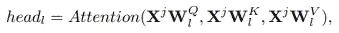

注意使用 Q、K 和 V 矩阵

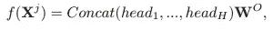

多头注意力连接不同的注意力头

上面的函数只是对多头注意力的数学描述:

最后，这一切都归结于变压器模块的数学描述:

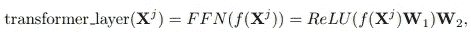

这是整个变压器模块:

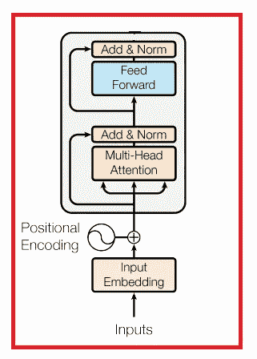

太好了，现在我们把它们绑在一起了。通常，变压器有多个变压器层，这意味着我们可以分配一个通用的变压器功能，这只是一系列变压器块。这在论文中被描述为:

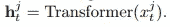

其中 **h** 是 Transformer 函数的输出，这个输出本质上应该只是一个向量，它对定义为 x 的对数序列的所有信息进行编码。

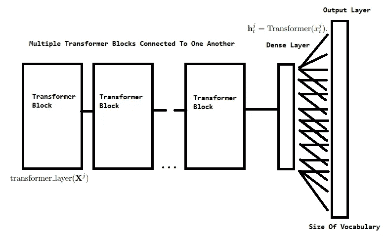

我认为上面的图片总结了这一切。只是一般的洛波特架构。注意输出层是如何决定词汇表的大小的。在分类案例中，特别是在我们的案例中，我们通常需要对掩码标记下的单词进行分类。这让我想到了最终 LogBERT 模型的损失函数。

如前所述，所有日志序列都经过预处理，以包含一个屏蔽词。该模型将尝试预测被屏蔽的单词。这是一个模型必须完成的自我监督的任务。这个任务的损失函数是:

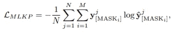

其中 **y** 是掩码下的真实单词，而 **y hat** 是为掩码下的真实单词分配的概率。我们可以看到，损失本质上是一个类别交叉熵损失函数，其中类别实际上是单词。注意求和是如何超过 N 和 M 的，N 是对数序列的数量，M 是句子中选择的掩码总数。

对于每个日志序列，我们选择一个概率为 0.15 的随机单词进行屏蔽。我们实际上选择多个单词来屏蔽，对于每个日志，我们计算句子中屏蔽预测的总损失。将每个序列的最终损失相加，然后除以对数序列的数量。

LogBERT 需要最小化的另一个任务(损失函数)是超球损失函数的体积。

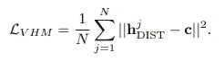

这个损失函数使用如上所述的 **h —** 。h 是对数序列的表示(特别是 h-dist)，这个损失函数的目标是最小化每个对数的表示和它们的中心之间的距离。该中心随着每个历元而更新，并被计算为平均总体对数表示。

最后，两个损失函数都用于更新模型权重。最终损失函数由两个损失函数的加权和组成。

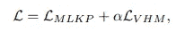

现在，我们如何使用 LogBERT 来查找异常日志？正如论文中提出的，我们检查一个日志序列，并计算每个屏蔽词的预测。我们定义了一个超参数 **g** ，它是位于掩码之外的前 g 个最可能的单词。如果实际的单词不在前 g 个单词中，我们将该单词视为异常。现在，我们定义 r，另一个超参数，作为我们计数一个日志异常与否的阈值。如果存在多于 r 个字的异常，则该日志序列被定义为异常日志。

我想提出另一种定位异常日志的方法。只需使用最终损失函数并定义阈值 z，如果测井记录得分高于 z，则该测井记录为异常测井记录。

就这样，我希望你喜欢你的阅读。我强烈推荐阅读原始论文，并跳到 GitHub 上查看代码本身。