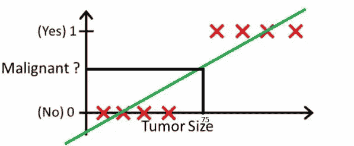
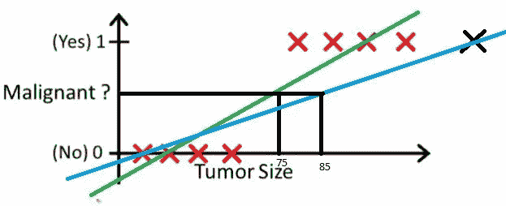
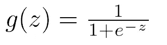
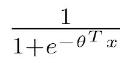
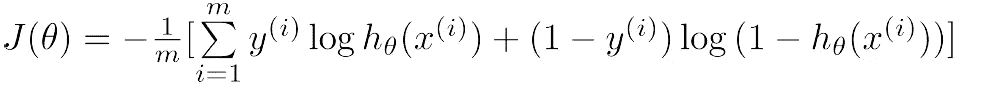
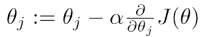
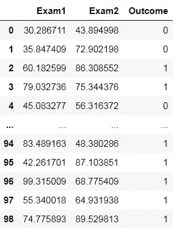
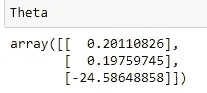
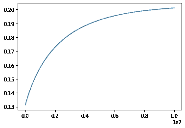

# 逻辑回归——示例概述

> 原文：<https://pub.towardsai.net/logistic-regression-an-overview-with-example-2661ee075d13?source=collection_archive---------2----------------------->

## [数据科学](https://towardsai.net/p/category/data-science)

## 逻辑回归简介及其在 Python 中的实现


由[克里斯·利维拉尼](https://unsplash.com/@chrisliverani?utm_source=medium&utm_medium=referral)在 [Unsplash](https://unsplash.com?utm_source=medium&utm_medium=referral) 上拍摄

众所周知，逻辑回归算法简单易懂，非常可靠而且非常有用，这就是为什么当涉及到二元分类问题时，逻辑回归是任何工程师的首选。

逻辑回归使用 sigmoid 函数输出**连续的概率值**，该值为自变量的任意值，介于 0-1 之间，然后将这些**概率值**与阈值 0.5 进行比较。

任何大于 0.5 的值被归入" **1 类，"**"类，任何小于 0.5 的值被归入" **0 类"**或"**类，其中特定事件不发生。"**


s 形曲线

# 为什么叫 Logistic“回归”？

人们问的一个常见问题是，如果逻辑回归用于分类问题，为什么它会有“回归”一词？而分类问题为什么不能用线性回归代替 Logistic 回归呢？

第一个问题的答案是，即使逻辑回归用于二元分类问题，sigmoid 方程的输出仍然是一个**连续数值。**我们只是将这些值与阈值 0.5 进行比较，并将结果分类为 0 或 1。

线性回归不能用于分类问题的主要原因是，我们的线性回归模型的输出不能限制在"**0–1 "**之间，对于概率值，我们总是需要 0–1 之间的值。

更好的解释方式是看下面的图片:



例子

比方说。我们使用线性回归来根据诊断的肿瘤大小对特定患者是否患有癌症进行分类。我们追踪阈值 0.5，发现任何大于 75 的肿瘤大小导致癌症的阳性病例，任何小于 0.5 的值导致阴性病例。
这似乎很好，但问题出在哪里？



从上图中可以看出，**右侧的新肿瘤尺寸**导致最佳拟合线出现较大偏差，导致一些数据点被错误分类。

# 逻辑回归的假设

逻辑回归没有做出线性回归做出的许多关键假设，如**线性**、**同方差、**或**正态性**。但是，有些假设确实适用，例如:

1.  **二元因变量**
    二元分类的因变量必须是二元的
2.  **无多重共线性**
    多重共线性[在我以前的一篇文章](https://medium.com/analytics-vidhya/how-multicollinearity-is-a-problem-in-linear-regression-dbb76e25cd80)中讨论过，会导致线性回归中的问题，也会导致逻辑回归中的问题
3.  **独立观测值** 观测值应相互独立，不应来自重复数据。

如果上述假设都考虑到了，我们可以期待我们的逻辑模型表现良好。

# 逻辑回归背后的数学

如上所述，逻辑回归使用 Sigmoid 方程来输出连续的概率值。



Sigmoid 方程

Sigmoid 方程或**假设方程**在分母中有一个“**z 的负指数”**项，其中 **z** 只不过是“系数转置”和“独立变量”的**点积**



简化的 Sigmoid 方程

现在我们知道这里的 X，它是我们数据的独立变量，但是我们如何找到系数的值呢？

我们转向**成本函数**和**梯度下降法。**

当试图找到我们的系数时，我们总是以能够最小化我们的成本函数的值为目标，这就是**梯度下降法的用武之地。**



逻辑回归的成本函数



梯度下降方程

使用我们的梯度下降方程，我们通过多次迭代找到我们的系数值，直到我们的系数值不再收敛。

# 实际实施

对于这一部分，我将处理来自 Andrew ng 的机器学习入门课程的数据集，该数据集接受学生在两次考试中的分数，并以二进制值 **0 或 1** 的形式给出输出。
0 表示学生未被录取，1 表示学生未被录取。

将数据集导入 Jupyter 笔记本:

```
data = pd.read_csv('ex2data1.txt')
data.columns = ['Exam1','Exam2','Outcome']
sns.scatterplot(data['Exam1'],data['Exam2'],hue=data['Outcome'])
```


散点图



资料组

自变量将是考试 1 和考试 2 的分数以及一个常数值。

```
X = data[['Exam1','Exam2','ones']]
```

为了找到我们的最佳系数，我们将实施梯度下降法，在这种方法中，我们将对θ值进行初始猜测，并从那里开始工作。

将我们最初的θ猜测值作为 0，定义 X 和 y 变量:

```
Theta = np.array([0,0,0])
Theta = Theta.reshape(3,1)
X_array = np.array(X)
X_array.shape
y_array = np.array(y)
y_array = y_array.reshape(99,1)
```

我们将运行梯度下降法进行大量迭代，直到我们的系数不再收敛。

```
T = []
I = []
i=0
while i <10000000:
    hypothesis = 1/(1+np.exp(-1*(np.dot(X_array,Theta))))
    submission = hypothesis - y_array
    transpose = np.transpose(submission)
    grad = (1/99) * np.dot(transpose,X)
    grad = grad.reshape(3,1)
    grad
    Theta = Theta - (0.001*grad)
    Theta
    i = i +1
    T.append(Theta[0])
    I.append(i)
```

在继续之前，我想稍微解释一下代码。

“假设”术语只不过是 sigmoid 方程。

我已经使用了 NumPy 的**点和转置函数**来执行我的矩阵操作。

得到假设函数后，我找到假设和因变量之间的差异，然后在下一步中进行转置。

然后我找到梯度，其中 99 是观察次数。

下一步，我将我的渐变值乘以我的 alpha 值 0.001，然后从我的初始θ猜测值中减去它。

整个过程重复几次，直到θ值不再进一步收敛。

我得到的θ值是:



θ值



θ值接近 0.20

# 接下来呢？

我们已经找到了θ值。让我们测试一下我们的发现有多准确。


散点图

看着散点图，我可以猜测一个考试 1 得 80 分，考试 2 得 30 分的学生不太可能被录取。
让我们用新发现的系数来检验这些。
将考试分数乘以系数并求和，我得到

```
product = (0.2011*80) + (0.1975*30)-24.58
```

把这个值代入我的 Sigmoid 方程。

```
1/ ( 1+ np.exp(-1*product))
```

我得到的值是 0.071292，小于阈值 0.5。
因此，该学生将无法获得入学许可。

# 结论

在本文中，我回顾了逻辑回归的基础知识，比如逻辑回归的假设。

我还看了一个基本的例子，在这个例子中，梯度下降法被用来寻找系数的最优值，然后使用 sigmoid 函数来预测一个学生是否会被录取。

这只是对逻辑回归的简单介绍。在接下来的几篇文章中，我将介绍与分类算法相关的其他主题，比如**性能指标、超参数调优、算法选择、**等等。

[1]:安德鲁·吴..*机器学习-简介* [https://www.coursera.org/learn/machine-learning](https://www.coursera.org/learn/machine-learning)