# 二元分类的逻辑回归:SciKit-Learn 实践

> 原文：<https://pub.towardsai.net/logistic-regression-for-binary-classification-hands-on-with-scikit-learn-a5c06b0f2d60?source=collection_archive---------0----------------------->

## 使用 Python 和 Google Colab

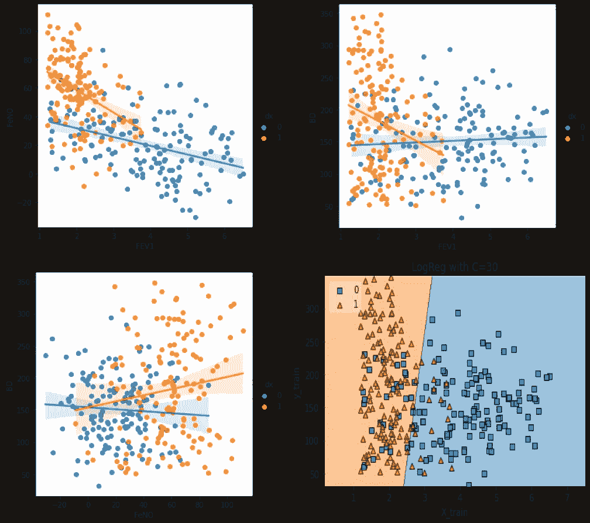

```
***Table of contents:****1\. Introduction
2\. What type of problems can be solved with Logistic Regression
3\. Mathematical Interpretation
4\. The C parameter
5\. Hands-On:* -Import Libraries-Create Data
   -Exploratory data analysis
   -Splitting data into train and test data sets
   -Build and evaluate the model
   -Finding the best C value
   -Build a visualisation for the model
```

当主题是机器学习时，逻辑回归是你会读到、听到的第一批算法之一。逻辑回归类似于多元回归，但有一个二元(因变量)输出变量和连续或分类预测变量。当因变量为二元(1 或 0)时，我们不能使用线性回归。

逻辑回归中的输出通过出现的概率来表示，而在简单回归中，获得的是数值。因此，逻辑回归本身就是一种确定二元变量预测值出现概率的方法。

## 逻辑回归可以解决什么类型的问题？

逻辑回归用于解决二元或多类分类任务。在本文中，我们将只讨论二元分类。用于分类目的逻辑回归的一个好例子是用于检测疾病，其中几个变量用于预测二元结果(疾病的存在或不存在)。预测变量可以是分类的、连续的或顺序的。

## 数学解释

逻辑回归的一般表达式是:

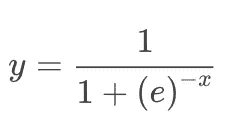

图形表示是:

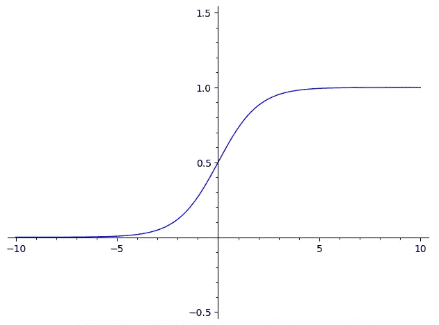

可以看到，函数范围在 0 到 1 之间。当我们将模型拟合到逻辑函数时，我们将使用数据参数的系数来改变 *x* 值，并得到我们的结果更接近 1 或 0 的概率。您还可以通过图形检查注意到，对于 *x < 0，**y*值将更接近 0，对于 *x > 0* ， *y* 值将更接近 1。所以，基本上如果你知道 *x* 是正值还是负值，你就知道对象属于哪一类，而不需要计算 *y.* 然而，如果你想知道预测的强度，你仍然需要知道 y 的值。

例如:

用 *x = 3:*

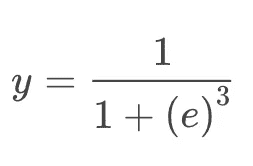

我们将获得:

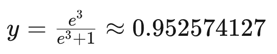

这意味着该对象很有可能属于类别 1。相比之下，如果 x= -4，那么它有很大概率在 0 类。


> **但是模型中 x 是如何计算的呢？**

为了拟合我们的模型，这意味着计算模型的 x 值，假设预测变量和结果的概率(y=1 或 y=0)之间存在线性关系。这样， *x* 将使用线性回归技术拟合，截距为 *m* ，预测变量的系数值为 *B1* 、 *B2* 、 *B3* ...

> 我在以前的出版物中解释过线性回归，你可以在这里找到[](https://medium.com/p/467d0df39cc9)**[**这里**](https://medium.com/p/2315b9a26348) 。**

## **C 参数:**

**逻辑回归中的 ***C*** 值是控制正则化的用户可调参数。简单来说，C 的较高 ***值将指示我们的模型尽可能地适合训练集，而 ***较低的 C 值*** 将有利于系数更接近于零的简单模型。*****

## **动手操作:**

**现在我们将使用 SciKit-Learn 和 Python 来全面实现和评估一个逻辑回归模型。我们还将学习如何调整模型参数，以控制模型的复杂性、过拟合和/或欠拟合。**

****导入必要的库:****

```
#Import Libraries:from random import random
from random import randint
import numpy as np
import pandas as pd
import matplotlib.pyplot as plt
import seaborn as snsfrom sklearn.model_selection import train_test_split
from sklearn.linear_model import LogisticRegressionfrom mlxtend.plotting import plot_decision_regions
```

****创建数据:****

**我们将通过构建一个用作示例的数据集来为此案例研究创建数据。我将变量命名为肺功能(FEV1 和 BD)和肺部炎症(FeNO)的参数，结果变量命名为疾病存在与否，在这种情况下为哮喘。但是请记住，这不是真实的数据，是为这个例子人工创建的数据，并且基于我在这个领域的专家知识。如果使用的是自己的数据，可以直接跳到步骤“探索性数据分析”。**

```
#Fabricating variables:#Creating values for FeNO with 3 classes:
FeNO_0 = np.random.normal(15,20, 100)
FeNO_1 = np.random.normal(35,20, 100)
FeNO_2 = np.random.normal(65, 20, 100)#Creating values for FEV1 with 3 classes:
FEV1_0 = np.random.normal(4.50, 1, 100)
FEV1_1 = np.random.uniform(3.75, 1.2, 100)
FEV1_2 = np.random.uniform(2.35, 1.2, 100)#Creating values for Broncho Dilation with 3 classes:
BD_0 = np.random.normal(150,49, 100)
BD_1 = np.random.uniform(250,50,100)
BD_2 = np.random.uniform(350, 50, 100)#Creating labels variable with two classes (1)Disease (0)No disease:
not_asthma = np.zeros((150,), dtype=int)
asthma = np.ones((150,), dtype=int
```

**现在，我们将把之前创建的值连接成三个预测变量和一个结果变量:**

```
#Concatenate classes into one variable:FeNO = np.concatenate([FeNO_0, FeNO_1, FeNO_2])
FEV1 = np.concatenate([FEV1_0, FEV1_1, FEV1_2])
BD = np.concatenate([BD_0, BD_1, BD_2])
dx = np.concatenate([not_asthma, asthma])
```

**下一步是创建一个数据帧，并将变量添加到数据帧中:**

```
#Create DataFrame:
df = pd.DataFrame()#Add variables to DataFrame:
df['FeNO'] = FeNO.tolist()
df['FEV1'] = FEV1.tolist()
df['BD'] = BD.tolist()
df['dx'] = dx.tolist()
```

**我们可以通过简单地输入“ **df** ”来查看我们的数据帧，以检查是否一切正常。可以看出，我们的数据框架有 4 列(三个预测变量和一个结果变量)，300 行。**

**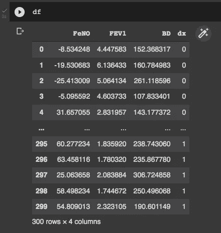**

****探索性数据分析:****

**这是一个简单的探索性数据分析(EDA ),只是为了了解我们的变量如何表现，以及它们如何相互关联并与结果(疾病存在或不存在)关联。首先，我们将看到我们的变量是如何根据疾病的存在与否而分布的:**

```
#Exploring dataset:sns.pairplot(df, kind="scatter", hue="dx")
plt.show()
```

**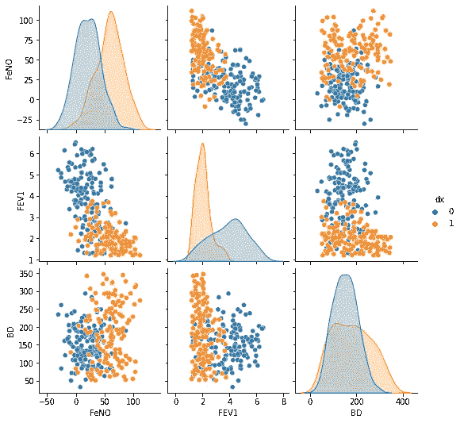**

**我们可以检查不同参数区分疾病存在/不存在的能力。参数“BD”显示了区分两个类别的最差能力，我们可以看到更高的重叠值。**

```
sns.boxplot( x=df["dx"], y=df["FEV1"] )
```

**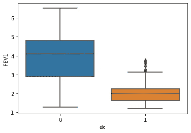**

```
sns.boxplot( x=df["dx"], y=df["FeNO"] )
```

**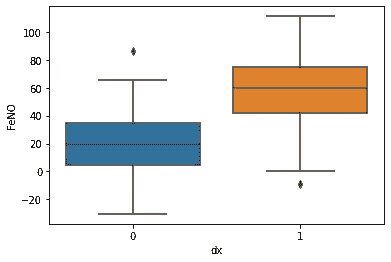**

```
sns.boxplot( x=df["dx"], y=df["BD"] )
```

**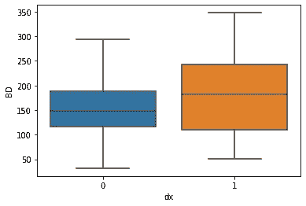**

**然后我们可以检查不同参数之间的相关性。在有哮喘的情况下，相关性总是更强，而在没有疾病的情况下，相关性就不那么显著了。**

```
sns.lmplot(x="FEV1", y="FeNO", data=df, fit_reg=True, hue='dx', legend=True)
```

**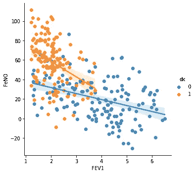**

**当疾病存在时，我们看到 FEV1 和 FeNO 之间有更强的相关性，并且这种相关性是负的(由负斜率可见)，这意味着对于较高的 FeNO 值，我们将发现较低的 FEV1 值。**

```
sns.lmplot(x="FEV1", y="BD", data=df, fit_reg=True, hue='dx', legend=True)
```

**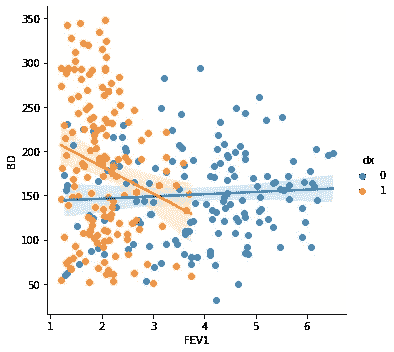**

**当检查 FEV1 和 BD 之间的相关性时，我们发现当存在哮喘诊断时，可以看到负相关性。这样，FEV1 值越低，支气管扩张值越高。**

```
sns.lmplot(x="FeNO", y="BD", data=df, fit_reg=True, hue='dx', legend=True)
```

**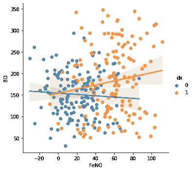**

**最后，FeNO 和 BD 之间的相关性表明，当存在哮喘时，较高的 FeNO 值与较高的 BD 值相关(正相关)。**

****将数据分成训练和测试数据集:****

**我们将使用 80%的数据来构建模型，剩下的 20%用于测试模型。但是首先，我们将创建我们的 ***X*** 和 ***y*** 变量，其中 ***X*** 表示带有预测值的数据集，而 ***y*** 表示带有结果的值的数组。**

```
#Creating X and y:
X = df.drop('dx', axis=1)
y = df['dx']#Data split into train and test:
X_train, X_test, y_train, y_test = train_test_split(X, y, test_size=0.20)
```

****建立并评估模型:****

```
#Fit the model:
logisticregression = LogisticRegression().fit(X_train, y_train)#Evaluate the model:
print("training set score: %f" % logisticregression.score(X_train, y_train))print("test set score: %f" % logisticregression.score(X_test, y_test))
```

**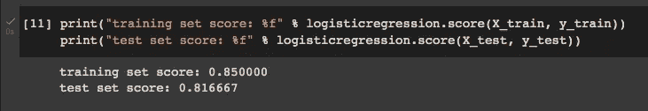**

**正如我们所看到的，我们的模型在训练集上表现稍好，这可能表明我们过度拟合了。幸运的是，我们可以使用 ***C*** 值来调整模型，并尝试找到一个在模型复杂性、过拟合和欠拟合之间权衡折衷的最佳模型。**

**让我们看看如果我们设置 ***C=100*** 会发生什么:**

```
#C=100
logisticregression100 = LogisticRegression(C=100).fit(X_train, y_train)print("training set score: %f" % logisticregression100.score(X_train, y_train))
print("test set score: %f" % 
logisticregression100.score(X_test, y_test))
```

**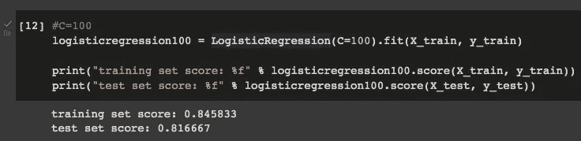**

**设置 ***C=100*** 对训练集得分影响很小，对测试集得分没有影响，也就是说对模型没有改善。**

**设定 ***C=0.01*** :**

```
#C=0.01
logisticregression001 = LogisticRegression(C=0.01).fit(X_train, y_train)print("training set score: %f" % logisticregression001.score(X_train, y_train))
print("test set score: %f" % 
logisticregression001.score(X_test, y_test))
```

**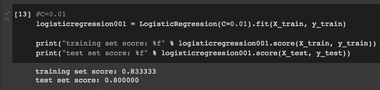**

**设置 ***C=0.01*** 会降低训练集分数和测试集分数，这意味着它不是该参数的好值。**

****寻找最佳的 *C* 值:****

**为了找到最佳的 ***C*** 值，我们应该使用比试错法更复杂的方法。一种方法是对训练集和测试集在不同的 ***C*** 值绘制几个准确度分数。**

```
training_accuracy = []
test_accuracy = []# try c values from 0.001 to 100:
c_settings = np.arange(0.001, 100, 0.1)for i in c_settings:
    # build the model
    clf = LogisticRegression(C=i)
    clf.fit(X_train, y_train)
    # record training set accuracy
    training_accuracy.append(clf.score(X_train, y_train))
    # record generalization accuracy
    test_accuracy.append(clf.score(X_test, y_test))plt.plot(c_settings, training_accuracy, label="training accuracy")
plt.plot(c_settings, test_accuracy, label="test accuracy")
plt.legend()
```

**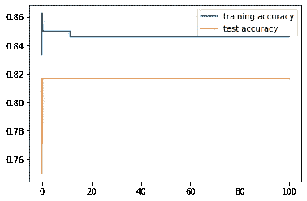**

**在图中我们可以看到，大约在 ***C*** 值为 10 之后，训练和测试精度值更加接近。在该图中并不完全清楚，因此我们可以绘制一个更小的区间:**

**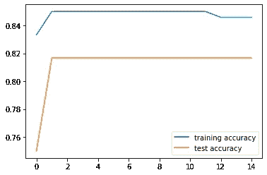**

**现在很容易看出，在 ***C=12*** 时训练和测试精度值更接近，这意味着这是我们的最优 ***C*** 值。我们可以检查一下:**

****

****建立模型的可视化:****

**最后，我们可以通过构建一个包含决策区域的图表来可视化我们的模型性能。为此，我们需要 csv 格式的数据帧:**

```
df.to_csv('data.csv', index = False)
data = pd.read_csv('data.csv')
```

**然后，我们使用两个主要变量为该图构建一个函数(我们知道，一旦 BD 具有更大的类重叠，我们将使用 FEV1 和 FeNO):**

```
def logisticReg_comparison(data,c):
    x = data[['FEV1','FeNO',]].values
    y = data['dx'].astype(int).values
    LogReg = LogisticRegression(C=c)
    LogReg.fit(x,y)
    print(LogReg.score(x,y))
    #Plot decision region:
    plot_decision_regions(x,y, clf=LogReg, legend=2)
    #Adding axes annotations:
    plt.xlabel('X_train')
    plt.ylabel('y_train')
    plt.title('LogReg with C='+str(c))
    plt.show()logisticReg_comparison(data,12)
```

**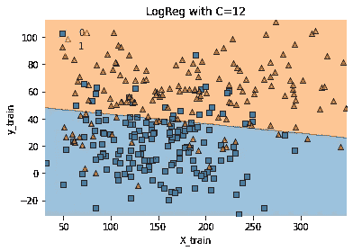**

**感谢您的阅读！如果您有任何更正或建议，请告诉我，不要忘记订阅以接收关于我未来出版物的通知。**

**如果:你喜欢这篇文章，别忘了关注我，这样你就能收到关于新出版物的所有更新。**

****其他如果:**你想了解更多，你可以通过[我的推荐链接](https://cdanielaam.medium.com/membership)订阅媒体会员。它不会花你更多的钱，但会支付我一杯咖啡。**

****其他:**谢谢！**