# 多类分类的逻辑回归:SciKit-Learn 实践

> 原文：<https://pub.towardsai.net/logistic-regression-for-multi-class-classification-hands-on-with-scikit-learn-bcc0bbad1def?source=collection_archive---------1----------------------->

## 使用 Python 和 Google Colab

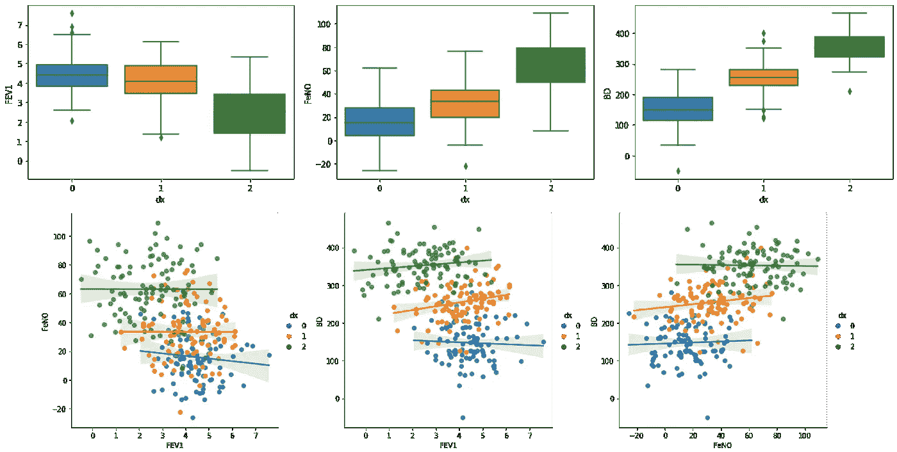

在之前的帖子中，我解释了二进制分类的逻辑回归、背后的数学推理以及如何使用 Scikit-Learn 库进行计算。在这篇文章中，我将解释为多类分类问题实现逻辑回归所需的修改。

本来，逻辑回归只支持二元分类，由于从逻辑方程获得的曲线的性质，这很容易理解。然而，有两个选项可以使这个模型“适应”多类问题。

## 一比一休息:

使用 one-vs-rest(“ovr”)选项，我们的模型将做的是将一个类与所有其他类进行比较，并对所有类执行这一步骤。这样，我们将多类问题转化为多二元问题。

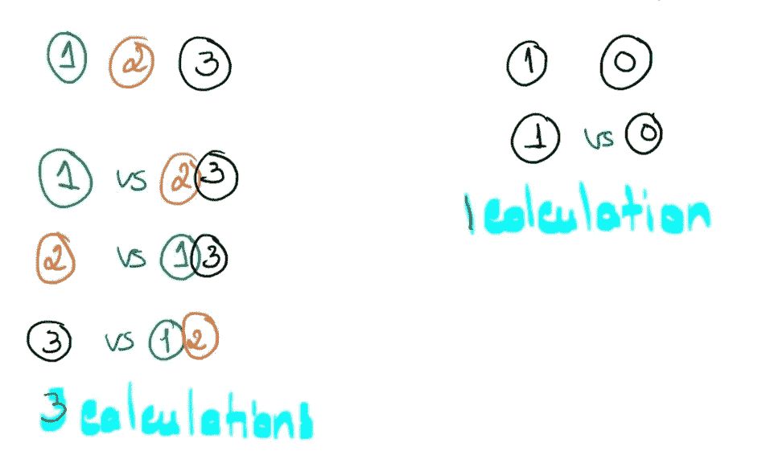

左边是使用“ovr”技术的多类分类。右边是简单的二进制分类。

## 多项逻辑回归；

另一种方法是使用多项式逻辑回归。为了应用这种技术，我们的数据需要满足预测变量的非完美分离和独立性的假设。多项逻辑回归同样基于[线性回归](https://code.likeagirl.io/how-to-implement-and-select-the-best-linear-regression-model-2315b9a26348)，公式为:

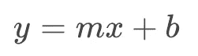

其中 ***y*** 是我们的结果变量， ***m*** 是曲线斜率， ***x*** 是预测变量， ***b*** 是与 ***y 轴*** 的截距。如果我们有一个以上的预测变量，我们的公式将是这样的:

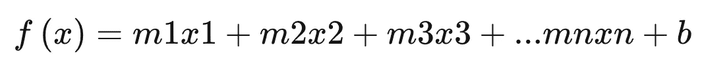

逻辑方程也被转换，以允许超过两个类别的概率。三类分类任务的多项式逻辑回归概率方程如下所示:

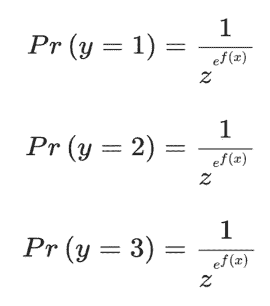

其中 ***z*** 是从:

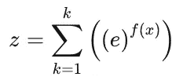

注意，*是模型中所有类的***【e^f(x】****的总和。要知道 ***z*** 对于任何给定的模型和数据都是常数，但不一定不等于 1。 ***z*** 可以取很大范围的值，因为没有明确的类别划分。该值仅在计算了变量和结果类别的回归系数后确定(如所解释的，应用[线性回归](https://code.likeagirl.io/how-to-implement-and-select-the-best-linear-regression-model-2315b9a26348)计算 ***f(x)*** )。**

## **C 参数:**

**多项式逻辑回归也有一个 C 参数，可以调整该参数以找到最佳拟合，而不会过度拟合或拟合不足。**

## **动手操作:**

**我们将使用带有预建函数的 Scikit-Learn 库来计算多项式逻辑回归。您可以按照本教程使用我的代码来构建您自己的数据库，或者您可以替换变量名称并使用您自己的数据。**

****导入必要的库:****

```
**from random import random
from random import randintimport pandas as pd
import numpy as np
import seaborn as sns
import matplotlib.pyplot as pltfrom sklearn.linear_model import LogisticRegression
from sklearn.svm import LinearSVC
from sklearn.model_selection import train_test_splitfrom mlxtend.plotting import plot_decision_regions**
```

****创建数据:****

**我将创建一个满足多项逻辑回归假设的数据集，其中包含三个预测变量和一个包含三个类别的结果变量:**

```
****#Fabricating variables:****#Creating values for FeNO with 3 classes:**
FeNO_0 = np.random.normal(15,20, 100)
FeNO_1 = np.random.normal(35,20, 100)
FeNO_2 = np.random.normal(65, 20, 100)**#Creating values for FEV1 with 3 classes:**
FEV1_0 = np.random.normal(4.50, 1, 100)
FEV1_1 = np.random.normal(3.75, 1.2, 100)
FEV1_2 = np.random.normal(2.35, 1.2, 100)**#Creating values for Broncho Dilation with 3 classes:**
BD_0 = np.random.normal(150,49, 100)
BD_1 = np.random.normal(250,50,100)
BD_2 = np.random.normal(350, 50, 100)**#Creating labels variable with three classes:(2)disease (1)possible disease (0)no disease:**
not_asthma = np.zeros((100,), dtype=int)
poss_asthma = np.ones((100,), dtype=int)
asthma = np.full((100,), 2, dtype=int)**
```

**连接变量并创建数据帧:**

```
****#Concatenate classes into one variable:**
FeNO = np.concatenate([FeNO_0, FeNO_1, FeNO_2])
FEV1 = np.concatenate([FEV1_0, FEV1_1, FEV1_2])
BD = np.concatenate([BD_0, BD_1, BD_2])
dx = np.concatenate([not_asthma, poss_asthma, asthma])**#Create DataFrame:**
df = pd.DataFrame()**#Add variables to DataFrame:**
df['FeNO'] = FeNO.tolist()
df['FEV1'] = FEV1.tolist()
df['BD'] = BD.tolist()
df['dx'] = dx.tolist()**
```

**现在我们可以看看我们的数据框架:**

**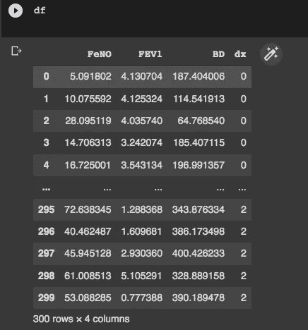**

**正如所料，我们有 3 行 4 列。**

****探索性数据分析:****

**与任何数据项目一样，当我们准备好数据时，我们应该执行探索性数据分析(EDA)。我将简单地进行一些描述性的练习，但是你应该根据你的数据类型(或者为了发现它)应用最好的 EDA。**

```
****#Exploring dataset:**
sns.pairplot(df, kind="scatter", hue="dx")
plt.show()**
```

**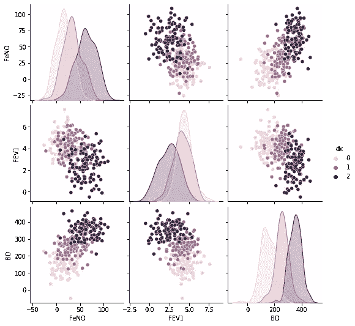**

```
**sns.boxplot(x=df["dx"], y=df["FEV1"])sns.boxplot(x=df["dx"], y=df["FeNO"])sns.boxplot(x=df["dx"], y=df["BD"])**
```

**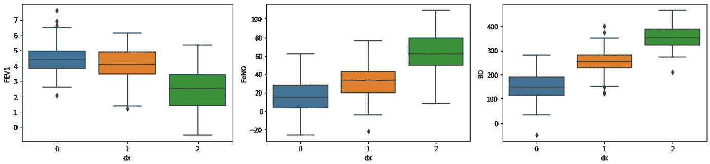**

```
**sns.lmplot(x="FEV1", y="FeNO", data=df, fit_reg=True, hue='dx', legend=True)sns.lmplot(x="FEV1", y="BD", data=df, fit_reg=True, hue='dx', legend=True)sns.lmplot(x="FeNO", y="BD", data=df, fit_reg=True, hue='dx', legend=True)**
```

**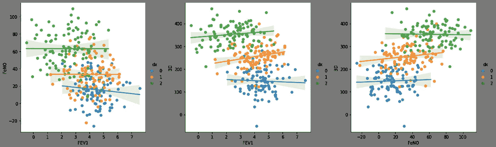**

**尚不完全清楚，但到目前为止，通过目测，变量“FeNO”和“BD”似乎是区分这三组的最佳方法。在分析之前，我们不需要知道这些，当我们构建决策边界图时，这在接下来的步骤中会很有用。**

****将数据分为训练和测试数据集:****

**我们需要一部分数据来训练模型，另一部分数据来测试模型。通常，训练模型需要大量数据，因此我们将 90%用于训练，10%用于测试:**

```
****#Creating X and y:**
X = df.drop('dx', axis=1)
y = df['dx']**#Data split into train and test:**
X_train, X_test, y_train, y_test = train_test_split(X, y, test_size=0.10)**
```

****建立并评估模型:****

```
****#Fit Logistic Regression model:**
logisticregression = LogisticRegression().fit(X_train, y_train)**#Evaluate Logistic Regression model:**
print("training set score: %f" % logisticregression.score(X_train, y_train))
print("test set score: %f" % logisticregression.score(X_test, y_test))
print("coefficients shape: ", logisticregression.coef_.shape)
print("intercept shape: ", logisticregression.intercept_.shape)**
```

**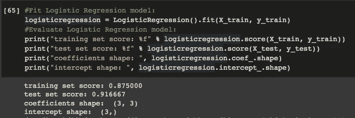**

**现在让我们分析我们的输出。如果你读过我以前关于[二元逻辑回归](https://medium.com/p/a5c06b0f2d60)的文章，你会发现输出只包含训练集分数和测试集分数。这里，除此之外，我们还有系数形状和截距形状。(3，3)的系数形状意味着我们有 3 个类别和 3 个特征。截距形状是添加到决策函数中的常数，与类的数量相同。**

**通过分析我们的训练和测试集分数，可以看出我们的模型是不合适的。我们现在将学习如何调整模型中的一些参数。**

****调整 *C* ，多类技术，迭代次数:****

**我前面已经解释过*[***C***值在逻辑回归](https://medium.com/p/a5c06b0f2d60)中的作用。在本文的开始，我解释了我们的机器可以用来计算多类逻辑回归的两种技术。默认情况下，Scikit-Learn 将使用多项逻辑回归，但我们可以更改 one-vs-rest(“ovr”):***

```
****#Fit Logistic Regression model:** logisticregression = LogisticRegression(C=1, multi_class='ovr',
                                 max_iter=100).fit(X_train, y_train)**#Evaluate Logistic Regression model:** print("training set score: %f" % logisticregression.score(X_train, y_train))
print("test set score: %f" % logisticregression.score(X_test, y_test))**
```

**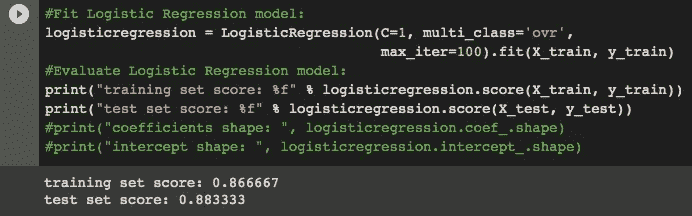**

**这里，我们将多类技术更改为“ovr ”,我们看到结果比“多项式”稍差。**

**我们可以改变的另一个参数是最大迭代次数。再次切换到多项式，如果我们再次尝试，我们将会看到**警告消息**:**

**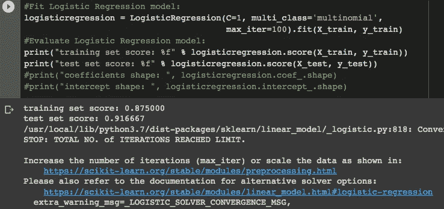**

**为了解决这个问题，我们只需要增加最大迭代次数。改为“max_iter = 1000 ”,我们得到:**

**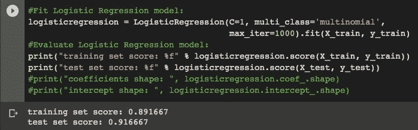**

****寻找最佳 *C* 值:****

**为了找到最佳的 ***C*** 值，程序与二进制分类相同。**

```
**training_accuracy = []
test_accuracy = []**# try c values from 0.001 to 100:** c_settings = np.arange(0.001, 100, 1)for i in c_settings:
    **# build the model**
    clf = LogisticRegression(C=i, multi_class='auto', max_iter=1000)
    clf.fit(X_train, y_train)
    **# record training set accuracy**
    training_accuracy.append(clf.score(X_train, y_train))
    **# record generalization accuracy**
    test_accuracy.append(clf.score(X_test, y_test))plt.plot(c_settings, training_accuracy, label="training accuracy")
plt.plot(c_settings, test_accuracy, label="test accuracy")
plt.legend()**
```

**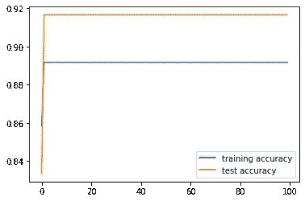**

**在图表中，我们看到非常接近于 ***C*** =1 的值几乎没有改善。所以我们会保持这个值不变。**

**我们可以使用“ovr”技术进行同样的尝试:**

```
**training_accuracy = []
test_accuracy = []**# try c values from 0.001 to 5:**
c_settings = np.arange(0.001, 5, 0.5)for i in c_settings:
    **# build the model**
    clf = LogisticRegression(C=i, multi_class='ovr', max_iter=1000)
    clf.fit(X_train, y_train)
    **# record training set accuracy**
    training_accuracy.append(clf.score(X_train, y_train))
    **# record generalization accuracy**
    test_accuracy.append(clf.score(X_test, y_test))plt.plot(c_settings, training_accuracy, label="training accuracy")
plt.plot(c_settings, test_accuracy, label="test accuracy")
plt.legend()**
```

**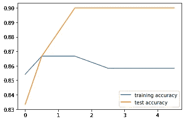**

**One-vs-rest 在 ***C*** =0.5 时似乎表现更好。**

****构建模型的可视化:****

**现在我们可以用决策边界为我们的模型构建一个图形化的可视化。由于 2D 最容易解释，我们将只使用两个特征来构建图表。在 EDA 过程中，我们发现 FeNO 和 BD 是区分能力较强的变量。**

> **对于多项式:**

```
**def logisticReg_comparison(data,c):
    x = data[['BD','FeNO',]].values
    y = data['dx'].astype(int).values
    LogReg = LogisticRegression(C=c, multi_class='multinomial',
                                                      max_iter=1000)
    LogReg.fit(x,y)
    print(LogReg.score(x,y))
    **#Plot decision region:**
    plot_decision_regions(x,y, clf=LogReg, legend=1)
    **#Adding axes annotations:**
    plt.xlabel('X_train')
    plt.ylabel('y_train')
    plt.title('LogReg with C='+str(c))
    plt.show()logisticReg_comparison(data,1)**
```

**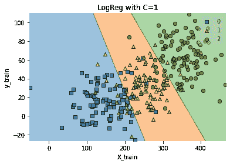**

> **对于一比一休息:**

```
**def logisticReg_comparison(data,c):
    x = data[['BD','FeNO',]].values
    y = data['dx'].astype(int).values
    LogReg = LogisticRegression(C=c, multi_class='ovr',
                                               max_iter=1000)
    LogReg.fit(x,y)
    print(LogReg.score(x,y))
    **#Plot decision region:**
    plot_decision_regions(x,y, clf=LogReg, legend=1)
    **#Adding axes annotations:**
    plt.xlabel('X_train')
    plt.ylabel('y_train')
    plt.title('LogReg with C='+str(c))
    plt.show()logisticReg_comparison(data,0.5)**
```

**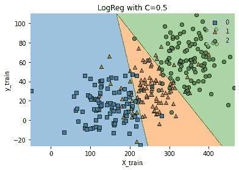**

**感谢您的阅读！如果您有任何更正或建议，请告诉我，不要忘记订阅以接收关于我未来出版物的通知。**

**如果你喜欢这篇文章，别忘了关注我，这样你就能收到所有关于新出版物的更新。**

**如果你想了解更多，你可以通过[我的推荐链接](https://cdanielaam.medium.com/membership)订阅媒体会员。它不会花你更多的钱，但会支付我一杯咖啡。**

****其他:**谢谢！**