# 仅使用 Python 代码从零开始进行逻辑回归

> 原文：<https://pub.towardsai.net/logistic-regression-from-scratch-with-only-python-code-9d3ae607e739?source=collection_archive---------1----------------------->

## [机器学习](https://towardsai.net/p/category/machine-learning)

## 仅使用 Python 对多要素数据集应用逻辑回归。用 Python 逐步实现编码示例

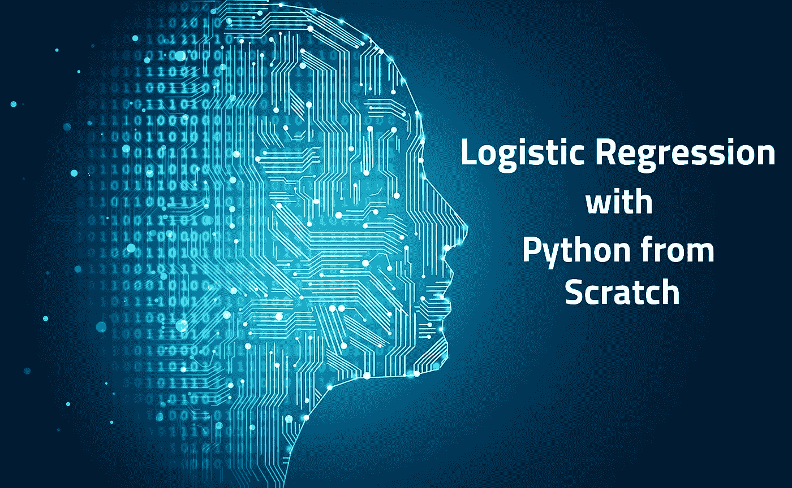

从零开始的逻辑回归

> 在本文中，我们将建立一个**逻辑** **回归**模型，用于对患者是否患有糖尿病进行分类。这里的重点是，我们将只使用 **python** 来构建读取文件、规范化数据、优化参数等功能。因此，您将深入了解从阅读文件到做出预测的一切是如何工作的。

如果你是机器学习新手，或者不熟悉**逻辑回归**或**梯度** **下降**，不要担心我会尽力用 ***俗人的*** 术语解释这些。有更多的教程解释相同的概念。但是本教程的独特之处在于它的 ***简短的*** 和 ***初学者友好的*** 代码片段的高级描述。因此，让我们从一些重要的理论概念开始，以便理解我们模型的工作原理。

## **逻辑回归**

逻辑回归是入门级**监督**机器学习算法，用于**分类**目的。这是每个人都应该知道的算法之一。逻辑回归在某种程度上类似于线性回归，但它具有不同的**成本** **函数**和**预测** **函数**(假设)。

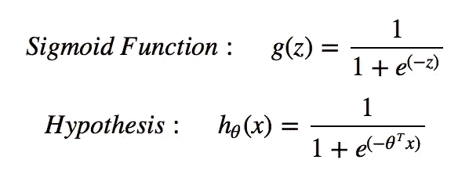

## Sigmoid 函数

在 **0** 和 **1** 之间的范围内**挤压**该函数的输出是激活函数，其中小于 0.5 的值表示 0 级，大于等于 0.5 的值表示 1 级。

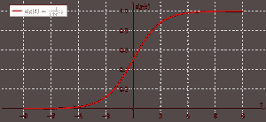

## 价值函数

**成本函数**找出我们算法的 ***实际值*** 和 ***预测值*** 之间的误差。应该尽可能少。在线性回归的情况下，公式如下

但是这个公式**不能**用于**逻辑**回归，因为这里的假设是一个**非凸**函数，这意味着有机会找到局部最小值，从而避免全局最小值。如果我们使用相同的公式，那么我们的绘图将如下所示

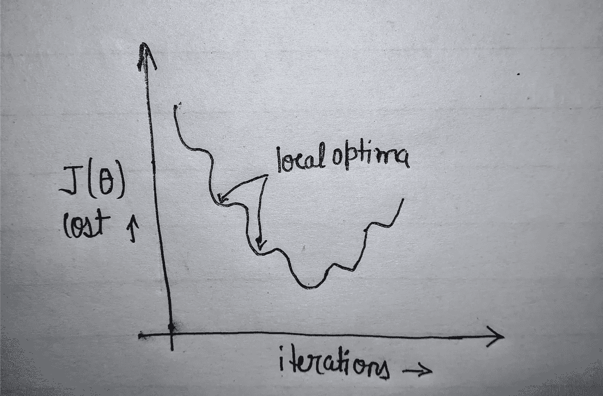

非凸图

因此，为了避免这种情况，我们在**日志**的帮助下**平滑了**曲线，我们的成本函数将如下所示

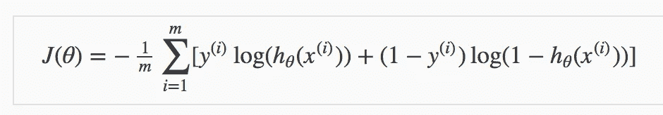

其中 m =数据集中的示例数或行数，iᵗʰ示例的 xᶦ=feature 值，iᵗʰ示例的 yᶦ=actual 结果。使用这个之后，我们的成本函数图将如下所示

凸图

## 梯度下降

我们在任何 ML 算法中的目标都是找到使**最小化****成本** **函数**的参数集。为了自动找到最佳参数集，我们使用了优化技术。其中之一就是梯度下降。在这种情况下，我们从参数的随机值开始(在大多数情况下*)然后不断改变参数以减少 J( **θ** ₀， **θ** ₁)或成本函数，直到我们最终达到最小值。同样的公式是:-*

*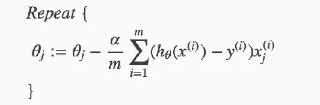*

*梯度下降*

*它看起来与线性回归完全相同，但不同之处在于假设( **hθ(x)** )，因为它也使用了 **sigmoid** 函数。*

*我知道这需要很多理论，但这是理解下面的代码片段所必需的。而我只触及了表面，所以请谷歌一下以上的主题，获取更深入的知识。*

# *先决条件:*

*我假设您熟悉 ***python*** ，并且已经在您的系统中安装了 ***python 3*** 。我用了一个 ***jupyter 笔记本*** 来做这个教程。你可以使用你喜欢的 **IDE** 。所有需要的库都内置在 ***anaconda*** 套件中。*

# *让我们编码*

*好了，我已经导入了 CSV、numpy(主要用于点积)和 math 来执行对数和指数计算。*

## *阅读文件*

*首先，我们定义了函数`read_file`来读取数据集本身。这里，文件是用`with`打开的，所以我们不必关闭它并把它存储在 reader 变量中。然后我们循环遍历`reader`并在名为**数据集**的列表中追加每一行。但是加载的数据是字符串格式，如下图所示。*

*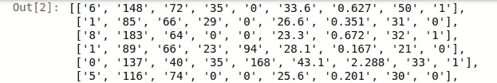*

*读取 CSV 后的数据*

## *将字符串转换为浮点型*

*这里的`string_to_float`函数有助于将所有字符串值转换为浮点型，以便对其执行计算。我们简单地循环每一行和每一列，并将每个条目从字符串转换为浮点。*

*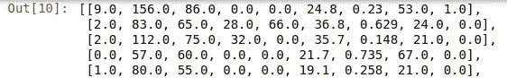*

*数据转换为浮点型*

## *查找最小值最大值*

*现在，为了执行**归一化**或在同一标度上获得所有值，我们必须从每一列中找到最小**值**和最大**值**。在这里的函数中，我们按列进行循环，并在`minmax`列表中添加每一列的最大值和最小值。获得的值显示在下面的截图中。*

*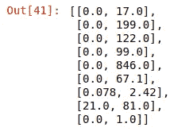*

*每列的最小最大值*

## *正常化*

*现在，我们已经遍历了数据集中的每个值，并从中减去(该列的)最小值，然后除以该列的最大值和最小值之差。下面的屏幕截图显示了单行示例的规范化值。*

*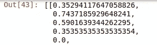*

*标准化后的单行值*

***列车试分裂***

*在这里，`train_test`功能帮助创建训练和测试数据集。我们使用了随机模块中的`shuffle`来混洗整个数据集。然后我们将数据集分割成 80%并存储在`train_data`中，剩下的 20%存储在`test_data`中。两组的大小如下所示。*

*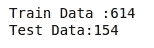*

*训练和测试集的大小*

## *准确(性)*

*这个`accuracy_check`函数将用于检查我们模型的准确性。这里，我们简单地循环实际或预测列表的长度，因为两者长度相同，如果两者在当前索引处的值相同，我们增加计数`c`。然后只需将计数`c`除以实际或预测列表长度，并乘以 100，即可得到准确率%。*

## *预测或假设函数*

*是的，这里我们引入了`numpy`来计算点积，但是也可以创建函数。`math`用于计算指数。`prediction`函数是我们的假设函数，它将整行和参数作为参数。然后，我们用θo 初始化假设变量，我们循环遍历每个行元素，忽略最后一个，因为它是目标`y`变量，并将 xᵢ*θ(i+1(I+1 在下标中)添加到假设变量。之后，出现了`sigmoid`函数 1/(1+exp(-hypothesis))，该函数将值压缩到 0–1 的范围内。*

## *价值函数*

*我们不一定需要这个函数来让我们的模型工作，但是计算每次迭代的成本并绘制出来是很好的。在`cost_function`中，我们循环了数据集中的每一行，并用上述公式计算了该行的`cost`,然后将其添加到成本变量中。最后，返回平均成本。*

## *最优化技术*

*这里，我们使用了`gradient_descent`为我们的模型自动寻找最佳的参数集。该函数以**数据集**、**历元**(迭代次数)和 **alpha** (学习率)作为参数。在该函数中，`cost_history`被初始化以在每个历元后追加成本，`parameters`保存参数集(参数数量=特征+1)。之后，我们开始一个循环，重复寻找参数的过程。内部循环用于迭代数据集中的每一行。这里，由于成本函数的偏导数，梯度项对于θo 是不同的，这就是为什么它被单独计算并添加到参数表中的第 0 个位置，然后其他参数使用行的其他特征值(忽略最后一个目标值)计算并添加到参数表中它们各自的位置。对每一行重复相同的过程。此后，1 个时期完成，用计算的参数集调用`cost_function`，并将获得的值附加到`cost_history`。*

## *组合算法*

*这里，我们导入了`matplotlib.pyplot`只是为了绘制成本图。所以没必要。在`algorithm`函数中，我们用 epochs= **1000** 和 learning_rate = **0.001** 调用`gradient_descent`。之后，在我们的测试数据集上做预测。`round`用于对得到的预测值进行四舍五入(即 0.7=1，0.3=0)。然后，调用`accuracy_check`来获得模型的精度。最后，我们绘制了迭代 v/s 成本图。*

## *把所有东西放在一起*

*为了有一个合适的结构，我们将所有的函数放在一个单独的`combine`函数中。我们能够实现大约 **78.5%** 的准确度，可以通过对模型进行超调来进一步提高。下图也证明了我们的模型工作正常，因为成本随着迭代次数的增加而降低。*

*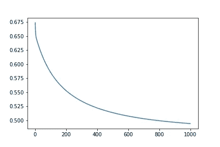*

*迭代 v/s 成本*

# *结论*

*我们已经成功地从零开始构建了一个**逻辑** **回归**模型，而没有使用 ***熊猫******scikit******学习库*** 。我们已经实现了大约 **78.5%** 的准确率，还可以进一步提高。此外，我们可以保留 **numpy** 并构建一个计算点积的函数。虽然我们将使用 sklearn，但了解其内部工作原理也是很好的。😉*

*源代码可以在 [**GitHub**](https://github.com/PushkaraSharma/medium_articles_code/tree/master/Logistic_Regression_from_scratch) 上找到。请随意改进。*

*谢谢你宝贵的时间。😊我希望你喜欢这个教程。*

*此外，检查我的教程上的[梯度下降 v/s 正常方程](https://medium.com/towards-artificial-intelligence/gradient-descent-v-s-normal-equation-for-regression-problems-e6c3cdd705f)*

* [## 回归问题的梯度下降 v/s 正规方程

### 选择正确的算法来找到使成本函数最小的参数。

medium.com](https://medium.com/towards-artificial-intelligence/gradient-descent-v-s-normal-equation-for-regression-problems-e6c3cdd705f)  [## 使用提取方法的简单文本摘要

### 自动对包含最重要句子的文章进行简短总结。

towardsdatascience.com](https://towardsdatascience.com/simple-text-summarizer-using-extractive-method-849b65c2dc5a)*