# 数学逻辑回归

> 原文：<https://pub.towardsai.net/logistic-regression-with-mathematics-ac69bafdc72?source=collection_archive---------1----------------------->

## [机器学习](https://towardsai.net/p/category/machine-learning)，[数学](https://towardsai.net/p/category/mathematics)

# 介绍

逻辑回归是一种无处不在且广泛使用的分类算法。这是一个分类模型，非常容易使用，其性能是最好的线性可分类。这是基于样本属于一个类别的概率。这里，概率必须是连续的，并且在(0，1)之间。它依赖于被称为 Sigmoid 或逻辑函数的阈值函数来做出决定。

要理解 Logistic 回归的概念，重要的是理解**奇数比(OR)** 、 **Logit 函数**、 **Sigmoid 函数或 Logistic 函数**、**交叉熵**或**对数损失**的概念。

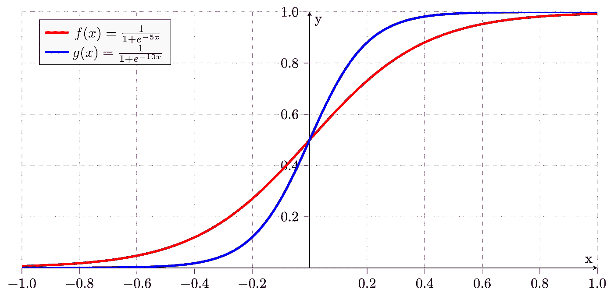

乙状结肠的

# 优势比

比值比(OR)是对特定事件有利的比值。这是一个暴露和结果之间的联系的措施。

> 设 X 是受试者受影响的概率，Y 是不受影响的概率，那么，赔率= X/Y

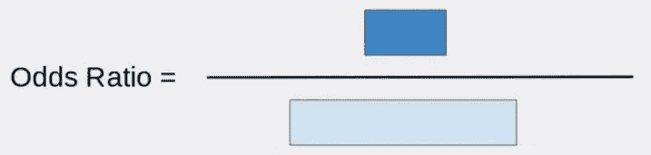

让步比

比值比的公式:

比值比方程

我们取 0 & 1 之间的概率范围。比方说…

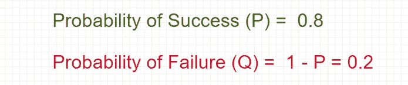

成功和失败的概率

赔率是成功概率和失败概率的比值。

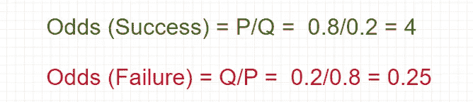

成功和失败的几率

**问题陈述**

*假设 10 个男生中有 7 个被数据科学录取，而 10 个女生中有 3 个被录取。求男生考上数据科学的概率？*

***解***

设 **P** 是被录取的概率， **Q** 是不被录取的概率。

男孩的概率:

被录取和不被录取的概率(男生)

女孩的概率:

被录取和不被录取的概率(女生)

现在，计算男孩和女孩的入学几率:

男孩和女孩的入学几率

因此，获得数据科学录取的**优势比**:

数据科学录取的优势比

结论:——对于一个男生来说，被录取的几率是 5.44。

# Logit 函数

Logit 函数是奇数比的对数(log-odds)。它接受 0 到 1 范围内的输入值，然后将它们转换为整个实数范围内的值。

我们先取 P 为概率，那么 P/(1-P)就是对应的赔率；概率的对数是下面给出的奇数的对数:

Logit 函数

在 logit 函数的示例之前，让我们采用逻辑回归方程，并与 logit 函数相关联来计算概率:

让我们举一个汽车的例子，汽车是否会被出售？

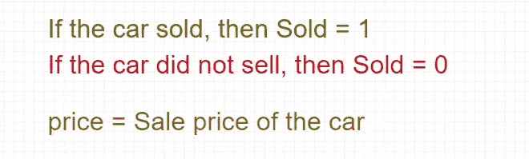

所以，等式:

出售汽车的概率

所以，

可能性

最后，使用 logit 函数

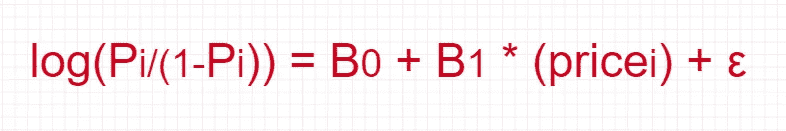

可能性

**问题陈述**

*假设有一辆车，它的价格是 45，000 美元，还有一个叫做粉色便签的附加功能。找到卖出这辆车的可能性了吗？*

**解决方案**

让我们写下汽车是否会被出售的等式？

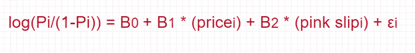

现在，将系数值如下所示:

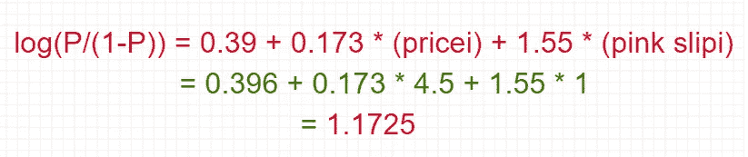

可能性

所以，

因此，

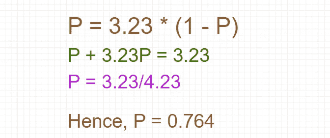

最终导数

因此，该车有 **76.4%** 的销售机会。

# 逻辑函数或 Sigmoid 函数

logit 函数的逆称为逻辑函数或 Sigmoid 函数。它因其特有的形状而被称为 Sigmoid 函数。

Sigmoid 函数的等式(来自 logit 函数):

乙状结肠功能

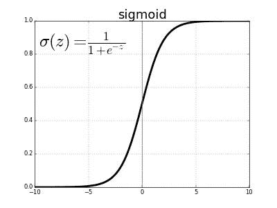

sigmoid 函数将实数值作为输入，并将其转换为截距为**∮(z = 0.5**的[0，1]范围内的值。

# 交叉熵或对数损失

交叉熵通常用于量化两个概率分布之间的差异。这用于逻辑回归。

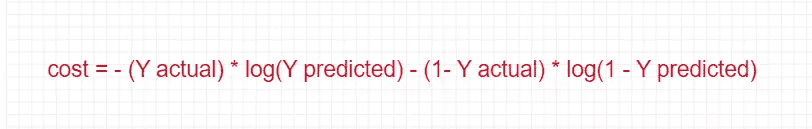

交叉熵方程

或者

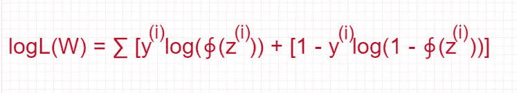

交叉熵方程

它也被称为对数似然函数。

# 结论

逻辑回归的基础依赖于不同的概率方程，如比值比、Sigmoid 函数等。这种分类模型非常容易实现，并且在线性可分类中表现非常好。