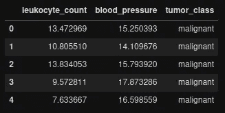
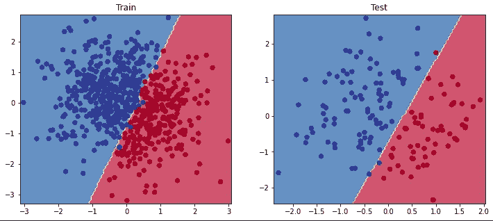
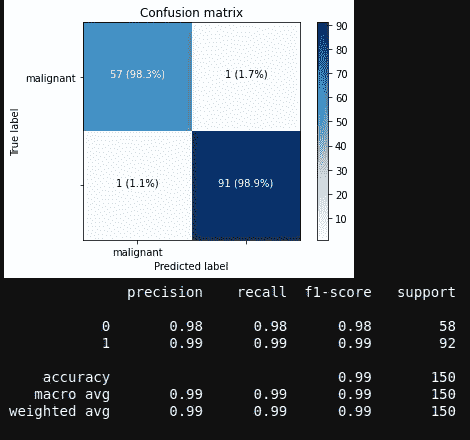
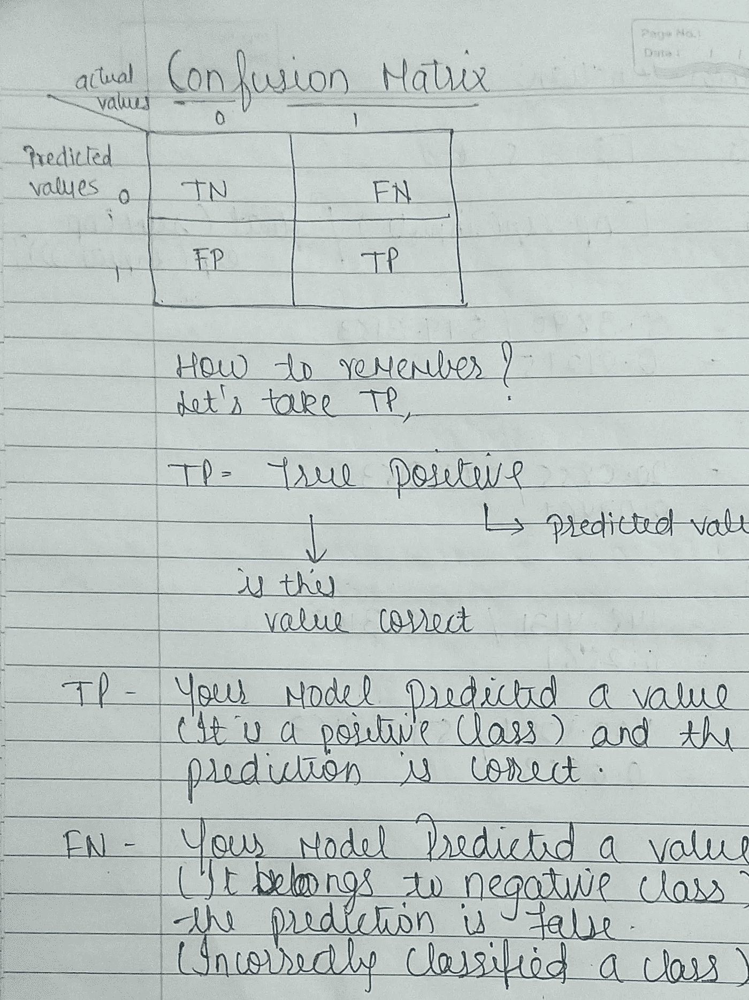
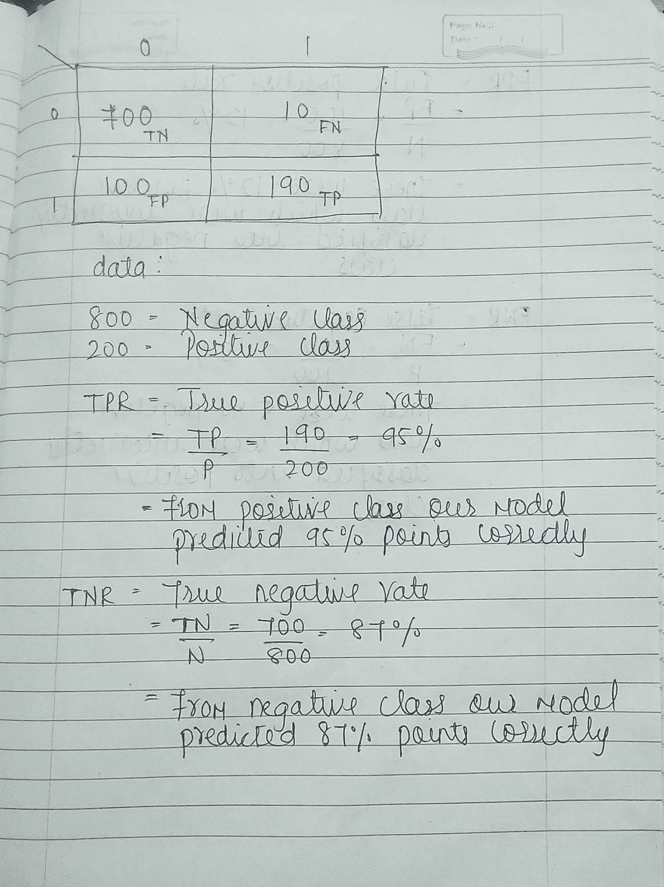
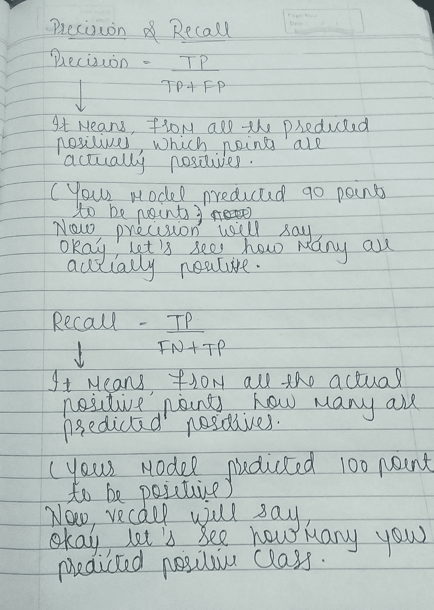
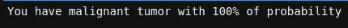

# 用 PyTorch 进行逻辑回归

> 原文：<https://pub.towardsai.net/logistic-regression-with-pytorch-198a4ec80649?source=collection_archive---------0----------------------->

## [机器学习](https://towardsai.net/p/category/machine-learning)


来源: [Pexels](https://www.pexels.com/photo/photo-of-road-during-dawn-3588998/)

在上一篇文章中，我们学习了线性回归，现在我们来学习逻辑回归。

因为我们不能对分类任务使用线性回归，所以我们使用逻辑，它是对分类任务的线性回归的扩展。

对于需要概率作为输出的问题，逻辑回归是一种很好的方法。

有两种方法可以使用输出，

1]你可以把它们转换成二进制，2]你可以直接使用概率。

让我们看看两个例子， **1】我们如何使用概率，因为它是，**

假设我们创建一个模型来预测一名前锋在客场比赛时的概率。我们称之为概率:

**p(比分|客场 _ 比赛)**

如果一个模型预测一个 **p(score | Away_Match)** 为 *0.05* ，那么总的客场比赛，前锋将会打进大约 *1* 个进球。

goal =**p(score | Away _ Match)*** Total _ Away _ Match:

*0.05 * 19 = 0.95 ~ 1 目标。*

2]现在让我们看看二进制分类的第二种方式，

数据集

在这里，我们的任务是根据白细胞(白血球)计数和血压来确定肿瘤是良性(无害)还是恶性(有害)。

```
import pandas as pd
data = pd.read_csv('tumor.csv')
data.head()
```



数据主管

让我们定义 X 和 y，

```
X = data[['leukocyte_count', 'blood_pressure']].values
y = data['tumor_class'].values
```

现在，让我们绘制数据。

```
import matplotlib.pyplot as plt
colors = {'benign' : 'orange', 'malignant' : 'green'}
plt.scatter(data['leukocyte_count'], data['blood_pressure'], c = [colors[item] for item in y], edgecolors = 'k')
plt.xlabel('leukocyte_count')
plt.ylabel('blood_pressure')
plt.legend(['malignant', 'benign'], loc = 'upper right')
plt.show()
```


**拆分数据**

我们现在将数据随机分成 3 组:训练、验证和测试。

*   Train:用于训练我们的模型。
*   Val:用于在培训期间验证我们模型的性能。
*   测试:用于评估我们完全训练好的模型。

在分割数据时，我们将使用分层参数。当我们有一个分类任务时，那么我们必须确保每个分裂都有相同的类别分布(这有助于我们很好地预测类别)

例如，我们的变量 y 是一个二元分类变量，值为“良性”和“恶性”，有 38%的“良性”和 61%的“恶性”，分层= y 将确保您的随机分割有 38%的“良性”和 61%的“恶性”。

```
# Importing library
from sklearn.model_selection import train_test_split# Defining sets
TRAIN_SIZE = 0.7
VAL_SIZE = 0.15
TEST_SIZE = 0.15
SHUFFLE = True# Creating a function 
def split(X, y, val_size, test_size, shuffle):
    X_train, X_test, y_train, y_test = train_test_split(X, y, test_size = test_size, stratify = y, shuffle = shuffle)
    X_train, X_val, y_train, y_val = train_test_split(X_train, y_train, test_size = val_size, stratify = y_train, shuffle = shuffle)
    return X_train, X_val, X_test, y_train, y_val, y_testX_train, X_val, X_test, y_train, y_val, y_test = split(X, y, VAL_SIZE, TEST_SIZE, SHUFFLE)
```

我们可以看到，我们的类标签是文本，我们需要做点什么，万岁！sklearn 让我们…

在此之前，我们只处理数字数据，但现在我们在文本中有了标签。

因此，我们需要将它转换成数字形式。为了将标签转换成数字形式，在 sklearn 中有一个叫做“LabelEncoder”的方法。我们将应用这一点。

```
from sklearn.preprocessing import LabelEncoder
le = LabelEncoder()# fitting on train data
y_le = le.fit(y_train)
classes = y_le.classes_
```

现在，我们将把标签转换成令牌

```
# Convert labels to tokens
**# Before transforming - y_train[0] - 'malignant'**
print(f'y_train[0] : {y_train[0]}')
y_train = y_le.transform(y_train)
y_val = y_le.transform(y_val)
y_test = y_le.transform(y_test)**# After transforming - y_train[0] - 1**
print(f'y_train[0] : {y_train[0]}') 
```

**标准化数据**

我们需要标准化我们的数据(零均值和单位方差)

**z(标准化值)**=*-*μ*/*σ**

*   **xi* =输入*
*   **μ* =平均值*
*   **σ* =标准差*

```
*from sklearn.preprocessing import StandardScaler
ss = StandardScaler().fit(X_train)*
```

*现在，我们将把拟合的数据应用于训练和测试数据*

```
*X_train = ss.transform(X_train)
X_val = ss.transform(X_val)
X_test = ss.transform(X_test)*
```

*现在，我们将定义输入维度和输出维度*

```
*INPUT_DIM = X_train.shape[1]
NUM_CLASSES = len(classes)*
```

*现在，我们将使用 torch.nn.functional 来定义一个自定义层*

```
*import torch.nn.functional as F
from torch import nn
class LogisticRegression(nn.Module):
    def __init__(self, input_dim, num_classes):
        super(LogisticRegression, self).__init__()
        self.fc1 = nn.Linear(input_dim, num_classes)

    def forward(self, x_in, apply_softmax = False):
        y_pred = self.fc1(x_in)
        if apply_softmax:
            y_pred = F.softmax(y_pred, dim = 1)
        return y_pred*
```

*就像我们对线性回归所做的那样，我们创建一个线性层，然后在其上应用 softmax(这是我们用 nn.functional 制作的)。*

***nn.module** —当我们想要创建一个定制模型时，我们使用它。这意味着我们正在以我们的方式定义我们的模型。它是用输入和输出维度初始化的，这是我们在上面定义的。
**nn。线性** —对我们的输入和输出样本应用线性变换。
是全连接层，有输入有输出。现在，它的输入会有一个权重。它的输出将是*【XW+b】，因为它完全是线性的，没有激活函数。**

****f . soft max**——[https://pytorch.org/docs/stable/nn.functional.html?highlight = softm # torch . nn . functional . soft max](https://pytorch.org/docs/stable/nn.functional.html?highlight=softm#torch.nn.functional.softmax)**

**现在，我们将初始化模型。**

```
**model = LogisticRegression(input_dim = INPUT_DIM, num_classes = NUM_CLASSES)**
```

**损失函数**

**LR 的损失函数是对数损失:**

*   ****-ylog(y')****
*   **y '-预测值**
*   **y-实际值**

```
**loss_fn = nn.CrossEntropyLoss()**
```

**韵律学**

**在这里，我使用准确性作为我的衡量标准**

```
**def accuracy_fn(y_pred, y_true):
    n_correct = torch.eq(y_pred, y_true).sum().item()
    accuracy = (n_correct / len(y_pred)) * 100
    return accuracy**
```

****优化器****

**我们在上面看到了**损失函数**(这是一种衡量你离目的地有多远的方法)。考虑到这一点，现在让我们了解一下什么是优化器？**

****

**让我们以陶器为例。这是一个用粘土和其他陶瓷材料制成容器的过程，这些材料在高温下烧制，使它们坚硬耐用。**

**就像这个过程，在训练我们的模型时，这里陶工是我们的优化器，粘土和陶瓷材料是参数(权重)和损失函数，使模型更准确或更无误差。**

**现在，罐子有不同的形状，所以陶工会试着把罐子做成想要的形状，就像陶工一样。优化器将尝试获得正确的权重形状。**

```
**learning_rate = 1e-1
optimizer = torch.optim.Adam(model.parameters(), lr = learning_rate)**
```

**这里，我们使用 ADAM 优化器；它使用自适应学习率。我们不必像在学习率调度器中那样手动调整学习率。**

**有时优化者往往会超越目的地，亚当试图通过在开始时采取较大的步骤，在到达目的地时采取较小的步骤来克服它。**

**现在，我们需要将数据转换成张量。为此，我们使用**火炬。张量**。**

```
**# Convert data to tensors
X_train = torch.Tensor(X_train)
y_train = torch.LongTensor(y_train)
X_val = torch.Tensor(X_val)
y_val = torch.LongTensor(y_val)
X_test = torch.Tensor(X_test)
y_test = torch.LongTensor(y_test)**
```

**现在，让我们训练我们的模型**

```
**EPOCHS = 100
for epoch in range(EPOCHS):
    y_pred = model(X_train)
    loss = loss_fn(y_pred, y_train)
    optimizer.zero_grad()
    loss.backward()
    optimizer.step()
    if epoch%10==0: 
        predictions = y_pred.max(dim=1)[1] # class
        accuracy = accuracy_fn(y_pred=predictions, y_true=y_train)
        print (f"Epoch: {epoch} | loss: {loss:.2f}, accuracy: {accuracy:.1f}")**
```

****精度****

```
**# Accuracy
train_acc = accuracy_score(y_train, pred_train)
test_acc = accuracy_score(y_test, pred_test)
print (f"train acc: {train_acc:.2f}, test acc: {test_acc:.2f}")**
```

**想象边界**

****

**分类报告**

****

**正如我们所看到的，分类报告中有如此多的新术语，让我们一个一个地了解它们。**

****绩效评估****

**1]准确性:正确分类的点数/一组点数**

**让我们举个例子:**

**假设我们有 100 分，其中 60 分是正分，40 分是负分。**

**现在，在这 100 个点中，我们的模型正确地分类了 88 个点(53 个来自正面类，35 个来自负面类)，并且不正确的分类，即错误，是 12 个点。**

**所以我们模型的准确率是 88%，误差是 12 %。**

*   **这个指标很容易理解**
*   **它在不平衡数据上表现不佳。**

****混乱矩阵****

****

**混淆矩阵**

****

**混淆矩阵**

****

**混淆矩阵**

****精度和召回****

****

**精确度和召回率**

****推论****

```
**X1 = pd.DataFrame([{'leukocyte_count': 13, 'blood_pressure': 16}])
# Standardize
X1 = ss.transform(X1)**
```

****预测****

```
**# Predict
y1 = model(torch.Tensor(X), apply_softmax=True)
prob, _class = y.max(dim=1)
print (f"You have {classes[_class.detach().numpy()[0]]} tumor with {prob.detach().numpy()[0]*100.0:.0f}% of probability")**
```

****

**推理的结果**

****代码**-[https://github . com/prati kraut 1/Logistic-regression-with-py torch](https://github.com/pratikraut1/Logistic-regression-with-pytorch)**

****免责声明**-标题中无链接的图片为作者所有；否则，会提供一个链接。**