# 回顾最初的香草甘及其随时间的演变

> 原文：<https://pub.towardsai.net/looking-back-at-the-original-vanilla-gan-and-its-evolution-over-time-3d441cedbd05?source=collection_archive---------1----------------------->

## [机器学习](https://towardsai.net/p/category/machine-learning)

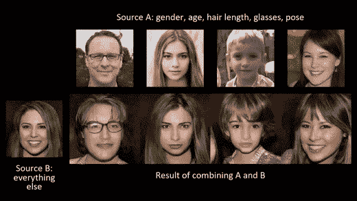

氮化镓的演变

当谈到机器学习时，有两种类型的模型，称为判别模型和生成模型。

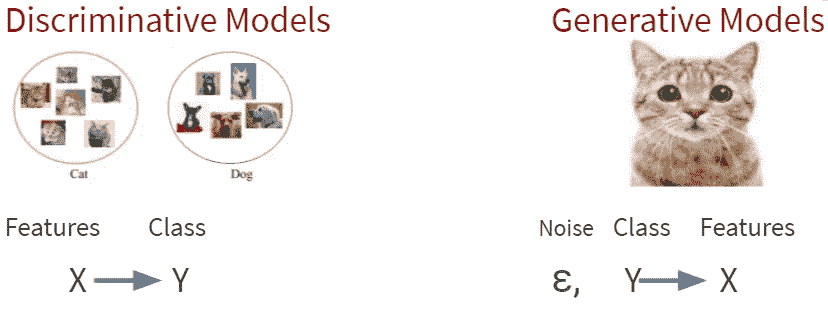

判别模型与生成模型

区分模型用于分类任务，其中我们使用 X 特征将它们分类到某个特定的 y 类。

生成模型试图使用均匀噪声生成新数据。它将来自某个分布的训练样本作为输入，并学习代表该分布的模型。

说到生成模型，目前有几种模型。下图将让您对现有模型有一个总体的了解。

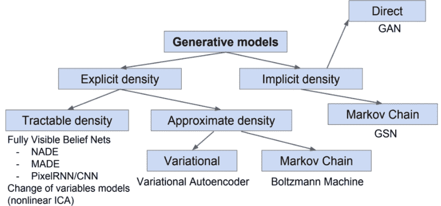

来自 Ian Goodfellow，2017 年《生成性对抗性网络教程》。

Ian Goodfellow 在 2014 年提出了一种被称为生成对抗网络的生成模型。该模型有助于将深度学习模型推向一个新时代。

这个想法很简单，有两个神经网络被称为鉴别器和发生器。我们可以认为直觉是一个鉴别者，是一个艺术检查员，而发生器是一个试图愚弄艺术检查员的小偷。

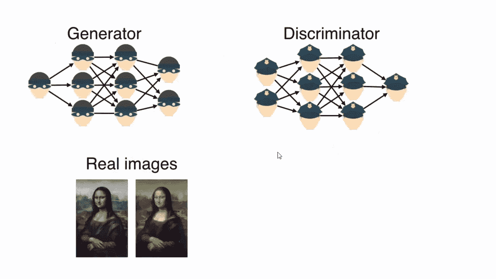

gan 的简单表示

如上图超时生成器，小偷变得非常熟练生成现实艺术。然后甄别器最终将被生成器愚弄。

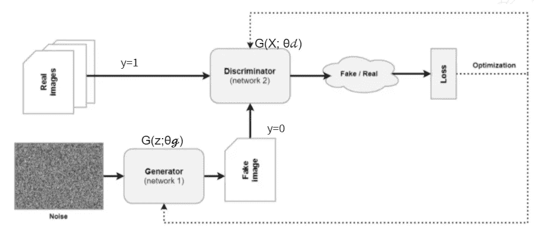

GAN 架构

如果我们看看这个 min-max 游戏的架构，其中生成器试图欺骗鉴别器，鉴别器试图识别假货，可以通过上面的架构显示出来。

第一个是捕获数据分布的生成器，第二个是估计样本来自训练数据而不是生成器的概率的鉴别器。这个想法是让这两个网络变得更好，同时通过玩一个 minimax 双人游戏来相互竞争。

随着时间的推移，发生器和鉴别器试图最大化下限值函数。

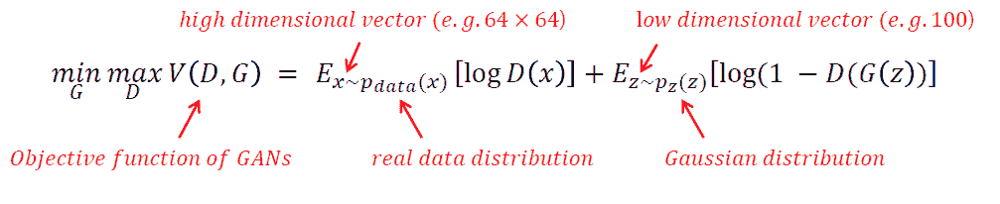

甘斯的价值函数

这里，鉴别器 D 试图最大化值函数，使得 D(X) = 1，D(G(Z)) = 0，生成器试图最小化值函数，使得 D(G(Z)) = 1。

Ian Goodfellow 已经确定了当生成的数据等于真实数据时，鉴别器的最大最佳值和发生器的最小值。这在实际场景中更难实现。

在引入这种最初的 GAN 之后，在过去的 7 年中出现了几种变体。如果我们看一些应用程序，

1.  **艺术一代**

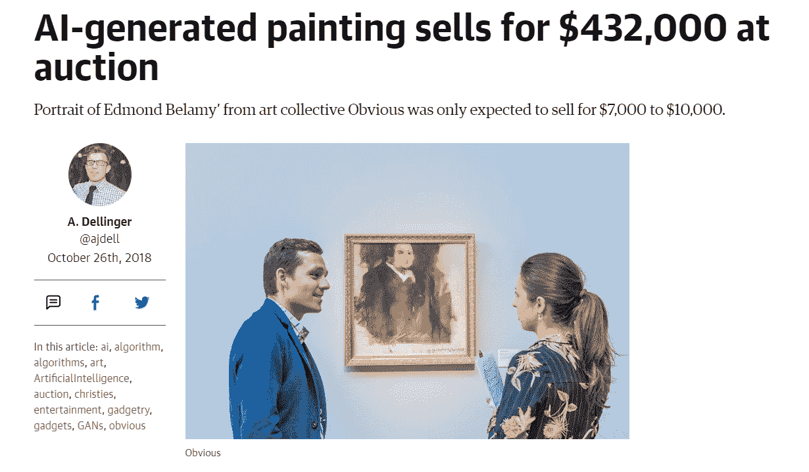

这幅画是用甘斯的变体创作的，售价为 43.2 万美元

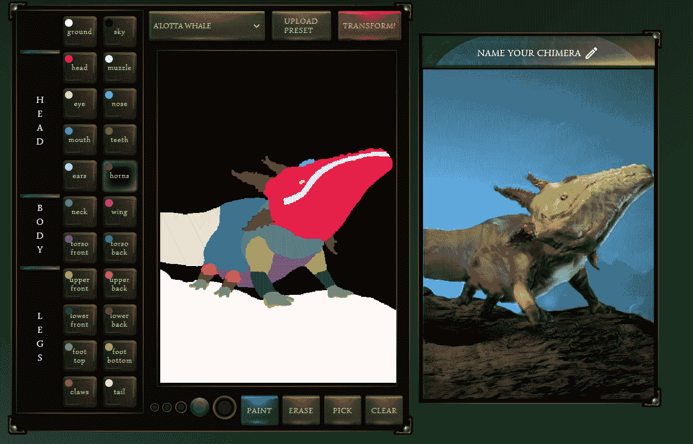

【https://storage.googleapis.com/chimera-painter/index.html 

到目前为止，艺术生成是一个要求极高的领域。现在许多艺术家用甘创造艺术。

**2。面部生成/面部交换**

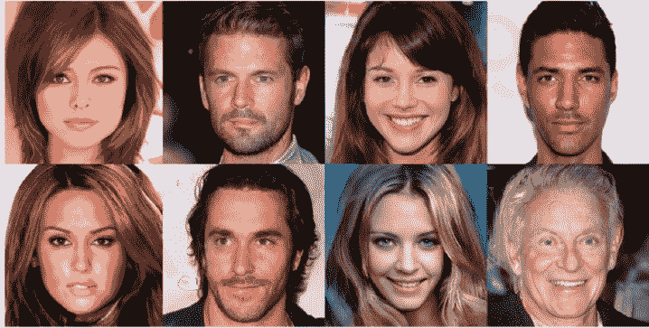

https://thispersondoesnotexist.com/

在过去的几年里,“面子工程”迈出了巨大的步伐。如果你访问这个[链接](https://thispersondoesnotexist.com/)，你可以看到一张在用 GANs 生成的作品中不存在的脸。

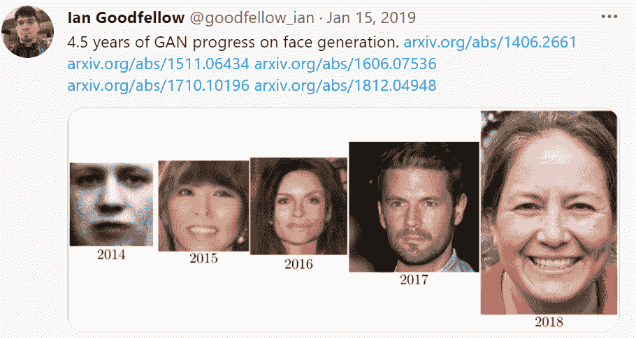

人脸生成随时间的演变

**3。翻译图像**

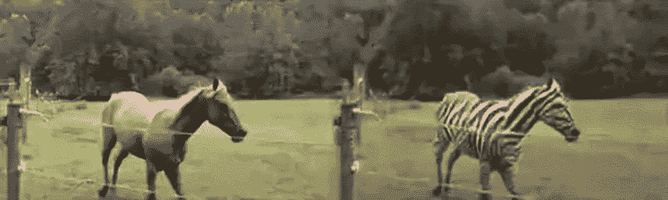

朱等.基于循环一致对抗网络的不成对图像到图像翻译，2017

使用 GANS 将图像转换成图像是另一个应用。在过去的几年里，利用这一概念，出现了几种类型的研究。

**4。编辑照片/视频**

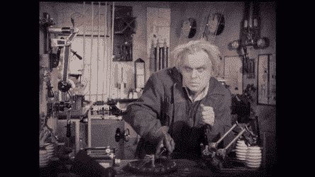

使用[https://github.com/jantic/DeOldify](https://github.com/jantic/DeOldify)着色

给视频和照片着色是 GANS 处理的另一个领域。如果你访问这个 [git repo](https://github.com/jantic/DeOldify) 你可以使用 provide google collab 环境给你的旧照片上色。😄

**6。娱乐**

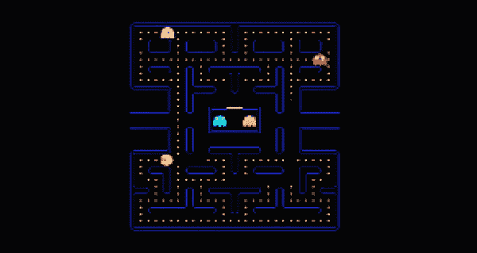

使用 GANs 生成的游戏-[https://blogs . NVIDIA . com/blog/2020/05/22/gamegan-research-pacman-周年纪念/](https://blogs.nvidia.com/blog/2020/05/22/gamegan-research-pacman-anniversary/)

现在，用 GANs 创作新的交响乐、音乐和歌词也成为可能。上图显示了 Nvidia 的一个新项目，他们试图使用 GANs 生成一个吃豆人游戏。

希望你们能看到甘斯的重要性。😎

**参考文献**

1.[https://arxiv.org/abs/1406.2661](https://arxiv.org/abs/1406.2661)