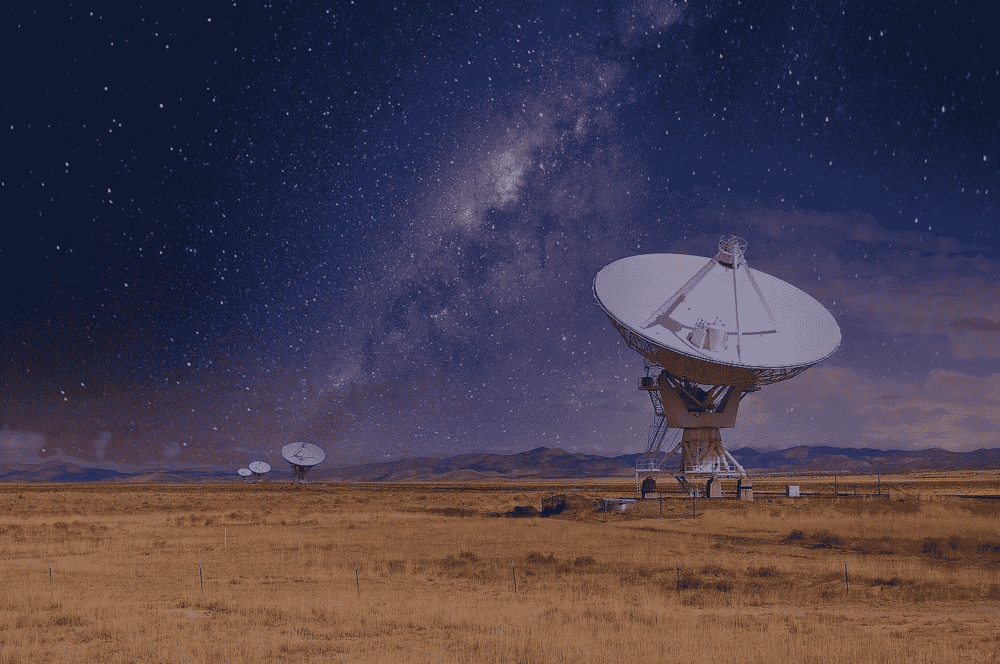
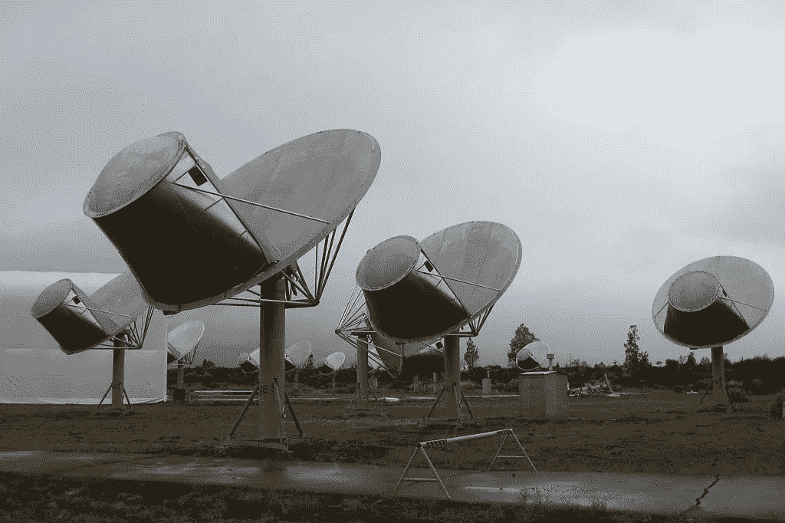
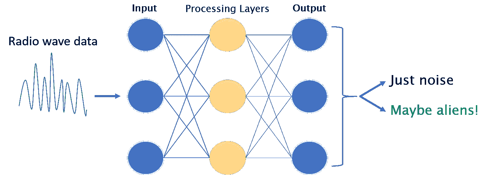
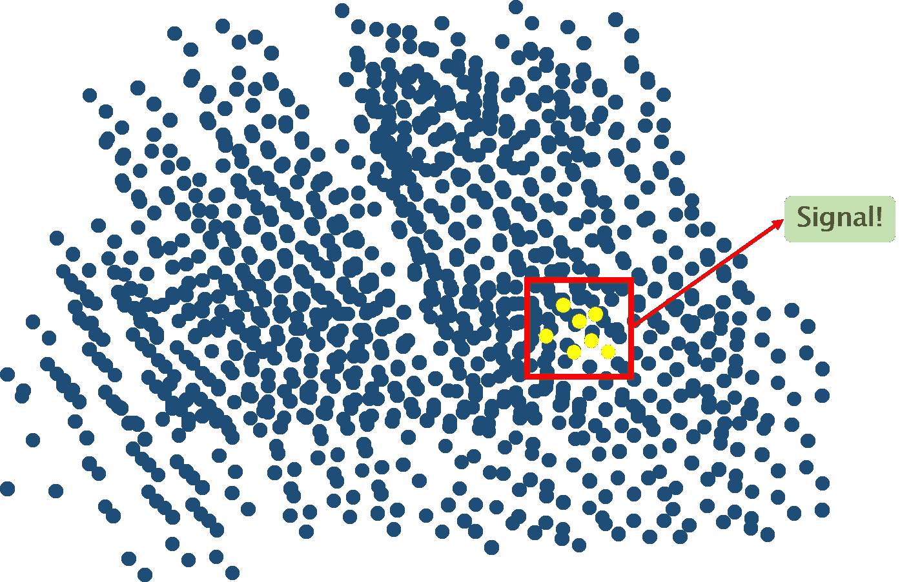

# 利用人工智能寻找外星人

> 原文：<https://pub.towardsai.net/looking-for-aliens-using-artificial-intelligence-8f836db4ef37?source=collection_archive---------2----------------------->

## [未来](https://towardsai.net/p/category/future)，[意见](https://towardsai.net/p/category/opinion)

## 如果有智慧的外星生命，那将是人工智能发现了它。

图片来自[皮耶路易吉·达梅里奥](https://pixabay.com/users/obelixlatino-11847510/?utm_source=link-attribution&utm_medium=referral&utm_campaign=image&utm_content=5066630)来自[皮克斯拜](https://pixabay.com/?utm_source=link-attribution&utm_medium=referral&utm_campaign=image&utm_content=5066630)

> **“看那东西，哥们！”**
> 
> ——美国海军飞行员在发现一个速度惊人的不明飞行物后

2020 年 4 月，美国国防部[解密](https://www.cnbc.com/2020/04/28/pentagon-declassifies-ufo-videos-taken-by-navy-pilots.html)三段海军飞行员在 2004 年和 2015 年拍摄的 UFO 视频。有趣的是不明飞行物飞行的速度。我们清楚地听到视频中的海军飞行员是多么震惊——他们对快速飞行略知一二。

我们仍然没有弄清楚那些飞行物是什么。尽管如此，即使是看了视频的坚定的怀疑论者也会问自己“*如果……”会怎么样*

我们很可能并不孤单。银河系中超过一半的类太阳恒星可能包含一颗可居住的行星。计算表明，至少有 170 亿颗恒星可能存在可居住的世界。现在考虑宇宙的其他部分。为什么我们会孤独？

# 人工智能已经在寻找外星生命了

像 SETI 研究所(搜寻外星生命)这样的组织正在通过分析来自外太空的无线电频率来寻找外星通讯。有磁场的天体(如恒星)会产生无线电波。技术驱动的交流也是如此，这正是 SETI 所寻求的。

那为什么我们什么都没找到？答案是，我们旧的搜索技术仅仅触及了需要做的事情的表面。SETI 的名誉主席 Jill Tarter 说，如果我们必须搜索的数据量相当于地球海洋的体积，我们目前已经看到了一个玻璃杯。如果你想知道海洋中是否有鱼，你舀起一杯水，你可能会得出海洋中没有鱼的结论。

## 人工智能让我们分析大量的数据

简单来说，AI 教会计算机如何学习。这是强大的，因为我们不必每次都编写新的指令。“人工智能”实际上是包括机器学习、计算机视觉和自然语言处理在内的技术的总称。

**机器学习**是分析太空数据寻找智慧生命迹象的最相关技术。其核心是，机器学习用于大规模分类数据，找到模式，并产生人类可能看不到的洞察力。

更重要的是，人工智能大规模地自动化了工作。当我们将人工智能工具与现代计算能力结合起来时，我们可以处理大量数据——远远超过一群工程师在几十年内可能完成的任务。

在一个人工智能的世界里，听来自太空的无线电波并不是一屋子带着耳机的人。它几乎完全由电脑驱动。

# SETI 的艾伦望远镜阵列监听外星人的对话

艾伦望远镜阵列(局部视图)。图片来自[维基共享](https://commons.wikimedia.org/wiki/File:Seeing_the_Allen_Telescope_Array_-_Flickr_-_brewbooks.jpg)在知识共享[署名-共享 2.0 通用](https://creativecommons.org/licenses/by-sa/2.0/deed.en)许可下授权。

艾伦望远镜阵列(ATA)的唯一任务是寻找外星人通讯的证据。单个望远镜指向数光年之外的行星系统，以确定该地区的无线电波是否来自技术交流。听起来很简单，但 ATA 的功能强大到可以让其他望远镜看起来像孩子的玩具。

在微软联合创始人保罗·艾伦的支持下，该望远镜阵列于 2007 年建成，其各个部分结合起来，创造了更广阔的天空视野。这允许阵列捕捉更大范围的频率并收集更多数据。

来自每个望远镜的无线电信号被发送到一个控制室，数字化成 1 和 0，并组合起来产生一个巨大望远镜的效果。

## 使用人工智能分析无线电频率(并找到外星人)

这就是人工智能的用武之地。ata 收集的近乎连续的射频数据流太大，人类无法处理。人类也很难识别哪些无线电模式是不寻常的，值得研究。这就像在银河大海捞针一样。

一种过于简化的神经网络表示。图片作者。

**神经网络，**机器学习的子集，正在解决这些问题。神经网络能够实现更密集的模式识别和分类任务。具有更多“处理层”的神经网络模型可以处理更复杂的任务。

ata 收集的无线电波数据被输入神经网络模型进行分析。该模型试图从无线电波中存在的大量“噪音”中识别出通信的“信号”。这是银河尺度的模式识别。重复的、结构化的无线电波模式可能意味着交流。换句话说，模型寻找一些不寻常的东西。

神经网络模型试图从大量噪音中分离出信号。图片作者。

神经网络通过首先研究夜空中一个小区域的无线电频率来“学习”。从这个更小的数据集，它学习什么是“正常”的声音。然后，它利用这种能力从更大的射频数据集中滤除背景信号。剩下的是“不正常”的信号、模式或重复。这些信号可能表明潜在的外星通讯，并被发送给人类工程师进行进一步研究。

这些光点并不一定证明外星人的交流。它们可能只是模型不知道是随机的随机模式。然而，一旦模型学会了这一点，它就会随着时间变得更好。

神经网络的美妙之处在于，我们不需要编写代码来告诉系统“正常”是什么样子。我们只是告诉系统将数据聚集到不同的桶中，并找到模式或异常。这就像告诉分析师“这里有很多数据，去给我找些有趣的。”

事实上，类似的神经网络模型已经在其他行业使用。例如，[银行一直在使用类似的模型](https://towardsdatascience.com/artificial-intelligence-for-risk-reduction-in-banking-current-uses-799445a4a152)来检测欺诈和洗钱等异常情况。

# 天文学中的其他人工智能用例

人工智能可能会帮助我们识别可能与地球相撞的小行星。图片由[родионжуравлёв](https://pixabay.com/users/9866112-9866112/?utm_source=link-attribution&utm_medium=referral&utm_campaign=image&utm_content=3628185)来自 [Pixabay](https://pixabay.com/?utm_source=link-attribution&utm_medium=referral&utm_campaign=image&utm_content=3628185)

据美国宇航局称，自动驾驶汽车背后的人工智能方法可能很快会帮助我们检测可能与地球相撞的小行星，并确定类地行星(“系外行星”)的可居住条件。

美国宇航局前沿发展实验室(FDL)的机器学习软件可以创建附近小行星的 3D 模型。该软件还能精确估计它们的大小、形状和旋转速度。快速计算这些信息对于识别(以及未来偏转)威胁地球的小行星至关重要。如果你认为 2020 年是一个糟糕的年份，想象一下如果有一颗小行星参与，情况会有多糟糕。

天文学家使用传统的软件技术需要一到三个月来分析一颗小行星。机器学习算法现在可以在短短四天内创建一个小行星的渲染。

神经网络可能很快使我们能够快速识别可居住的系外行星。我们目前使用望远镜数据来分析外行星大气中的分子是如何吸收或发射光波长的。这种分析可以揭示行星化学的线索，比如它的大气中是否含有氧气。

迄今为止，我们已经发现了数以千计的系外行星，这才刚刚开始。快速确定“最适宜居住”的行星可以帮助我们集中精力和资源。

FDL 团队与谷歌云合作开发了一个神经网络模型，以分析 2008 年发现的系外行星 WASP-12b 的大气。神经网络优于更基本的机器学习技术，甚至可以对其预测应用确定性分数。这是一个重要的特性，有助于建立对这些新模型的信任。

# 未来…

为什么把人工智能技术局限在地球上？为航天器配备人工智能软件可以在外层空间实现实时决策，并减少向地球传输数据的时间。如果我们处于《星际迷航》的情况，我们会希望我们的宇宙飞船立即识别潜在的外星人接触，而不是在等待从地球得到确认时被分解。

人工智能也将扩大地球上的数据处理。据报道，美国宇航局每 15 秒收集 2GB 的数据，使用传统方法只能分析其中的一小部分。通过自动化常规和耗时的数据处理，人工智能将解放科学家，使他们专注于前沿工作。

人工智能不会很快取代人类科学家。人工智能倾向于将巨大的计算能力应用于狭窄定义的任务。需要独创性的任务仍然属于人类的领域。

我们还必须仔细检查人工智能生成的结果。你不想成为那种告诉所有人小行星正朝我们飞来，但后来才意识到人工智能模型出错的科学家。