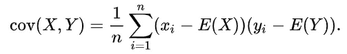
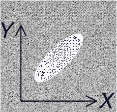
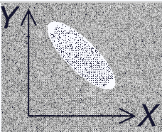
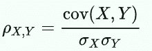
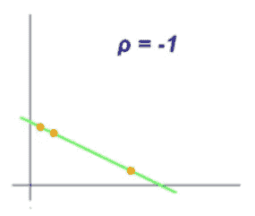
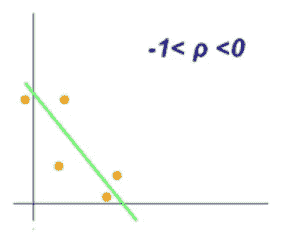
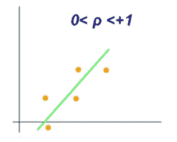
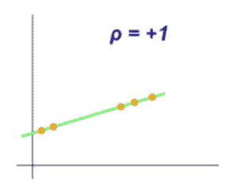
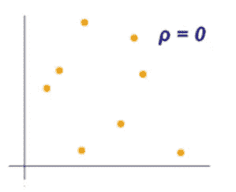

# 在数据中寻找联系？相关技术来拯救！

> 原文：<https://pub.towardsai.net/looking-for-connections-in-your-data-correlation-techniques-come-to-rescue-53121a149f96?source=collection_archive---------2----------------------->

理解数据中的联系有其自身的优势(照片由[克林特·王茂林](https://unsplash.com/@clintadair?utm_source=medium&utm_medium=referral)在 [Unsplash](https://unsplash.com?utm_source=medium&utm_medium=referral) 上拍摄)

## [数据科学](https://towardsai.net/p/category/data-science)

## 简单地说，相关技术

机器学习模型的好坏取决于你使用的数据。这就是为什么数据科学家通常会花费数小时来预处理和清理数据。关键是只选择对最终模型的性能贡献最大的特征。这里*特征工程*进入了画面。

## 有什么关联？

简单来说，*相关性是一个特性与另一个特性*相关程度的度量。例如，身高和体重可以*正相关* *相关*。而身高和工资*根本不相关。*

通过使用另一个相关要素输入缺失值或消除高度相关的冗余要素，了解要素之间的相关性有助于进行要素工程。

**在本文中，我们将讨论各种相关技术及其有用性。**

以下是最广泛使用的相关技术，

1.  协方差
2.  皮尔逊相关系数
3.  斯皮尔曼等级相关系数

让我们开始吧！

## 1.协方差:

协方差是两个特征的*联合概率*的度量。对于两个特征，比如说， *X 和 Y* ，设 *E(X)，E(Y)* 分别为 *X，Y* 的期望值，【n】为数据点的总数。X，Y 的协方差由下式给出:

X，Y 的协方差的数学公式

协方差的符号表示特征之间的线性关系的趋势。然而，协方差的大小并不表示特征之间关系的强度。

*   如果**协方差(X，Y)为正**，则意味着一个特征的较大值对应于另一个特征的较大值，对于较小值也是如此，(即，这些特征倾向于表现出**相似的行为**

当协方差(X，Y)为正时，X，Y 的样本图

*   如果**协方差(X，Y)为负**，则意味着一个特征的较大值对应于另一个特征的较小值(即，这些特征倾向于显示与**相反的行为**)

协方差(X，Y)为负时 X，Y 的样本图

## 缺点:

1.  从特征的协方差来看，不能解释特征之间相似(或相异)的强弱。
2.  要素单位的变化可能会改变要素的协方差值，从而使其不可靠。

## 2.皮尔逊相关系数(PCC):

皮尔逊相关系数是测量两个特征之间的线性相关性的统计量。对于两个特征，X，Y 设σX，σY 分别为 X，Y 的标准差。X，Y 的 PCC 由下式给出

X，Y 的 PCC 的数学公式

它的值介于+1 和-1 之间，其中

*   1 是一个**完美的正线性相关**
*   0 是**没有线性相关性**
*   —1 是一个**完美的负线性相关**

PCC 可以洞察变量之间的相似性强度(这是协方差的一个主要缺点)。

*   如果 PCC 值为-1，则存在**严格负线性相关性**

值为 PCC -1 的变量样本图

*   如果 PCC 值位于(-1，0)，则存在**不太完美的负线性相关性**

PCC 值为(-1，0)的变量样本图

*   如果 PCC 值位于(0，+1)，则存在**不太完美的正线性相关**

PCC 值为(0，+1)的变量样本图

*   如果 PCC 值为+1，则存在**严格正线性相关性**

值为 PCC +1 的变量样本图

*   如果 PCC 值为 0，则**不相关**

值为 PCC 0 的变量样本图

## 缺点:

PCC 不能很好地处理*非线性关系*。对于以下所有图，特征之间的 PCC 为 0。

非线性曲线

## 3.斯皮尔曼等级相关系数；

斯皮尔曼等级相关系数(SRCC)评估两个特征之间的关系可以使用*单调函数(无论线性与否)*描述的有多好，其中 PCC 只能评估线性关系。

两个变量之间的 Spearman 等级相关系数等于两个变量等级值之间的 *Pearson 相关系数*。 *Rank* 是变量内观察值的相对位置标签。

> 直观上，当两个变量之间的观测值具有相似的秩时，两个变量之间的 Spearman 秩相关系数将会很高，而当两个变量之间的观测值具有不同的秩时，该相关系数将会很低。

Spearman 等级相关系数位于+1 和-1 之间，其中

*   1 是一个**完全正相关**
*   0 是**不相关**
*   —1 是一个**完美负相关**

## 优势:

*   Spearman 等级相关系数比 Pearson 相关系数对强异常值**不敏感**
*   当被比较的两个变量单调相关时，Spearman 等级相关系数为 1，即使它们的关系不是线性的。

谢谢你的阅读。我也将在未来写更多初学者友好的帖子。请在[媒体](https://medium.com/@ramyavidiyala)上关注我，以便了解他们。我欢迎反馈，可以通过 Twitter [ramya_vidiyala](https://twitter.com/ramya_vidiyala) 和 LinkedIn [RamyaVidiyala](https://www.linkedin.com/in/ramya-vidiyala-308ba6139/) 联系我。快乐学习！