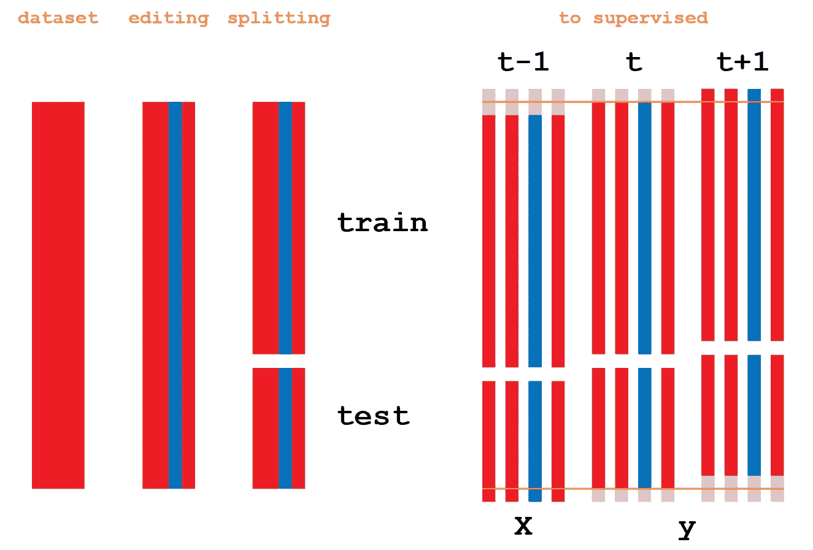
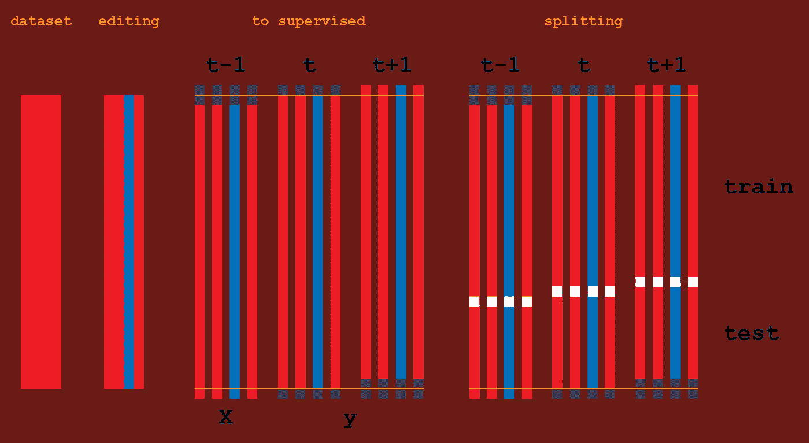
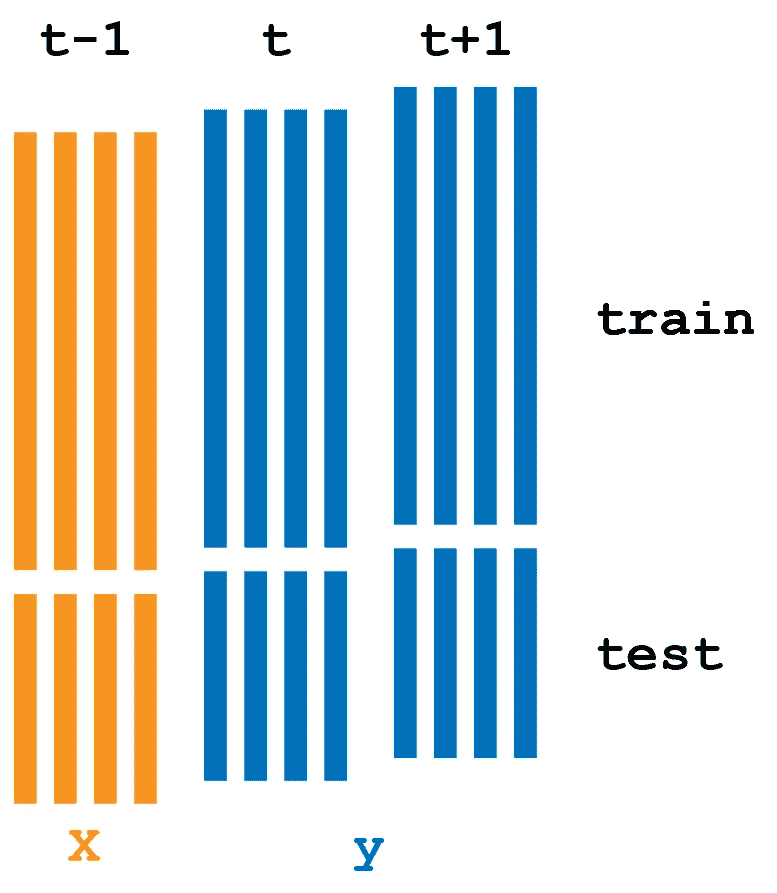
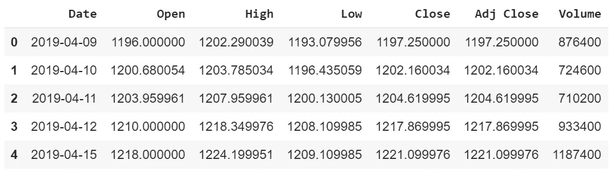
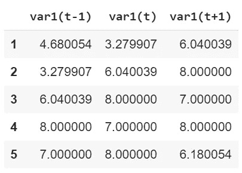
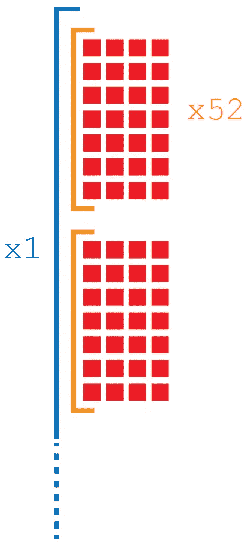
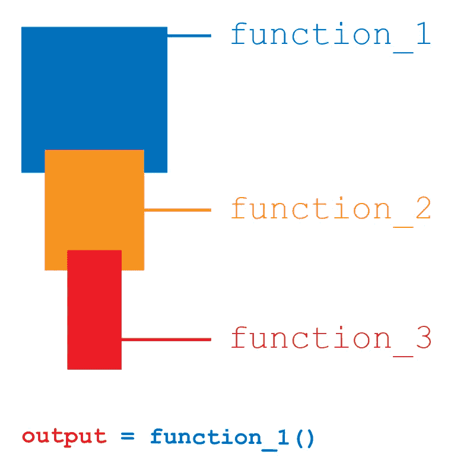
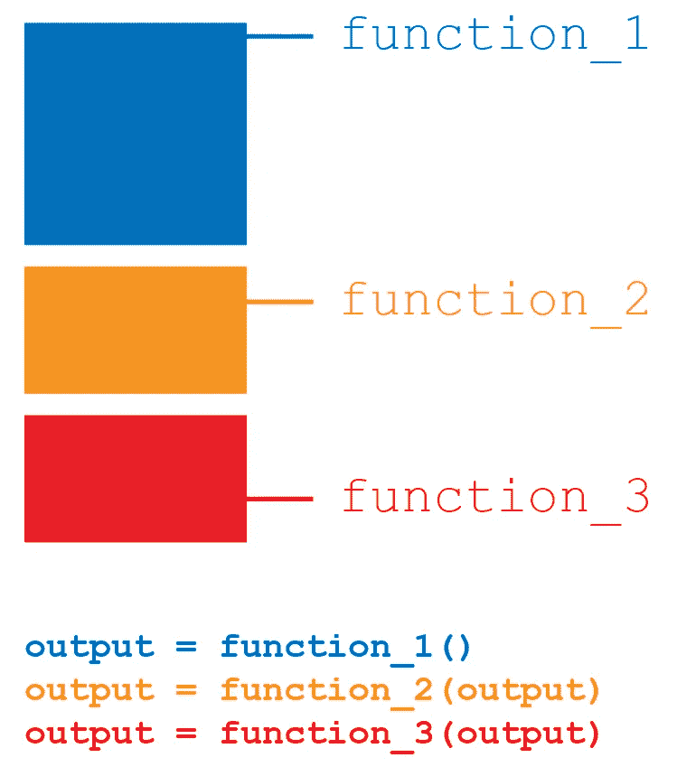

# 时间序列的 LSTM:人工智能行业的混乱

> 原文：<https://pub.towardsai.net/lstm-for-time-series-chaos-in-the-ai-industry-63b8efc12696?source=collection_archive---------0----------------------->

## 机器学习

## 为什么 LSTMs 如此难以编码？

LSTM 是预测时间序列最常用的神经网络之一。不幸的是，这种神经网络是复杂的(特别是数据准备)，不仅因为时间序列数据需要特定的结构来适应人工智能(如滑动窗口技术)，而且因为创建 LSTM 的关键步骤(数据准备、整形……)表达成完全取决于工程师习惯的路径变化。

当我在互联网上搜索代码进行研究时，我总是发现很难将另一个程序员的代码合并到我的项目中。具体到 LSTM，我认为导致更多麻烦的关键步骤是:

*   为 LSTM 准备数据集的顺序
*   我们选择哪种数据结构来存储数据集

简单地说，因为对于两个关键步骤有多种方法可以达到相同的结果，所以另一个程序员选择的路径可能与我的不同。

在本文中，我将阐明我的立场，即为什么有必要下定决心使用一组特定的范例，尤其是在编写乏味的 LSTM 时，这既是出于调试的原因，也是为了共享简化。

# LSTM 的数据准备

本质上，当我们为模型准备时间序列数据时，这些关键步骤可以互换:

*   按时间分割数据集
*   将数据集转换为监督学习问题

不幸的是，程序员还没有想出一个精确的顺序。一部分程序员首先拆分数据集。然后他们将其转化为监督学习问题。剩下的程序员颠倒顺序:



在拆分之前，然后转换为监督学习问题

上面那个是我比较喜欢的范式。需要的编码更少，并且我在库中收集的所有算法都遵循相同的结构。



在转换到监督学习问题之前，然后拆分

甚至上面的结构也是可能的，但是我的算法需要一些编辑，我不能仅仅颠倒几行代码来获得相同的结果:



决赛成绩

正如我们所看到的，两种方法导致相同的结果。但是我们都意识到，当程序员使用他们独特的方法来解决一个与程序员社区共享的问题时，在共享或发布代码时绝对是混乱的。

# 数据结构

在我们决定了为 LSTM 准备数据的正确顺序之后，我们需要选择我们将使用的数据结构。我发现世界分为三类:

*   那些喜欢 NumPy 数组的
*   喜欢熊猫数据框的
*   那些喜欢列表的人

# 熊猫数据框

我属于第二类:我相信 pandas 是一个舒适可靠的图书馆，可以有序地保存数据。每当我们为人工智能编写代码时，我们应该总是能够在过程的任何一步检查我们的数据，以便于调试。

用简单的一行代码:

```
df.head()
```

我们可以立即检查数据的状态。



一个用熊猫形象化的谷歌股票的例子。

每当我写一个人工智能的时候，我总是尽我最大的努力在代码的每一步把数据保持在熊猫数据帧的形式。简单地说，每当出现问题时，我都想看一看数据，以检查是否有任何可见的错误。



熊猫数据框架作为监督学习问题的一个例子

然而，如果我们使用一个不可理解的多维列表，将很难看到我们正在做什么。

# Numpy 数组

所有数据集迟早都会被转换成 NumPy 数组，以便进行编辑或缩放。例如，如果我们希望在 0 和 1 之间缩放数据集，我们可以使用一个名为 MinMaxScaler 的工具，该工具需要数据集作为值。

```
from sklearn.preprocessing import MinMaxScaler#df is pandas DataFrame
#conversion to numpy array
df = df.Values
scaler = MinMaxScaler(feature_range=(0, 1))
scaled_values = scaler.fit_transform(df)
```

将整个数据集作为 NumPy 数组的问题是，您无法详细了解其中的内容。您看不到命名列下的数据。当您将数据集转换为监督学习问题时，这变得非常重要。

幸运的是，您可以轻松地从 NumPy 数组切换回 DataFrame，但是拆分方法完全不同。您可以通过形状直接编辑数据集，但这并不会使它更有利于调试。

# 列表

将数据集的内容存储在多维列表中是荒谬的。就在几天前，我在 Kaggle 上发布的代码中目睹了这一点:



上面的示例说明了如何使用形状列表存储每天有四个参数的时间序列:

```
(52, 7, 4)
```

确切地说，告诉我，你将如何查看数据内部，并用相似的结构按名称组织所有的列？

# 最后但并不是最不重要的

这个问题不仅限于 LSTM，但我遇到的次数更多了。至少在我看来，你不能一个接一个地调用一系列函数。



我可以向你保证。代码可能看起来短小精悍，但是查找错误绝对是个问题。在函数声明期间，输入的名称可能会改变，当您想要检查隐藏在代码中的变量的值或输出时，您不能简单地在最后调用它，您必须提取它及其所有以前的代码。那会很不舒服。



这是我喜欢的构建代码的方式。有几行代码一个接一个地调用不同的函数，而不是只有一行。这看起来更费时间，但是我可以很容易地检查每个函数的输出，而不会发疯，而且我可以用一种更容易的方式隔离每个函数中的变量。

# 谈到 LSTMs

你还有什么要补充的吗？

由[向艾](https://towardsai.net/)发布