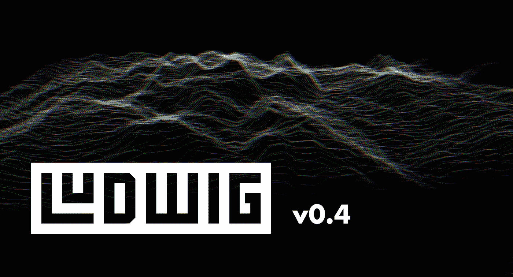
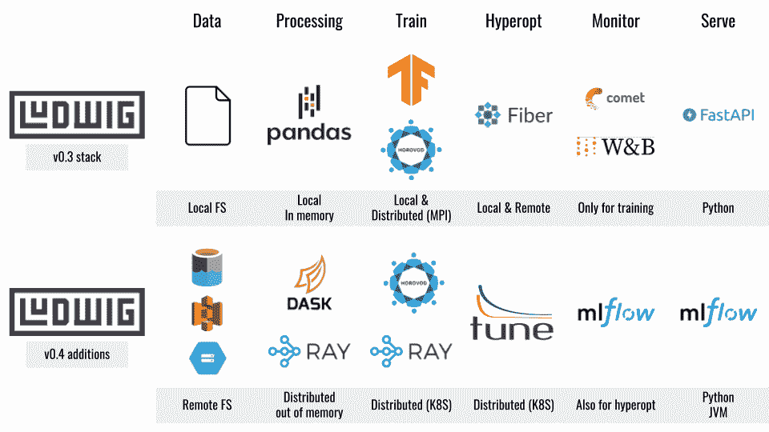

# Ludwig 0.4 已经发布，它包含了一些令人惊叹的低代码机器学习功能

> 原文：<https://pub.towardsai.net/ludwig-0-4-is-here-and-includes-some-amazing-low-code-machine-learning-capabilities-44cc66c61daa?source=collection_archive---------0----------------------->

## [人工智能](https://towardsai.net/p/category/artificial-intelligence)

## 与 Ray、MLflow 和 TabNet 的集成是这个版本的主要特性。

**图片来源:路德维希**

> 我最近创办了一份专注于人工智能的教育时事通讯，已经有超过 80，000 名订户。《序列》是一份无废话(意思是没有炒作，没有新闻等)的 ML 导向时事通讯，需要 5 分钟阅读。目标是让你与机器学习项目、研究论文和概念保持同步。请通过订阅以下内容来尝试一下:

 [## 序列

### 订阅人工智能世界中最相关的项目和研究论文。受到 85，000 多人的信任…

thesequence.substack.com](https://thesequence.substack.com/) 

如果你关注这个博客，你就会知道我是路德维希开源项目的粉丝。Ludwig 最初由优步孵化，现在是 Linux AI 基金会的一部分，它提供了当前市场上最好的低代码机器学习(ML)栈之一。上周，Ludwig 的 0.4 是开源的，包括一组很酷的功能，这使它更适合现实世界的 ML 解决方案。

# 什么是优步·路德维希？

在功能上，Ludwig 是一个框架，用于简化为给定场景选择、训练和评估机器学习模型的过程。考虑配置而不是编码机器学习模型。Ludwig 提供了一组模型架构，可以将这些架构组合在一起，以创建针对特定需求集优化的端到端模型。从概念上讲，Ludwig 的设计基于一系列原则:

*   ***不需要编码:*** *不需要编码技能来训练模型并使用它来获得预测。*
*   ***通用性:*** *一种新的基于数据类型的深度学习模型设计方法，使该工具可以跨许多不同的用例使用。*
*   ***灵活性:*** *有经验的用户对模型的建立和训练有着广泛的掌控，而新手会觉得很好用。*
*   ***扩展性:*** *易于添加新的模型架构和新的特征数据类型。*
*   ***可理解性:*** *深度学习模型内部通常被认为是黑盒，但我们提供了标准的可视化来理解它们的性能并比较它们的预测。*

# 一切事物的声明式体验

Ludwig 的轨迹是专注于使基于配置的去加速模型能够与当前市场中的顶级 ML 堆栈进行交互。从这个角度来看，Ludwig 为希望在解决方案中利用最佳 ML 框架的数据科学团队增加了一层简单性和一致的体验。

图片来源:路德维希

# 路德维希 0.4

Ludwig 新版本的重点是简化 MLOps 实践的声明性模型。从这个角度来看，Ludwig 0.4 包含了一组功能，可以简化现实解决方案中 MLOps 管道的实现。让我们回顾几个:

## ①路德维希·于雷

到目前为止，这个版本中我最喜欢的特性是与 Ray 平台的集成。Ray 是高度可扩展的 ML 训练和优化过程的最完整的堆栈之一。在 Ludwig 0.4 中，数据科学家可以使用几行配置代码将培训工作负载从单台笔记本电脑扩展到大型 Ray 集群。

## 2)利用射线调谐的超参数搜索

Ray Tune 是 Ray 平台的一个组件，它允许在大型节点集群中进行分布式超参数搜索。Ludwig 0.4 集成了 Ray Tune，允许分布式超参数搜索算法，如[基于人口的训练](https://docs.ray.io/en/master/tune/api_docs/schedulers.html#tune-scheduler-pbt)、[贝叶斯优化](https://docs.ray.io/en/master/tune/api_docs/suggestion.html#bayesopt)和[超波段](https://docs.ray.io/en/master/tune/api_docs/schedulers.html#hyperband-tune-schedulers-hyperbandscheduler)等。

## 3)具有 TabNet 的声明式表格模型

TabNet 是用于表格数据的顶级深度学习堆栈之一，它整合了前沿功能，如注意力架构。Ludwig 的新版本通过添加新的 TabNet 组合器实现了表格模型的声明性体验，该组合器还包括表格特征转换和注意机制，以实现最先进的性能。

## 4)使用 MLflow 进行实验跟踪和模型服务

MLflow 正在迅速成为最受欢迎的 ML 实验跟踪和模型服务平台之一。Ludwig 0.4 通过单一命令行实现基于 MLflwo 的实验跟踪。此外，Ludwig 的新版本可以使用简单的命令行语句将 ML 模型部署到 MLflow registry。