# 自动驾驶汽车的 Lyft 运动预测:2020 年

> 原文：<https://pub.towardsai.net/lyft-motion-prediction-for-autonomous-vehicles-2020-410e58e703af?source=collection_archive---------3----------------------->

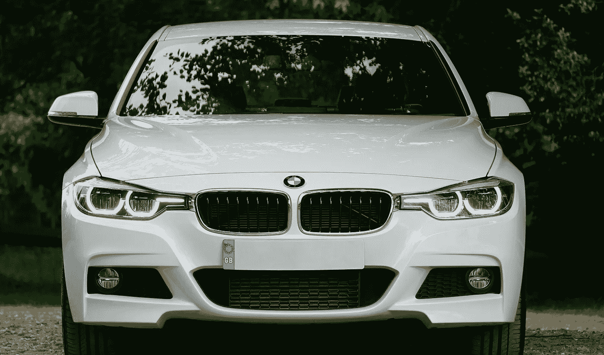

资料来源:Pexels

## [自动驾驶汽车](https://towardsai.net/p/category/self-driving-cars)

## 自动驾驶汽车的 Lyft 运动预测挑战

## 问题描述

挑战在于预测 2020 年 AV 周围交通主体的运动，如汽车、骑自行车的人和行人。与此同时，2019 年的比赛专注于检测 3D 物体，这是检测它们运动之前的重要一步。总体而言，与 2019 年的问题陈述相比，这需要相当独特的领域技能。

> *该数据集由 170，000 个捕捉自动驾驶汽车周围环境的场景组成。每个场景都编码了车辆在给定时间点周围的状态。*

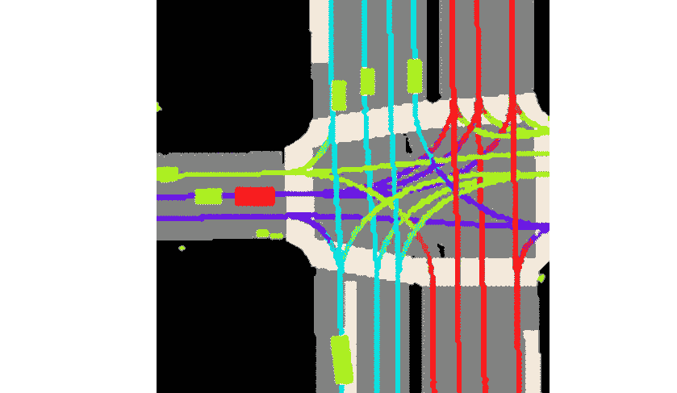

资料来源:Kaggle EDA Lyft

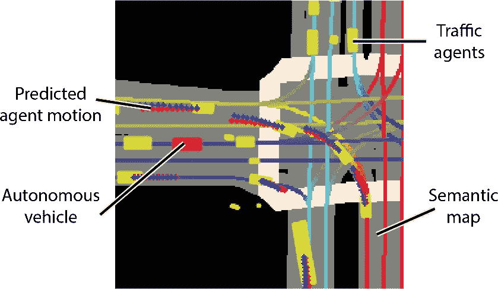

资料来源:Kaggle EDA Lyft5

**这个竞赛的目标是预测其他汽车/自行车手/行人(称为“代理”)的运动。**

称为光栅化的数据预处理技术是从其他对象创建图像的过程。例如，下面是我们得到的一个典型的图像，有 25 个通道，一个通道一个通道地查看。首先，11 个图像是其他代理历史的光栅化，接下来的 11 个图像是考虑中的代理本身，最后 3 个是语义图光栅化。

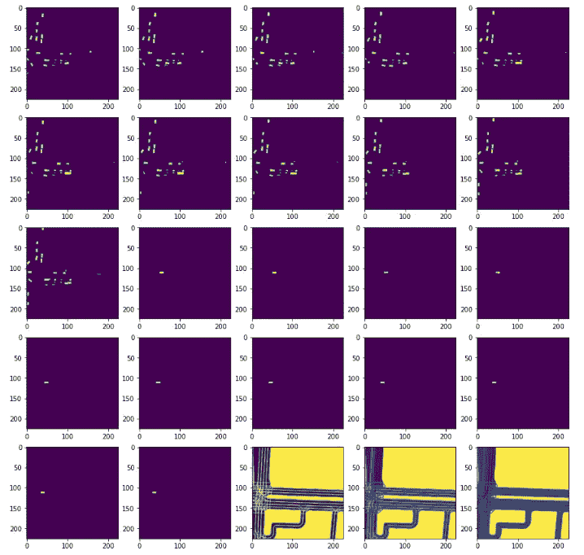

并且使用光栅化器转换成 RGB 图像包括:

*   图像:(通道，高度，宽度)帧的图像。这是鸟瞰图(BEV)表示。
*   目标位置:(n 帧，2)世界坐标中以米为单位的位移
*   target_yaws: (n_frames，1)
*   质心:(2)中心位置 x 和 y。
*   world_to_image: (3，3) 3x3 矩阵，用于变换矩阵。

用于数据处理的 L5Kit(Lyft 5 kit)结构示例:

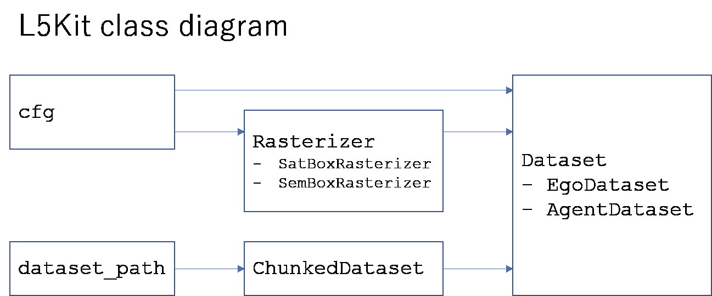

话虽如此，在这场竞赛中，理解光栅化器类并实现定制的光栅化器类一直是一个很大的挑战。因此，下面是如何选择两个重要的配置选项。我们应该仔细考虑

*   `raster_size`以像素为单位的光栅化图像最终尺寸(例如:[300，300]
*   `pixel_size`栅格的空间分辨率[米/像素]:现实世界中一个像素对应的大小。

# 光栅尺寸

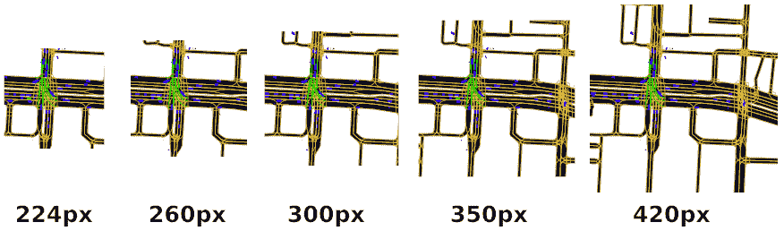

`*pixel_size = [0.5, 0.5]*`

正如您在图像中看到的，如果增加栅格大小(像素大小不变)，模型(ego/agent)将“看到”周围更多的区域。

*   后面/前面有更多区域
*   较慢的渲染，因为更多的信息(代理，道路等。)

## **什么是好的光栅尺寸？**
我觉得要看车速。

公里/小时毫秒/5 秒像素的距离 10 . 281 . 392 . 7851 . 39413 . 89102 . 7813 . 8927 . 78154 . 1720 . 8341 . 5341 . 5555656

*假设我一直用* `*pixel_size = [0.5, 0.5]*` *进行这些计算。*

问题是，平均速度是多少。在下图中，你可以看到平均速度。(我假设单位是米/秒)。我排除了所有小于 1 m/s 的东西，基于这些信息，我们可以选择图像的大小。

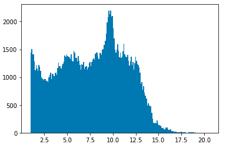

*   选择你的最高速度。例如 20 米/秒
*   计算 5 秒内的最大距离。(100 米)
*   用它除以像素的大小(100 / 0.5 = 200)
*   因为 ego 在图像左侧的`raster_size * 0.25`像素处，我们必须添加一些空间。最终尺寸是`200/0.75 = 267`

# 像素大小

另一个参数是像素的大小。就世界米而言，一个像素是多少？默认设置下是 1px = 0.5m
下图，可以看到不同像素大小的区别。(图像大小为 300x300px 像素)。例如，因为行人不到半米(从上面的视图看)，所以在最初的 2-3 幅图像中看不到他们。所以我们必须选择更高的分辨率(更低的 pixel_size)。介于 0.1 和 0.25 之间。

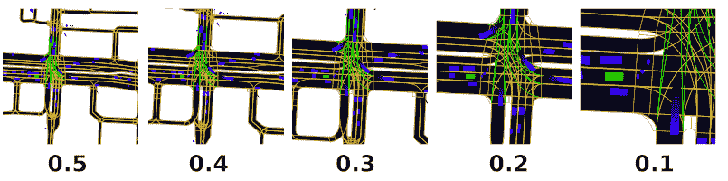

如果我们使用不同的像素大小，我们也必须重新计算图像大小。用`pixel_size=0.2`重新计算上面的例子:

*   20 米/秒
*   5 秒跑完 100 米
*   100/0.2 = 500
*   最终图像尺寸:500/0.75 = 667 像素

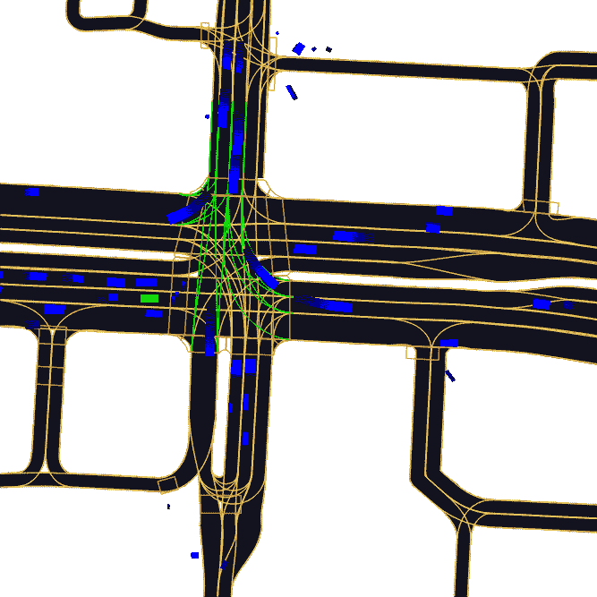

# 问题

随着我们增加 image_size 和分辨率(减小像素大小)，光栅化器必须做更多的工作。这已经是一个瓶颈，所以我们必须在模型性能和训练时间之间进行平衡。

计算光栅化器中的误差

每一个历史位置，每一条车道，每一个其他代理都被编码成像素，我们的网络只能以像素级的精度预测地图上的下一个位置。
在许多笔记本电脑中，光栅的尺寸为每像素 0.50 m(超参数)。因此，对于每个预测位置，每个方向的预期平均误差将是 0.50 / 4。

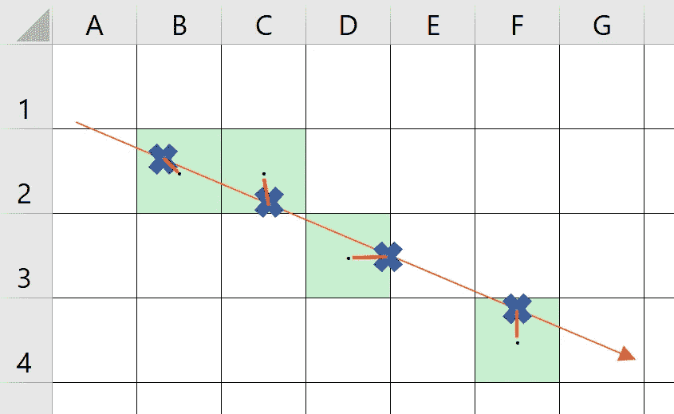

来源:栅格化文件错误计算的 Github 代码

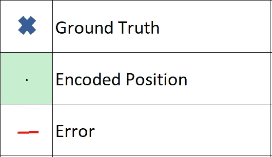

来源:栅格化文件错误计算的 Github 代码

本次竞赛的获奖架构包括 Resnet(18、34、50)、EDA、计算误差和效率 net(b1、b3 和 b6)。代码请查看 Github 报告:

 [## rashmimarganiatgithub/LYFT2020

### GitHub 是超过 5000 万开发人员的家园，他们一起工作来托管和审查代码、管理项目和构建…

github.com](https://github.com/rashmimarganiatgithub/LYFT2020)