# 主成分分析的变量约简

> 原文：<https://pub.towardsai.net/machine-learning-1096c38e6a18?source=collection_archive---------1----------------------->

## [机器学习](https://towardsai.net/p/category/machine-learning)

## 使用库 Plotly Express 对 MNIST 数据集进行可视化的示例

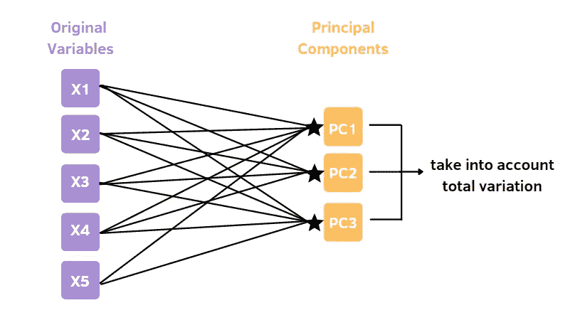

作者插图

实际上，我在数据科学实习中遇到了这个话题。这不是第一次了。我在大学期间已经看过了，但是我从来没有真正理解我们应该使用这种方法的原因。大多数时候都是用高深的理论术语来解释，而没有给出在现实世界中应用的例子。那么，什么是主成分分析呢？我们为什么要利用它？这种方法的优点是什么？

> 主成分分析是一种无监督的技术，它可以降低数据集的维数，同时尽可能地保留可变性。

它是怎么做到的？它将大量的观察变量减少到更少的分量，称为主分量。**主成分是数据集中原始变量的线性组合**。此外，这些成分使方差最大化，并且彼此不相关。第一个部分从数据中获取最大量的信息，因此它是方差最大的线性组合。第二分量考虑了第二大方差，并且与第一分量不相关。因此，方差从第一个分量到最后一个分量单调递减。

主成分分析是卡尔·皮尔逊在 1901 年发现的，但同时，它也非常现代，因为它现在被广泛用于描述目的。特别是，在低维空间中表示高维数据非常有用。您可以在 2D 或 3D 维度空间中可视化数据集。当数据集中有三个以上的变量时，这是不可能的。它在诸如人脸识别和图像压缩等领域有应用。

# PCA 是如何工作的？

这种方法可以概括为 5 个步骤:

1.  首先，数据集中的数量变量需要标准化。它们应该具有等于 0 的平均值和可比较的数值范围。

2.一旦数据标准化，您就可以构建协方差矩阵

3.从协方差矩阵计算特征向量和相应的特征值。

4.需要按照降序对特征值进行排序，以对相应的特征向量进行排序。

5.选择具有 k 个最大特征值的 k 个特征向量。k 表示新特征子空间的维数。从顶部 k 个特征向量构建投影矩阵 W。

7.使用投影矩阵 W 变换 d 维数据集，以获得新的 k 维特征子空间。

# 认证后活动的实施

我将展示应用于 MNIST 数据集的主成分分析的步骤，该数据集包含手写数字的图像。让我们导入 sklearn 库提供的数据集:

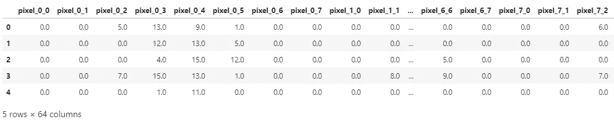

在应用 PCA 之前，我们需要标准化数据:

我们通过将特征矩阵与其转置形式相乘来获得协方差矩阵。

协方差矩阵的维数是 64 x 64，其中 64 是数据集的列数。下一步是从协方差矩阵计算特征值和特征向量。

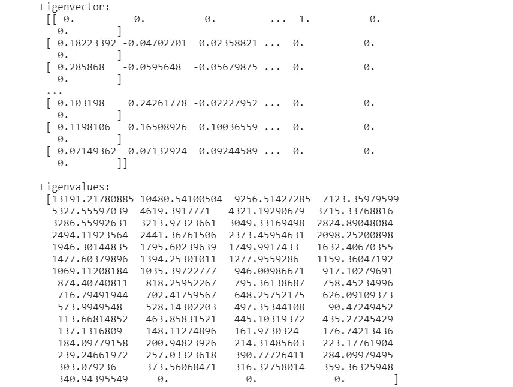

一旦计算出特征值，我们就可以导出由分量解释的累积方差。每个分量解释的方差是分量 j 的**特征值与所有分量特征值**之和**的比值。下面我将计算由组件解释的累积方差。**

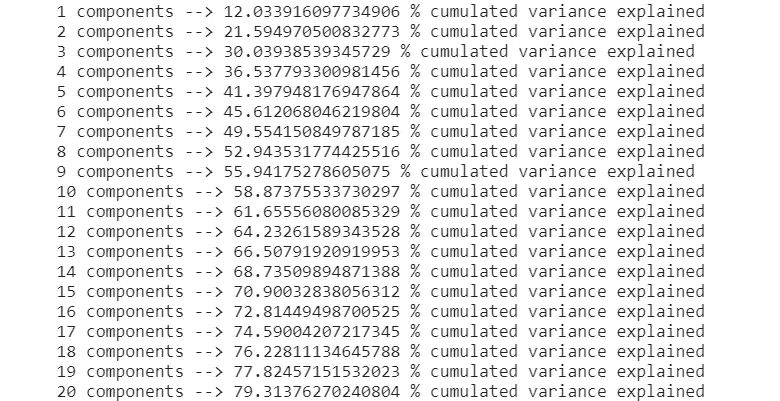

我们可以观察到，前四个分量占据了解释的累积方差的大约 37%。只有当我们至少有 20 个组件时，累积方差才在 80%左右。然后，我们选择 20 作为组件的数量。

我们按降序对特征值和特征向量进行排序，因为我们希望首先得到可变性最高的特征值。一旦特征向量以正确的方式排序，我们可以将组件的数量减少到 20。这个矩阵被称为**投影矩阵**，由可变性最高的前 k 个特征向量构建而成。

最后，我们可以使用投影矩阵来转换我们的标准化数据集，以获得**新的 k 维特征子空间**。

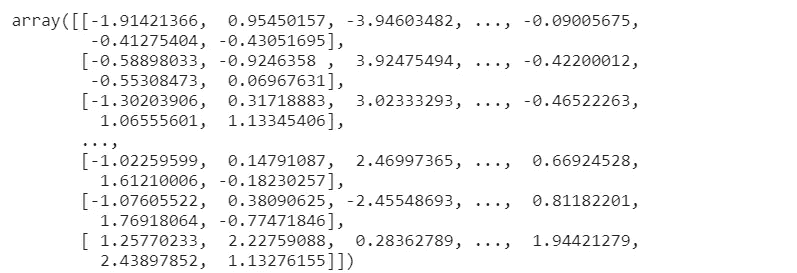

# **在 MNIST 数据集上使用 sklearn 的 PCA**

我将展示在 Sklearn 中实现的 PCA，它总是应用于 MNIST 数据集。使用标准化数据集，我们需要选择组件的数量，这些组件需要被指定为 PCA 函数中的自变量。

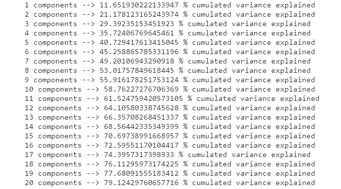

我们获得了与之前相同的结果，我们保留了 20 个成分，这解释了数据可变性的 80%。然后，我们选择 20 作为组件的数量。

为了更快地了解组件保留的可变性，我们可以绘制出解释的方差。我们将使用 [plotly express 库](https://plotly.com/python/pca-visualization/)，它允许构建交互式动态散点图。

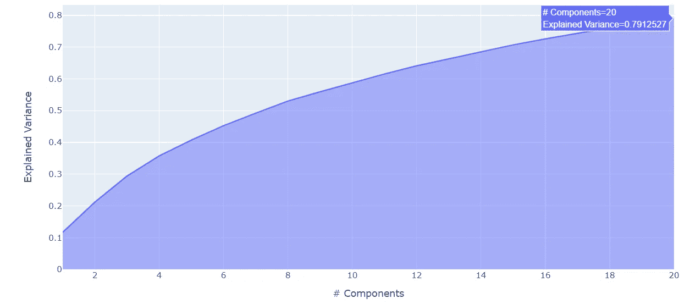

另一件有趣的事情是数据集的每一列对主成分的贡献。事实上，主成分是原始变量的线性组合。但是这些原始变量中的每一个都有不同的权重来创建这些分量。我将提取前五个组件，以便有一个更简单的概述。查看这些贡献的一个简单方法是显示热图:

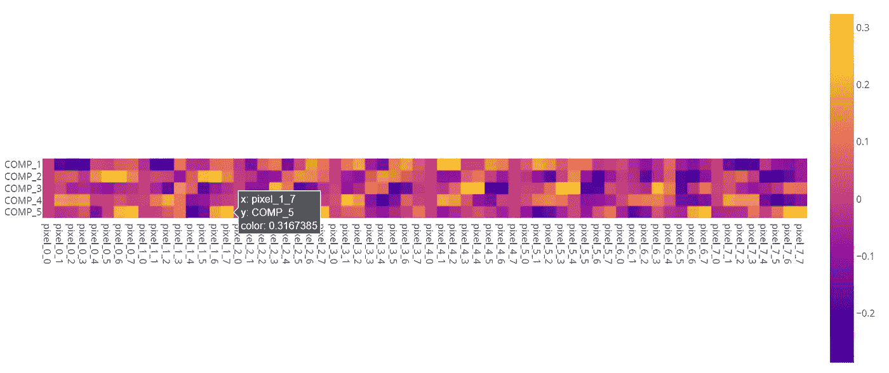

现在，您可以观察哪个像素对每个主成分的贡献更大。这些权重称为负载，可以有负值(深紫色)、中性值或正值(黄色)。一般来说，在这个特定的数据集中，这些负载非常小，影响很小。当这些值大于-/+0.75 时，载荷被认为是强的和显著的，但这不是我们的情况。使用 plotly.express 中的函数 px.im_show 的好处是，当您将鼠标悬停在这个彩色矩阵的单元格上时，您可以看到每个细节。这样，你就可以对这种无监督的方法有更好的解读。

一旦我们了解了主成分是如何获得的，我们就有兴趣将所有数据集可视化为一个图形。由于主成分分析降低了图像数据集的维度，这是可能的。我们可以通过函数 scatter_matrix 显示几个主成分。我选择只显示前四个组件，以便有一个更简单和清晰的可视化。

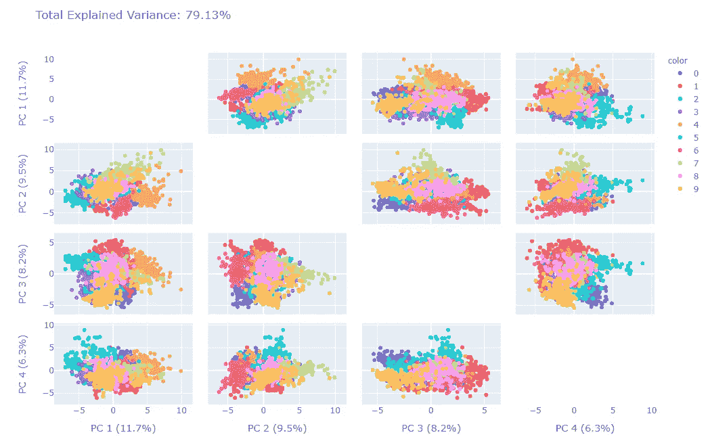

该图还显示了解释的总差异和每个组成部分解释的差异。第一个分量捕获了数据中最大的可变性，11.7%。第二个分量保留 9.5 %的方差，依此类推。

如果我们只想看到前两个部分，我们可以显示一个简单的散点图。这样，我们在 2 维空间中减少了 64 维的数据集:

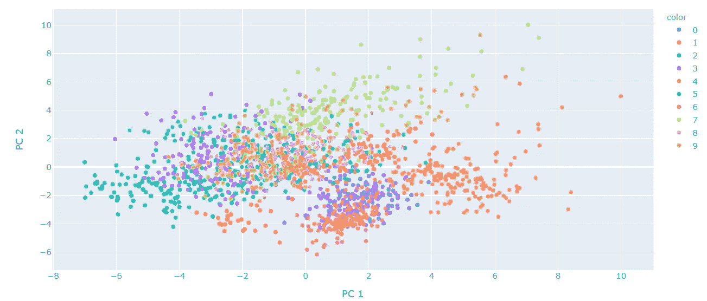

我们还可以在图中添加一个额外的组件。正如我们所看到的，前三个组件一起捕获了解释的总方差的大约 40%,我们可以更好地可视化我们的数据集。

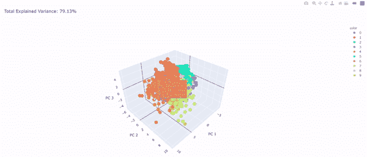

数字的类别沿着这个 3D 空间重叠。一些数字相互混淆。例如，3 和 8 没有分开，8 的簇部分地覆盖了数字 3 的簇。所以，阶级划分得还不够。这些限制的原因是 PCA 使用线性变换来获得主分量，并且不考虑非线性特征。一种更好的可视化 MNIST 数据集的方法是 t-SNE(t-分布式随机相邻实体)。

# 最终想法:

我希望这个指南能帮助你掌握这种方法。正如您在示例中看到的，它有一些限制，但它仍然有用，因为它易于理解，并且具有很高的可解释性。

感谢阅读。祝你有愉快的一天。

**参考文献:**

*   [https://www . ask python . com/python/examples/principal-component-analysis](https://www.askpython.com/python/examples/principal-component-analysis)
*   [https://www . research gate . net/post/How-can-I-interpret-PCA-results](https://www.researchgate.net/post/How-can-I-interpret-PCA-results)

你喜欢我的文章吗？ [*成为会员*](https://eugenia-anello.medium.com/membership) *每天无限获取数据科学新帖！这是一种间接的支持我的方式，不会给你带来任何额外的费用。如果您已经是会员，* [*订阅*](https://eugenia-anello.medium.com/subscribe) *每当我发布新的数据科学和 python 指南时，您都可以收到电子邮件！*