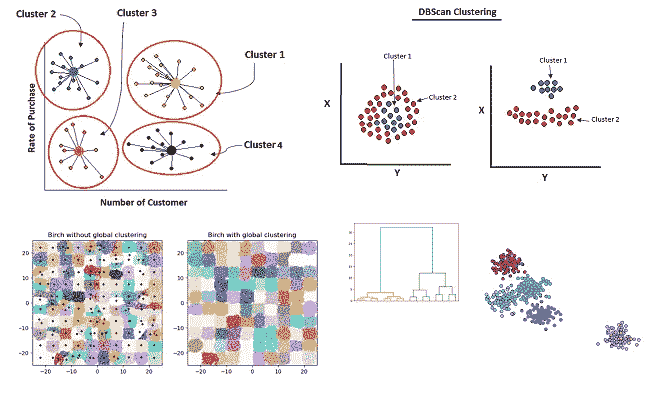

# 无监督学习中不同类型的聚类方法

> 原文：<https://pub.towardsai.net/machine-learning-16c8ccc2c7b8?source=collection_archive---------0----------------------->

## [机器学习](https://towardsai.net/p/category/machine-learning)

## 机器学习聚类算法

无监督聚类方法。作者的照片

在本文中，我们将分析无监督机器学习中不同类型的聚类算法。这些算法将通过参数、可伸缩性、用例以及几何来区分。

这些方法的主要焦点是利用一些距离测量公式来发现数据中的聚类或组。聚类方法很简单，因为在这些方法中我们很少进行训练和测试。

不使用训练和测试集的原因是因为这些方法使用基于距离度量的数据相似性、基于密集数据的分组、基于特征树的方法等。

## 不同类型的聚类算法

> ***K-均值聚类***

该方法基于距离度量和具有相等方差的数据相似性。

*   **参数:**该方法需要指定聚类数。
*   **可扩展性:**k-means 适用于大量样本，在 mini-batch 的帮助下，它也适用于中等数量的聚类。
*   **用例:**它用于偶数簇，它有一个平坦的几何图形，有簇数的限制。
*   **几何:**它使用距离度量来寻找数据中的组相似性。

> ***亲和传播聚类***

该方法基于发送到数据对的消息，该数据对更新直到用于最终聚类的最终样本。

*   **参数:**该方法需要两个参数，第一个是控制样本数量的偏好，第二个是阻尼，以避免消息中的振荡。
*   **可扩展性:**不随样本数量而扩展。
*   **使用案例:**它用于不均匀的集群大小，它具有非平坦的几何形状，它采用归纳法工作，即从想法的数量到它们的最终关系。
*   **几何:**它使用图距离度量来寻找最近邻。

> ***均值漂移聚类***

该方法基于 blob 方法，以该区域中的点的平均值来寻找聚类。

*   **参数:**该方法需要带宽来检测区域的大小。
*   **可扩展性:**它不随样本数量而扩展，即它需要更多的最近邻多重搜索。
*   **使用案例:**它用于不均匀的集群大小，它具有非平坦的几何形状，它采用归纳法工作，即从想法的数量到它们的最终关系。与亲和法相同。
*   **几何:**它使用距离度量来发现数据中的组相似性。

> ***桦树集群***

这种方法是基于层次聚类特征树(CFT)和处理噪声很好。

*   **参数:**该方法参数基于分支因子，如使用树和全局聚类。
*   **可伸缩性:**BIRCH 可以处理大量样本，也可以处理中等数量的聚类。
*   **使用案例:**它用于不均匀的集群大小，它具有扁平的几何形状，它以归纳的方法工作，即从想法的数量到它们的最终关系。它在剔除异常值和减少数据方面表现良好。
*   **几何:**它使用欧几里德距离度量来进行聚类。

 [## 用 Python 对异常值进行 BIRCH 聚类的完整解释

### 聚类中的无监督学习为数据建立树

pub.towardsai.net](/fully-explained-birch-clustering-for-outliers-with-python-2ad6243f126b) 

> ***DBSCAN 聚类***

该方法基于数据点的密度，用半径和最小点信息覆盖最大数据点。

*   **参数:**该方法参数基于邻域大小。
*   **可伸缩性:**DBS can 可以处理大量的样本，也可以处理中等数量的集群。
*   **用例:**它用于不均匀的聚类大小，它具有非平坦的几何形状，它基于直推方法工作，即它用于未标记的点进行聚类。
*   **几何:**它使用到最近点的距离度量来进行聚类。

 [## 用 Python 全面解释 DBScan 聚类算法

### 基于密度聚类的机器学习中的无监督学习

pub.towardsai.net](/fully-explained-dbscan-clustering-algorithm-with-python-a568139ebff5)  [## Python 中的数据预处理概念

### 一种为机器学习估值器准备数据的稳健方法

pub.towardsai.net](/data-preprocessing-concepts-with-python-b93c63f14bb6) 

> ***光学聚类***

该方法基于范围值来获得可达性距离并对属性进行排序。

*   **参数:**该方法参数基于最小聚类成员。
*   **可扩展性:**光学系统可以处理大量样本，也可以处理中等数量的集群。
*   **用例:**它用于不均匀的聚类大小，它具有非平坦的几何形状，它基于直推方法工作，即它用于未标记点的聚类。它也适用于不同规模的集群。
*   **几何:**它使用点与点之间的距离度量。

> ***集聚聚类***

这种方法基于分层聚类，将聚类合并到另一个聚类中。

*   **参数:**该方法需要连接准则来合并聚类。
*   **可伸缩性:**agglomerate 对大量的样本和集群进行处理。
*   **用例:**它已用于许多集群大小，它有一个连接性约束，并在直推方法上工作，即它用于未标记点的聚类。
*   **几何:**它使用成对的距离度量来进行聚类。

 [## Python 中的数据预处理概念

### 一种为机器学习估值器准备数据的稳健方法

pub.towardsai.net](/data-preprocessing-concepts-with-python-b93c63f14bb6) 

我希望你喜欢这篇文章。通过我的 [LinkedIn](https://www.linkedin.com/in/data-scientist-95040a1ab/) 和 [twitter](https://twitter.com/amitprius) 联系我。

# 推荐文章

[1。NLP —零到英雄与 Python](https://medium.com/towards-artificial-intelligence/nlp-zero-to-hero-with-python-2df6fcebff6e?sk=2231d868766e96b13d1e9d7db6064df1)
2。 [Python 数据结构数据类型和对象](https://medium.com/towards-artificial-intelligence/python-data-structures-data-types-and-objects-244d0a86c3cf?sk=42f4b462499f3fc3a160b21e2c94dba6)3 .[Python 中的异常处理概念](/exception-handling-concepts-in-python-4d5116decac3?source=friends_link&sk=a0ed49d9fdeaa67925eac34ecb55ea30)
4。[用 Python 进行主成分分析降维](/principal-component-analysis-in-dimensionality-reduction-with-python-1a613006d531?source=friends_link&sk=3ed0671fdc04ba395dd36478bcea8a55)
5。[用 Python 全面讲解 K-means 聚类](https://medium.com/towards-artificial-intelligence/fully-explained-k-means-clustering-with-python-e7caa573176a?source=friends_link&sk=9c5c613ceb10f2d203712634f3b6fb28)
6。[用 Python](https://medium.com/towards-artificial-intelligence/fully-explained-linear-regression-with-python-fe2b313f32f3?source=friends_link&sk=53c91a2a51347ec2d93f8222c0e06402)
7 全面讲解了线性回归。[用 Python](https://medium.com/towards-artificial-intelligence/fully-explained-logistic-regression-with-python-f4a16413ddcd?source=friends_link&sk=528181f15a44e48ea38fdd9579241a78)
充分解释了 Logistic 回归 8。[concat()、merge()和 join()与 Python](/differences-between-concat-merge-and-join-with-python-1a6541abc08d?source=friends_link&sk=3b37b694fb90db16275059ea752fc16a)
的区别 9。[与 Python 的数据角力—第一部分](/data-wrangling-with-python-part-1-969e3cc81d69?source=friends_link&sk=9c3649cf20f31a5c9ead51c50c89ba0b)
10。[机器学习中的混淆矩阵](https://medium.com/analytics-vidhya/confusion-matrix-in-machine-learning-91b6e2b3f9af?source=friends_link&sk=11c6531da0bab7b504d518d02746d4cc)