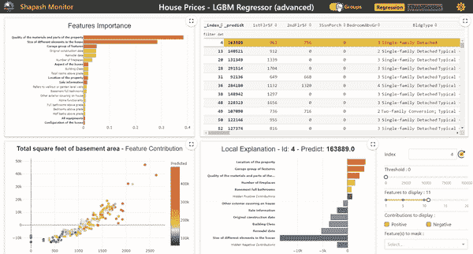
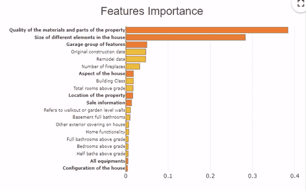
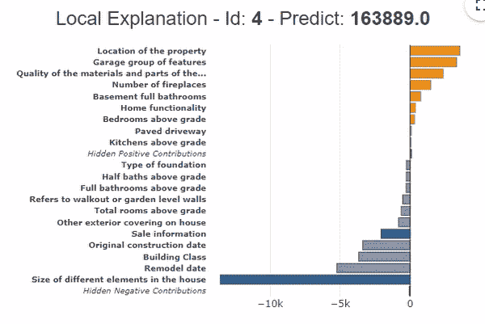
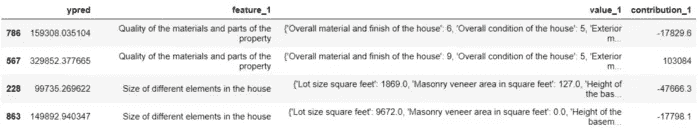

# Shapash 1.4.2:将变量分组，以便更容易理解模型

> 原文：<https://pub.towardsai.net/machine-learning-6011d5d9a444?source=collection_archive---------3----------------------->

## [机器学习](https://towardsai.net/p/category/machine-learning)

# Shapash 的 1.4.2 版本现已推出，该库增加了一个变量分组特性，在丰富变量模型的可解释性方面向前迈进了一步！



Webapp Shapash

模型从可能包含数十或数百个变量的数据集中学习，这些变量具有共同的主题。将这些变量分组到模型可解释性中，可以更容易地理解模型，并有助于浏览变量以及它们如何影响模型。

有了 Shapash 的这个新版本，现在可以指定一个变量组字典，用于可解释性分析。

我们将使用公共 Kaggle 数据集来说明这些功能: [**房价—高级回归技术| ka ggle**](https://www.kaggle.com/c/house-prices-advanced-regression-techniques/data)(Shapash[**教程**](https://github.com/MAIF/shapash/tree/master/tutorial) 中使用的示例数据集)。

该数据集包括大约 70 个房屋的描述性变量，这些变量呈现了房屋的外观和设备、位置、房间表面等信息……例如，6 个变量描述了车库的类型、饰面、质量、表面……为了分析模型的可解释性，我们可以将这 6 个变量归入同一个标题“车库”下，并对这组变量有一个全局的认识。



具有或不具有变量分组的重要性

*   **如何在 Shapash 中对变量进行分组？**

要访问不同的变量分组特性，您必须在一个字典中声明要分组的变量和变量组的名称，并在编译 Shapash 时声明这个字典。

```
**features_groups** = {
    "**location**": ["MSZoning", "Neighborhood", "Condition1", Condition2"],
    "**garage**": ["GarageType","GarageYrBlt","GarageFinish","GarageArea","GarageQual","GarageCond"],    
}from shapash.explainer.smart_explainer import SmartExplainer
xpl = SmartExplainer(features_dict=house_dict)
xpl.compile(
    x=X_test,
    model=regressor,
    preprocessing=encoder,
    **features_groups=features_groups**
)
```

*   **如何浏览 Webapp 来浏览群组？**

要启动 Web 应用程序，代码如下:

```
app = xpl.run_app(title_story='House Prices')
```

在 Web 应用程序中，此按钮允许您激活或取消激活变量分组。


在 Webapp 中导航功能重要性和功能贡献

在这个特征重要性图中，橙色和粗体的变量代表变量组。要查看组中每个变量的详细信息，请单击橙色条。

要恢复变量组，单击图形的白色背景。

当在特征重要性图中选择一个组时，变量组的特征贡献图对应于使用 t-sne 维数缩减在 x 轴上的投影。在 y 轴上，我们找到了贡献的总和。通过将光标指向某一点，我们可以找到该组中贡献最大的变量的详细信息。

如果我们在特征重要度图中点击组中的一个变量，贡献图显示与特征相关的贡献，而不是 t-sne 投影。

*   **变量分组的局部渲染:**



在 Webapp 的本地图中导航

变量分组也适用于当地捐款。它提供了贡献变量的综合视图。

在图中所示的示例中，变量分组显示，与平均值相比，所有区域变量导致价格下降-13，000 美元。位置变量(+3，000 美元)和车库变量(+2，000 美元)起积极作用。此外，随着变量的分组，隐藏贡献的条很低(隐藏的正贡献和隐藏的负贡献)，这表明贡献的全局被表示。

对于 API 或批处理模式中的局部贡献恢复，变量组被集成到 Smartexplainer(方法 to_pandas)和 Smartpredictor(方法 summarize)对象中。可以使用“use_groups=False”选项停用它们。

```
predictor = xpl.to_smartpredictor()
predictor.add_input(sample_input)
predictor.summarize()
```

对于变量组，该值是组中所有变量值的字典。



捐款数据框架

对于每一个人，Smartpredictor 的 summarize()方法提供了一个数据帧，其中包含按重要性排序的变量。在上面的例子中，主要起作用的变量是分组变量，这使得总结预测更容易。

通过这些新功能，我们希望 Shapash 可以进一步促进对机器学习模型的理解。

更多详情，我们邀请您在 [**Shapash**](https://github.com/MAIF/shapash) GitHub 上发现 [**教程**](https://github.com/MAIF/shapash/blob/master/tutorial/common/tuto-common01-groups_of_features.ipynb) 。

# 💡分享你的想法！

请随意访问 GitHub 的 [**Shapash**](https://github.com/MAIF/shapash) :你会找到关于这个新特性的详尽文档。您也可以在那里留下您的消息(讨论选项卡)，并通过共享您的模板或任何其他想法来为解决方案做出贡献。愿 [**沙帕什**](https://github.com/MAIF/shapash) 为开发值得信赖的 AI 做出贡献！