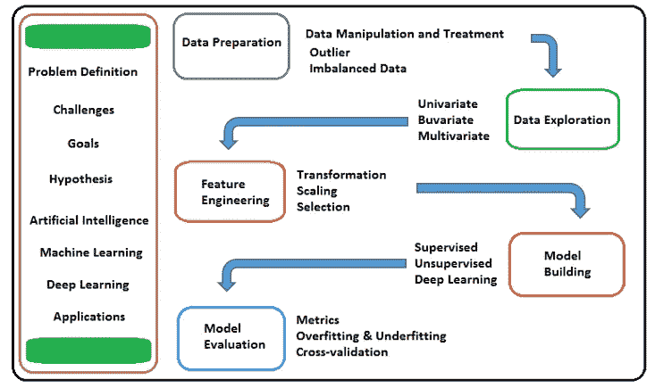

# 完整解释的机器学习生命周期

> 原文：<https://pub.towardsai.net/machine-learning-7c86b520720a?source=collection_archive---------2----------------------->

## [机器学习](https://towardsai.net/p/category/machine-learning)

## 理解并强化每一点的知识，直到模型评估



本文将涵盖机器学习中使用的大多数重要主题，并解释它们在每个步骤中的存在。

```
Topics to be covered
1\. **Introduction** 
   - Artificial Intelligence
   - Machine learning 
   - Deep Learning
   - Applications, Business Problems, Goals2\. **Machine Learning Life-cycle**3\. **Model Building and Evaluation**
   a. Data Preparation
   b. Data Exploration
   c. Feature Engineering
   d. Model Building
   e. Model Evaluation
```

> **简介 **

## 人工智能

人工智能是科学家想要实现的东西，机器智能是机器的一种行为，它复制或模仿人类智能，像人类一样根据环境做出决定，并根据目标行动采取相应行动。

## 机器学习

机器学习是一种通过学习实现人工智能的工具或方法，无需显式编码和编程，基于过去的历史数据进行学习。在 ML 中，有不同的学习方式，比如有监督的，无监督的学习等等。

## 深度学习

它是一种机器学习的形式，受基于神经元的人脑结构的启发，在特征检测方面特别有效。

## 应用程序

如果我们谈论人工智能应用，我们在今天的世界中有意或无意地使用它们的应用。

*   机器和深度学习:推荐引擎，欺诈检测系统。
*   语音识别:语音到文本，文本到语音
*   自然语言处理(NLP):亚马逊 Alexa，苹果的 Siri，IBM Watson，三星的 Voice。
*   机器人:人体模拟
*   计算机视觉和图像处理:成像诊断，自动驾驶汽车，谷歌图像搜索。

## 商业问题

基于应用，业务问题出现，并通过机器学习和各种工具来解决。业务问题需要对流程的理解来使其智能化。

通过了解业务问题，我们可以节省大量时间。这些流程已经在公司中存在并发挥作用，但要在机器学习和深度学习等先进工具的帮助下以更好的方式改进流程。

**例如:**在医疗保健应用中，医生正在处理胸部 x 光图像，手动查找所有风险因素，但这需要大量时间，因此他们需要一个模型来查看和分析图像，并自动预测风险因素。

## 假设

在深入研究数据之前，我们需要了解变量之间的关系。变量是我们在数据中看到的属性或列，我们试图从这些数据中预测一些东西。

在数据科学中，我们需要看到因变量/目标变量，并尝试在没有看到自变量的情况下思考影响它的因素。

假设用于根据业务目标进行假设。

## 目标

人工智能的主要目标是理解业务目标并使流程自动化，优化流程的逻辑行为并预测结果。

> ***机器学习生命周期***

机器学习是比传统编程更先进、更好的方法。传统的编程是基于规则的，而机器学习是基于算法的。

传统的预测方式是以接受或拒绝规则为基础的，它不随情况而改变。而机器学习预测适应新情况，并利用每个新数据改进其学习。

让我们从一个高层次的方法来理解机器学习过程。

历史数据被分成训练集、评估集。训练数据将提供给模型进行训练，并尝试使用评估集评估模型预测。

> ***模型建立和评估***

## 数据准备

这是机器学习项目的第一步。如果我们对原始数据使用机器学习，那么我们的模型预测的概率可能一点也不好。这是许多数据预处理过程需要获得良好准确性的地方。

[](/data-preprocessing-concepts-with-python-b93c63f14bb6) [## Python 中的数据预处理概念

### 一种为机器学习估值器准备数据的稳健方法

pub.towardsai.net](/data-preprocessing-concepts-with-python-b93c63f14bb6) 

*   **缺失值处理**

有时，在我们的数据集中，我们会得到一些缺失值，以及我们如何对待它们。处理它们的经验法则是基于数据集中缺失值的百分比。

1.  如果该列的缺失值小于 20%，那么我们可以估算或替换该行。如果该列的缺失值超过 20%，则可以选择移除该列。

```
Treatment: 
1\. We can impute them with zero value.
2\. We can impute them with central tendency measures like
   mean, median, or mode.
3\. We can impute them with the most probable value using 
   predictive model.
```

如果变量是连续的，用平均值、中值、最小值、最大值填充，或者使用回归。如果变量是分类的，那么填充它将模式化或创建一个新的级别或使用分类。

[](/z-statistics-t-statistics-p-statistics-are-still-confusing-you-87557047e20a) [## Z-统计量，T-统计量，P-统计量还在迷惑你？

### 机器学习统计学中的定义和概念

pub.towardsai.net](/z-statistics-t-statistics-p-statistics-are-still-confusing-you-87557047e20a) 

*   **异常检测和处理**

1.  **删除值:**有时，我们需要删除异常值，如果这些异常值是由于错误或者它们在数据中非常少。
2.  **转换和宁滨值:**如果有机会不删除异常值，则通过转换为减少极值变化的自然对数来消除异常值。

*   **不平衡数据处理**

在输出为二进制或多类的情况下，不平衡数据可以从因变量中识别出来。一个类别的百分比非常低，而另一个类别的百分比非常高。由于这个问题，很难使模型成为一个好的预测器。

```
Treatment:
1\. Try to collect more data.
2\. Try resampling the dataset
   - Over-sampling
   - Under-sampling
3\. Try to Generate Synthetic Samples
   - SMOTE
4\. Try different algorithms
   - Decision Tree
   - Random Forest
```

*   **纠正不一致的数据**

在这种类型的数据中，一些列有类别，一些列将自己命名为值，多个值存储在一列中。

*   **数据操纵**

可以通过使用诸如选择、过滤、排列、变异或汇总之类的功能来进行数据操作，以使数据变得干净。

## 数据探索

这一步用于探索变量之间的关系。探究自变量对因变量的影响。

*   **单变量分析**

它涉及描述单个变量的分布，包括如下所示:

1.  集中趋势:平均值、中间值和众数
2.  离差:范围、四分位数、方差、标准差、偏斜度和峰度。
3.  图形形式的特征:直方图、茎叶图和箱线图。

*   **双变量分析**

它用于描述变量对之间的关系。

1.  如果变量是分类的，那么使用 chi2 检验。
2.  如果变量是数字-数字，那么使用相关性，散点图。
3.  如果变量是数字分类的，那么使用 Z 检验、t 检验、ANOVA

[](/chi-square-hypothesis-testing-in-statistics-87884bc73d99) [## 统计学中的卡方假设检验

### 分类特征之间的关系关联

pub.towardsai.net](/chi-square-hypothesis-testing-in-statistics-87884bc73d99) 

## 特征工程

*   变量变换
*   特征缩放
*   特征创建
*   特征选择

## 模型结构

在这一步，不同的方法和不同的算法取决于我们的业务用例。

*   监督学习

[](/fully-explained-logistic-regression-with-python-f4a16413ddcd) [## 用 Python 全面解释逻辑回归

### 机器学习算法中的统计非线性方法

pub.towardsai.net](/fully-explained-logistic-regression-with-python-f4a16413ddcd) 

*   无监督学习
*   深度学习

## 模型评估

建立模型后，评估我们的模型以获得好的预测是很重要的。基于回归和分类算法，有不同的指标需要评估。

*   回归评估指标
*   分类评估指标

[](/regression-and-classification-metrics-in-machine-learning-with-python-6d9fcd8b73aa) [## Python 机器学习中的回归和分类度量

### 使用度量 API 进行回归和分类的模型评估

pub.towardsai.net](/regression-and-classification-metrics-in-machine-learning-with-python-6d9fcd8b73aa) 

*   过度装配和装配不足

[](https://medium.com/analytics-vidhya/confusion-matrix-in-machine-learning-91b6e2b3f9af) [## 机器学习中的混淆矩阵

### 监督学习中的分类度量

medium.com](https://medium.com/analytics-vidhya/confusion-matrix-in-machine-learning-91b6e2b3f9af) [](/concepts-of-bias-and-variance-in-dataset-aa119ccd2118) [## 数据集中偏差和方差的概念

### 对数据科学中使用的定义有基本的理解

pub.towardsai.net](/concepts-of-bias-and-variance-in-dataset-aa119ccd2118) 

*   交叉验证

我希望你喜欢这篇文章。通过我的 [LinkedIn](https://www.linkedin.com/in/data-scientist-95040a1ab/) 和 [twitter](https://twitter.com/amitprius) 联系我。

# 推荐文章

```
1\. [NLP — Zero to Hero with Python](https://medium.com/towards-artificial-intelligence/nlp-zero-to-hero-with-python-2df6fcebff6e?sk=2231d868766e96b13d1e9d7db6064df1)
2\. [Python Data Structures Data-types and Objects](https://medium.com/towards-artificial-intelligence/python-data-structures-data-types-and-objects-244d0a86c3cf?sk=42f4b462499f3fc3a160b21e2c94dba6)
3\. [Python: Zero to Hero with Examples](https://medium.com/towards-artificial-intelligence/python-zero-to-hero-with-examples-c7a5dedb968b?source=friends_link&sk=186aff630c2241aca16522241333e3e0)
4\. [Fully Explained SVM Classification with Python](https://medium.com/towards-artificial-intelligence/fully-explained-svm-classification-with-python-eda124997bcd?source=friends_link&sk=da300d557992d67808746ee706269b2f)
5\. [Fully Explained K-means Clustering with Python](https://medium.com/towards-artificial-intelligence/fully-explained-k-means-clustering-with-python-e7caa573176a?source=friends_link&sk=9c5c613ceb10f2d203712634f3b6fb28)
6\. [Fully Explained Linear Regression with Python](https://medium.com/towards-artificial-intelligence/fully-explained-linear-regression-with-python-fe2b313f32f3?source=friends_link&sk=53c91a2a51347ec2d93f8222c0e06402)
7\. [Fully Explained Logistic Regression with Python](https://medium.com/towards-artificial-intelligence/fully-explained-logistic-regression-with-python-f4a16413ddcd?source=friends_link&sk=528181f15a44e48ea38fdd9579241a78)
8\. [Basics of Time Series with Python](https://medium.com/towards-artificial-intelligence/basic-of-time-series-with-python-a2f7cb451a76?source=friends_link&sk=09d77be2d6b8779973e41ab54ebcf6c5)
9\. [NumPy: Zero to Hero with Python](https://medium.com/towards-artificial-intelligence/numpy-zero-to-hero-with-python-d135f57d6082?source=friends_link&sk=45c0921423cdcca2f5772f5a5c1568f1)
10\. [Confusion Matrix in Machine Learning](https://medium.com/analytics-vidhya/confusion-matrix-in-machine-learning-91b6e2b3f9af?source=friends_link&sk=11c6531da0bab7b504d518d02746d4cc)
```