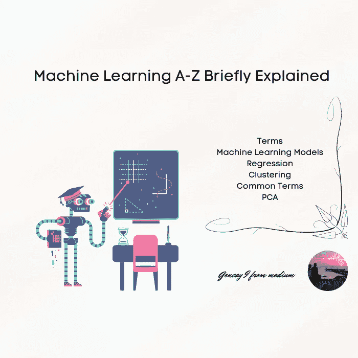
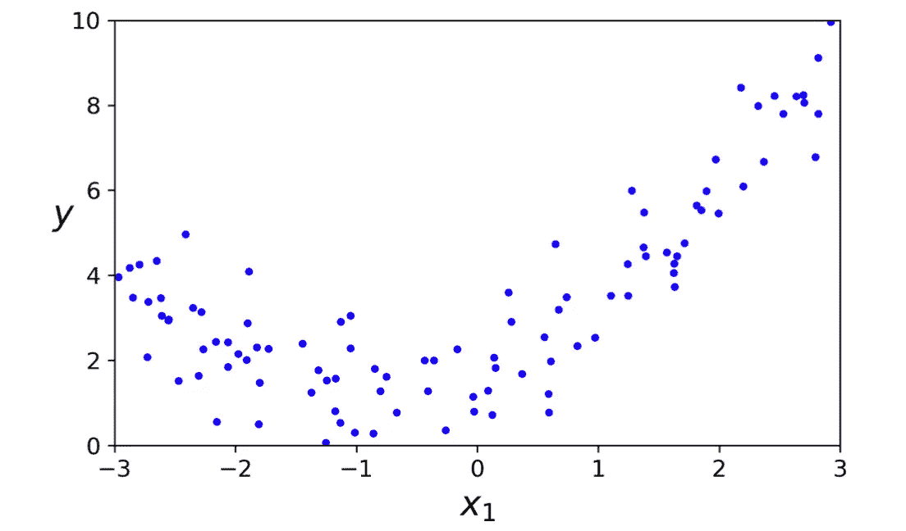
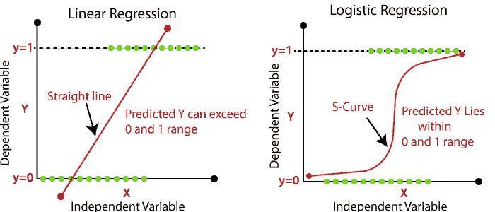
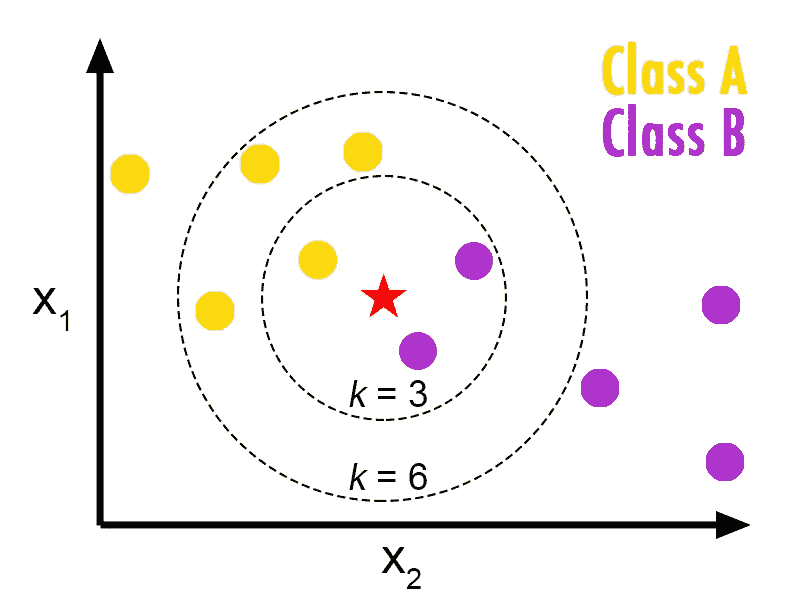
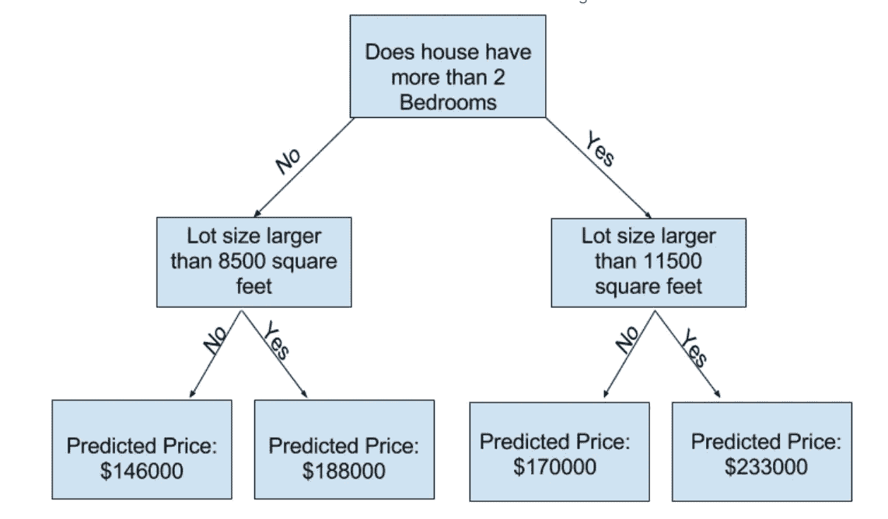
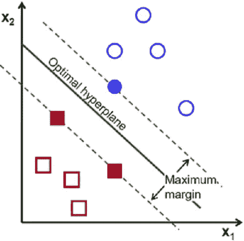
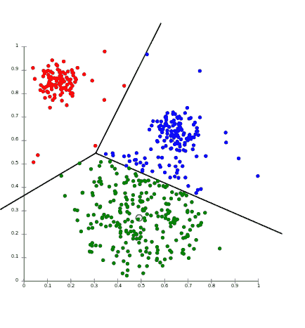
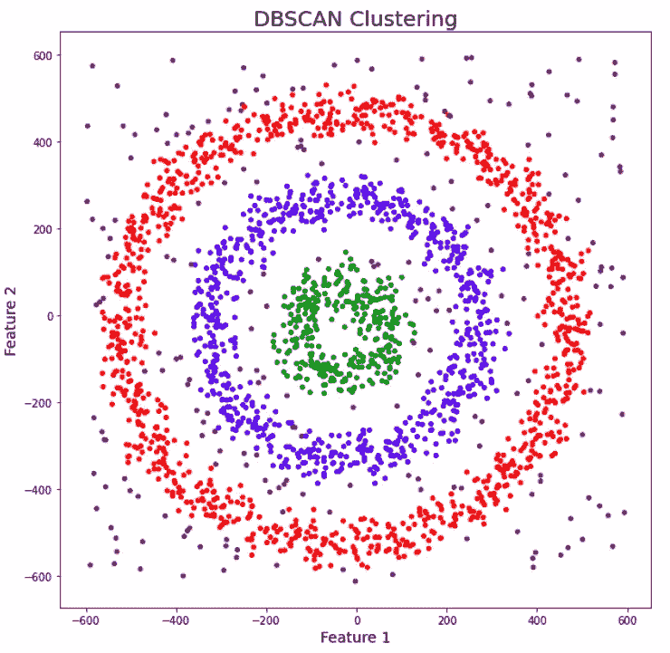
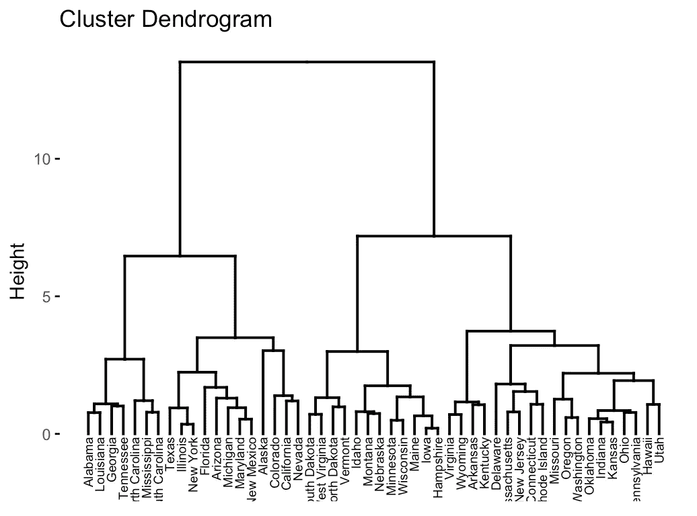

# 机器学习 A-Z 简要说明

> 原文：<https://pub.towardsai.net/machine-learning-a-z-briefly-explained-4ff86bd81e3a?source=collection_archive---------0----------------------->



作者图片

在这篇文章中，我试图简要地向你指出机器学习 A-Z **。你可以在面试前读一下这篇文章，让你的记忆焕然一新。这个术语很重要'*简单来说'*,让你在面试时快速回忆起这个解释。**

```
· [Machine Learning Types](#32d9)
· [Machine Learning Model Types](#6c07)
 ∘ [Linear Regression](#abc0)
 ∘ [Multiple Linear Regression](#90fb)
 ∘ [Polynomial Linear Regression](#51b0)
· [Classification](#7fd5)
 ∘ [Real-Life Examples](#7bda)
 ∘ [Logistic Regression](#b77e)
 ∘ [Naive Bayes](#827b)
 ∘ [K-Nearest Neighbors](#f12f)
 ∘ [Decision Tree](#4748)
 ∘ [Support Vector Machines](#434f)
· [Clustering](#183c)
 ∘ [Real-life Examples](#a9a4)
 ∘ [K-means clustering](#a34c)
 ∘ [DBSCAN clustering algorithm](#2d83)
 ∘ [An agglomerative Hierarchy clustering algorithm](#6e00)
· [Mostly Faced Problems in Machine Learning and Solutions](#89d0)
 ∘ [Overfitting](#17b9)
 ∘ [Underfitting](#ee40)
 ∘ [Missing Data](#733d)
· [Common Terms in Machine Learning](#cee7)
 ∘ [Pipeline](#5347)
 ∘ [A/B Testing](#8cad)
 ∘ [One-Hot Encoding](#5e8e)
 ∘ [Training / Test Split](#8df2)
 ∘ [Gradient Descent](#9e6d)
 ∘ [Learning Rate](#54f6)
 ∘ [Mean Absolute Error](#b209)
 ∘ [Normalization](#04ce)
 ∘ [Confusion Matrix](#5bbd)
 ∘ [False Positive / False Negative](#517d)
 ∘ [Deep Learning](#cab4)
 ∘ [Bias & Variance](#37a0)
 ∘ [Recommendation System](#8185)
 ∘ [Reducing Dimensionality](#f784)
 ∘ [PCA](#4ad9)
 ∘ [F1 Score](#068a)
 ∘ [Correlation](#3904)
 ∘ [Ensemble learning](#23ea)
 ∘ [Cross-Validation](#22ba)
· [Conclusion](#eaae)
```

此外，我添加了图表，因为如果招聘经理希望你进一步解释，你可以用一个简单的手势来解释。

[参考](https://giphy.com/gifs/xUOrvTqtFduR07rNXq)

# 机器学习类型

**监督学习**

您要预测的标签在数据集中。

(预测房价时，数据集包含房价。)

**无监督学习**

您要预测的标签不在数据集中。

**强化学习**

当你教一台有奖惩系统的电脑。

# **机器学习模型类型**

## **线性回归**

当你想用一个变量预测一个数值变量时。

**多元线性回归**

用多个变量预测一个数字变量。

## **多项式线性回归**

当变量之间的线比一条直线更复杂时。



参考:动手机器学习 O Reilly

[](https://medium.com/@geencay/machine-learning-model-in-weight-prediction-b22a4cb77e2c) [## 体重预测中的回归模型

medium.com](https://medium.com/@geencay/machine-learning-model-in-weight-prediction-b22a4cb77e2c) [](https://medium.com/@geencay/linear-regression-in-fuel-consumption-2fefb66418a0) [## 燃料消耗的线性回归

medium.com](https://medium.com/@geencay/linear-regression-in-fuel-consumption-2fefb66418a0) 

# **分类**

## **现实生活中的例子**

*   手写数字识别
*   垃圾电子邮件
*   客户流失预测
*   信用卡欺诈检测

## **逻辑回归**

*监督学习算法。*

一般用于二元分类问题。

*举例:选举预测——奥巴马还是特朗普？*



[参考](https://www.javatpoint.com/linear-regression-vs-logistic-regression-in-machine-learning)

## **朴素贝叶斯**

监督学习算法。

朴素贝叶斯假设特征是相互独立的，特征之间没有相关性，这就是它幼稚的原因。

该计算依赖于贝叶斯定理计算。

高斯，多项式，伯努利，补数。

***举例:*** 对一篇关于**科技**、**政治**或者**体育**的新闻文章进行分类

## **K-最近邻**

监督学习算法。

选择 k，根据聚类的复数做预测。

在图中，我们看到 1 个黄色的 2 个紫色的球，所以当 k = 3 时，它将是紫色的。

*示例:推荐系统*



[参考](https://helloacm.com/a-short-introduction-to-k-nearest-neighbors-algorithm/)

## **决策树**

监督学习算法

决策树是由重复的问题及其答案构建而成的。

*举例:房价预测*



来自 Kaggle 机器学习教程

随机森林是许多决策树的集合。

## **支持向量机**

监督学习算法

二分分类法，用一个边距画一个决策边界。



*人工智能趋势内幕人士兰斯·艾略特博士*

*举例* ***:*** *语音识别，人脸识别*

[](https://medium.com/@geencay/past-loan-data-75710e4552ed) [## 将分类算法应用于过去的贷款数据

medium.com](https://medium.com/@geencay/past-loan-data-75710e4552ed) [](https://medium.com/@geencay/face-recognition-algorithms-with-2-different-methods-361276a2ebc0) [## 两种不同方法的人脸识别算法

### 用两种不同的方法应用人脸识别算法。

medium.com](https://medium.com/@geencay/face-recognition-algorithms-with-2-different-methods-361276a2ebc0) 

# **聚类**

## **现实生活中的例子**

*   垃圾邮件过滤器。
*   识别假新闻
*   识别欺诈或犯罪活动

## **K-均值聚类**

监督学习

通过测量距离和计算每个聚类的均值进行聚类，并根据新的均值重新聚类，完成后聚类不会发生变化。



[参考](https://aws.amazon.com/blogs/machine-learning/k-means-clustering-with-amazon-sagemaker/)

***举例:推荐系统***

## **DBSCAN 聚类算法**

无监督学习

基于密度的技术对于任意形状的簇更有效，如嵌套的圆形。

***例如:***



[参考](https://www.analyticsvidhya.com/blog/2020/09/how-dbscan-clustering-works/)

## **凝聚层次聚类算法**

创建一个包含聚类的树，然后递归地分组或分离数据点。

无监督学习



[参考](https://www.datanovia.com/en/lessons/agglomerative-hierarchical-clustering/)

[](https://medium.com/@geencay/cafe-restaurant-management-in-istanbul-economical-background-f49e544415db) [## 伊斯坦布尔的咖啡馆餐厅管理&经济背景

medium.com](https://medium.com/@geencay/cafe-restaurant-management-in-istanbul-economical-background-f49e544415db) 

# **机器学习中面临的主要问题及解决方案**

## **过度拟合**

该模型在训练集上表现良好，但在测试集上表现不佳。

避免过度拟合

*   正规化。
*   制作一个简单的模型。使用较少的变量和参数
*   应用交叉验证方法
*   收集更多数据
*   移除异常值
*   如果你的一个参数是原因，应用正则化方法。(山脊，套索)

## **欠配合**

模型表现不好，它发生在你的模型太简单的时候。

*   选择一个简单的模型(变量较少)
*   特征工程
*   降维。

## **缺失数据**

当你得到足够的数据时，你可以删除丢失的行。然而，否则，你应该用该列的平均值来填充数据。

# **机器学习中的常用术语**

## 管道

将数据从原始格式转换为有用的格式

## A/B 测试

评估和比较不同模型的准确性。

## **一键编码**

将分类变量转换为数值变量，以执行机器学习算法。

## **训练/测试分割**

训练测试分割是一种用于评估机器学习算法性能的技术。(80/20)

## **梯度下降**

这样做是为了通过操纵参数来减少功能损失。

## **学习率**

向局部最小值梯度下降的步长。

## **平均绝对误差**

它用于模型评估，即预测真实误差的平均值。

## **正常化**

将实际值范围转换为标准值范围的过程，通常为-1 到+1 或 0 到 1。

## **混淆矩阵**

分类模型评估表。

## **假阳性/假阴性**

模型错误地预测了负类。

模型错误地预测了正类

## **深度学习**

它是机器学习的子集，意味着复制人类的思维过程，并包含具有几层的神经网络。该层标记的名称为“深度”。

ml 和 dl 之间有许多不同之处，但这是区分它们的一种方法，可以通过查找过程来实现。深度学习本身确实具有工程特征，但在机器学习中，你必须自己完成。

**分类或回归**

分类-分类变量

回归-数字变量

## **偏差&方差**

当(预测值-实际值)过高时，就会发生这种情况。

方差-当你使用不同的训练数据时，你的模型会发生变化。这个变化就是你的方差。

在一个好的模型中，方差应该很低。

**精确&召回**

精度-正预测值

精度= TP / TP+ FP

回忆敏感性。

召回= TP / TP +FN)

TP:真阳性

FP:假阳性

FN:假阴性

## **推荐系统**

很简单，一旦你看了一部关于网飞的电影，你可能也会喜欢这部电影

Spotify 和亚马逊也使用这种算法。

## **降维**

它减少了你做预测的变量的数量。

通过应用特征工程、移除共线特征或使用算法降维。(PCA)

## **PCA**

无监督算法。

有时也在监督算法应用于监督算法之前使用。

## **F1 得分**

它是通过使用精度和召回率来计算的。也称为加权平均。

它的计算方法是乘以精度，再除以总精度和召回率乘以 2。

2 *(P * R / P + R)

P =精度

R =回忆

**第一类错误&第二类错误**

类型 I-零假设是真的，但我们拒绝它。

第二类——不管我们接受与否，零假设都是错误的。

## **关联**

相关性:两个随机变量的相关性有多强

## **集成学习**

组合从多个 ML 模型收集的结果以提高模型效率。

## **交叉验证**

通过测试定型集的其他部分来评估模型归纳新数据的能力。

# 结论

我在准备面试时为自己制定了这个指南，它对我帮助很大。

我希望它也能帮助你，你会找到你梦想的工作。

[参考](https://media.giphy.com/media/nz94Hdu9eWFFK8ClHS/giphy.gif)

感谢阅读我的文章，如果你想阅读更多类似的文章，请竖起大拇指关注我。

下面是这篇文章。

[](/machine-learning-a-z-briefly-explained-part-2-61191a01c235) [## 机器学习 A-Z 简要解释了第 2 部分

### 提神和快速回忆

pub.towardsai.net](/machine-learning-a-z-briefly-explained-part-2-61191a01c235)