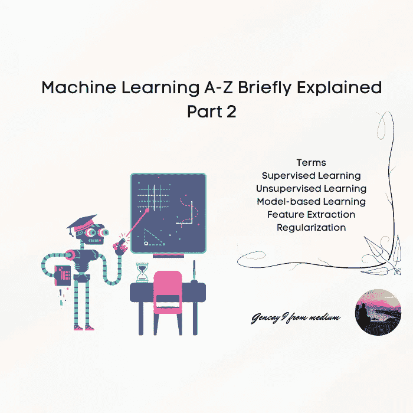
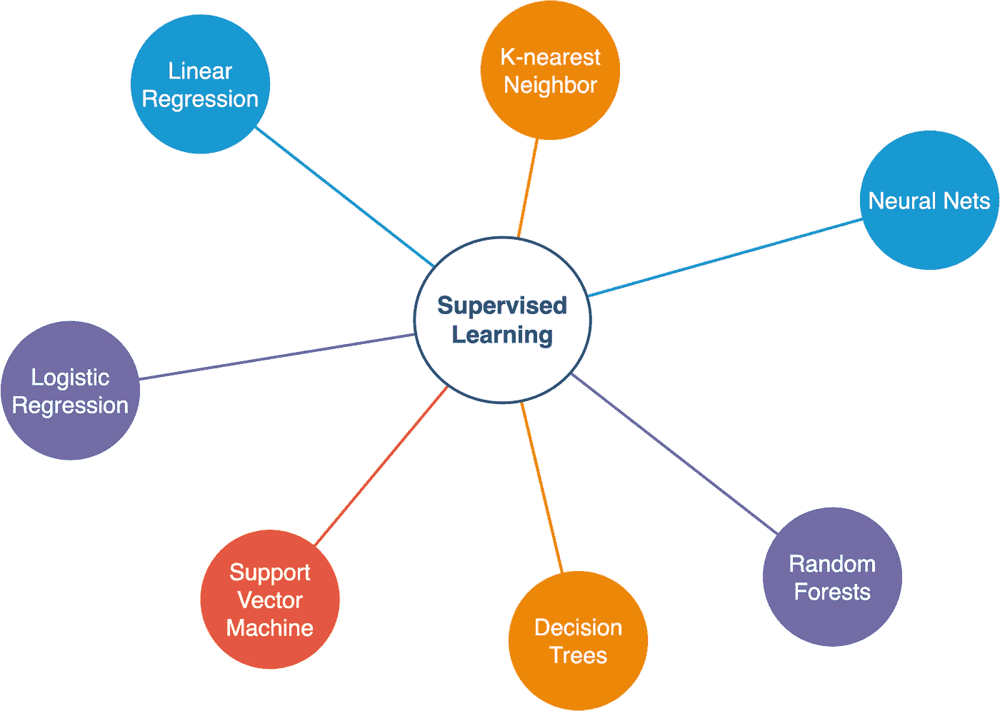
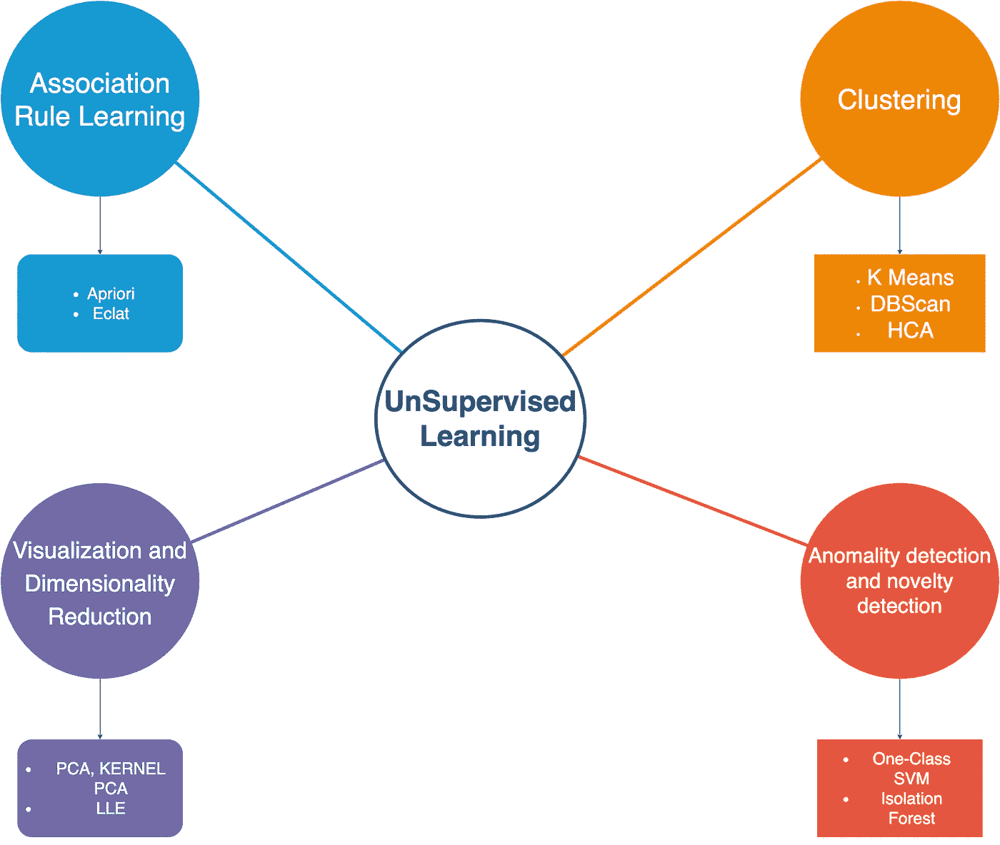
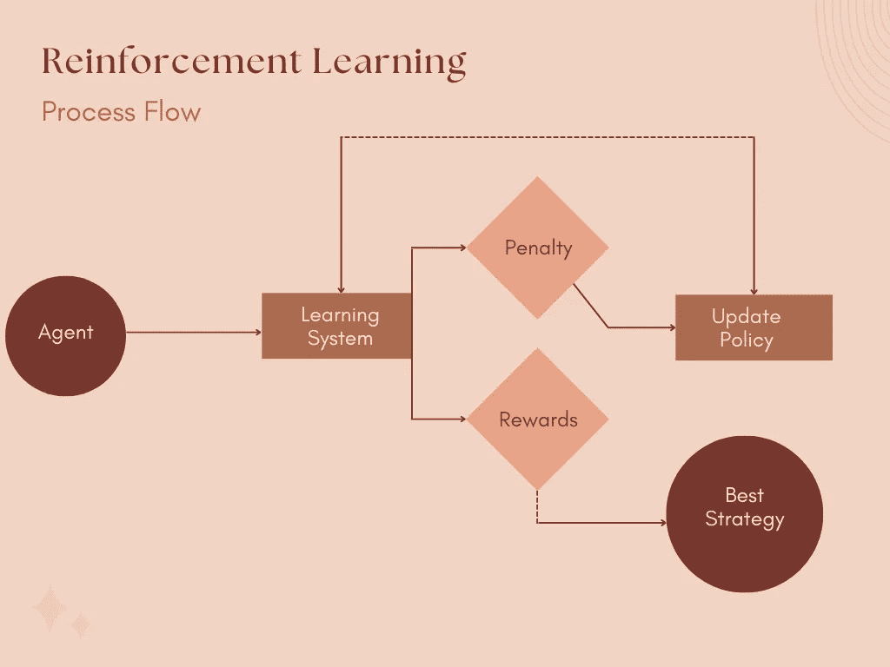
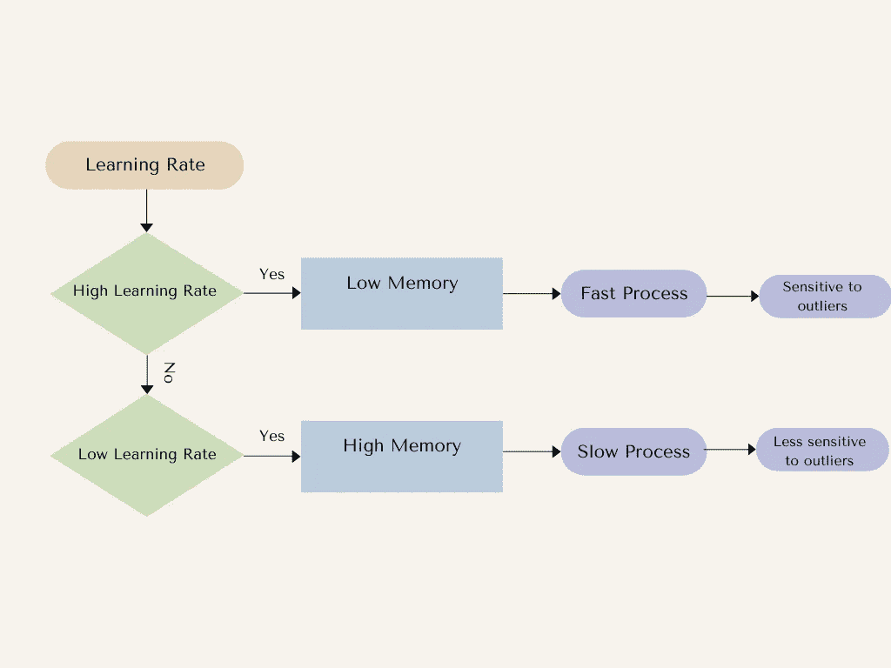
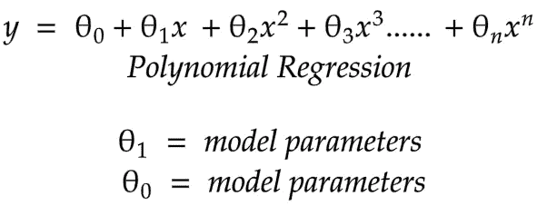

# 机器学习 A-Z 简要解释了第 2 部分

> 原文：<https://pub.towardsai.net/machine-learning-a-z-briefly-explained-part-2-61191a01c235?source=collection_archive---------2----------------------->

## 提神和快速回忆



作者图片

```
**Content Table****·** [**Introduction**](#9af5) **·** [**Terms**](#9f56)
  ∘ [Dimensionality Reduction](#1b83)
  ∘ [Supervised Learning Algorithms](#7820)
  ∘ [Unsupervised Learning Algorithms](#b332)
  ∘ [Association Rule Learning](#5009)
  ∘ [Reinforcement Learning](#dade)
  ∘ [Batch Learning](#6587)
  ∘ [Online Learning](#0e96)
  ∘ [Learning Rate](#3c9c)
  ∘ [Instance-Based Learning](#87eb)
  ∘ [Model-based Learning](#b6e2)
  ∘ [Model Parameters](#ed80)
  ∘ [Sampling Noise](#71d5)
  ∘ [Sampling Bias](#e426)
  ∘ [Feature Engineering](#01e0)
  ∘ [Feature Extraction](#bf14)
  ∘ [Regularization](#c562)
  ∘ [Hyperparameter](#25a6)
  ∘ [Grid Search](#b84b)
  ∘ [Stratified Sampling](#3463) 
  ∘ [Map- Reduce](#1af1)
  ∘ [Cross-validation](#a5bb)
  ∘ [Randomized Search](#9f64)
**·** [**Conclusion**](#599e)
```

# 介绍

欢迎来到另一篇 A-Z 文章。在发表了*《机器学习 A-Z 简述》*这篇文章后，我意识到有很多术语我没有提到。当然，机器学习是一个非常大的概念，正如我在本文第一部分提到的那样，我简要解释了一些术语，本文旨在在面试之前或做项目之前刷新您的记忆。

在两种情况下，您也可以从本文中获益。

对于初级开发人员、入门级数据科学家和希望成为数据科学家的数据分析师来说，这篇文章也有助于你熟悉这些机器学习术语。

事实上，我也想添加代码，但这不会很简单，所以我现在正在准备包含真实例子和 Python 代码的电子书，我想会在 7 月份准备好，我会在文章后添加链接。

我也要感谢你，因为你关注了我关于机器学习的 A-Z 文章，你的反馈真的激励我继续前进。

因此，让我们跳过闲聊，让我们深入研究条款。

[https://gi phy . com/gifs/gia tec-dogs-construction-3 ov9 jrpmchw 9 zzvluk](https://giphy.com/gifs/giatec-dogs-construction-3ov9jRPMChw9ZzVlUk)

# 条款

## 降维

然而，简化数据会尽量不丢失信息。

## 监督学习算法

你想用标签做一个预测。

当你想预测房价时；

***标签=房价***

*   k-最近邻
*   线性回归
*   逻辑回归
*   支持向量机(SVM)
*   决策树
*   随机森林
*   神经网络

如果形象化帮助你容易记忆；



作者监督学习算法的图像

## 无监督学习算法

你想做一个预测，没有标签。

当你想预测房价时；

***标签=房价***

*   聚类-(k 均值、DBScan、HCA)
*   异常检测和新奇检测。(一级 SVM，隔离林)
*   可视化和降维(主成分分析，核主成分分析，LLE)
*   关联规则学习。(先验，Eclat)

如果形象化帮助你容易记忆；



按作者分类的图像—无监督学习算法

## 关联规则学习

我举个例子来解释一下，商场货架定位。

这些产品往往会一起出售，而且位置会彼此靠近。

## 强化学习

学习系统=代理

例子:教机器人如何走路。



强化学习-在 Canva 中设计

## 批量学习

系统一步一步学习。

## 在线学习

该系统从小型数据组中学习。因此，如果您正在提供服务，请仔细监控系统的性能，因为传入的坏数据可能会破坏您的模型和服务。尝试设置限制，或者经常观察你的数据。

## 学习率

参数定义了步长。

高学习率-低记忆-快速过程-对异常值敏感

低学习率-高记忆力-缓慢的过程-对异常值不太敏感



在 Canva 设计

## 基于实例的学习

该系统从经验中学习，然后试图根据其经验预测新的事件。

## 基于模型的学习

该系统分析数据，建立模型来解释数据，并做出相应的预测。

## 模型参数

我用函数给你解释一下；



作者图片

## 采样噪声

当您的数据很小时，您的模型可能无法很好地执行。

## 抽样偏误

当您的数据很大，但您的模型不能很好地执行时。

## 特征工程

组合特征以找到模型的最佳参数。

当你说最佳参数时，那意味着与你想要预测的值最相关。

我可以很容易地说标签或响应变量，但我试图解释它，就像你是一个完全陌生的话题。

## 特征抽出

如果你的模型参数是相互关联的，可以合并成一个，比如你在处理房屋数据，你家每平米有几个房间？

## 正规化

将模型限制为简单的以避免过度拟合。

## 超参数

它定义了模型参数的值，如学习率，并帮助您找到最佳性能模型

## 网格搜索

这是一种手动更改超参数的方法。

## 分层抽样

如果你期望数据集能代表总体。

例如，如果贵国的人口分布是% 54 男性和% 46 女性。如果你想在那个国家做一个预测，你应该选择 54 个男性和 46 个女性。

你所做的是把人口分成不同的阶层。

## 地图-缩小

当您的数据非常庞大时，将数据分散到多个服务器上会减少映射。

## 交叉验证

使用小型验证集对不同的模型进行训练和评估，并找到最佳性能模型用于生产。

## 随机搜索

如果你有太多超参数。

这不是计算每个可能的组合，而是为每个超参数选择给定数量的“随机”组合。

# 结论

解释完这些术语，我真的很喜欢说那本书。

> 使用 Scikit-Learn 和 TensorFlow 进行机器学习:构建智能系统的概念、工具和技术

如果你想熟悉机器学习和深度学习，并专业地完成任务或深入学习概念，这确实是我找到的最佳来源之一。

此外，所有代码都是用 Python 编写的，并有详细的解释。

和所有奥莱利的书一样，真的很优秀，强烈推荐。

现在感谢你阅读我的文章，以防你可能会错过，这是机器学习 A-Z 的第一部分；

[](/machine-learning-a-z-briefly-explained-4ff86bd81e3a) [## 机器学习 A-Z 简介

### 在本文中，我试图向您简要解释机器学习 A-Z。

pub.towardsai.net](/machine-learning-a-z-briefly-explained-4ff86bd81e3a) 

此外，如果您认为您没有广泛的统计学知识来理解机器学习的概念，我已经写了一些关于统计学的文章，这些文章也是第一部分和第二部分；

[](/statistics-for-machine-learning-a-z-66a82fbf2622) [## 机器学习的统计学

### 简要说明

pub.towardsai.net](/statistics-for-machine-learning-a-z-66a82fbf2622) [](/statistics-for-machine-learning-a-z-part-2-fef63089b09d) [## 机器学习统计学 A-Z 第 2 部分

### 简要说明

pub.towardsai.net](/statistics-for-machine-learning-a-z-part-2-fef63089b09d) 

谢谢你阅读我的文章。

如果你想跟进我的其他文章，请跟我来，给我掌声，并快速提醒，在你保存我的文章后，不要犹豫给我掌声，因为我看到太多人保存了这篇文章，不要给我掌声。

[https://giphy.com/gifs/HallmarkChannel-fGRLn3m6XvmHeLNOzn](https://giphy.com/gifs/HallmarkChannel-fGRLn3m6XvmHeLNOzn)

> "机器学习是人类需要做出的最后一项发明。"Nick Bostrom

为我订阅更多；

[](https://medium.com/subscribe/@geencay) [## 每当 Gencay I .发布时，收到一封电子邮件。

### 每当 Gencay I .发布时，收到一封电子邮件。通过注册，您将创建一个中型帐户，如果您还没有…

medium.com](https://medium.com/subscribe/@geencay)