# 面向初学者的机器学习算法，带 Python 代码示例

> 原文：<https://pub.towardsai.net/machine-learning-algorithms-for-beginners-with-python-code-examples-ml-19c6afd60daa?source=collection_archive---------0----------------------->

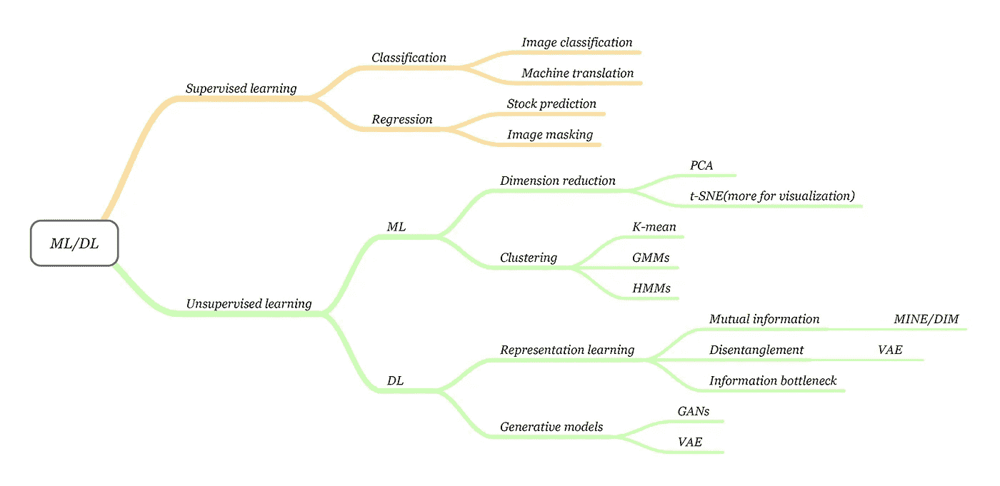

机器学习算法树|来源:图片作者 [Sherwin Chen](https://medium.com/@o.xlnwel) ，使用时请相应引用。引用来源可以在文章底部找到。

## [机器学习](https://towardsai.net/p/category/machine-learning)、[学者型](https://towardsai.net/p/category/scholarly)、[教程型](https://towardsai.net/p/category/tutorial)

## 用 Python 编写代码示例的初学者最佳机器学习算法。使用 Google Colab 启动编码示例

**作者:** [普拉蒂克·舒克拉](https://www.linkedin.com/in/pratik-shukla28/)，[罗伯特·伊里翁多](https://mktg.best/vguzs)，舍温·陈

最后更新于 2021 年 4 月 14 日

[](https://members.towardsai.net/) [## 加入我们吧↓ |面向人工智能成员|数据驱动的社区

### 加入人工智能，成为会员，你将不仅支持人工智能，但你将有机会…

members.towardsai.net](https://members.towardsai.net/) 

[**机器学习**](https://mld.ai/mldcmu) **(ML)** 正在迅速改变世界，来自工业和学术界追求的各种类型的应用和研究。机器学习正在影响我们日常生活的方方面面。从使用 NLP 和机器学习的语音助手来预约、查看我们的日历和播放音乐，到程序化广告，这些广告如此准确，以至于它们可以在我们想到之前预测我们将需要什么。

通常情况下，机器学习科学领域的复杂性可能会令人难以承受，这使得跟上“什么是重要的”成为一项非常具有挑战性的任务。然而，为了确保我们为那些寻求学习机器学习，但对这些概念很陌生的人提供一条学习途径。在这篇文章中，我们看看最关键的基本算法，希望它们能让你的机器学习之旅不那么具有挑战性。

任何建议或反馈对持续改进都至关重要。如果你有任何问题，请在评论中告诉我们。

# 索引

*   机器学习导论。
*   主要的机器学习算法。
*   监督与非监督学习。
*   线性回归。
*   多变量线性回归。
*   多项式回归。
*   指数回归。
*   正弦回归。
*   对数回归。

> 📚查看我们的教程，用数学和 Python 深入研究[简单线性回归](https://towardsai.net/p/machine-learning/calculating-simple-linear-regression-and-linear-best-fit-an-in-depth-tutorial-with-math-and-python-804a0cb23660)。📚

# 什么是机器学习？


来源:[卡耐基梅隆大学机器学习系](https://mld.ai/mldcmu)

> 如果一个计算机程序在 T 类任务中的性能，如 P 所测量的，随着经验 E 的增加而提高，那么就说它从经验 E 中学习了一些任务 T 和性能测量 P

机器学习的行为类似于儿童的成长。随着孩子的成长，她在执行任务 T 中的经验 E 增加，这导致更高的绩效测量(P)。

例如，我们给孩子一个“形状分类积木”玩具。(现在我们都知道，在这个玩具里，我们有不同的形状和形状洞)。在这种情况下，我们任务是为一个形状找到一个合适的形状孔。之后，孩子观察形状，并试图将它放入一个成型的孔中。假设这个玩具有三种形状:圆形、三角形和正方形。在她第一次尝试寻找一个形状的洞时，她的表现度量(P)是 1/3，这意味着孩子找到了 3 个正确形状的洞中的 1 个。

第二，孩子又尝试了一次，并注意到她在这项任务中有点经验。考虑到获得的经验(E)，孩子在另一次尝试这个任务，当测量表现(P)时，结果是 2/3。在重复这个任务(T) 100 次后，婴儿现在知道了哪个形状进入哪个形状孔。

所以她的经验(E)增加了，她的表现(P)也增加了，然后我们注意到随着尝试这个玩具的次数增加。性能也会提高，从而导致更高的精度。

这样的执行类似于机器学习。机器所做的是，接受一个任务(T)，执行它，并测量它的性能(P)。现在，一台机器有大量的数据，因此当它处理这些数据时，它的经验(E)会随着时间的推移而增加，从而产生更高的性能指标(P)。因此，在浏览所有数据后，我们的机器学习模型的准确性增加了，这意味着我们的模型做出的预测将非常准确。

阿瑟·塞缪尔对机器学习的另一个定义是:

> 机器学习是计算机科学的子领域，它赋予“计算机无需显式编程就能学习的能力。”~亚瑟·塞缪尔[2]

让我们试着理解这个定义:它指出“在没有明确编程的情况下学习”——这意味着我们不会用一套特定的规则来教计算机，相反，我们要做的是给计算机足够的数据，并给它时间从中学习，通过犯自己的错误并改进这些错误。例如，我们没有教孩子如何适应这些形状，但通过多次执行相同的任务，孩子学会了自己适应玩具的形状。

因此，我们可以说，我们没有明确地教孩子如何适应这些形状。我们对机器做同样的事情。我们给它足够的数据来工作，并向它提供我们想要的信息。所以它处理数据并准确预测数据。

## 我们为什么需要机器学习？

例如，我们有一组猫和狗的图像。我们想做的是把它们归为一群猫狗。为此，我们需要找出不同的动物特征，例如:

1.  每种动物有几只眼睛？
2.  每种动物的眼睛是什么颜色？
3.  每种动物的身高是多少？
4.  每种动物的重量是多少？
5.  每种动物一般吃什么？

我们在每个问题的答案上形成一个向量。接下来，我们应用一组规则，例如:

> 如果身高超过 1 英尺，体重超过 15 磅，那么它可能是一只猫。

现在，我们必须为每个数据点制定这样一套规则。此外，我们放置一个 if、else if、else 语句的决策树，并检查它是否属于其中一个类别。

让我们假设这个实验的结果没有收获，因为它错误地分类了许多动物，这给了我们一个使用机器学习的绝佳机会。

机器学习所做的是用不同种类的算法处理数据，并告诉我们哪个特征更重要，以确定它是猫还是狗。因此，我们可以基于两个或三个特征来简化它，而不是应用许多规则集，结果，它给了我们更高的准确性。以前的方法不够一般化，不足以做出预测。

机器学习模型在许多任务中帮助我们，例如:

*   物体识别
*   摘要
*   预言；预测；预告
*   分类
*   使聚集
*   推荐系统
*   以及其他等等

## 什么是机器学习模型？

机器学习模型是一个负责处理机器学习相关任务的问答系统。把它想象成一个在解题时代表数据的算法系统。我们下面要解决的方法对于解决商业问题的行业相关目的是有益的。

例如，让我们想象我们正在研究 Google Adwords 的 ML 系统，我们的任务是实现一个 ML 算法来使用数据传达特定的人口统计或区域。这样的任务旨在从使用数据收集有价值的见解，以改善业务成果。

# 主要的机器学习算法:

## 1.回归(预测)

我们使用回归算法来预测连续值。

回归算法:

*   线性回归
*   多项式回归
*   指数回归
*   逻辑回归
*   对数回归

## 2.分类

我们使用分类算法来预测一组项目的类别。

分类算法:

*   k-最近邻
*   决策树
*   随机森林
*   支持向量机
*   朴素贝叶斯

## 3.使聚集

我们使用聚类算法进行汇总或构建数据。

聚类算法:

*   k 均值
*   基于密度的噪声应用空间聚类
*   均值漂移
*   等级体系的

## 4.联合

我们使用关联算法来关联同时发生的项目或事件。

关联算法:

*   推测的

## 5.异常检测

我们使用异常检测来发现异常活动和异常案例，如欺诈检测。

## 6.序列模式挖掘

我们使用序列模式挖掘来预测序列中数据实例之间的下一个数据事件。

## 7.降维

我们使用降维来减少数据的大小，以便从数据集中只提取有用的特征。

## 8.推荐系统

我们使用推荐算法来构建推荐引擎。

示例:

*   网飞推荐系统。
*   一个图书推荐系统。
*   亚马逊上的产品推荐系统。

如今，我们听到许多热门词汇，如人工智能、机器学习、深度学习等。

# **人工智能、机器学习、深度学习的根本区别是什么？**

> 📚查看我们对[最佳机器学习书籍](https://towardsai.net/p/machine-learning/best-machine-learning-books-free-and-paid-ml-book-recommendations-40c9ab30b0c)的编辑推荐。📚

## 人工智能(AI):

根据安德鲁·摩尔教授的定义，人工智能(AI)是让计算机以我们认为需要人类智能的方式运行的科学和工程[4]。

其中包括:

*   计算机视觉
*   语言处理
*   创造力
*   摘要

## **机器学习(ML):**

根据 Tom Mitchell 教授的定义，机器学习是指人工智能的一个科学分支，主要研究计算机算法，让计算机程序通过经验自动改进[3]。

其中包括:

*   分类
*   神经网络
*   使聚集

## **深度学习:**

深度学习是机器学习的一个子集，其中分层的神经网络结合高计算能力和大数据集，可以创建强大的机器学习模型。[3]


神经网络抽象表示|照片由克林·王茂林通过 [Unsplash](https://unsplash.com/photos/BW0vK-FA3eg) 拍摄

# 为什么我们更喜欢用 Python 实现机器学习算法？

Python 是一种流行的通用编程语言。我们可以用 Python 写机器学习算法，效果很好。Python 在数据科学家中如此受欢迎的原因是 Python 已经实现了各种各样的模块和库，使我们的生活更加舒适。

让我们简单看一下一些令人兴奋的 Python 库。

1.  **Numpy** :这是一个在 Python 中处理 n 维数组的数学库。它使我们能够有效和高效地进行计算。
2.  **Scipy** :它是一个数值算法和特定领域工具箱的集合，包括信号处理、优化、统计等等。Scipy 是用于科学和高性能计算的函数库。
3.  **Matplotlib** :这是一个流行的绘图包，提供 2D 绘图以及 3D 绘图。
4.  **Scikit-learn** :这是一个免费的 python 编程语言的机器学习库。它拥有大部分的分类、回归和聚类算法，并且可以使用 Python 数字库，比如 Numpy、Scipy。

**机器学习算法分为两组:**

*   监督学习算法
*   无监督学习算法

# I .监督学习算法:

目标:预测类或值标签。

监督学习是机器学习的一个分支(目前可能是机器/深度学习的主流)，与从标记的训练数据中推断函数有关。训练数据由一组*(输入，目标)*对组成，其中输入可以是特征向量，目标指示我们希望函数输出什么。根据目标的类型，我们可以将监督学习大致分为两类:分类和回归。分类涉及分类目标；例子从一些简单的情况，如图像分类，到一些高级的主题，如机器翻译和图像字幕。回归涉及连续的目标。它的应用包括股票预测、图像屏蔽和其他——都属于这一类。


下面是监督学习的例子|图片来源:Shirota Yuri， [Unsplash](https://unsplash.com/photos/p0hDztR46cw)

为了理解监督学习是什么，我们将使用一个例子。例如，我们给一个孩子 100 个填充动物玩具，其中每种动物有 10 个，比如 10 只狮子、10 只猴子、10 只大象等等。接下来，我们教孩子根据动物的不同特征识别不同类型的动物。例如，如果它的颜色是橙色，那么它可能是一只狮子。如果它是一种有鼻子的大动物，那么它可能是一头大象。

我们教孩子如何区分动物，这是监督学习的一个例子。现在，当我们给孩子不同的动物时，他应该能够将它们归类到适当的动物组。

为了这个例子，我们注意到他的分类有 8/10 是正确的。所以我们可以说这个孩子做得很好。这同样适用于计算机。我们为他们提供了数千个数据点及其实际标记值(标记数据是将数据与其特征值一起分类到不同的组中)。然后它在训练期学习它的不同特点。训练期结束后，我们可以使用我们训练好的模型进行预测。请记住，我们已经向机器输入了标记数据，因此它的预测算法是基于监督学习的。简而言之，我们可以说这个例子的预测是基于标记数据的。

监督学习算法的例子:

*   线性回归
*   逻辑回归
*   k-最近邻
*   决策图表
*   随机森林
*   支持向量机

# 二。无监督学习:

目标:确定数据模式/分组。

与监督学习相反。无监督学习从不标记的数据中进行推断，这是一种描述数据中隐藏结构的函数。

可能最基本的一类无监督学习就是降维方法，比如 PCA，t-SNE，而 PCA 一般用于数据预处理，t-SNE 通常用于数据可视化。

一个更高级的分支是聚类，它探索数据中隐藏的模式，然后对它们进行预测；示例包括 K 均值聚类、高斯混合模型、隐马尔可夫模型等。

随着深度学习的复兴，无监督学习越来越受到关注，因为它将我们从手动标记数据中解放出来。鉴于深度学习，我们考虑两种无监督学习:**表示学习**和**生成模型**。

表征学习旨在提取对一些下游任务有用的高级代表特征，而生成模型旨在从一些隐藏参数中再现输入数据。


为了说明下面无监督学习的例子|来源:Jelleke Vanooteghem 的照片， [Unsplash](https://unsplash.com/photos/bNUGJD3gO94)

无监督学习听起来很有效。在这种类型的算法中，我们没有标记数据。因此，机器必须处理输入数据，并试图对输出做出结论。例如，还记得我们给了一个形状玩具的小孩吗？在这种情况下，他会从自己的错误中学习，为不同的形状找到完美的形状洞。

但问题是，我们不是通过教授适合形状的方法来喂养孩子(出于机器学习的目的，称为标记数据)。然而，孩子从玩具的不同特性中学习，并试图对它们做出结论。简而言之，预测是基于未标记的数据。

无监督学习算法的例子:

*   降维
*   密度估计
*   市场篮子分析
*   生成对抗网络
*   使聚集


在抽象的现实生活中，神经网络会是什么样子？资料来源:蒂莫·沃尔茨

> **在本文中，我们将使用几种类型的回归算法和 Python 代码示例。**

# 1.线性回归:

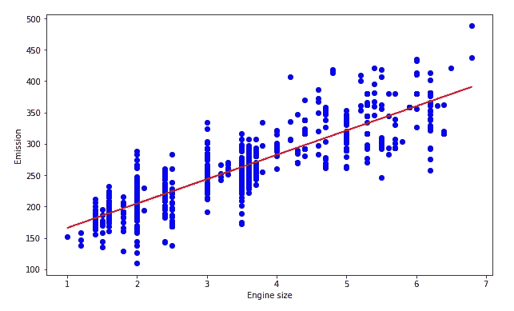

图中的线性回归算法|来源:用 Python 处理的图像。

线性回归是一种对输入要素和输出之间的关系进行建模的统计方法。输入特性称为**自变量**，输出称为**因变量**。我们的目标是通过将输入要素乘以其最佳系数来预测基于输入要素的输出值。

## 线性回归的一些实际例子:

(1)预测产品的销售。

(2)预测经济增长。

(3)预测石油价格。

(4)预测一辆新车的排放。

(GPA 对高校录取的影响。

**有两种类型的线性回归:**

1.  简单线性回归
2.  多元线性回归

## 1.1 简单线性回归:

在简单线性回归中，我们仅基于一个输入特征来预测输出/因变量。简单线性回归由下式给出:

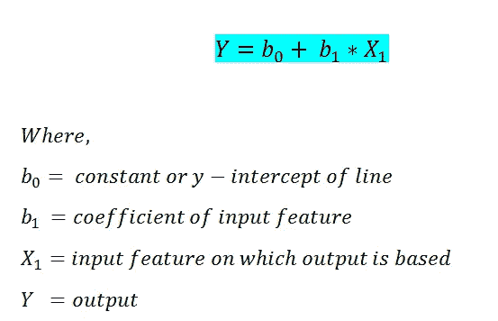

线性回归方程|来源:图片由作者创作。

下面我们将使用 Python 中的 sklearn 库实现简单的线性回归。

## Python 中的分步实现:

**a .导入所需库:**

由于我们要使用各种库进行计算，所以我们需要导入它们。

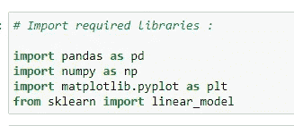

来源:图片由作者创作。

**b .读取 CSV 文件:**

我们检查数据集的前五行。在这种情况下，我们使用的是车辆模型数据集——请在 [Softlayer IBM](https://s3-api.us-geo.objectstorage.softlayer.net/cf-courses-data/CognitiveClass/ML0101ENv3/labs/FuelConsumptionCo2.csv) 上查看数据集。

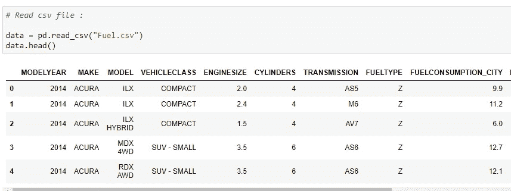

来源:图片由作者创作。

**c .选择我们在预测值时要考虑的特征:**

这里，我们的目标是从数据集中的“发动机尺寸”值预测“co2 排放量”值。

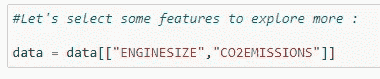

来源:图片由作者创作。

**d .绘制数据:**

我们可以在散点图上显示我们的数据。


线性回归算法的数据图|来源:图片由作者创建。

**e .将数据分为训练和测试数据:**

为了检查模型的准确性，我们将把数据分为训练数据集和测试数据集。我们将使用训练数据来训练我们的模型，然后我们将使用测试数据集来检查我们的模型的准确性。

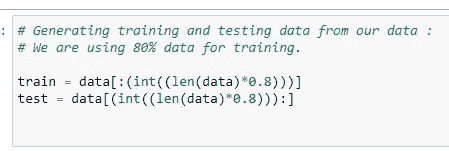

来源:图片由作者创作。

**f .训练我们的模型:**

这里是我们如何训练我们的模型，并找到我们的最佳拟合回归线的系数。

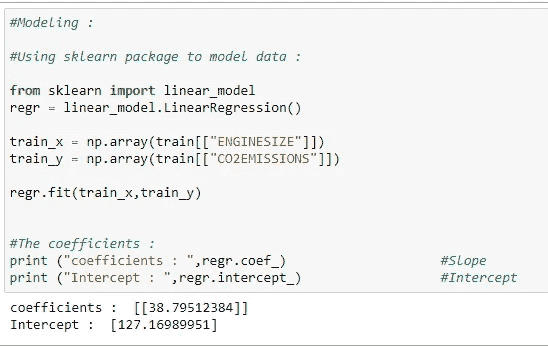

来源:图片由作者创作。

**g .绘制最佳拟合线:**

基于这些系数，我们可以为数据集绘制最佳拟合线。

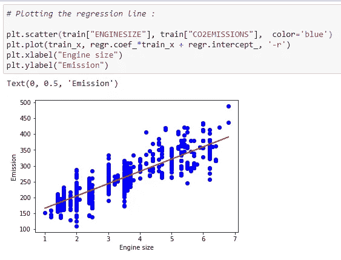

基于系数的线性回归数据图|来源:图片由作者创建。

**h .预测功能:**

我们将对测试数据集使用预测函数。

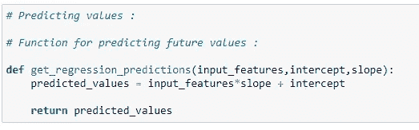

来源:图片由作者创作。

**一、预测二氧化碳排放量:**

根据回归线预测二氧化碳排放量。

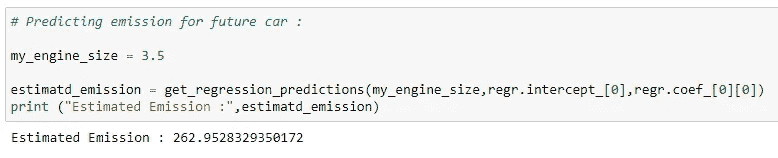

来源:图片由作者创作。

**j .检查测试数据的准确性:**

我们可以通过比较数据集中的实际值和预测值来检查模型的准确性。

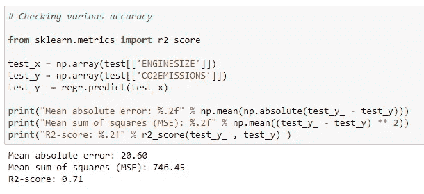

来源:图片由作者创作。

将所有这些放在一起:

```
# Import required libraries:
import pandas as pd
import numpy as np
import matplotlib.pyplot as plt
from sklearn import linear_model# Read the CSV file :
data = pd.read_csv(“Fuel.csv”)
data.head()# Let’s select some features to explore more :
data = data[[“ENGINESIZE”,”CO2EMISSIONS”]]# ENGINESIZE vs CO2EMISSIONS:
plt.scatter(data[“ENGINESIZE”] , data[“CO2EMISSIONS”] , color=”blue”)
plt.xlabel(“ENGINESIZE”)
plt.ylabel(“CO2EMISSIONS”)
plt.show()# Generating training and testing data from our data:
# We are using 80% data for training.
train = data[:(int((len(data)*0.8)))]
test = data[(int((len(data)*0.8))):]# Modeling:
# Using sklearn package to model data :
regr = linear_model.LinearRegression()
train_x = np.array(train[[“ENGINESIZE”]])
train_y = np.array(train[[“CO2EMISSIONS”]])
regr.fit(train_x,train_y)# The coefficients:
print (“coefficients : “,regr.coef_) #Slope
print (“Intercept : “,regr.intercept_) #Intercept# Plotting the regression line:
plt.scatter(train[“ENGINESIZE”], train[“CO2EMISSIONS”], color=’blue’)
plt.plot(train_x, regr.coef_*train_x + regr.intercept_, ‘-r’)
plt.xlabel(“Engine size”)
plt.ylabel(“Emission”)# Predicting values:
# Function for predicting future values :
def get_regression_predictions(input_features,intercept,slope):
 predicted_values = input_features*slope + intercept
 return predicted_values# Predicting emission for future car:
my_engine_size = 3.5
estimatd_emission = get_regression_predictions(my_engine_size,regr.intercept_[0],regr.coef_[0][0])
print (“Estimated Emission :”,estimatd_emission)# Checking various accuracy:
from sklearn.metrics import r2_score
test_x = np.array(test[[‘ENGINESIZE’]])
test_y = np.array(test[[‘CO2EMISSIONS’]])
test_y_ = regr.predict(test_x)print(“Mean absolute error: %.2f” % np.mean(np.absolute(test_y_ — test_y)))
print(“Mean sum of squares (MSE): %.2f” % np.mean((test_y_ — test_y) ** 2))
print(“R2-score: %.2f” % r2_score(test_y_ , test_y) )
```

**在 Google Colab 上发布:**

[](https://colab.research.google.com/drive/1CdiInssgUbBJ9GB2D4n_RSsuAjhsNTkk?usp=sharing) [## 谷歌联合实验室

### 线性回归示例—https://towardsai.net/machine-learning-algorithms

colab.research.google.com](https://colab.research.google.com/drive/1CdiInssgUbBJ9GB2D4n_RSsuAjhsNTkk?usp=sharing) 

## 1.2 多变量线性回归:

在简单线性回归中，我们只能考虑一个输入要素来预测输出要素的值。然而，在多变量线性回归中，我们可以基于多个输入特征来预测输出。这是多元线性回归的公式。

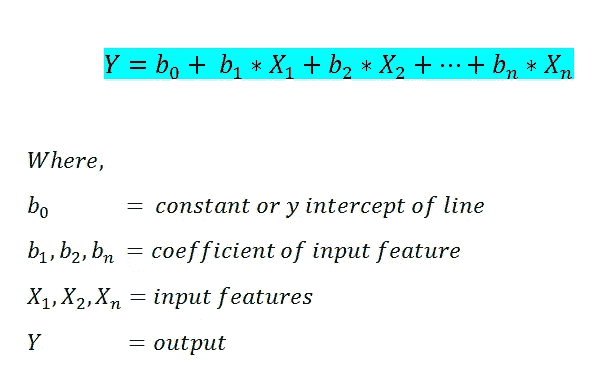

多元线性回归方程|来源:图片由作者创作。

## Python 中的分步实现:

**a .导入所需的库:**

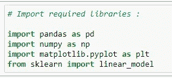

来源:图片由作者创作。

**b .读取 CSV 文件:**

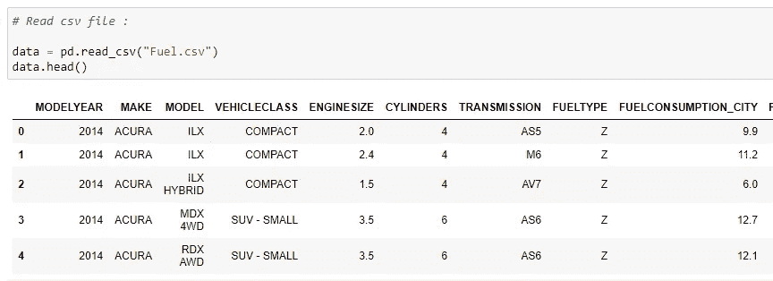

来源:图片由作者创作。

**c .定义 X 和 Y:**

x 存储我们要考虑的输入特性，Y 存储输出的值。

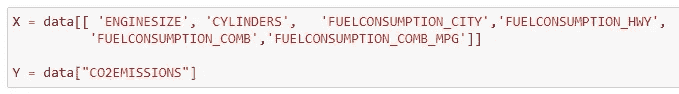

来源:图片由作者创作。

**d .将数据分成测试和训练数据集:**

在这里，我们将 80%的数据用于训练，20%的数据用于测试。

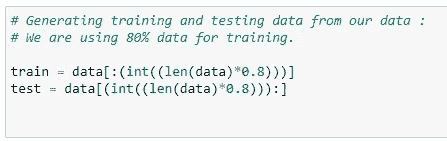

来源:图片由作者创作。

**e .训练我们的模型:**

这里我们要用 80%的数据来训练我们的模型。

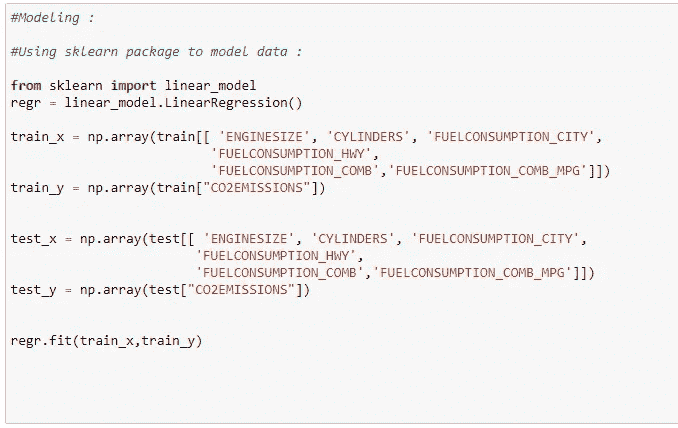

来源:图片由作者创作。

**f .求输入特征的系数:**

现在我们需要知道哪个特性对输出变量的影响更大。为此，我们将打印系数值。请注意，负系数意味着它对输出有相反的影响。即，如果该特征的值增加，则输出值减少。

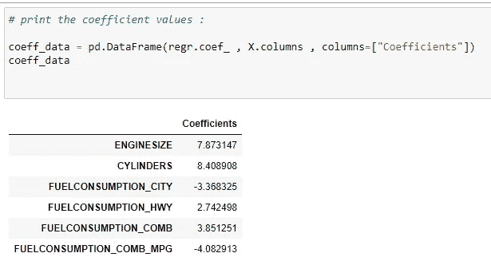

来源:图片由作者创作。

**g .预测值:**


来源:图片由作者创作。

**h .模型的精度:**

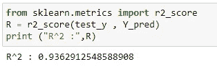

来源:图片由作者创作。

现在请注意，这里我们对简单和多变量线性回归使用了相同的数据集。我们可以注意到，多元线性回归的精度远远好于简单线性回归的精度。

将所有这些放在一起:

```
# Import the required libraries:
import pandas as pd
import numpy as np
import matplotlib.pyplot as plt
from sklearn import linear_model# Read the CSV file:
data = pd.read_csv(“Fuel.csv”)
data.head()# Consider features we want to work on:
X = data[[ ‘ENGINESIZE’, ‘CYLINDERS’, ‘FUELCONSUMPTION_CITY’,’FUELCONSUMPTION_HWY’, 
 ‘FUELCONSUMPTION_COMB’,’FUELCONSUMPTION_COMB_MPG’]]Y = data[“CO2EMISSIONS”]# Generating training and testing data from our data:
# We are using 80% data for training.
train = data[:(int((len(data)*0.8)))]
test = data[(int((len(data)*0.8))):]#Modeling:
#Using sklearn package to model data :
regr = linear_model.LinearRegression()train_x = np.array(train[[ ‘ENGINESIZE’, ‘CYLINDERS’, ‘FUELCONSUMPTION_CITY’,
 ‘FUELCONSUMPTION_HWY’, ‘FUELCONSUMPTION_COMB’,’FUELCONSUMPTION_COMB_MPG’]])
train_y = np.array(train[“CO2EMISSIONS”])regr.fit(train_x,train_y)test_x = np.array(test[[ ‘ENGINESIZE’, ‘CYLINDERS’, ‘FUELCONSUMPTION_CITY’,
 ‘FUELCONSUMPTION_HWY’, ‘FUELCONSUMPTION_COMB’,’FUELCONSUMPTION_COMB_MPG’]])
test_y = np.array(test[“CO2EMISSIONS”])# print the coefficient values:
coeff_data = pd.DataFrame(regr.coef_ , X.columns , columns=[“Coefficients”])
coeff_data#Now let’s do prediction of data:
Y_pred = regr.predict(test_x)# Check accuracy:
from sklearn.metrics import r2_score
R = r2_score(test_y , Y_pred)
print (“R² :”,R)
```

**在 Google Colab 上发布:**

[](https://colab.research.google.com/drive/1CdiInssgUbBJ9GB2D4n_RSsuAjhsNTkk#scrollTo=sTVcjiI_AX2X&line=1&uniqifier=1) [## 谷歌联合实验室

### 多变量线性回归—https://towardsai.net/machine-learning-algorithms

colab.research.google.com](https://colab.research.google.com/drive/1CdiInssgUbBJ9GB2D4n_RSsuAjhsNTkk#scrollTo=sTVcjiI_AX2X&line=1&uniqifier=1) 

## 1.3 多项式回归:

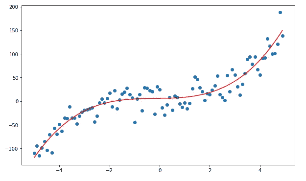

来源:图片由作者创作。

有时我们的数据不仅仅遵循线性趋势。我们有时有遵循多项式趋势的数据。因此，我们将使用多项式回归。

在深入研究它的实现之前，我们需要知道一些主要多项式数据的图形是什么样子的。

## 多项式函数及其图形；

a.图为 **Y=X** :

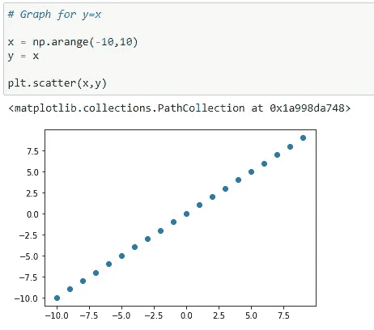

来源:图片由作者创作。

b.图形为 **Y = X** :

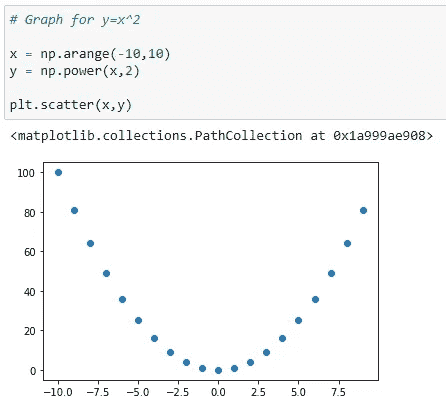

来源:图片由作者创作。

c.图形为 **Y = X** :

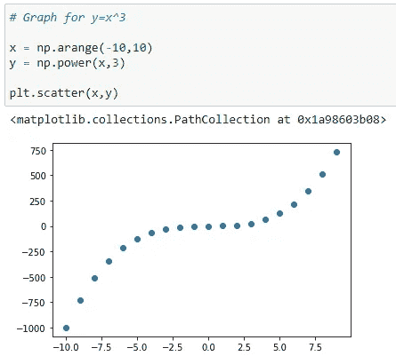

来源:图片由作者创作。

d.具有多个多项式的图: **Y = X +X +X** :

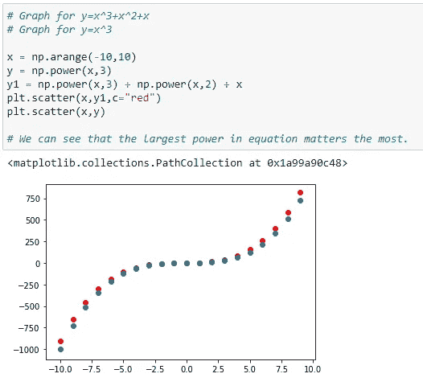

来源:图片由作者创作。

在上图中，我们可以看到红点显示的是 Y=X +X +X 的图形，蓝点显示的是 Y=X 的图形。在这里，我们可以看到最显著的幂影响了我们图形的形状。

**下面是多项式回归的公式:**

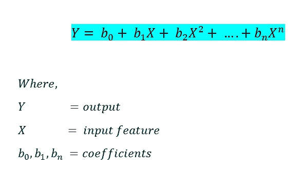

多项式回归的公式|来源:图片由作者创作。

在之前的回归模型中，我们使用 sci-kit 学习库来实现。在这里，我们将使用正规方程来实现它。这里请注意，我们也可以使用 scikit-learn 来实现多项式回归，但是另一种方法将让我们了解它是如何工作的。

等式如下:


来源:图片由作者创作。

在上面的等式中:

θ:最佳定义的假设参数。

x:输入每个实例的特征值。

y:每个实例的输出值。

## 1.3.1 多项式回归的假设函数

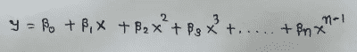

来源:图片由作者创作。

标准方程中的主矩阵:

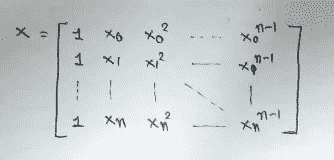

来源:图片由作者创作。

## **用 Python 一步步实现:**

**a .导入所需的库:**

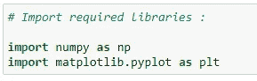

来源:图片由作者创作。

**b .生成数据点:**

我们将生成一个数据集来实现我们的多项式回归。

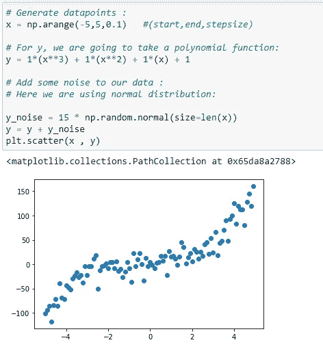

来源:图片由作者创作。

**c .初始化 x，x，x 向量:**

我们取 x 的最大幂为 3。所以我们的 X 矩阵会有 X，X，X。

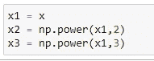

来源:图片由作者创作。

**d . X 矩阵的第 1 列:**

主矩阵 X 的第一列将总是 1，因为它保存β_ 0 的系数。

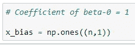

来源:图片由作者创作。

**e .形成完整的 x 矩阵:**

请看这个实现开始时的矩阵 X。我们将通过添加向量来创建它。

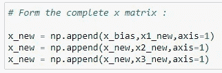

来源:图片由作者创作。

**f .矩阵的转置:**

我们将逐步计算θ的值。首先，我们需要找到矩阵的转置。

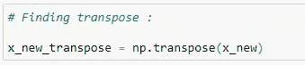

来源:图片由作者创作。

**g .矩阵乘法:**

找到转置后，我们需要将其与原矩阵相乘。请记住，我们要用一个正规方程来实现它，所以我们必须遵循它的规则。


来源:图片由作者创作。

**h .矩阵的逆:**

寻找矩阵的逆矩阵并将其存储在 **temp1** 中。

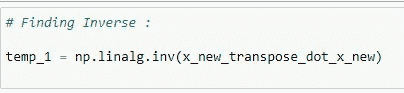

来源:图片由作者创作。

**一、矩阵乘法:**

找到转置的 X 和 Y 向量的乘积，并将其存储在 temp2 变量中。

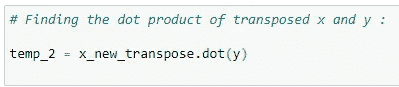

来源:图片由作者创作。

**j .系数值:**

要计算系数值，我们需要将 temp1 和 temp2 相乘。见正规方程公式。

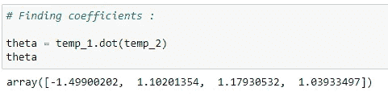

来源:图片由作者创作。

**k .将系数存储在变量中:**

将这些系数值存储在不同的变量中。


来源:图片由作者创作。

**l .用曲线绘制数据:**

用回归曲线绘制数据。

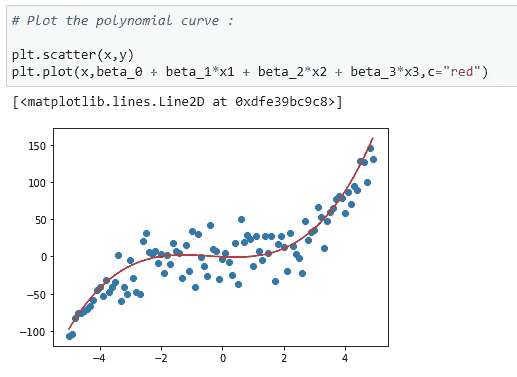

来源:图片由作者创作。

**m .预测功能:**

现在我们将使用回归曲线来预测输出。

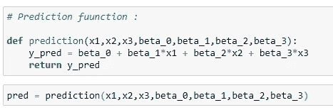

来源:图片由作者创作。

**n .误差函数:**

使用均方误差函数计算误差。

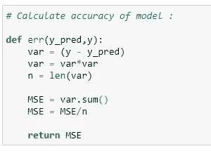

来源:图片由作者创作。

**o .计算误差:**

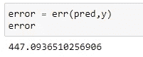

来源:图片由作者创作。

将所有这些放在一起:

```
# Import required libraries:
import numpy as np
import matplotlib.pyplot as plt# Generate datapoints:
x = np.arange(-5,5,0.1)
y_noise = 20 * np.random.normal(size = len(x))
y = 1*(x**3) + 1*(x**2) + 1*x + 3+y_noise
plt.scatter(x,y)# Make polynomial data:
x1 = x
x2 = np.power(x1,2)
x3 = np.power(x1,3)# Reshaping data:
x1_new = np.reshape(x1,(n,1))
x2_new = np.reshape(x2,(n,1))
x3_new = np.reshape(x3,(n,1))# First column of matrix X:
x_bias = np.ones((n,1))# Form the complete x matrix:
x_new = np.append(x_bias,x1_new,axis=1)
x_new = np.append(x_new,x2_new,axis=1)
x_new = np.append(x_new,x3_new,axis=1)# Finding transpose:
x_new_transpose = np.transpose(x_new)# Finding dot product of original and transposed matrix :
x_new_transpose_dot_x_new = x_new_transpose.dot(x_new)# Finding Inverse:
temp_1 = np.linalg.inv(x_new_transpose_dot_x_new)# Finding the dot product of transposed x and y :
temp_2 = x_new_transpose.dot(y)# Finding coefficients:
theta = temp_1.dot(temp_2)
theta# Store coefficient values in different variables:
beta_0 = theta[0]
beta_1 = theta[1]
beta_2 = theta[2]
beta_3 = theta[3]# Plot the polynomial curve:
plt.scatter(x,y)
plt.plot(x,beta_0 + beta_1*x1 + beta_2*x2 + beta_3*x3,c=”red”)# Prediction function:
def prediction(x1,x2,x3,beta_0,beta_1,beta_2,beta_3):
 y_pred = beta_0 + beta_1*x1 + beta_2*x2 + beta_3*x3
 return y_pred

# Making predictions:
pred = prediction(x1,x2,x3,beta_0,beta_1,beta_2,beta_3)

# Calculate accuracy of model:
def err(y_pred,y):
 var = (y — y_pred)
 var = var*var
 n = len(var)
 MSE = var.sum()
 MSE = MSE/n

 return MSE# Calculating the error:
error = err(pred,y)
error
```

**在 Google Colab 上发布:**

[](https://colab.research.google.com/drive/1CdiInssgUbBJ9GB2D4n_RSsuAjhsNTkk#scrollTo=OnN44asuAo_m&line=1&uniqifier=1) [## 谷歌联合实验室

### 多项式回归-https://towardsai.net/machine-learning-algorithms

colab.research.google.com](https://colab.research.google.com/drive/1CdiInssgUbBJ9GB2D4n_RSsuAjhsNTkk#scrollTo=OnN44asuAo_m&line=1&uniqifier=1) 

## 1.4 指数回归:

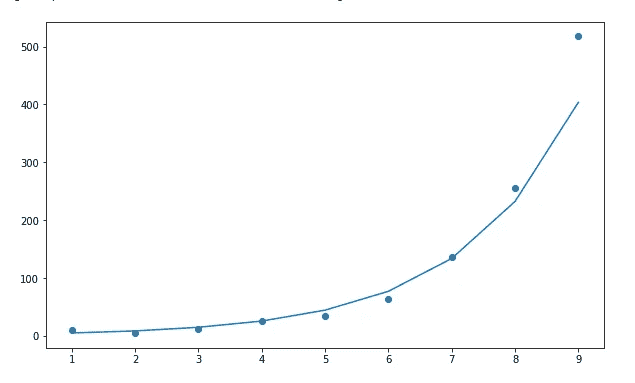

来源:图片由作者创作。

**指数增长的一些真实例子:**

1.培养中的微生物。

2.食物变质。

3.人类人口。

4.复利。

5.流行病(如新冠肺炎)。

6.埃博拉疫情。

7.入侵物种。

8.着火了。

9.癌细胞。

10.智能手机的使用和销售。

**指数回归公式如下:**

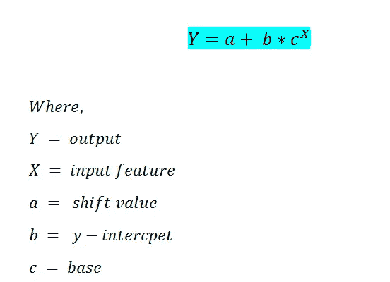

指数回归的公式|来源:图片由作者创作。

在这种情况下，我们将使用 scikit-learn 库来查找 a、b、c 等系数值。

## **用 Python 一步步实现**

**a .导入所需库:**

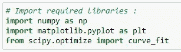

来源:图片由作者创作。

**b .插入数据点:**

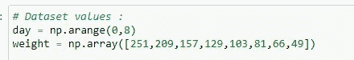

来源:图片由作者创作。

**c .实现指数函数算法:**

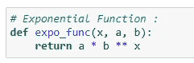

来源:图片由作者创作。

**d .应用最佳参数和协方差:**

这里我们使用 curve_fit 来寻找最佳的参数值。它返回两个变量，名为 **popt，pcov。**

**popt** 存储最优参数的值，pcov 存储其协方差的值。我们可以看到 popt 变量有两个值。这些值是我们的最佳参数。我们将使用这些参数并绘制最佳拟合曲线，如下所示。

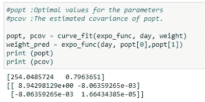

来源:图片由作者创作。

**e .绘制数据:**

用找到的系数绘制数据。

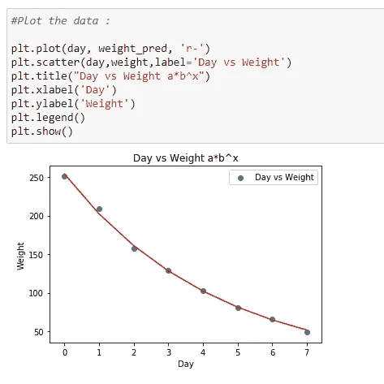

来源:图片由作者创作。

**f .检查模型的准确性:**

用 **r2_score** 检查模型的准确性。

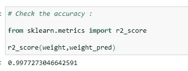

来源:图片由作者创作。

将所有这些放在一起:

```
# Import required libraries:
import numpy as np
import matplotlib.pyplot as plt
from scipy.optimize import curve_fit# Dataset values :
day = np.arange(0,8)
weight = np.array([251,209,157,129,103,81,66,49])# Exponential Function :
def expo_func(x, a, b):
 return a * b ** x#popt :Optimal values for the parameters
#pcov :The estimated covariance of poptpopt, pcov = curve_fit(expo_func, day, weight)
weight_pred = expo_func(day,popt[0],popt[1])# Plotting the data
plt.plot(day, weight_pred, ‘r-’)
plt.scatter(day,weight,label=’Day vs Weight’)
plt.title(“Day vs Weight a*b^x”)
plt.xlabel(‘Day’)
plt.ylabel(‘Weight’)
plt.legend()
plt.show()# Equation
a=popt[0].round(4)
b=popt[1].round(4)
print(f’The equation of regression line is y={a}*{b}^x’)
```

**在 Google Colab 上发布:**

[](https://colab.research.google.com/drive/1CdiInssgUbBJ9GB2D4n_RSsuAjhsNTkk#scrollTo=q-w2fW-uDKHK&line=26&uniqifier=1) [## 谷歌联合实验室

### 指数回归—https://towardsai.net/machine-learning-algorithms

colab.research.google.com](https://colab.research.google.com/drive/1CdiInssgUbBJ9GB2D4n_RSsuAjhsNTkk#scrollTo=q-w2fW-uDKHK&line=26&uniqifier=1) 

## 1.5 正弦回归:

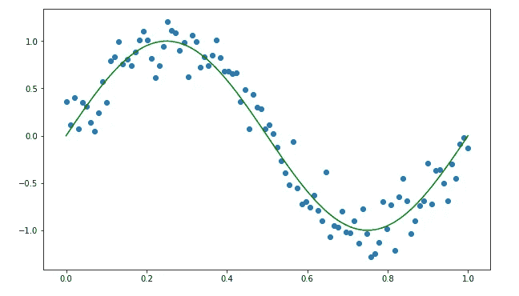

来源:图片由作者创作。

**正弦回归的一些实际例子:**

1.  一代音乐浪潮。
2.  声音以波的形式传播。
3.  建筑中的三角函数。
4.  用于太空飞行。
5.  GPS 位置计算。
6.  建筑。
7.  电流。
8.  无线电广播。
9.  海洋的低潮和高潮。
10.  建筑。

有时我们有数据显示像正弦波一样的模式。因此，在这种情况下，我们使用正弦回归。下面我们可以展示算法的公式:


正弦回归的公式|来源:图片由作者创作。

## Python 中的分步实现:

**a .生成数据集:**


来源:图片由作者创作。


来源:用 Python 处理的图片。

**b .应用正弦函数:**

这里，我们创建了一个名为“calc_sine”的函数，根据最佳系数计算输出值。这里我们将使用 scikit-learn 库来查找最佳参数。


来源:图片由作者创作。


来源:用 Python 处理的图片。

为什么正弦回归比线性回归表现更好？

如果我们在用直线拟合我们的数据后检查模型的准确性，我们可以看到预测的准确性低于正弦波回归。这就是为什么我们使用正弦回归。


来源:图片由作者创作。


来源:用 Python 处理的图片。

将所有这些放在一起:

```
# Import required libraries:
import numpy as np
import matplotlib.pyplot as plt
from scipy.optimize import curve_fit
from sklearn.metrics import r2_score# Generating dataset:# Y = A*sin(B(X + C)) + D
# A = Amplitude
# Period = 2*pi/B
# Period = Length of One Cycle
# C = Phase Shift (In Radian)
# D = Vertical ShiftX = np.linspace(0,1,100) #(Start,End,Points)# Here…
# A = 1
# B= 2*pi
# B = 2*pi/Period
# Period = 1
# C = 0
# D = 0Y = 1*np.sin(2*np.pi*X)# Adding some Noise :
Noise = 0.4*np.random.normal(size=100)Y_data = Y + Noiseplt.scatter(X,Y_data,c=”r”)# Calculate the value:
def calc_sine(x,a,b,c,d):
 return a * np.sin(b* ( x + np.radians(c))) + d# Finding optimal parameters :
popt,pcov = curve_fit(calc_sine,X,Y_data)# Plot the main data :
plt.scatter(X,Y_data)# Plot the best fit curve :
plt.plot(X,calc_sine(X,*popt),c=”r”)# Check the accuracy :
Accuracy =r2_score(Y_data,calc_sine(X,*popt))
print (Accuracy)# Function to calculate the value :
def calc_line(X,m,b):
 return b + X*m# It returns optimized parametes for our function :
# popt stores optimal parameters
# pcov stores the covarience between each parameters.
popt,pcov = curve_fit(calc_line,X,Y_data)# Plot the main data :
plt.scatter(X,Y_data)# Plot the best fit line :
plt.plot(X,calc_line(X,*popt),c=”r”)# Check the accuracy of model :
Accuracy =r2_score(Y_data,calc_line(X,*popt))
print (“Accuracy of Linear Model : “,Accuracy)
```

**在 Google Colab 上发布:**

[](https://colab.research.google.com/drive/1CdiInssgUbBJ9GB2D4n_RSsuAjhsNTkk#scrollTo=vPU_9qhzD2Z4&line=48&uniqifier=1) [## 谷歌联合实验室

### 正弦回归—https://towardsai.net/machine-learning-algorithms

colab.research.google.com](https://colab.research.google.com/drive/1CdiInssgUbBJ9GB2D4n_RSsuAjhsNTkk#scrollTo=vPU_9qhzD2Z4&line=48&uniqifier=1) 

## 1.6 对数回归:


对数回归图|来源:用 Python 处理的图像。

**对数增长的一些真实例子:**

1.  地震的震级。
2.  声音的强度。
3.  溶液的酸度。
4.  溶液的 pH 值。
5.  化学反应的产量。
6.  商品生产。
7.  婴儿的成长。
8.  新冠肺炎图表。

> 📚查看我们对[最佳机器学习书籍](https://towardsai.net/p/machine-learning/best-machine-learning-books-free-and-paid-ml-book-recommendations-40c9ab30b0c)的编辑推荐。📚

有时，我们的数据在语句中呈指数增长，但在某个点之后，它变得平缓。在这种情况下，我们可以使用对数回归。


对数回归方程|来源:图片由作者创作。

## Python 中的分步实现:

**a .导入所需库:**


来源:图片由作者创作。

**b .生成数据集:**


来源:图片由作者创作。

**c .我们的矩阵 X 的第一列:**

这里我们将使用我们的正规方程来寻找系数值。


来源:图片由作者创作。

**d .整形 X:**


来源:图片由作者创作。

**e .走正规方程公式:**


来源:图片由作者创作。

**f .形成主矩阵 X:**


来源:图片由作者创作。

**g .寻找转置矩阵:**


来源:图片由作者创作。

执行矩阵乘法:


来源:图片由作者创作。

**一、求逆:**


来源:图片由作者创作。

**j .矩阵乘法:**


来源:图片由作者创作。

**k .求系数值:**


来源:图片由作者创作。

**l .用回归曲线绘制数据:**


来源:图片由作者创作。

**m .精度:**


来源:图片由作者创作。

**综合起来:**

```
# Import required libraries:
import numpy as np
import matplotlib.pyplot as plt
from sklearn.metrics import r2_score# Dataset:
# Y = a + b*ln(X)
X = np.arange(1,50,0.5)
Y = 10 + 2*np.log(X)#Adding some noise to calculate error!
Y_noise = np.random.rand(len(Y))
Y = Y +Y_noise
plt.scatter(X,Y)# 1st column of our X matrix should be 1:
n = len(X)
x_bias = np.ones((n,1))print (X.shape)
print (x_bias.shape)# Reshaping X :
X = np.reshape(X,(n,1))
print (X.shape)# Going with the formula:
# Y = a + b*ln(X)
X_log = np.log(X)# Append the X_log to X_bias:
x_new = np.append(x_bias,X_log,axis=1)# Transpose of a matrix:
x_new_transpose = np.transpose(x_new)# Matrix multiplication:
x_new_transpose_dot_x_new = x_new_transpose.dot(x_new)# Find inverse:
temp_1 = np.linalg.inv(x_new_transpose_dot_x_new)# Matrix Multiplication:
temp_2 = x_new_transpose.dot(Y)# Find the coefficient values:
theta = temp_1.dot(temp_2)# Plot the data:
a = theta[0]
b = theta[1]
Y_plot = a + b*np.log(X)
plt.scatter(X,Y)
plt.plot(X,Y_plot,c=”r”)# Check the accuracy:
Accuracy = r2_score(Y,Y_plot)
print (Accuracy)
```

在 Google Colab 上发布:

[](https://colab.research.google.com/drive/1CdiInssgUbBJ9GB2D4n_RSsuAjhsNTkk#scrollTo=-FNHHye-Ek9P&line=44&uniqifier=1) [## 谷歌联合实验室

### 对数回归—https://towardsai.net/machine-learning-algorithms

colab.research.google.com](https://colab.research.google.com/drive/1CdiInssgUbBJ9GB2D4n_RSsuAjhsNTkk#scrollTo=-FNHHye-Ek9P&line=44&uniqifier=1) [](https://www.buymeacoffee.com/pratu)

给普拉蒂克买杯咖啡！

**免责声明:**本文表达的观点仅代表作者个人观点，不代表卡内基梅隆大学或其他(直接或间接)与作者相关的公司的观点。这些文章并不打算成为最终产品，而是当前思想的反映，同时也是讨论和改进的催化剂。

## 引用

对于学术背景下的归属，请引用该工作为:

```
Shukla, et al., “Machine Learning Algorithms For Beginners with Code Examples in Python”, Towards AI, 2020
```

## BibTex 引文:

```
@article{pratik_iriondo_chen_2020, 
 title={Machine Learning Algorithms For Beginners with Code Examples in Python}, 
 url={[https://towardsai.net/machine-learning-algorithms](https://towardsai.net/machine-learning-algorithms)}, 
 journal={Towards AI}, 
 publisher={Towards AI Co.}, 
 author={Pratik, Shukla and Iriondo, 
 Roberto and Chen, Sherwin}, 
 editor={Stanford, StacyEditor}, 
 year={2020}, 
 month={Jun}
}
```

## **参考文献:**

[1]米切尔，汤姆。(1997).机器学习。麦格劳·希尔。第 2 页。国际标准书号 0–07–042807–7

[2]机器学习，亚瑟·塞缪尔，卡耐基·梅隆，【http://www.contrib.andrew.cmu.edu/~mndarwis/ML.html 

[3]机器学习(ML) vs. AI，走向 AI，[https://towardsai.net/ai-vs-ml](https://towardsai.net/ai-vs-ml)

[4]关键机器学习定义，走向人工智能，[https://towardsai.net/machine-learning-definitions](https://towardsai.net/machine-learning-definitions)

通过[向 AI](https://towardsai.net/) 发布

# 推荐文章

一、[机器学习和数据科学最佳数据集](https://towardsai.net/p/machine-learning/best-datasets-for-machine-learning-and-data-science-d80e9f030279)
二。[艾薪资冲天](http://towardsai.net/ai-salaries)三世
。[什么是机器学习？](https://towardsai.net/p/machine-learning/what-is-machine-learning-ml-b58162f97ec7)
四世。[2020 年最佳机器学习硕士项目](https://towardsai.net/ml-masters)
五、[2020 年最佳机器学习博士项目](https://towardsai.net/ml-phd)
六、[最佳机器学习博客](https://towardsai.net/p/machine-learning/best-machine-learning-blogs-6730ea2df3bd)
七。[关键机器学习定义](https://towardsai.net/p/machine-learning/key-machine-learning-ml-definitions-43e837ec6add)
八。[用机器学习在 0.05 秒内破解验证码](https://towardsai.net/ml-captcha)
九。[机器学习 vs. AI 及其重要区别](https://towardsai.net/p/machine-learning/machine-learning-vs-ai-important-differences-between-them/robiriondo/3432/)
十.[确保成功开创机器学习事业(ML)](https://towardsai.net/p/machine-learning/moocs-vs-academia-ensuring-success-starting-in-a-machine-learning-ml-career-304b2e42315e)
XI。[机器学习算法初学者](https://towardsai.net/p/machine-learning/machine-learning-algorithms-for-beginners-with-python-code-examples-ml-19c6afd60daa)
十二。[神经网络从零开始详细用 Python 代码和数学](https://towardsai.net/neural-networks-with-python)
XIII。[用 Python 构建神经网络](https://towardsai.net/p/machine-learning/building-neural-networks-with-python-code-and-math-in-detail-ii-bbe8accbf3d1)
XIV。[神经网络的主要类型](https://towardsai.net/p/machine-learning/main-types-of-neural-networks-and-its-applications-tutorial-734480d7ec8e)
十五。[用 Python 编写的蒙特卡洛模拟教程](https://towardsai.net/p/machine-learning/monte-carlo-simulation-an-in-depth-tutorial-with-python-bcf6eb7856c8)
XVI。[Python 自然语言处理教程](https://towardsai.net/p/nlp/natural-language-processing-nlp-with-python-tutorial-for-beginners-1f54e610a1a0)