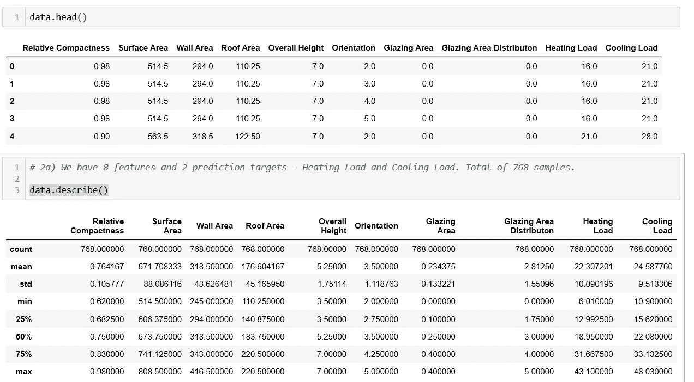
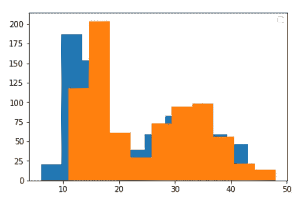
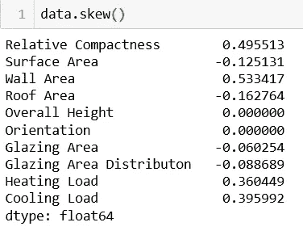
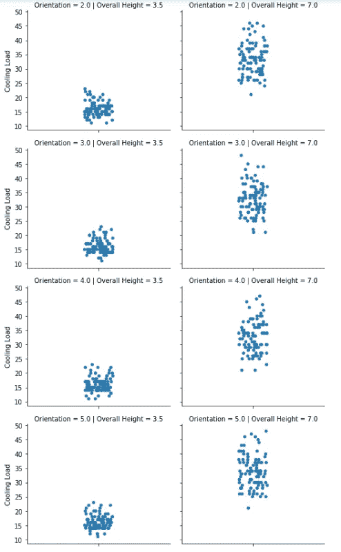
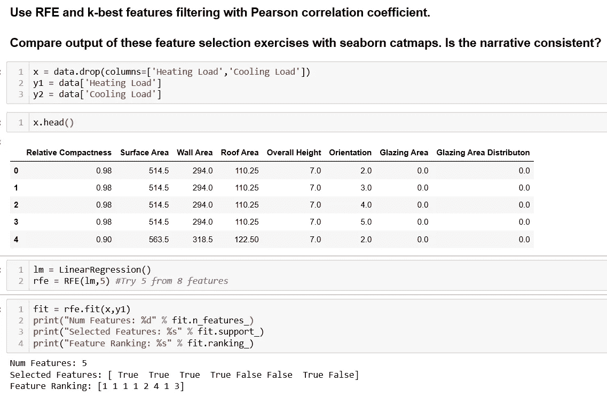
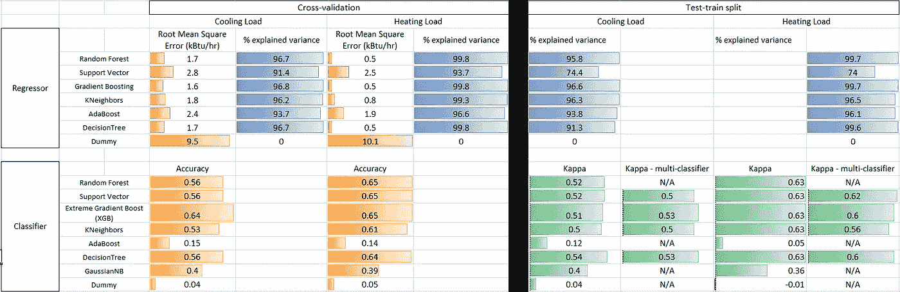
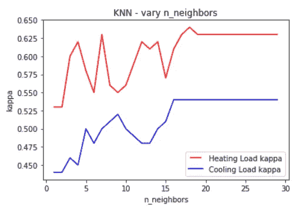
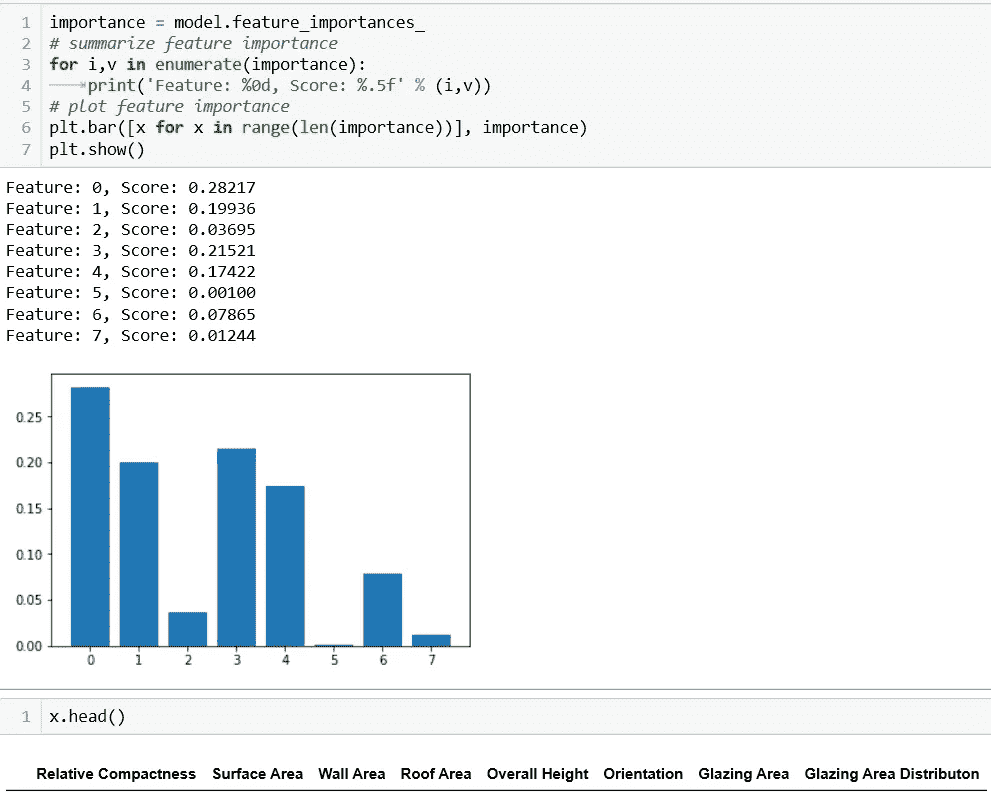

# 机器学习和深度学习——系统应用

> 原文：<https://pub.towardsai.net/machine-learning-and-deep-learning-a-systematic-application-f53b51f3b098?source=collection_archive---------3----------------------->

## [机器学习](https://towardsai.net/p/category/machine-learning)

## 使用特征选择、交叉验证、scikit-learn 和神经网络来识别价值


由[凯文·Ku](https://unsplash.com/@ikukevk?utm_source=medium&utm_medium=referral)在 [Unsplash](https://unsplash.com?utm_source=medium&utm_medium=referral) 上拍摄的照片

我之前的[帖子](https://medium.com/@rangys3)已经使用 Python 可视化来探索美国的炼油和环境排放。在将机器学习和深度学习技术应用于能源行业的海量数据之前，我将在 UCI 机器学习资源库的[能效数据集](https://archive.ics.uci.edu/ml/datasets/Energy+efficiency)上进行实践。

## TL/DR:回归在 UCI 能效数据集上提供了优于分类的性能。神经网络回归器并不比像梯度推进或随机森林这样的集成技术更有效。

这篇文章有代码和输出的例子，所有的工作都可以在这个 [Github repo](https://github.com/Ranga2904/EnergyEfficiency_ML_DL) 上获得。

您将在本文中看到执行的关键步骤是:

**第一步** =在开始建模之前，确保理解目标和大局。

**步骤 2** =加载并获得数据的高级洞察

**第三步** =进一步可视化以探索数据。目标:尽早了解最具杠杆作用的特性。

**第四步** =建模计划。这里的关键是为训练和测试模型准备好数据。

第五步 =执行建模并评估绩效。根据需要完成灵敏度分析

**第 6 步** =从工作中得出结论，让最终用户受益

步骤 4 和 5 分享了测试分类和回归算法时的一些过程。

请注意，我已经强调了一些我不打算使用但还是尝试过的工具和步骤，只是为了说明它们的影响并分享为什么我不会使用它们。在其他情况下，我列出了我没有采取的步骤和相应的理由。

最后—请就其他步骤或现有步骤的变化提供反馈。这都是为了持续改进！

**步骤 1** :目标=给定建筑物的描述符，预测这些建筑物的热负荷和冷负荷。这可以帮助我们优化空调和加热器负载，最大限度地降低建筑能耗。

作为第一步的一部分，我将假设我的客户不会在回归预测和基于分类的预测之间进行选择。

**第二步**:加载并获得高层次的数据洞察。有一些 auto-EDA 软件包可供使用，但我暂时不会使用它们，而是依赖。头()和。描述()

```
data = pd.read_csv('ENB2012_data.csv')data.head()
data.describe()
```



图 1:高级数据探索的命令和输出

来自上面的见解:

*   高度、方向和玻璃面积变量代表不同类型的建筑。
*   不同的特征有不同的量级，**在训练模型之前需要注意数据缩放需求。**
*   加热和冷却是连续的标签，但快速 matplotlib.pyplot 直方图表明，如果四舍五入，则加热和冷却负荷可以分组并用于拟合分类器。



图 2:标签直方图

最后，检查数据的偏斜度——如下所示，所有列的偏斜度都非常接近 0，表明接近高斯分布，很少考虑离群数据。



图 3:显示数据不对称的命令和输出

如果上述数据偏斜度远远超出-1 比 1 的范围，那么**将触发对某种数据转换**的需求，例如在应用机器学习之前进行对数转换。

ne 预测:这个数据集有 8 个特征和 768 个实例。这不是一个非常大的数据集，我不指望深度神经网络能提供比机器学习算法更多的东西。

**步骤 3:** 追求更详细的可视化，探索各种特征对输出变量或“标签”的影响。

我将使用 Seaborn 的分类绘图:

```
c = sns.catplot(y='Cooling Load', data=data,col='Overall Height', row='Orientation', height=3, aspect=1.2)
```



图 4: Seaborn 分类图，用于评估特征对标注的影响

以上是最终得出以下结论的分析样本:

*   建筑高度=3.5 的热负荷为 10–20，高度=7 的热负荷为 25–45，与其他功能无关。
*   建筑朝向与能量负荷没有明显的相关性，玻璃面积分布也是如此。
*   热负荷和冷负荷随着玻璃面积的增加而增加。
*   屋顶面积> 200，表面积> 670 导致较低的能量负荷

**我认为方向和玻璃面积分布是影响最小的变量，高度是第二或第三个影响最小的变量。**

我先从机器学习说起。

**第 4 步:**让我们使用回归来执行**使用递归特征消除(RFE)的特征选择。**

步骤 4a)将数据分成 x 个独立变量或特征，以及 y1、y2 个独立变量或标签。然后使用递归特征消除来评估哪些变量被认为是可利用的。以下结果与冷负荷相同。



图 4:x 和 y 分割以及 RFE 运动的输出

我们从上面了解到，对于线性回归模型中的选择来说，朝向和玻璃区域分布(以及潜在的高度)并不是最佳的。这符合探索性数据分析的最初预期——您可以在[报告](https://github.com/Ranga2904/EnergyEfficiency_ML_DL)中看到 k-best 过滤的结果。

步骤 4b)从 x 中删除高度、方向和玻璃区域分布，然后设置 10 重交叉验证。*我也做过测试列车分裂，其结果在表 1 中。*

*这是我的测试序列分割代码的一个例子，我没有使用它——我过去犯过的一个错误是在将输入特性分割成测试序列分割* ***之前缩放所有输入特性，从而无意中将信息从序列测试泄露给测试集。***

```
std = StandardScaler()
x_std = std.fit(x).transform(x)x1_train, x1_test, y1_train, y1_test = train_test_split(x_std, y1, test_size=0.33, random_state=42)
x2_train, x2_test, y2_train, y2_test = train_test_split(x_std, y2, test_size=0.33, random_state=24)
```

**第五步**:执行建模。在深入研究之前，请注意:能源数据集没有指定加热和冷却负荷的测量单位。因此，我假设测量值为几千 Btu/hr(或 kBtu/hr ),因为我们讨论的是建筑物的加热和冷却，而不是大型工业加热器/冷却器。

下面的代码片段用于回归，并完成以下任务:

(1)标准化数据

(2)创建要迭代的模型向量

(3)使用 for-loop 应用 10 倍 cv

(4)用每个回归变量 cv 分数的平均值创建一个向量

```
x_sc = std.fit(x).transform(x)Heating_Load_crossval_explvar = []
Cooling_Load_crossval_explvar = []regressors = [RandomForestRegressor(),  SVR(),
    GradientBoostingRegressor(),
    KNeighborsRegressor(),
    AdaBoostRegressor(),
    DecisionTreeRegressor(),    
    DummyRegressor()]cv = KFold(10,True,1)for rgr in regressors:
    rgrscore_heat_load = cross_val_score(rgr,x_sc,y1,cv=cv,scoring='explained_variance')
    rgrscore_heat_load = round(np.mean(rgrscore_heat_load),3)
    Heating_Load_crossval_explvar.append(rgrscore_heat_load)

    rgrscore_cool_load = cross_val_score(rgr,x_sc,y2,cv=cv,scoring='explained variance')
    rgrscore_cool_load = round(np.mean(rgrscore_cool_load),3)
    Cooling_Load_crossval_explvar.append(rgrscore_cool_load)
```

在查看下面的结果摘要之前，添加一个代码块:对于分类算法，标签的连续值是不可接受的。如上面第 2 步所述，我将热负荷和冷负荷四舍五入，以创建有助于训练分类器的标签类别。如下所示，标签远不止 2 个，这使得某些评分指标无法用于 k 倍交叉验证。

```
data['Heating Load'] = round(data['Heating Load'])
data['Cooling Load'] = round(data['Cooling Load'])class_counts_heat = data.groupby('Heating Load').size()
class_counts_cool = data.groupby('Cooling Load').size()print("Number of classes in Cooling Load: %d" % len(class_counts_cool))
print("Number of classes in Heating Load: %d" % len(class_counts_heat)) Number of classes in Cooling Load: 38
Number of classes in Heating Load: 37
```



图 5:分类和回归得分汇总

**我们的主要收获:**

*   在这个阶段，回归预测优于分类预测，无需进行大量的模型调整。
*   与热负荷相比，冷负荷建模更具挑战性，因此模型性能较差。
*   **回归:**梯度推进回归器和随机森林集合技术更优越，因为它们导致 0.5-1.7 kBtu/HR 的误差，并且模型解释了 95-99%的方差。
*   **分类:**测试列车分裂 Kappa 评分对于冷负荷预测统一在 0.6 以下，对于热负荷预测统一在 0.6 以上。经常被引用的 Landis 论文建议 0.41-0.60 表示中度同意，0.61-0.80 表示基本同意。请记住，与随机分类相比，这是对模型性能的度量。
*   **使用多输出分类器并不能比使用单独的算法对热负荷和冷负荷进行分类提高性能**

B 在讨论神经网络的机器学习之前，我想谈谈最后一点:调整机器学习模型的超参数，尝试提高模型性能。我已经在[回购](https://github.com/Ranga2904/EnergyEfficiency_ML_DL)中这样做了，这里有我工作的样本。鉴于上述表现，这不是重点。

下面是 KNearestNeighbors 分类器查询的邻居数量变化的结果-我们观察到，随着查询的增加，性能平均增加，最终稳定在 n=18 左右。



图 6: KNN 模型超参数测试

## 现在谈谈深度学习——出于这个练习的目的，我将构建一个回归神经网络。

**第 4 步:**神经网络在特征选择和/或工程方面需要较少的工作，所以我不会在这里花时间。数据缩放将是下面管道的一部分。

**步骤 5** :我将在 Keras 中使用顺序 API。导入 Keras 和 TensorFlow 后，我将使用 Keras 回归器。

```
%pip install keras
%pip install tensorflowfrom keras.models import Sequential
from keras.layers import Densefrom keras.wrappers.scikit_learn import KerasRegressor
```

Keras 还有一个分类器，我不会在这个练习中使用它。

下面的代码实现了以下功能:

1.  创建基线序列模型，第一个隐藏层接受 8 个特征和 8 个节点，第二个隐藏层接受 8 个节点，输出层接受 2 个输出，因为我想预测两个变量
2.  创建一个标准化数据的管道，然后使用创建的模型为 50 个 epochs 定型数据，批量大小为 5。使用 10 重交叉验证对性能进行分级。

```
def baseline_model_two():
    model = Sequential()
    model.add(Dense(8, input_dim=8, kernel_initializer='normal', activation='relu'))
    model.add(Dense(8, activation='relu'))
    model.add(Dense(2, kernel_initializer='normal'))
    # Compile model
    model.compile(loss='mean_squared_error', optimizer='adam')
    return modelestimators = []
estimators.append(('standardize', StandardScaler()))
estimators.append(('mlp', KerasRegressor(build_fn=baseline_model_two, epochs=50, batch_size=5, verbose=0)))
pipeline = Pipeline(estimators)
kfold = KFold(n_splits=10)
results = cross_val_score(pipeline, x, y, cv=kfold)
print("Error: %.2f (%.2f) MSE" % (results.mean(), results.std()))
```

模型性能如下:

50 个时期:均方误差为 9.56 (kBtu/hr)

150 个时期:均方误差为 9.57 (kBtu/hr)

50 个历元、额外层和除输出层之外的所有层中的 10 个节点:均方误差为 9.58 (kBtu/hr)

**对我们来说，关键的一点是:正如上文第二步结束时预测的那样，神经网络并没有提供优于传统机器学习技术的优势。**

**第六步**

我们创建了分类和回归模型，以帮助我们的最终用户设计优化能耗的建筑。训练神经网络很有趣，但考虑到标准机器学习技术所达到的性能，最终不值得付出努力。

我们的客户可能对我们模型中最少和/或最多的杠杆变量感兴趣？我们能告诉他们什么？

拟合后，模型的 feature_importances_ property 可以告诉我们每个特征的相对重要性分数。然后可以对其进行分析/绘制，以回答我们客户的问题。请看下面的图 7:



图 7:特性重要性

我们可以告诉我们的客户，朝向、玻璃面积分布是最不具杠杆作用的变量——相对紧凑性、屋顶面积和表面积是最具杠杆作用的变量。有趣的是，总高度系数仅比表面积系数低 0.02。我们在这里得到的答案取决于我们选择应用 features_importance 的模型。

如前所述，我欢迎任何有利于持续改进的反馈。这项练习帮助我增强了信心，并计划迎接能源行业的挑战。