# 机器学习和人工智能减少金融犯罪

> 原文：<https://pub.towardsai.net/machine-learning-artificial-intelligence-to-reduce-financial-crimes-766dcfc1bd47?source=collection_archive---------4----------------------->

## **保险业务概述**

经济的主要组成部分之一是保险业，它防范存在于人们生活和商业各个阶段的金融风险。保险公司防止损失——汽车、房子、甚至生命——并在损失发生时向投保人或指定人支付保险金。它收取的保费数量、投资规模和保险通过覆盖个人和商业风险发挥着重要的社会和经济作用。尽管过去几年面临严峻的宏观经济和结构性挑战、激烈的竞争以及持续的技术驱动型中断，但保险公司已经表明，他们能够以比许多行业资深人士想象的更快的速度进行大规模变革，并能够应对意外的发展。生活的方方面面，包括面临的风险，可以是个人，也可以是企业。无论我们是接受可能损失的后果，还是在发生损失时寻求保险，降低风险敞口都取决于我们。获得保险的人成功地将风险“转移”给另一个组织，即保险公司。

购买保险是大多数人和组织最常见的风险转移机制。被保险人支付的钱称为保险费。作为回报，保险公司同意在发生约定的损失时支付指定的利益。2020 年，毛保费增长放缓，但保险业在 2021 年出现了增长反弹，尤其是在人寿保险领域。从数据来看，保险公司的毛保费上升了 7.3%。非寿险业务的保费也平均增长 1.7%。

**代位权**

被保险人可以就他们所遭受的损失起诉其他方，并获得潜在的赔偿来源。这种情况无处不在:一个被保险的司机，他的车在事故中损坏了，他可以起诉另一个造成事故的司机，要求赔偿修理费；一个被保险的房主，他的房子因火灾被烧毁，可能会从保险公司得到赔偿，或者一个有健康保险的人在商店里滑倒，可能会起诉店主，要求赔偿医疗费用。保险单不仅承诺赔偿被保险人的损失，通常还包括所谓的代位求偿条款，赋予保险人接替被保险人的位置并起诉造成被保险人损失的一方的权利。

在一些国家，代位条款是财产保险、责任保险、健康和医疗保险以及残疾保险单的共同特征。在过去几年里，代位求偿权是保险市场的弃儿，但这种形象正在改变。如今，在投资回报平平的环境下，代位权正被保险公司用作增加利润的一种方式。近来，保险业在分析和利用代位追偿方面变得越来越成熟。保险业已经参与了基准研究，以帮助其为其代位求偿计划获得更强有力的统计分析。最初的研究创建于 20 世纪 90 年代，但在过去的 20 年里，保险公司在集中和分散代位求偿权的行业趋势之间摇摆不定。通过正确分析关闭但未恢复的文件，运营商可以变得更有创造力或更有侵略性，从而降低关闭但未恢复的文件的百分比。对于代位求偿权，关注的领域包括汽车、财产、工人赔偿和医疗保健。这些领域中的每一个都有特殊的重点和战略，通常取决于不同国家的法律。例如，在汽车回收方面，一些国家允许回收医疗费用，而另一些国家只允许回收财产损失。此外，一些城市正在制定反代位求偿立法，这将严重限制保险公司的追偿能力。最近对个人汽车碰撞的研究表明，高性能的承运人将收集约 24%，而平均水平约为 11.5%。最近的研究表明，付费冲突的标准恢复率高达 27%，而非标准运营商的恢复率为 14.5%。自最初的基准以来，这些数字有了显著的增长。

大多数保险公司都在投资现代系统、先进的数据实践以及先进的机器学习和人工智能解决方案，这些解决方案既灵活又强大，可以推动转型。最新人工智能和机器学习解决方案的实施使员工能够更有效地工作，并将注意力集中在客户关系上，从而提高个人互动的质量。此类投资使这些保险公司能够开拓新市场，推进其增长战略。

随着人工智能和机器学习的进步，保险公司有一个独特的机会将分析分数纳入决策引擎，以创建一个智能系统。任何保险公司要完全实现数据驱动，都需要付出巨大努力，从数据和预测模型中获取更多信息。该解决方案需要对业务友好，并应支持基于事实的决策。

为了成功地利用 AI & ML，应该考虑几个方面

明确定义的业务问题和适当的目标结果

通过详细的功能设计将预测分数集成到核心系统中

技术细节设计，包括数据采集、模型构建和核心系统集成

# **我们当前的问题陈述**

鉴于上述事实和不断变化的经济形势，保险公司已经意识到，在金融市场困难时期，代位求偿权可以成为承运人的主要收入来源。在 Covid 之后，可以观察到汽车保险行业的经济放缓，尤其是未投保的索赔人。在美国本土，3200 多万辆未投保车辆的代位求偿工作量增加了 35 倍，导致 15%的代位求偿机会丧失(恶化)，32%的可收回已付索赔损失。如果我们中的任何一个人遇到这样的情况，我们只知道事故不是我们的错，但我们真的什么也做不了，即使是对方的错？这正是我们可以从保险代位求偿权中获益的地方。在不到 10%的索赔中，有机会追求代位求偿权。对于大多数保险公司来说，代位求偿仍然是一个手动过程，导致线索丢失，并使一些理赔部门损失高达两个百分点的赔付率。

# **我们为什么需要代位权？**

自动代位清偿在世界各地急剧增加，英国和澳大利亚等国家的自动清偿率高达 40%。然而，美国的自动结算率在 10%到 15%之间，低于全球同行。

由 AI & ML 驱动的智能系统将向最有可能有代位求偿机会的索赔的理算人发出警报，并在索赔处理工作流程中提供可收回金额的估计。这一新信息将阻止理算员关闭预测模型标记的索赔，并将它们转交给代位求偿专业人员。与所有其他损失和费用相比，寻找和恢复失去的代位求偿机会可能显得微不足道，但这可能导致承保利润的显著增加。在代位求偿的情况下，一些保险公司也会增加免赔额。因此，在这种情况下，损害是由第三方造成的，一旦第三方向保险公司支付赔偿，人们就可以获得他们的索赔金额加上免赔额。

该解决方案基于机器学习，将导致:-

消除与代位求偿权识别相关的泄漏。

减少高达 36%的误报。

使生产率提高高达 20%。

将周期时间缩短 30%以上。

## **客户的总体利益&保险公司将:-**

减少欺诈

提高客户保持率

提高客户信任度和体验

提高客户参与度

提高员工生产力

降低成本和缩短响应时间

## **一个真实的例子，这个用例的核心方面**

为了容易理解事物，用一个故事或例子把它们联系起来。假设有一天天气很好，一个鲁莽的司机撞了你的车，你的车碰巧受伤了。现在，你的车后部损坏了，而这个家伙似乎甚至不承认他的错误。你没有时间来解决这个问题或进一步争论，所以你继续用你损坏的汽车，而不是用你的综合汽车保险来支付损失。您的保险公司将要求第三方对损坏负责，并赔偿您自掏腰包支付的金额以及您的保险公司因造成的损坏和损失而支付的金额。

## **在上述方面，分析如何为价值链做出贡献..？**

我们最初的方法包括一个标准的事故风险保险模型，并得到被保险人对其遭受的伤害提起诉讼的能力的支持。我们假设相同的规避风险的个体面临遭受事故伤害的机会；他们购买最大化其预期效用的保险单，并且如果事故发生，他们将能够起诉潜在的责任方要求赔偿，其中诉讼将涉及诉讼费用，并且只有概率导致成功。

# **启发式模型**

> 注释

y =个人的初始财富

U(∙) =个人对财富的效用，其中 U′> 0 且 U″ < 0

p = probability of an accident; p 0 (0, 1)

h = harm if an accident occurs; h > 0

k =提起诉讼的费用；k ≥ 0

q =赢得诉讼的概率，导致 h 的奖励；q 0 [0，1]。

π =保险费

c =保险范围 c ≥ 0

N =保险人是否根据代位求偿条款起诉的指示；如果 N = 0，则不提起诉讼；如果 N = 1，则提起诉讼

s =如果诉讼成功，被保险人在代位求偿条款下的赔偿份额 h；s 0 [0，h]

在纯保单下，保费约束是

***π = pc***

如果被保险人在这种情况下提起诉讼，预期效用将是

***EU =(1—p)U(y—π)+p[q U(y—π+c—k)+(1—q)U(y—π—h+c—k)]***

# **分析方法**

我们机器学习的下一个方法将利用文本数据和算法。这将有助于降低欺诈、检测语义关系模式和自动分类。它使我们能够根据可恢复性可能性将索赔文件分为高、中或低三个等级，从而确定索赔的优先级。已评分的案例将发送给适当的调查和恢复专家。所有这些确保了代位求偿诉讼将更好地了解情况，并有助于在发生重大索赔时帮助保险公司消除虚假或过度赔付的情况。目标是通过分析具有已知结果的历史索赔的文本注释，了解具有高代位求偿潜力的索赔的模式特征。为了对从与索赔相关联的文本注释和结构化属性中提取的模式进行联合分析，开发了用于预测每个索赔的代位求偿潜力的模型。所创建的模型能够根据索赔的代位求偿潜力对索赔进行自动排序。关注具有最高代位求偿潜力的索赔的能力提高了人工分析师的工作效率，并增加了回收率。自动代位求偿权预测系统确保所有索赔和所有时间的分析的一致性。它有助于最大限度地减少失去代位求偿权的机会。一个好的代位求偿权预测模型可以发现大量的好的代位求偿权候选索赔，这些索赔在人工分析中可能会被遗漏。

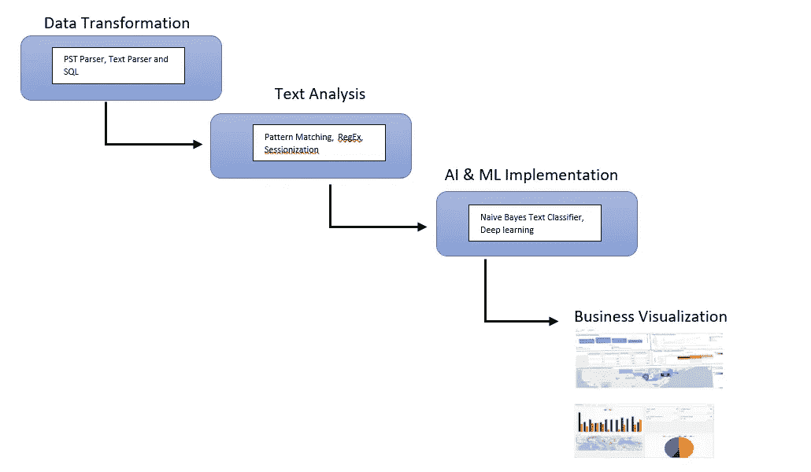

我们方法的标准下限

## **高级数据集成**

从不同来源提取数据并进行转换，以识别最有可能获得代位求偿权的索赔。

我们可以为模型创建或使用的变量:

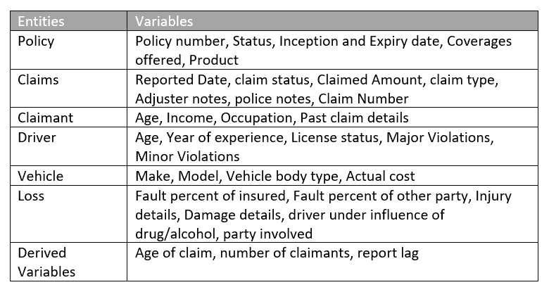

我们可以为分析创建/使用的变量很少

显示示例数据集中的列和数据。数据在 2019 年到 2022 年的索赔 id 级别，有 48 个特征。(这只是一个从开源创建的模拟数据集)

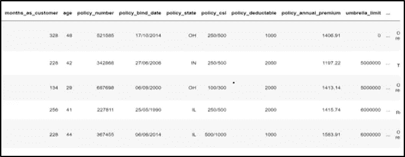

模拟数据集

让我们来看一个非结构化数据的示例

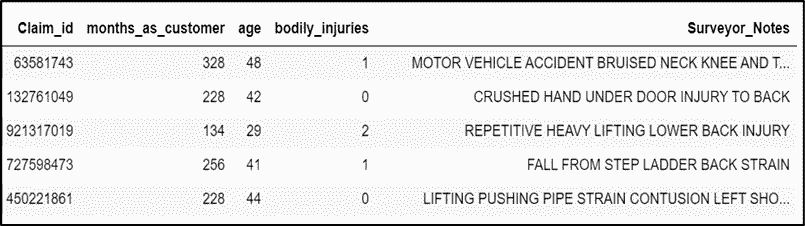

模拟数据集

我们将增加我们的索赔文本数据，以揭示未投保或投保不足的索赔人的重要方面，从而使用变量来建立一个机器学习模型，以了解支付代位求偿权的可能性。查看这些数据，我们可以很容易地识别出一些针对潜在事故的关键词。

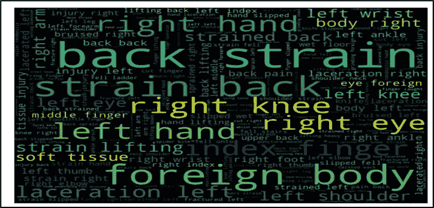

代位求偿期间最常出现的词的词云

***目前我们将只推进非结构化数据***

# 人工智能/人工智能模型建立和可解释性(XAI)

我们现在准备开始建模。我们喜欢采取的方法是立即构建一个简单的模型作为基线，然后使用该模型来比较更复杂的方法。如果我们不能在基线上实现显著的改进，那么使用更复杂的模型是没有意义的。

这里，我们将从逻辑回归模型开始&一些超参数来查看性能。从这个结果，我们将移动到 BERT，并检查我们是否有一个更好的模型可以使用。

我们的模型通过收集大量不同的数据输入来工作。然后，这些输入在模型中运行，以检测索赔中的异常情况，此外，我们可以应用 ran 业务规则来检测是否自动发生了高代位求偿权实例。

## a.逻辑回归

该算法通常处理观察值有多可能属于每个组的问题。该模型通常用于通过 logit 函数预测事件发生的可能性。对于这个问题，这是一个可以利用的有用模型，因为我们感兴趣的是预测索赔是针对代位权(1)还是不针对代位权(0)。逻辑回归通过一组其他解释变量(也称为预测因子)预测响应变量(营业额)的结果。

初始模型

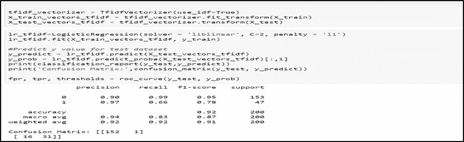

LR 输出

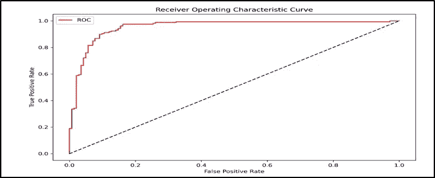

模型性能度量(ROC)

**b .**BERT(双向编码器表示法)

这种深度学习模型已经在各种各样的自然语言处理任务上给出了最先进的结果。它代表变压器的**双向编码器表示。它已经在维基百科和 BooksCorpus 上进行了预训练，并且需要(仅)针对特定任务进行微调。它基本上是一堆堆叠在一起的转换器编码器(不是整个转换器架构，而只是编码器)。双向的概念是 BERT 和它的前身之间的关键区别。**

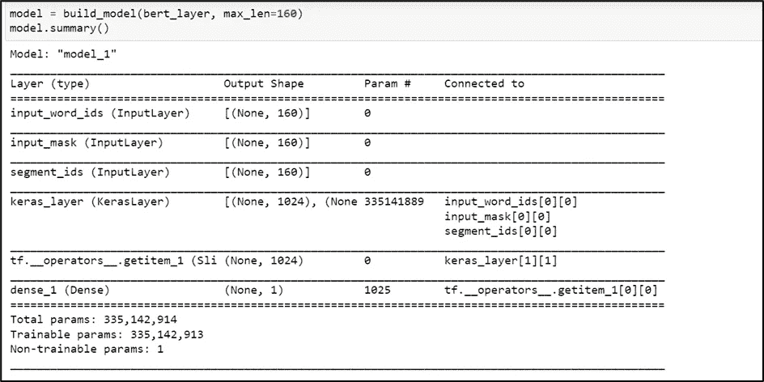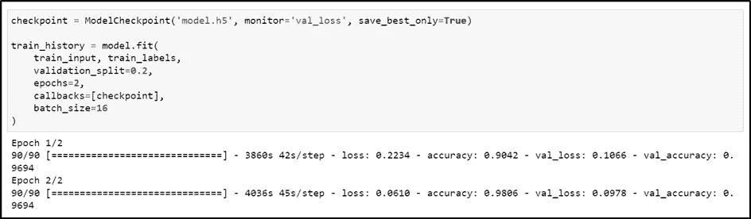

伯特输出

数据集的每一行都由索赔报告文本及其标签组成。数据预处理包括将文本转换为 BERT 输入特征:`*input_word_ids*` *、*、`*input_mask*`、*、*、`*segment_ids/input_type_ids*`

***输入单词 id:****输出我们的分词器，把每个句子转换成一组 token ids。*

***输入掩码:*** *因为我们要填充所有的序列，所以创建某种掩码来确保这些填充不会干扰实际的文本标记是很重要的。因此，我们需要一个生成输入掩码来阻止填充。掩码中 1 代表实数标记，0 代表填充标记。只关注真实的令牌。*

****segment_ids:****对于我们的文本分类任务来说，由于只有一个序列，Segment _ Ids 本质上只是一个 0 的向量。**

## *伯特的可解释性*

*如果我们假设我们的模型可以很好地理解文本的上下文，这将是非常好的。因此，当我们使用像 BERT 这样的模型来理解我们的文本栏的上下文，并研究 BERT 正在学习语言的哪一方面时。它有助于验证我们模型的稳健性。我们将知道哪些单词被我们的模型认为是重要的。*

*让我们来看一种简单的归因方法，它根据我们的模型做出的预测对输入数据进行评分，即，它使用每个特征的分数将预测归因于其输入信号或特征。*

*综合渐变使用 ***特征*渐变*** 的方法。梯度是告知神经网络在反向传播期间将网络中的某个权重/系数增加或减少多少的信号。它在很大程度上依赖于输入特性。因此，每个输入要素相对于输出的梯度有助于我们了解要素的重要性。集成梯度允许我们将从 BERT 模型中选择的输出特征归因于其输入。*

*我们可以为每个输出特征生成单词重要性，如下所示*

*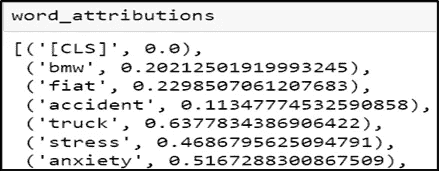**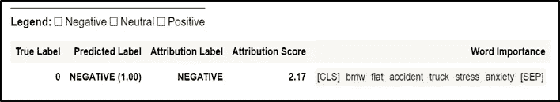*

*这使我们能够了解哪些单词导致了他们正在查看的特征(这是 BERT 的特征向量之一)。*

# ***我们如何从这里前进。？***

*我们希望整合各种数据源，研究可能的方法来提高模型性能，并获得更接近现实生活场景的结果。通过使用谷歌街景(基于科利森日期时间和位置)和索赔人的数字身份映射。将模型性能与维持数据进行比较，并相互衡量性能，以确定最值得信赖的索赔代位求偿预测值。*

*在企业层面，我们需要与索赔部门的领导和专家合作，将我们的模型输出引入索赔流程。当代位求偿的可能性超过预定的限度时，通常由保险公司向理算师和代位求偿专家发出警报。概率稍低(5-20%)的索赔通常会被分配到“观察”状态，而概率更低的索赔(大多数索赔)将不会收到消息，因为这些索赔的消息通常被视为分散注意力。*

*将创建一个 API 来对索赔进行评分，索赔中心将使用 HTTPClient 来调用 REST 服务。此外，需要为启动这些调用的触发事件进行配置。*

*请随意分享你的观点和想法。*

*快乐学习！*