# 机器学习自动化

> 原文：<https://pub.towardsai.net/machine-learning-automation-1c112e099005?source=collection_archive---------2----------------------->

## [机器学习](https://towardsai.net/p/category/machine-learning)


由[克里斯多夫·高尔](https://unsplash.com/@cgower?utm_source=unsplash&utm_medium=referral&utm_content=creditCopyText)在 [Unsplash](https://unsplash.com/s/photos/tech?utm_source=unsplash&utm_medium=referral&utm_content=creditCopyText) 上拍摄的照片

> “仅仅因为你可以自动化某件事，并不意味着这件事*就应该*自动化。”

**我们将在本文中讨论的内容**

*   自动化的需要
*   我们真的能做出全自动的机器学习系统吗？
*   我们将如何建造
*   建立自动化系统

如果你对最终产品的外观很好奇。然后看看我的这两个项目

> 1) **网络上的机器学习/数据科学自动化**

机器学习/数据科学自动化

> 2) **机器学习 Web App(虹膜分类)**

机器学习 Web 应用程序(虹膜分类)

# 现在我们开始吧

> **自动化需求:**

**自动化机器学习**通过**自动化**许多建模活动**需要**来构建和部署**机器学习**模型，帮助企业用户快速采用**机器学习**解决方案，使公司的数据科学家能够专注于更复杂的问题。

从长远来看，自动化简化了人类活动，实际上降低了运营成本。此外，任何规模和性质的企业都可以实现流程自动化，并显著提高绩效。

1.成本效益

2.节省时间

3.提高工作流程效率

4.操作的准确性和一致性

5.降低员工流动率

> **我们真的能做出全自动的机器学习系统吗？**

答案是**“否”**

**但是**

当机器学习一次又一次地涉及相同的活动时，它可以自动化。然而，机器学习的基本性质处理相反的情况:可变条件。在这方面，机器学习需要能够独立运行，并采用不同的解决方案来满足不同的需求。

自动化机器学习改变了这一点，通过对原始数据运行系统化的流程，并选择从数据中提取最相关信息的模型，使在现实世界中建立和使用机器学习模型变得更容易——这通常被称为“噪音中的信号”。自动化机器学习融合了来自顶级数据科学家的机器学习最佳实践，使数据科学在整个组织中更容易获得。

> **我们将如何构建:**

我们将使用**【Streamlit】**在 web 上制作它，使用**【熊猫】**我们将与数据文件进行交互，使用 **Matplotlib"** 和 **Seaborn"** 进行数据浏览，现在，我们将使用的最棒的部分是" **SweetViz** "库，重点是在漂亮和高密度可视化的帮助下浏览数据…

**细流:**

Streamlit 是一个开源的 Python 库，可以轻松创建和共享漂亮的自定义 web 应用程序，用于机器学习和数据科学。只需几分钟，您就可以构建和部署强大的数据应用

熊猫:

Pandas 是一个快速、强大、灵活且易于使用的开源数据分析和操作工具，构建于 Python 编程语言之上…

**Matplotlib 和 Seaborn:**

**Matplotlib** 主要部署用于基本绘图。使用 Matplotlib 的可视化通常由条形图、饼图、折线图、散点图等组成。

另一方面，Seaborn 提供了多种可视化模式。它使用更少的语法，并有很容易有趣的默认主题…

SweetViz:

Sweetviz 是一个 python 库，专注于借助漂亮的高密度可视化来探索数据。它不仅自动化了 EDA，还用于比较数据集并从中得出推论。在这里，我们将分析与我们用于熊猫概况相同的数据集。

> **构建 AutoML 系统:**

```
## Importing Necessary Librariesimport streamlit as st
import streamlit.components.v1 as componentsst.set_option(‘deprecation.showPyplotGlobalUse’, False)import codecsimport pandas as pd 
import numpy as np 
import matplotlib.pyplot as plt
import seaborn as sns
```

> **制作简单的 Streamlit app**

```
import streamlit as stdef main():
 st.title("Machine Learning Automation")## Eveything else inside this blockif __name__ == "__main__":
    main()
```

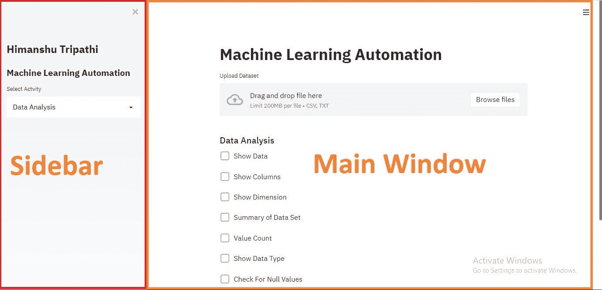

自动化 web 应用程序

基本上，该应用程序有 2 个主要组成部分

1.  侧栏部分
2.  主窗口

让我们建造这两个组件

> **构建侧栏部分**

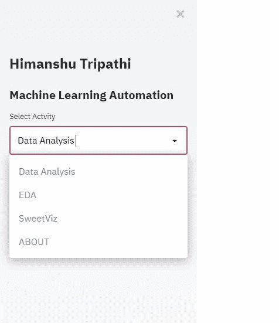

补充报道

如图所示，我们有四个选项可供选择

**数据分析，EDA，SweetViz，**和可选**关于**部分

```
## Side bar
st.sidebar.title(“Himanshu Tripathi”)
st.sidebar.header(“Machine Learning Automation”)activites = [‘Data Analysis’,’EDA’,’SweetViz’,’ABOUT’]
 choice = st.sidebar.selectbox(“Select Actvity”, activites)
```

> **构建拖放逻辑**


拖放

```
data = st.file_uploader(“Upload Dataset”, type=[‘csv’,’txt’,])

df = pd.DataFrame()
if data is not None:
 df = pd.read_csv(data)
 st.success(“Data File Uploaded Successfully”)
```

> **构建我们的第一个屏幕，即数据分析屏幕**

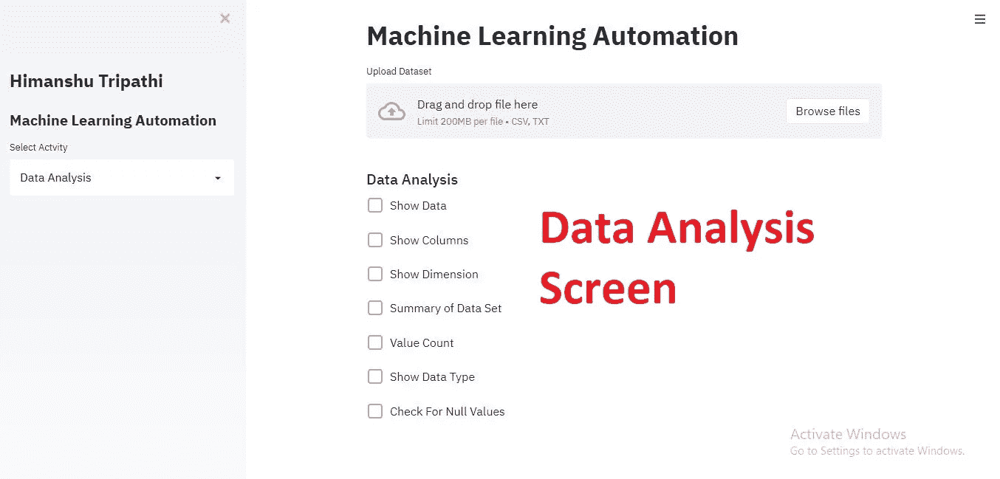

数据分析屏幕

```
if choice == ‘Data Analysis’:
 st.subheader(“Data Analysis”)
 # Data Show
 if st.checkbox(“Show Data”):
     select_ = st.radio(“HEAD OR TAIL”,(‘All’,’HEAD’,’TAIL’))
     if select_ == ‘All’:
         st.dataframe(df)
     elif select_ == ‘HEAD’:
         st.dataframe(df.head())
     elif select_ == ‘TAIL’:
         st.dataframe(df.tail())

     # Columns
    if st.checkbox(“Show Columns”):
        select_ = st.radio(“Select Columns”,(‘All Columns’,’Specific Column’))
    if select_ == “All Columns”:
        st.write(df.columns)
    if select_ == “Specific Column”:
       col_spe = st.multiselect(“Select Columns To Show”,df.columns)
       st.write(df[col_spe]) # Show Dimension
    if st.checkbox(“Show Dimension”):
       select_ = st.radio(‘Select Dimension’,     (‘All’,’Row’,’Column’))
   if select_ == “All”:
       st.write(df.shape)
   elif select_ == “Row”:
       st.write(df.shape[0])
   elif select_ == “Column”:
       st.write(df.shape[1]) # Summary of dataset
   if st.checkbox(“Summary of Data Set”):
      st.write(df.describe()) # Value Counts
   if st.checkbox(“Value Count”):
      select_ = st.multiselect(“Select values”,df.columns.tolist())
      st.write(df[select_].count()) # Show data Type
   if st.checkbox(“Show Data Type”):
       select_ = st.radio(“Select “,(‘All Columns’,’Specific Column’))
   if select_ == “All Columns”:
       st.write(df.dtypes)
   elif select_ == “Specific Column”:
       s = st.multiselect(“Select value”,df.columns.tolist())
       st.write(df[s].dtypes) # Check for Null Values
   if st.checkbox(“Check For Null Values”):
        st.write(df.isnull().sum())
```

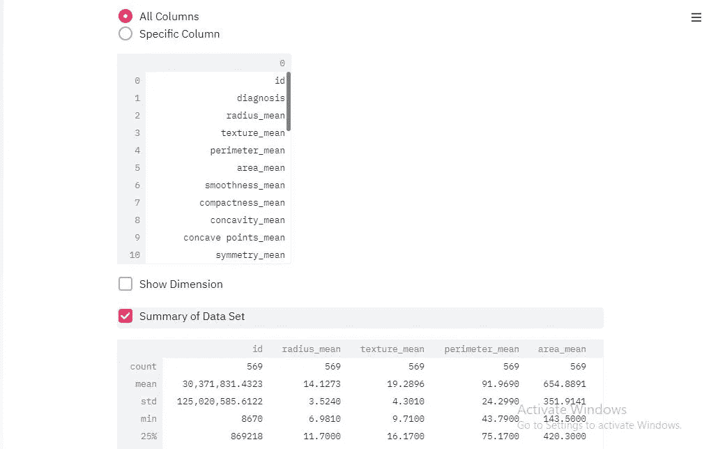

数据探索工作

> **EDA(探索性数据分析)屏幕**

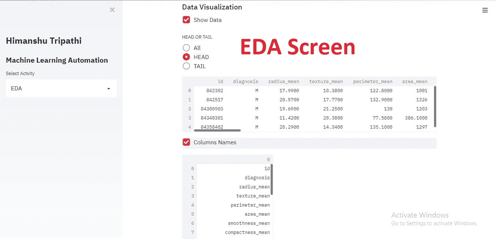

EDA 屏幕

```
#Data Visualizationelif choice == 'EDA':
  st.subheader("Data Visualization")
  if st.checkbox("Show Data"):
   select_ = st.radio("HEAD OR TAIL",('All','HEAD','TAIL'))
   if select_ == 'All':
    st.dataframe(df)
   elif select_ == 'HEAD':
    st.dataframe(df.head())
   elif select_ == 'TAIL':
    st.dataframe(df.tail())
  # Show Columns Names
  if st.checkbox("Columns Names"):
   st.write(df.columns)
  # Check for null values in the form of HeatMap
  if st.checkbox("Show Null Values in Heatmap"):
   st.write(sns.heatmap(df.isnull()))
   st.pyplot()# Quick Analysis
  if st.checkbox("Quick Analysis"):
   select_ = st.radio("Select Type for Quick Analysis",('Count Plot','Box Plot','Bar Plot for Specific Columns','lmplot','Scatter Plot','Correlation Heatmap','Histogram','Joint Distribution Plot'))
   if select_ == "Count Plot":
    st.write(df.dtypes)
    s = st.text_input('Enter Column Name')
    try:
     if s != " ":
      st.write(sns.countplot(df[s]))
      st.pyplot()
    except Exception as e:
     st.error(e)
   elif select_ == 'lmplot':
    st.write(df.dtypes)
    x = st.text_input('Enter X Value')
    y = st.text_input("Enter Y Value")
    try:
     if x != " " and y != " ":
      st.write(x,y)
      st.write(sns.lmplot(x,y,data=df))
      st.pyplot()
    except Exception as e:
     st.error(e)elif select_ == 'Scatter Plot':
    st.write(df.dtypes)
    x = st.text_input('Enter X Value')
    y = st.text_input("Enter Y Value")
    try:
     if x != " " and y != " ":
      st.write(x,y)
      st.write(sns.scatterplot(x,y,data=df))
      st.pyplot()
    except Exception as e:
     st.error(e)

   elif select_ == 'Box Plot':
    st.write(sns.boxplot(data=df))
    st.pyplot()elif select_ == "Bar Plot for Specific Columns":
    x = st.multiselect('Select Value',df.columns)
    try:
     if x != " ":
      st.write(sns.barplot(data=df[x]))
      st.pyplot()
    except Exception as e:
     st.error(e)elif select_ == "Correlation Heatmap":
    st.write(sns.heatmap(df.corr()))
    st.pyplot()elif select_ == "Histogram":
    x = st.multiselect('Select Numerical Variables',df.columns)
    try:
     if x != " ":
      st.write(sns.distplot(df[x]))
      st.pyplot()
    except Exception as e:
     st.error(e)elif select_ == "Joint Distribution Plot":
    st.write(df.dtypes)
    x = st.text_input('Enter X Value')
    y = st.text_input("Enter Y Value")
    try:
     if x != " " and y != " ":
      st.write(x,y)
      st.write(sns.jointplot(x,y,data=df))
      st.pyplot()
    except Exception as e:
     st.error(e)
```

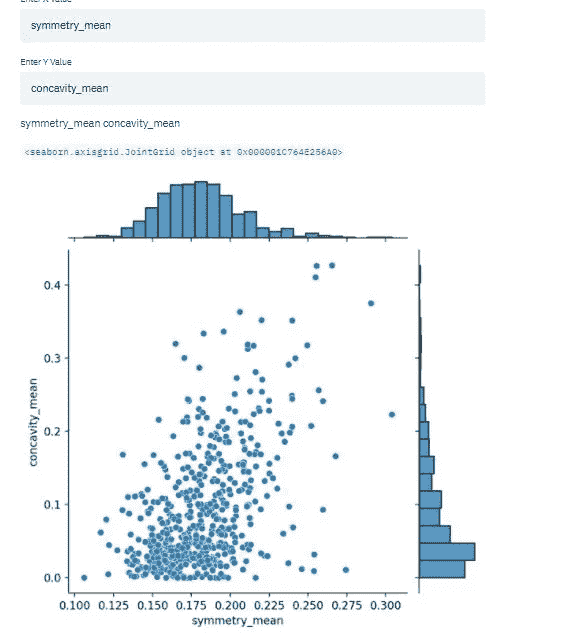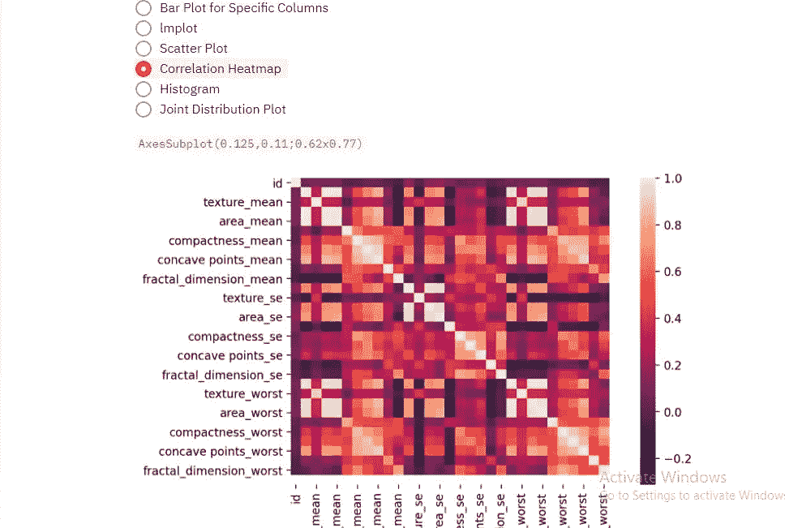

配对图和相关热图

> **SweetViz 可视化屏幕**

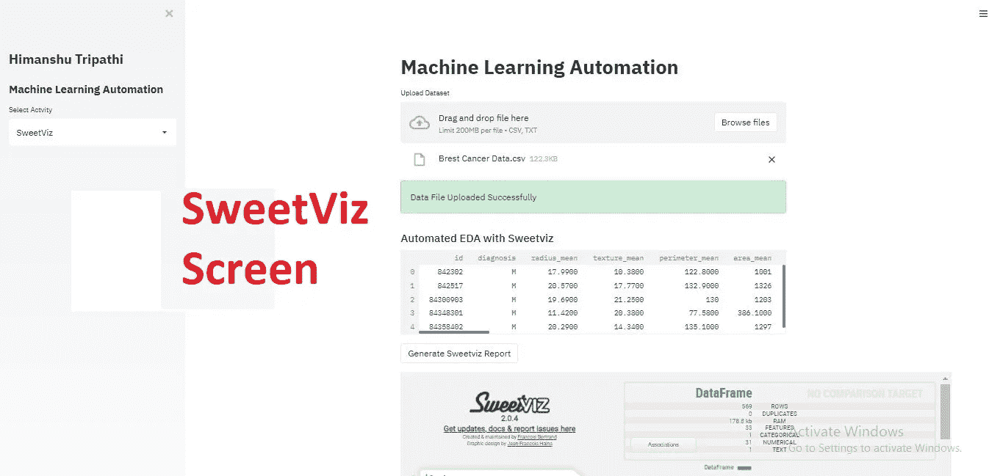

Sweetviz 屏幕

```
elif choice == 'SweetViz':
  st.subheader("Automated EDA with Sweetviz")
  # data_file = st.file_uploader("Upload CSV",type=['csv'])
  # if data_file is not None:
  # df = pd.read_csv(data)
  st.dataframe(df.head())
  if st.button("Generate Sweetviz Report"):
   # Normal Workflow
   with st.spinner("Just wait a second.. Making Something good for you... "):
    report = sv.analyze(df)
    report.show_html(open_browser = False)display_sweetviz("SWEETVIZ_REPORT.html")
```

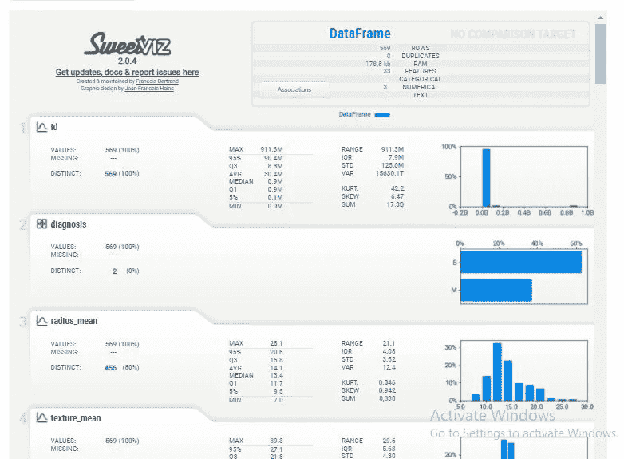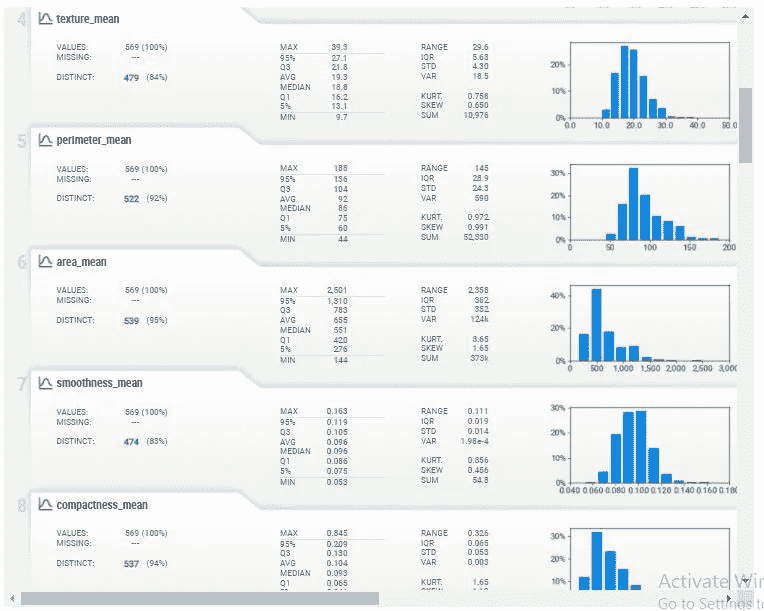

SweetViz 在行动

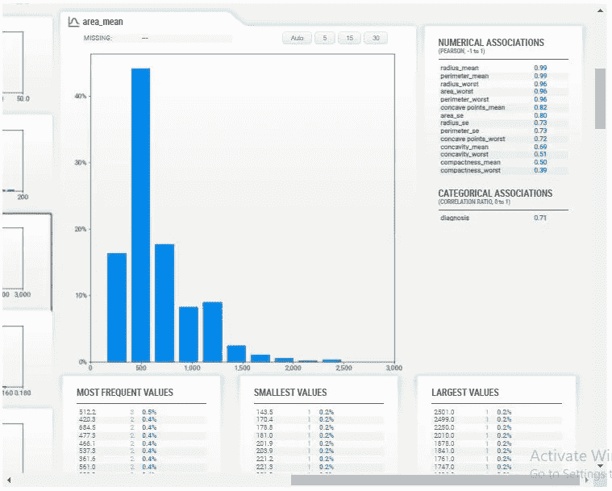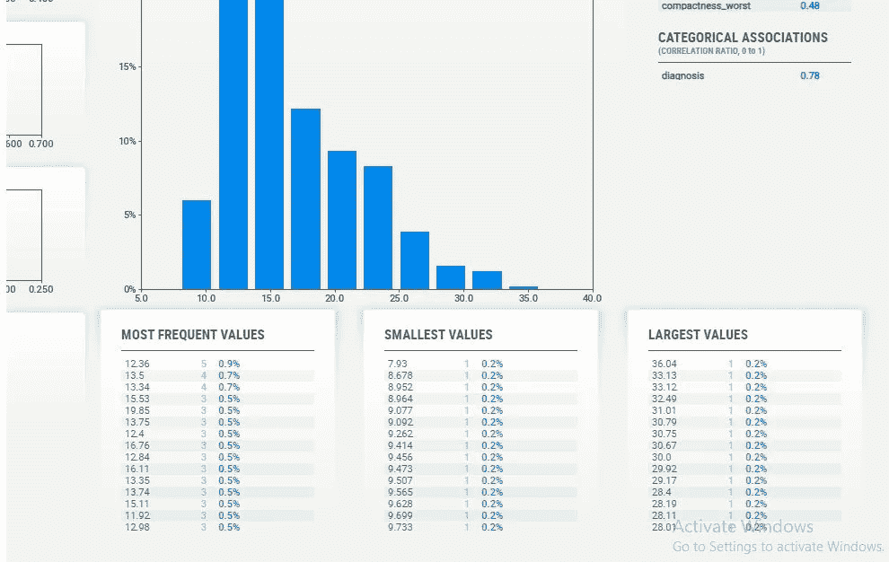

更多关于 sweetviz 的信息

> **完整代码**

```
import streamlit as st
import streamlit.components.v1 as componentsst.set_option('deprecation.showPyplotGlobalUse', False)import codecsimport pandas as pd 
import numpy as np 
import matplotlib.pyplot as plt
import seaborn as sns
from sklearn.model_selection import train_test_split
from sklearn.preprocessing import StandardScaler
from sklearn.metrics import confusion_matrix, accuracy_scoreimport tensorflow as tf# making custom component
import sweetviz as svdef display_sweetviz(report_file, width=1000, height=800):
 report_file = codecs.open(report_file,'r')
 page = report_file.read()
 components.html(page, width=width, height=height, scrolling=True)def main():
 st.title("Machine Learning Automation")
 st.sidebar.title("Himanshu Tripathi")
 st.sidebar.header("Machine Learning Automation")activites = ['Data Analysis','EDA','SweetViz','ABOUT']
 choice = st.sidebar.selectbox("Select Actvity", activites)data = st.file_uploader("Upload Dataset", type=['csv','txt',])

 df = pd.DataFrame()
 if data is not None:
  df = pd.read_csv(data)
  st.success("Data File Uploaded Successfully")if choice == 'Data Analysis':
   st.subheader("Data Analysis")
   # Data Show
   if st.checkbox("Show Data"):
    select_ = st.radio("HEAD OR TAIL",('All','HEAD','TAIL'))
    if select_ == 'All':
     st.dataframe(df)
    elif select_ == 'HEAD':
     st.dataframe(df.head())
    elif select_ == 'TAIL':
     st.dataframe(df.tail())
   # Columns
   if st.checkbox("Show Columns"):
    select_ = st.radio("Select Columns",('All Columns','Specific Column'))
    if select_ == "All Columns":
     st.write(df.columns)
    if select_ == "Specific Column":
     col_spe = st.multiselect("Select Columns To Show",df.columns)
     st.write(df[col_spe])# Show Dimension
   if st.checkbox("Show Dimension"):
    select_ = st.radio('Select Dimension',('All','Row','Column'))
    if select_ == "All":
     st.write(df.shape)
    elif select_ == "Row":
     st.write(df.shape[0])
    elif select_ == "Column":
     st.write(df.shape[1])# Summary of dataset
   if st.checkbox("Summary of Data Set"):
    st.write(df.describe())# Value Counts
   if st.checkbox("Value Count"):
    select_ = st.multiselect("Select values",df.columns.tolist())
    st.write(df[select_].count())# Show data Type
   if st.checkbox("Show Data Type"):
    select_ = st.radio("Select ",('All Columns','Specific Column'))
    if select_ == "All Columns":
     st.write(df.dtypes)
    elif select_ == "Specific Column":
     s = st.multiselect("Select value",df.columns.tolist())
     st.write(df[s].dtypes)# Check for Null Values
   if st.checkbox("Check For Null Values"):
    st.write(df.isnull().sum())#Data Visualizationelif choice == 'EDA':
  st.subheader("Data Visualization")
  if st.checkbox("Show Data"):
   select_ = st.radio("HEAD OR TAIL",('All','HEAD','TAIL'))
   if select_ == 'All':
    st.dataframe(df)
   elif select_ == 'HEAD':
    st.dataframe(df.head())
   elif select_ == 'TAIL':
    st.dataframe(df.tail())
  # Show Columns Names
  if st.checkbox("Columns Names"):
   st.write(df.columns)
  # Check for null values in the form of HeatMap
  if st.checkbox("Show Null Values in Heatmap"):
   st.write(sns.heatmap(df.isnull()))
   st.pyplot()# Quick Analysis
  if st.checkbox("Quick Analysis"):
   select_ = st.radio("Select Type for Quick Analysis",('Count Plot','Box Plot','Bar Plot for Specific Columns','lmplot','Scatter Plot','Correlation Heatmap','Histogram','Joint Distribution Plot'))
   if select_ == "Count Plot":
    st.write(df.dtypes)
    s = st.text_input('Enter Column Name')
    try:
     if s != " ":
      st.write(sns.countplot(df[s]))
      st.pyplot()
    except Exception as e:
     st.error(e)
   elif select_ == 'lmplot':
    st.write(df.dtypes)
    x = st.text_input('Enter X Value')
    y = st.text_input("Enter Y Value")
    try:
     if x != " " and y != " ":
      st.write(x,y)
      st.write(sns.lmplot(x,y,data=df))
      st.pyplot()
    except Exception as e:
     st.error(e)elif select_ == 'Scatter Plot':
    st.write(df.dtypes)
    x = st.text_input('Enter X Value')
    y = st.text_input("Enter Y Value")
    try:
     if x != " " and y != " ":
      st.write(x,y)
      st.write(sns.scatterplot(x,y,data=df))
      st.pyplot()
    except Exception as e:
     st.error(e)

   elif select_ == 'Box Plot':
    st.write(sns.boxplot(data=df))
    st.pyplot()elif select_ == "Bar Plot for Specific Columns":
    x = st.multiselect('Select Value',df.columns)
    try:
     if x != " ":
      st.write(sns.barplot(data=df[x]))
      st.pyplot()
    except Exception as e:
     st.error(e)elif select_ == "Correlation Heatmap":
    st.write(sns.heatmap(df.corr()))
    st.pyplot()elif select_ == "Histogram":
    x = st.multiselect('Select Numerical Variables',df.columns)
    try:
     if x != " ":
      st.write(sns.distplot(df[x]))
      st.pyplot()
    except Exception as e:
     st.error(e)elif select_ == "Joint Distribution Plot":
    st.write(df.dtypes)
    x = st.text_input('Enter X Value')
    y = st.text_input("Enter Y Value")
    try:
     if x != " " and y != " ":
      st.write(x,y)
      st.write(sns.jointplot(x,y,data=df))
      st.pyplot()
    except Exception as e:
     st.error(e)# st.write(sns.countplot(df[str(s)]))
    # st.pyplot()# Sweet viz
 elif choice == 'SweetViz':
  st.subheader("Automated EDA with Sweetviz")
  # data_file = st.file_uploader("Upload CSV",type=['csv'])
  # if data_file is not None:
  # df = pd.read_csv(data)
  st.dataframe(df.head())
  if st.button("Generate Sweetviz Report"):
   # Normal Workflow
   with st.spinner("Just wait a second.. Making Something good for you... "):
    report = sv.analyze(df)
    report.show_html(open_browser = False)display_sweetviz("SWEETVIZ_REPORT.html")elif choice == 'ABOUT':
  st.subheader("About Me")if __name__ == "__main__":
 main()
```

> "自动化不是银弹，它不会为你修复你的破碎的过程."

**在我的 YouTube 上查看更多有趣的机器学习、深度学习、数据科学项目👉:-**[**YouTube**](https://www.youtube.com/c/himanshutripathi)**(👍)**

**暂时就这样了👏👏。下一篇文章再见。**

> ****看看我以前的文章:****

**[](https://medium.com/@iamhimanshutripathi0/product-recommendation-based-on-visual-similarity-on-the-web-machine-learning-project-end-to-end-6d38d68d414f) [## 基于网页视觉相似性的产品推荐:机器学习项目…

### 众所周知，谷歌、亚马逊、网飞等大型科技公司都在使用推荐系统…

medium.com](https://medium.com/@iamhimanshutripathi0/product-recommendation-based-on-visual-similarity-on-the-web-machine-learning-project-end-to-end-6d38d68d414f) [](https://medium.com/datadriveninvestor/natural-langauge-processing-nlp-for-indian-language-hindi-on-web-64d83f16544a) [## Web 上印度语言(印地语)的自然语言处理(NLP)

### "语言是一个秘密，每个人都可以处理，对我来说，这是美丽的."

medium.com](https://medium.com/datadriveninvestor/natural-langauge-processing-nlp-for-indian-language-hindi-on-web-64d83f16544a) [](https://medium.com/analytics-vidhya/what-is-balance-and-imbalance-dataset-89e8d7f46bc5) [## 什么是平衡和不平衡数据集？

### 不平衡数据集到平衡数据集的转换技术及其比较

medium.com](https://medium.com/analytics-vidhya/what-is-balance-and-imbalance-dataset-89e8d7f46bc5) [](https://medium.com/analytics-vidhya/brain-tumor-classification-transfer-learning-e04f84f96443) [## 基于迁移学习的脑肿瘤分类

### 迁移学习的详细解释以及如何使用它进行分类

medium.com](https://medium.com/analytics-vidhya/brain-tumor-classification-transfer-learning-e04f84f96443) [](https://medium.com/analytics-vidhya/different-type-of-feature-engineering-encoding-techniques-for-categorical-variable-encoding-214363a016fb) [## 用于分类变量编码的不同类型的特征工程编码技术

### “让我们从现有功能中创建新功能。”

medium.com](https://medium.com/analytics-vidhya/different-type-of-feature-engineering-encoding-techniques-for-categorical-variable-encoding-214363a016fb) 

如果你觉得这篇文章有趣，有帮助，如果你从这篇文章中学到了什么，请鼓掌👏👏)**并留下反馈。**

**感谢阅读！****