# 如何使用 Weka 和 Python 对肺癌进行机器学习

> 原文：<https://pub.towardsai.net/machine-learning-c84c2795c296?source=collection_archive---------2----------------------->


Dmitriy Ermakov 在 [Unsplash](https://unsplash.com/photos/AXzC9pew07w) 拍摄的照片

## [机器学习](https://towardsai.net/p/category/machine-learning)

# 目录:

一、数据集信息
二。下载数据
III。Python 数据准备
四。Weka 实现
V .精度
VI。混乱矩阵
VIII。参考

## 一.数据集信息

以下信息列于 [**来源网站**](https://archive.ics.uci.edu/ml/datasets/Anticancer+peptides) **。**

**来源:**

Francesca Grisoni，Claudia S. Neuhaus，Miyabi Hishinuma，Gisela Gabernet，Jan A. Hiss，Masaaki Kotera，Gisbert Schneider
联系人:Francesca Grisoni，苏黎世联邦理工学院，Francesca . gris oni**' @ '**pharma . ethz . ch

**数据集信息:**

膜分解抗癌肽(ACPs)作为潜在的未来抗癌治疗剂正引起越来越多的关注，因为它们能够阻碍细胞耐药性的发展，并且它们具有克服化疗的常见障碍，例如副作用和细胞毒性的潜力。
该数据集包含关于肽(标注为单字母氨基酸代码)及其对乳腺癌和肺癌细胞系的抗癌活性的信息。

从 CancerPPD 中手工组装和筛选了两个针对乳腺癌和肺癌细胞的肽数据集。保留了对乳腺癌和肺癌细胞的 EC50、IC50、LD50 和 LC50 注释(乳腺癌细胞系:mcf 7 ‰= 57 %, MDA-m b-361 ‰= 11 ‰, MT-1 ‰= 9 ‰;肺细胞系:H-1299 ‰= 45 %, A-549 ‰= 17.7%)；mg ml 值被转换为μm 单位。线性和 l-手性肽被保留，而环状、混合或 d-手性肽被丢弃。在同一序列同时存在酰胺化和非酰胺化数据的情况下，仅保留酰胺化肽的值。

为进行模型训练，将肽分为三类:(1)非常活跃的(EC/IC/LD/LC50‰‰‰5 μm)，(2)中度活跃的(EC/IC/LD/LC50 值高达 50 μm)，以及(3)不活跃的(EC/IC/LD/LC50 ‰> 50 μm)肽。

具有冲突类注释的副本被手动地与原始源进行比较，并且如果必要的话，被纠正。如果同一个序列存在多个类注释，则选择最频繁出现的类；在平局的情况下，选择了不太活跃的班级。由于 CancerPPD 偏向于活性肽的注释，我们通过从存放在蛋白质数据库中的晶体结构中随机提取 750 个α-螺旋序列(7-30 个氨基酸)建立了一组可能无活性的肽。

最终的训练集包含 949 个乳腺癌肽和 901 个肺癌肽。
数据集用于开发抗癌肽设计的神经网络模型，并以. csv 文件的形式提供在. zip 文件夹中。

更多详情可参见:Grisoni，f .，Neuhaus，C.S .，Hishinuma，m .，Gabernet，g .，Hiss，J.A .，Kotera，m .和 Schneider，g .，2019。用集成人工神经网络从头设计抗癌肽。分子建模杂志，25(5)，112。

## 二。下载数据

从下面的链接下载 zip 文件或者点击 [**这里**](https://archive.ics.uci.edu/ml/machine-learning-databases/00589/) :

 [## /ml/机器学习数据库/00589 的索引

### 编辑描述

archive.ics.uci.edu](https://archive.ics.uci.edu/ml/machine-learning-databases/00589/) 

解压缩下载的文件夹，然后将肺癌文件放在您选择的工作位置:

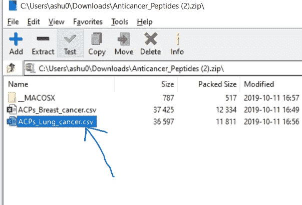

## 三。数据准备

打开 Spyder 或您选择的任何 python ide。

继续，从导入开始。在这种情况下，你需要熊猫:

```
import pandas as pd
```

接下来，您可以导入数据集:

```
df=pd.read_csv(r'C:\Users\ashu0\OneDrive\Documents\ACPs_Lung_cancer.csv')
```

现在，您可以在变量资源管理器中将其签出，以查看列的外观:

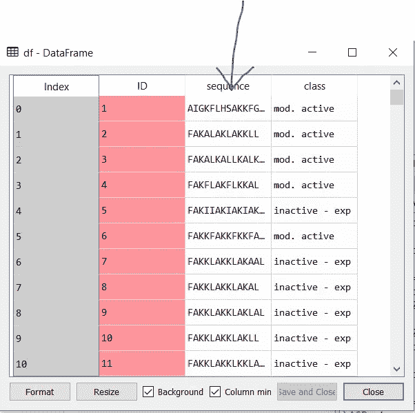

如果您不在 Spyder ide 中，也可以使用:

```
df.head()
```

这将为您提供要查看的前五行:

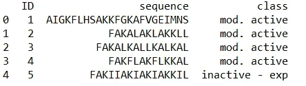

如你所见，我们在标有序列的一栏中有一个字母的氨基酸序列。

目标是预测类别。我们要做的是继续下去，分割序列。为了做到这一点，让我们快速浏览一下 python 中的另一个例子。

想象一下，一个程序以变量名开始，在我的例子中，我将使用我的名字:

```
name = 'Ashutosh'
```

名称是一个字符串变量，内容是单词 Ashutosh。我想要的是一个将单词 Ashutosh 中的每个字符分离出来的列表。为了做到这一点，我们可以像这样简单地使用 python 中的 list 函数:

```
name2=list(name)
print(name2)
```

在这种情况下，输出将是包含每个字符的列表，如下所示:

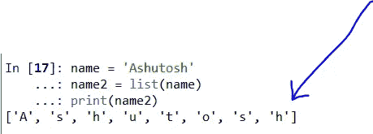

好的，现在在我们的熊猫数据帧中，我们必须将它应用到每一行。幸运的是，熊猫为此提供了一个名为 apply 的功能。让我们使用它:

```
df2=df['sequence'].apply(lambda x: pd.Series(list(x)))
```

这将创建一个熊猫数据框架，但只是在肽序列栏之外。

下面是我们键入 df2.head()后的样子。

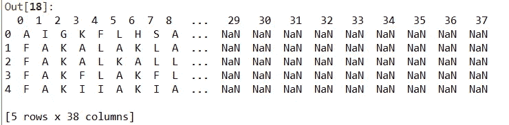

如你所见，我们没有班级专栏。让我们继续插入 class 列，然后像这样做一个 df2.head:

```
df2['class']=df['class']
df2.head()
```

这一次，您的输出将如下所示:

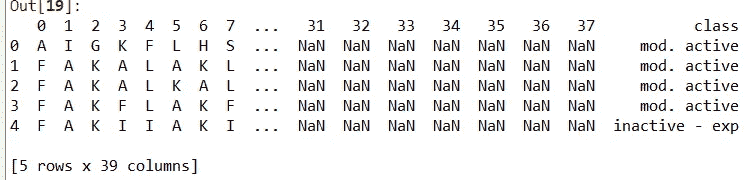

39 列，最后一列是 class。

好了，我们已经完成了数据准备。现在还有最后一步。为了让 Weka 接收它，我们必须导出这个准备好的文件。确保包含 index=False 参数，因为除非重命名，否则索引无法正确导入 weka。此外，指数并不能起到预测阶层的作用。

```
df2.to_csv(r'C:\Users\ashu0\OneDrive\Documents\ACPs_Lung_cancer_datacleaned.csv',index=False)
```

现在，您将在该位置有一个干净的 csv 文件供 weka 提取。

## 四。Weka 实施

如果你没有 weka，你需要下载并安装它。只要在谷歌上快速搜索 Weka 下载，你就会看到来源。

安装 weka 后打开它:

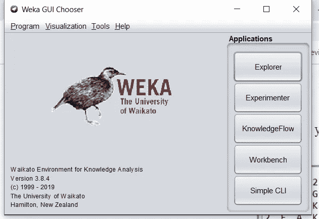

点击上面的“资源管理器”按钮，然后如下图所示，点击“打开文件”按钮:

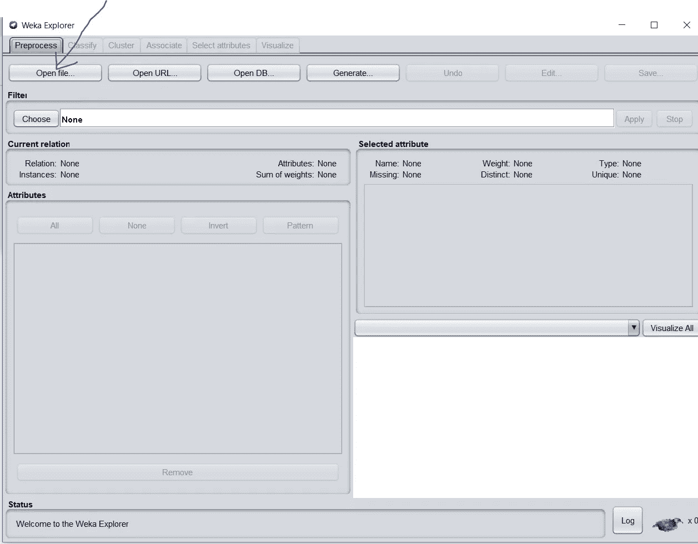

单击“打开文件”后，将会打开一个浏览窗口，浏览到我们刚刚创建的已清理 CSV 文件，然后打开它:


一旦文件进入，您将看到所有列。您还可以看到每一列的分布统计信息。以下是“类别”列的一个示例:

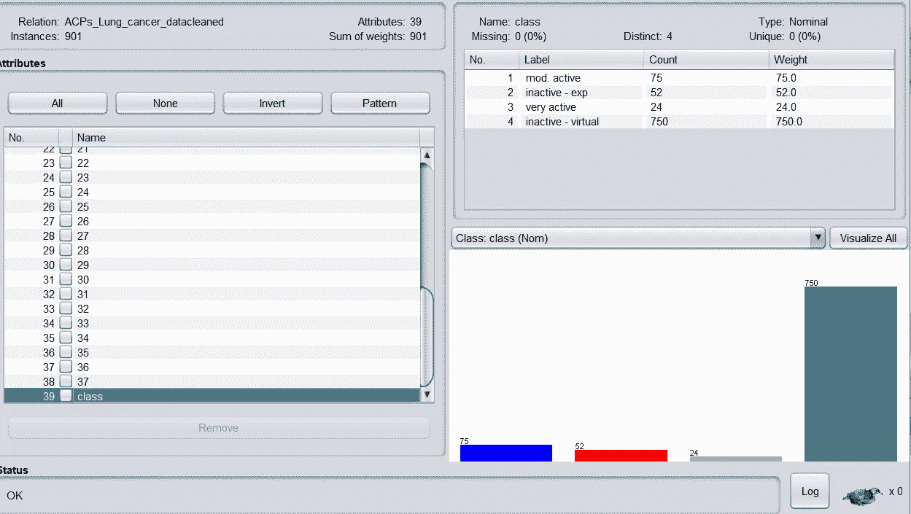

这个阶级分布告诉我们一些事情。请注意，901 个实例中有 750 个属于“非活动—虚拟”类。这里的数据在阶级分布上是不平衡的。

```
750/901 = 83.2%
```

这意味着，如果一个应用算法的预测能力在 83%左右，它除了简单的猜测之外什么也没做。对于被认为具有良好预测能力的算法，它必须通过超过数据中给定的类别分布来超越。

继续并点击顶部的分类按钮:

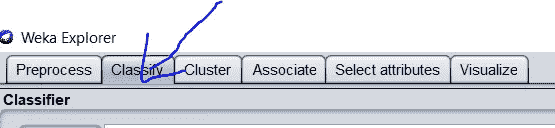

接下来，点击“选择”按钮:

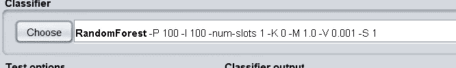

在树下面，选择 RandomForest 算法。

在您的测试选项中，选择百分比分割。66%用于培训，34%用于测试，这是一个合理的比例。这只是意味着该算法将在随机的 66%上训练自己，然后看看它的预测能力如何与剩余的测试数据一起工作。

另外，确保 start 按钮顶部的下拉菜单被设置为 class 变量。您在此下拉列表中选择的是算法将预测的内容，即您选择要分类的目标变量的位置。因为，在这种情况下，我们预测的变量被命名为“class ”,所以选择它。

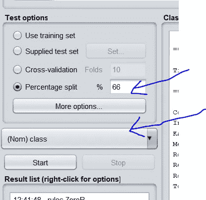

## 动词 （verb 的缩写）准确(性)

现在点击“开始”按钮。它将运行几秒钟，然后给出如下所示的输出:

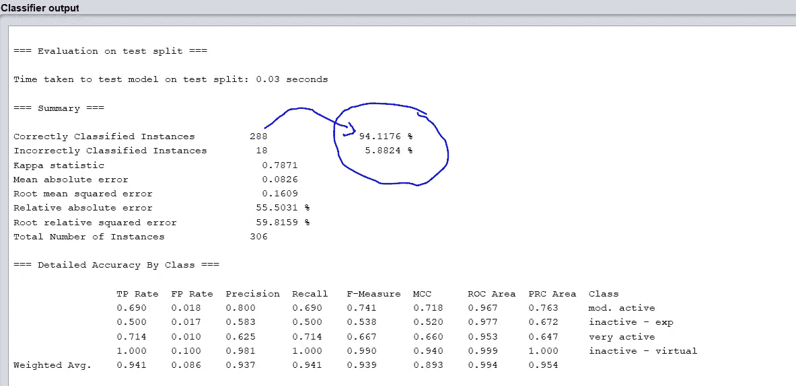

请注意，我们使用随机森林的准确率为 94.1176%，远远高于我们在前面的类分布中看到的将所有事物分类为不平衡类并获得大约 83%准确率的算法。与分布相比，这种高水平的准确性意味着随机森林与简单的猜测相比表现得非常好。

## 不及物动词混淆矩阵

这是 Weka 在同一个输出窗口中给出的混淆矩阵。这个矩阵告诉我们每个类什么是对的，什么是错的。它还告诉我们选择了哪个错误的类，以及有多少实例被选入了那个错误的类。

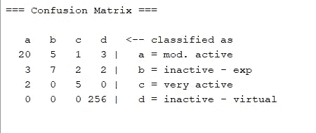

```
Accuracy by class: 
A --> 20 / (20+5+1+3)= 20/29 = 68.9%
B --> 7 / (3+7+2+2) = 7/14 = 50%
C --> 5 / (2+0+5+0) = 5/7 = 71.4%
D --> 256 / (0+0+0+256) = 256/256 = 100%
```

如您所见，预测非活动虚拟内存的准确度最高。这主要是因为原来的阶级分布向它倾斜。这在医学数据集中很常见。尽管如此，请注意，它能够以 68.9%的比率预测中度活跃，以 71.4%的比率预测非常活跃。

## 八。参考

1-https://archive.ics.uci.edu/ml/datasets/Anticancer+peptides

2- Grisoni，f .，Neuhaus，C.S .，Hishinuma，m .，Gabernet，g .，Hiss，J.A .，Kotera，m .和 Schneider，g .，2019。用集成人工神经网络从头设计抗癌肽。分子建模杂志，25(5)，112。[【网页链接】](https://link.springer.com/article/10.1007/s00894-019-4007-6)

谢谢你的阅读，希望你能关注我，看看我的其他作品。在下面张贴一些链接:

1.  [https://pub . toward sai . net/how-to-use-WEKA-to-predict-甲状腺疾病-e8571c9330d4？source = friends _ link&sk = b 979967 b 9 ced 2017723 c 98 b 82 ccaa2e](/how-to-use-weka-to-predict-thyroid-disease-e8571c9330d4?source=friends_link&sk=b979967b9ced2017723c98b82ccaaa2e)
2.  [https://medium . com/analytics-vid hya/breast-cancer-prediction-with-geometric-mean-class ification-with-probability-optimization-2e 2988 CB 8 BD 1？source = friends _ link&sk = 1636 DD 225 be 0 ea 8 ba 5701 e0e 431 fdf 1c](https://medium.com/analytics-vidhya/breast-cancer-prediction-with-geometric-mean-classification-with-probabilistic-optimization-2e2988cb8bd1?source=friends_link&sk=1636dd225be0ea8ba5701e0e431fdf1c)