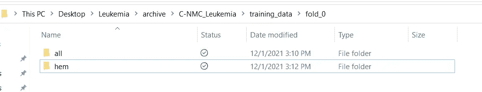
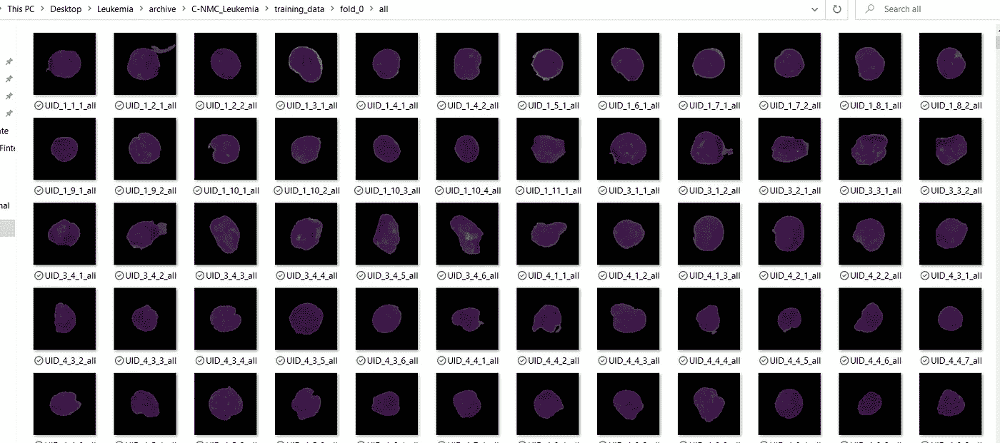
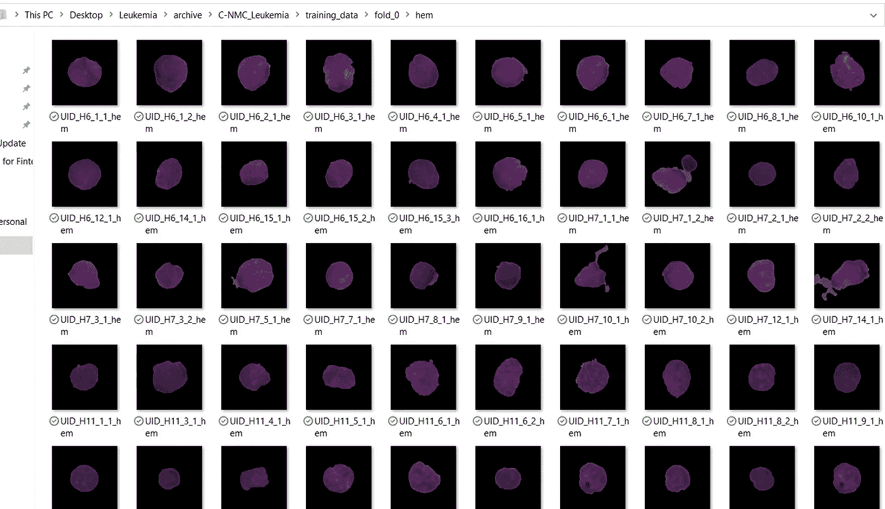
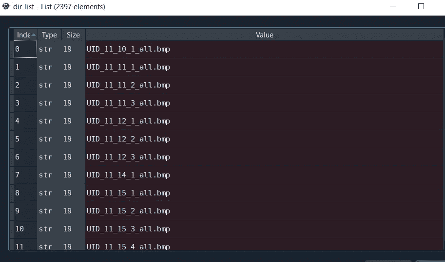
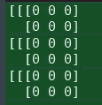
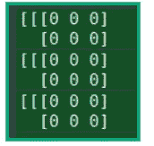
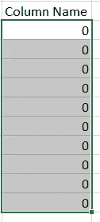
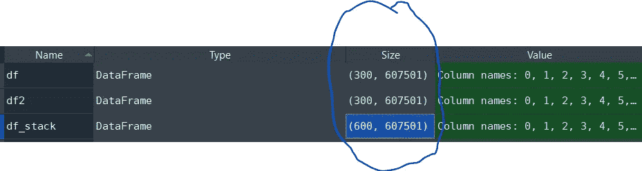
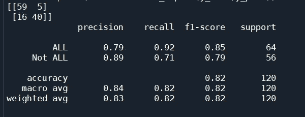
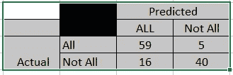

# 基于细胞图像的机器学习/生物统计学诊断急性淋巴细胞白血病

> 原文：<https://pub.towardsai.net/machine-learning-cdbf0047af06?source=collection_archive---------0----------------------->

## [机器学习](https://towardsai.net/p/category/machine-learning)


https://unsplash.com/photos/SJCalEw-1LM?utm_source=unsplash&T2 UTM _ medium = referral&UTM _ content = creditShareLink

如果你喜欢我的文章，请考虑使用下面的链接成为会员:

【https://medium.com/@ashu.malgaonkar/membership 

## **目录:**

一.关于该数据集

二。数据集引用

三。下载数据

四。将数据处理成 Python

动词 （verb 的缩写）机器学习

不及物动词分析指标

七。结论

## 一.关于该数据集

[急性淋巴细胞白血病](https://en.wikipedia.org/wiki/Acute_lymphoblastic_leukemia) (ALL)是最常见的儿童癌症类型，约占儿童癌症的 25%。

这些细胞是从显微图像中分割出来的，代表了真实世界中的图像，因为它们包含一些染色噪声和照明误差，尽管这些误差在采集过程中已经得到了很大程度的修正。

由于形态学上的相似性，在显微镜下从正常细胞中识别未成熟白血病母细胞的任务是具有挑战性的，因此由肿瘤专家对基本事实标签进行注释。

总共有来自 118 名患者的 15，135 幅图像，分为两个标记类别:

*   正常细胞；
*   白血病爆发。

## 二。数据集引用

该数据集可在以下位置找到:

[白血病分类| Kaggle](https://www.kaggle.com/andrewmvd/leukemia-classification)

## 数据引用

*   古普塔，a .，&古普塔，R. (2019)。ISBI 2019 所有挑战数据集[数据集]。癌症影像档案。[https://doi.org/10.7937/tcia.2019.dc64i46r](https://doi.org/10.7937/tcia.2019.dc64i46r)

## 出版物引文

*   Anubha Gupta、Rahul Duggal、Ritu Gupta、Lalit Kumar、Nisarg Thakkar 和 Devprakash Satpathy，“GCTI-SN:受几何学启发的显微医学图像的化学和组织不变性染色标准化”，正在审查中。
    Ritu Gupta、Pramit Mallick、Rahul Duggal、Anubha Gupta 和 Ojaswa Sharma，“显微图像中浆细胞的染色颜色标准化和分割作为开发多发性骨髓瘤计算机辅助自动化疾病诊断工具的前奏”，第 16 届国际骨髓瘤研讨会(IMW)，印度，2017 年 3 月。
*   Rahul Duggal、Anubha Gupta、Ritu Gupta、Manya Wadhwa 和 Chirag Ahuja，“使用深度信念网络在显微图像中进行重叠细胞核分割”，印度计算机视觉、图形和图像处理会议(ICVGIP)，印度，2016 年 12 月。
    Rahul Duggal、Anubha Gupta 和 Ritu Gupta，“使用人工神经网络分割重叠/接触的白细胞细胞核”，CME 血癌病理学系列，全印度医学科学研究所(AIIMS)，印度新德里，2016 年 7 月。
*   Rahul Duggal、Anubha Gupta、Ritu Gupta 和 Pramit Mallick，“SD 层:医学显微成像中 CNN 的染色去卷积层”，载于:Descoteaux M .、Maier-Hein L .、Franz A .、Jannin P .、Collins D .、Duchesne S .(编辑)医学图像计算和计算机辅助干预-MICCAI 2017 年，MICCAI 2017 年。计算机科学讲义，第三部分，LNCS 10435，第 435–443 页。斯普林格，查姆。https://doi.org/10.1007/978-3-319-66179-7_50。

## 三。下载数据

去这个链接下载资料:[白血病分类| Kaggle](https://www.kaggle.com/andrewmvd/leukemia-classification)

提取文件夹后，当您沿着包含图像的路径前进时，会看到两个文件夹:



“全部”文件夹包含带有癌症的图像:



“hem”文件夹包含非癌症图像:



## 四。将数据处理成 Python

为了处理数据，我们需要一些软件包。

我们将需要 skimage io 来读取图像并获取像素:

```
from skimage import io
```

然后我们需要一个包来存储我们的数据。为此，我们可以使用像 pandas 这样的数据框包:

```
import pandas as pd
```

接下来，我们需要操作系统将我们指向我们的映像所在的目录:

```
import os
```

好了，现在我们有了自己的包，让我们为两个路径创建一个变量，一个用于“all”文件夹，另一个用于“hem”文件夹:

```
pathforall= r'C:\...Desktop\Leukemia\archive\C-NMC_Leukemia\training_data\fold_0\all'pathforhem= r'C:\...Desktop\Leukemia\archive\C-NMC_Leukemia\training_data\fold_0\hem'
```

现在，我们需要将 Python 指向这些文件夹(上面的路径变量),并将其中的文件名存储为一个列表。这两行为您提供了两个列表，一个用于“所有”图像，另一个用于“边缘”图像:

```
dir_list=os.listdir(pathforall)
dir_list2=os.listdir(pathforhem)
```

下面是 Spyder 编辑器的变量资源管理器中的一个例子，我用它来编写代码:



好了，现在是时候存储这些图像的数据了。让我给你看完整的代码，然后分解我是如何做到这一点的:

```
df = pd.DataFrame()for i in dir_list[:300]:
    img=io.imread(pathforall + "\\" + i)

    my_df = pd.DataFrame(img.flatten()).transpose()
    my_df['Class'] = 'ALL'
    my_df=my_df.head(n=1)
    df = df.append(my_df, ignore_index=True)
```

所以，让我们一步一步来看:

上述代码中的第一行创建了一个空数据框。这个名为 df 的数据框是我将存储“所有”数据的地方。

```
df = pd.DataFrame()
```

接下来，我将启动一个 for 循环，它指向“all”文件夹中的列表。记住我们的列表叫做 dir_list。我只为我的项目处理了图像的一个子集，因为所有 2500 张图像需要我花半个小时到一个小时来完成这个程序，我不想等那么久。这就是[:300]的含义，即列表将在此结束:

```
for i in dir_list[:300]:
```

现在在 for 循环中，我正在编写代码。这意味着代码将运行并将每个图像的数据存储到数据框中。让我们经历这一切。

下面一行是所有文本的路径，并在它后面添加一个斜杠，然后添加来自 for 循环的“I”。这个“I”是第一个图像的文件名，当循环第二次运行时是第二个图像的文件名，然后是第三个图像的文件名，依此类推，即“I”遍历“all”文件夹中图像的文件名:

```
img=io.imread(pathforall + "\\" + i)
```

IMG 是由图像的像素数据构成的 n 维数组。



但是，我们需要将它展平，使它变得像一个列表。为此，我们可以使用 img.flatten()。然后，我们需要将这些值存储为 Pandas 数据帧，以便我们可以在以后存储和操作它们。然而，当我们从我们的列表制作数据框时，它会将列表存储到一列中。这对我们没用。我们希望我们的列表水平存储在一行上，这样我们就可以将“all/cancer”类作为最后一列，然后使用机器学习算法对其进行分类。为了做到这一点，我们需要转置数据。让我首先解释这将做什么。

首先，数组看起来像这样:



用 img.flatten 展平后会是这样的:

{0,0,0,0…}

当将其转换为数据框时，将如下所示:



然而，我们需要第一行的第一个图像和第二行的第二个图像，依此类推。所以我们必须改变它。当您转置类似上面的内容时，它看起来像这样一行:


所有这些展平、转换成数据帧和转置都可以通过这段代码完成:

```
my_df = pd.DataFrame(img.flatten()).transpose()
```

接下来，我们希望刚刚创建的行有正确的标签。在这种情况下，我们循环通过癌细胞，因此我们的标签/类别将是“全部”:

```
my_df['Class'] = 'ALL'
```

现在让我们确保，我们只取我们生成的一行:

```
my_df=my_df.head(n=1)
```

现在，记住我们所做的一切都是 for 循环的一部分。因此，循环的最后一部分是将我们之前在循环外创建的空数据帧放入我们刚刚创建的行:

```
df = df.append(my_df, ignore_index=True)
```

现在，每次循环运行时，它都会遍历该行，并将该行放在底部。

现在，让我们通过在“哼哼”路径上重复来对“哼哼”数据做同样的事情:

```
df2 = pd.DataFrame()for i in dir_list2[:300]:
    img2=io.imread(pathforhem + "\\" + i)

    my_df2 = pd.DataFrame(img2.flatten()).transpose()
    my_df2['Class'] = 'Not ALL'
    my_df2=my_df2.head(n=1)
    df2 = df2.append(my_df2, ignore_index=True)
```

注意，这不是“全部”类。

> 好了，现在我们有两个不同的数据帧，每行都有图像像素数据。一个数据帧包含白血病细胞的像素数据，另一个包含非白血病细胞的像素数据。

现在，为了运行一个分类算法，我们首先需要使它成为一个数据集。我们可以通过使用 concat 命令来实现这一点。在 SQL 术语中，concat 命令本质上是一个“Union”。它将数据集堆叠在一起:

```
df_stack = pd.concat([df, df2])
```

当您运行 concat 命令时，如上所示，您会在变量资源管理器中注意到以下内容:



> 注意尺寸。df 和 df2 的大小各为 300。当你把它们叠在一起，就变成了 600。这是检查工作的快捷方式。

## 动词 （verb 的缩写）机器学习

我在这里使用的算法是支持向量机:

支持向量机第 1 部分(共 3 部分):主要观点！！！——YouTube

[支持向量机第二部分:多项式核(第二部分，共三部分)——YouTube](https://www.youtube.com/watch?v=Toet3EiSFcM)

[支持向量机第三部分:径向基核(第三部分，共三部分)——YouTube](https://www.youtube.com/watch?v=Qc5IyLW_hns&t=2s)

让我们从将数据集分解为 X 和 y 开始。X 将是用于预测目标变量的要素或列，即存储为 y 的类。

```
#Store class as y and rest of data as x
X = df_stack.drop('Class', axis=1)
y = df_stack['Class']
```

让我们将数据集分为测试和训练两部分。训练集将占 80%，测试集占 20%。这意味着该算法将使用 80%的数据来训练和建立规则，然后使用这些数据来预测其余 20%的类别。

```
#split data
from sklearn.model_selection import train_test_split
X_train, X_test, y_train, y_test = train_test_split(X, y, test_size = 0.20)
```

现在让我们实现我们的支持向量机:

```
from sklearn.svm import SVC
```

我们要选择的内核是:

```
svclassifier = SVC(kernel='rbf')
```

当数据中存在重叠时，这种内核工作得最好，在图像处理等情况下，也存在重叠。您可以在这里了解关于内核的更多信息:

[支持向量机第三部分:径向(RBF)核(第三部分，共三部分)——YouTube](https://www.youtube.com/watch?v=Qc5IyLW_hns&t=2s)

```
svclassifier.fit(X_train, y_train)
```

现在让我们做一些预测:

```
#make predictionsy_pred = svclassifier.predict(X_test)
```

现在让我们来看看预测的指标:

```
#metricsfrom sklearn.metrics import classification_report, confusion_matrix
print(confusion_matrix(y_test,y_pred))
print(classification_report(y_test,y_pred))
```

指标的打印结果如下所示:



## 不及物动词分析指标

看混淆矩阵:

[[59 5]

[16 40]]

在 sklearn 中，预测标签在顶部，实际标签在侧面:



这意味着在测试数据中，该算法具有以下准确度:

```
Accuracy --> (59+40)/(59+5+16+40) = 82.5%
```

**灵敏度=真阳性数/(真阳性数+假阴性数)**

```
Sensitivity --> 59 / (59 + 5) = 59/64 = 92%
```

**特异性=真阴性数/(真阴性数+假阳性数)**

```
Specificity --> 40 / (16+40) = 40/56 = 71%
```

****七。结论:****

**当患者患有 ALL 时，该测试将非常有助于诊断 ALL，即其具有 92% 的 ***良好灵敏度。然而，当这个人没有全部时，它有时可能给出一个假阳性。*****

**其他文章:**

**[1 —如何使用 Python 检测图像差异|作者 Ashutosh Malgaonkar | 2021 年 11 月|面向人工智能](/how-to-detect-image-differences-with-python-9ea04859084c)**

**2 — [如何创建一个城市的邻近定位系统|作者 Ashutosh Malgaonkar |朝向 AI](/how-to-create-a-proximity-positioning-system-for-a-city-451ad19784d3)**