# 机器学习清单:成本函数和梯度下降

> 原文：<https://pub.towardsai.net/machine-learning-checklist-cost-function-and-gradient-descent-c3fabbd0e00b?source=collection_archive---------0----------------------->

## 线性回归及其 Python 实现

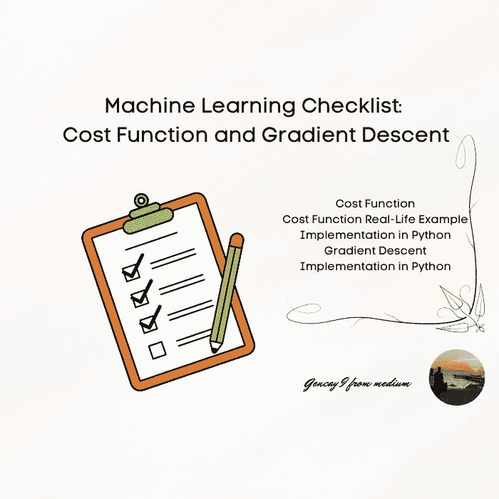

作者图片

# 介绍

你们都来到这里，因为你们对机器学习&人工智能着迷。这项技术已经成为太多行业的重点。有太多的课程和网页会给你很好的直觉和知识。我的目的是简单明了地向你解释。

```
**Content Table****·** [**Introduction**](#a137) **·** [**Cost Function**](#0476)  ∘ [Mean Squared Error](#4e0f)
  ∘ [Root Mean Squared Error](#ac49)
**·** [**Cost Function Real Life Example**](#0bb9) **·** [**Cost Function Implementation in Python**](#0964)  ∘ [Mean Square Error Python Implementation](#06e3)
  ∘ [Root Mean Square Error Python Implementation](#2147)
**·** [**Gradient Descent**](#e6b6)  ∘ [Gradient of W](#f494)
  ∘ [Gradient of b](#5480)
**·** [**Gradient Descent Implementation in Python**](#33d7)  ∘ [Cost Function](#3d06)
  ∘ [Gradient Function](#4bbf)
  ∘ [Gradient Descent Function](#4744)
·[**Conclusion**](#322c)
```

在我之前的文章中，我已经给出了成本函数和梯度下降的定义，以及其他一些必要的定义。

如果你想简单看看机器学习的其他定义；

[](/machine-learning-a-z-briefly-explained-4ff86bd81e3a) [## 机器学习 A-Z 简要说明

### 在这篇文章中，我试着向你简单解释一下机器学习 A-Z。

pub.towardsai.net](/machine-learning-a-z-briefly-explained-4ff86bd81e3a) 

现在，在这篇文章中，以及我几乎所有的文章中，我试图用以下元素向你解释这个话题。

*   **数学(公式)**
*   **代码(Python )**
*   **视觉(图形/表格)**
*   **现实生活中的例子**

现在，我将向你们解释线性回归中的梯度下降和成本函数。

顺便说一下，我有一篇文章，解释了线性回归的术语，如果你想简单了解回归，这是我的文章；

[](/regression-a-z-briefly-explained-618e5d5c89f8) [## 回归 A-Z 简要说明

### 快速和提醒的备忘单，用于刷新

pub.towardsai.net](/regression-a-z-briefly-explained-618e5d5c89f8) 

现在让我们深入成本函数

[参考](https://media.giphy.com/media/2cehTmp8rASyunE10R/giphy.gif)

# 价值函数

它计算原始值和从模型生成的预测值之间的度量。根据您的选择、您的经理的选择或项目的必要性，成本函数可能会有所不同。

## 均方误差

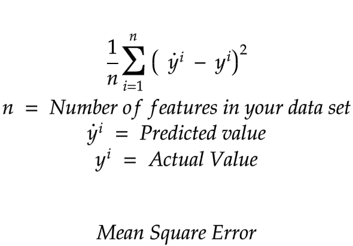

作者图片

## 均方根误差

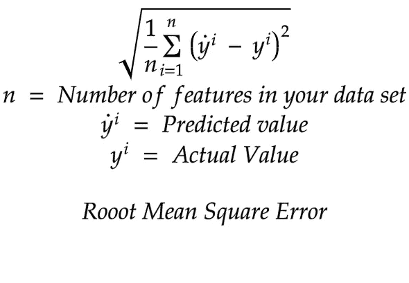

作者图片

# 成本函数现实生活的例子

想象一下，你有一个关于房价的数据集。

你建立了模型，然后做了预测。

该房屋的实际价格为:***【155.000】美元***

但是你预测 ***$165.000*** 。

假设您的数据集包含 2 行。

第二个价格应该是*145.000 美元*

*但是你预测***15 万美元。****

*成本函数的计算很简单。*

*把实际价格和预测价格做个减法就行了，平方，对所有数据点都做这个动作。在我们的例子中有两个计算。*

*然后将数据集除以数据点的数量，也是 2。就这么简单。*

*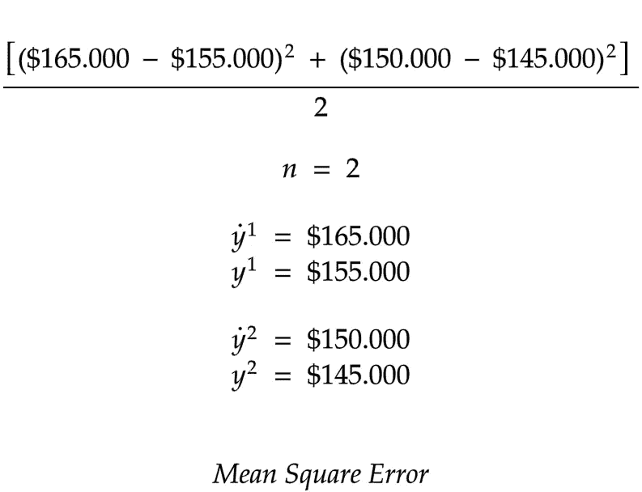*

*作者图片*

# *成本函数在 Python 中的实现*

*现在让我们定义我们的参数。*

*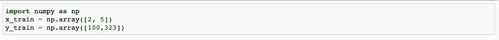*

*作者图片*

*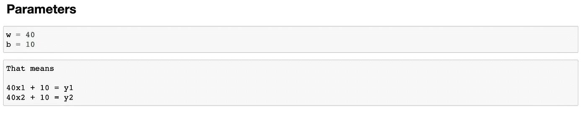*

*作者图片*

*现在，是时候计算我们的 y_pred 了。*

*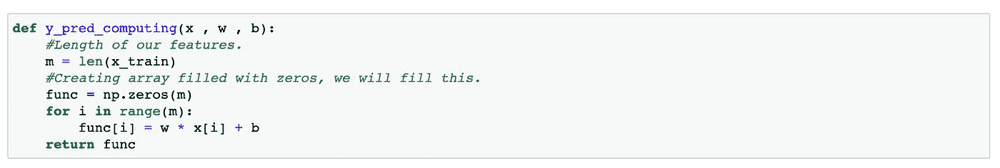*

*作者图片*

*正如代码片段中所解释的那样，首先，我们将定义我们的长度，并且我们将实现我们的线性回归。*

*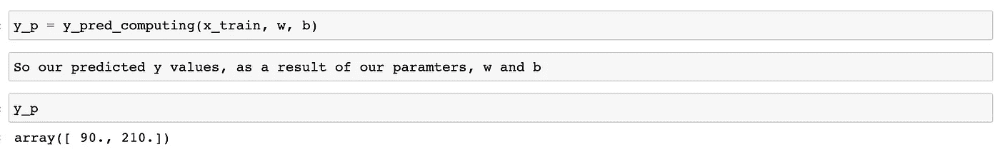*

*作者图片*

*现在让我们看看我们的两个 y 值*

*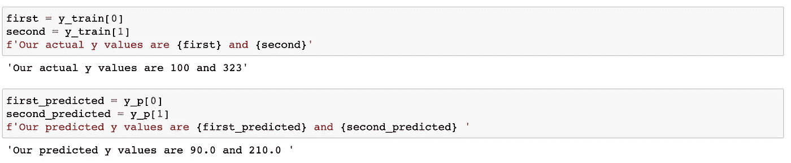*

*作者图片*

*现在是计算均方差的时候了。*

## *均方差 Python 实现*

*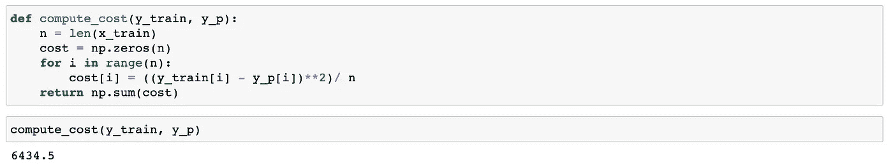*

*作者图片*

*实际上，你也可以通过使用 [scikit-learn](https://scikit-learn.org/stable/modules/generated/sklearn.metrics.mean_squared_error.html) 很容易地计算出来。*

*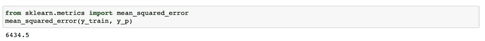*

*作者图片*

## *均方根误差 Python 实现*

*实际上，我们可以很容易地计算出均方差的根，这是我们之前计算过的。*

*然而，从开始到结束学习实现会磨砺我们的机器学习技能。*

*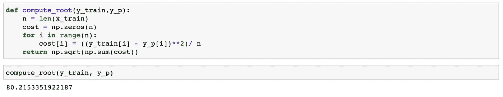*

*作者图片*

*通过使用 sci-kit learn，所有这些实现都将变得更加容易。然而，知道如何做是好的。*

*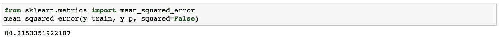*

*作者图片*

# *梯度下降*

*所以，我们的重点是最小化成本函数，因为我们都想做一个更接近实际值的预测，对吗？*

*一种方法是应用梯度下降算法。*

*梯度下降算法迭代地改变我们的参数，以最小化我们的成本函数。这个函数通过计算偏导数来完成这个动作。*

*因为我们的线性回归公式*

*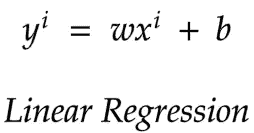*

*作者图片*

## *W 的梯度*

*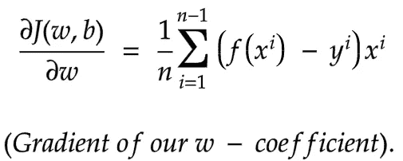*

*作者图片*

## *b 的梯度*

*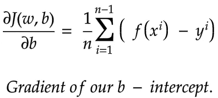*

*作者图片*

*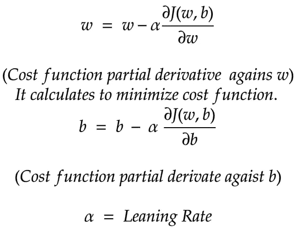*

*作者图片*

*首先，我们将找到梯度，我们将使用它来更新我们的参数。*

*我们的基本目标是最小化成本函数。*

*学习率是我们的梯度函数移动的步长。*

# *Python 中的梯度下降实现*

*为了计算梯度下降，我们需要三个函数。*

## *价值函数*

*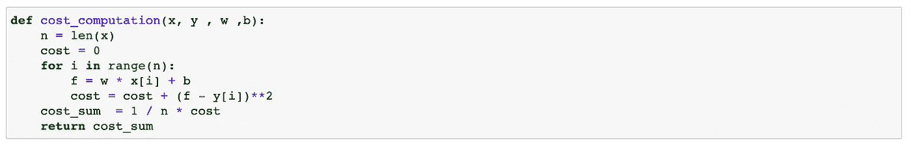*

*作者图片*

## *梯度函数*

*   *首先，定义我们的线性回归函数。*
*   *然后根据我们的公式定义我们的偏导数。*

*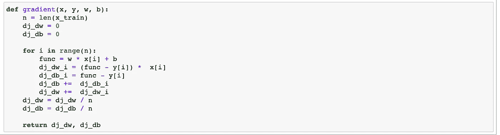*

*作者图片*

## *梯度下降函数*

*   *首先，我们将使用梯度函数计算梯度。*
*   *然后我们会相应地更新我们的参数。*
*   *之后，是时候计算我们的成本了。*

*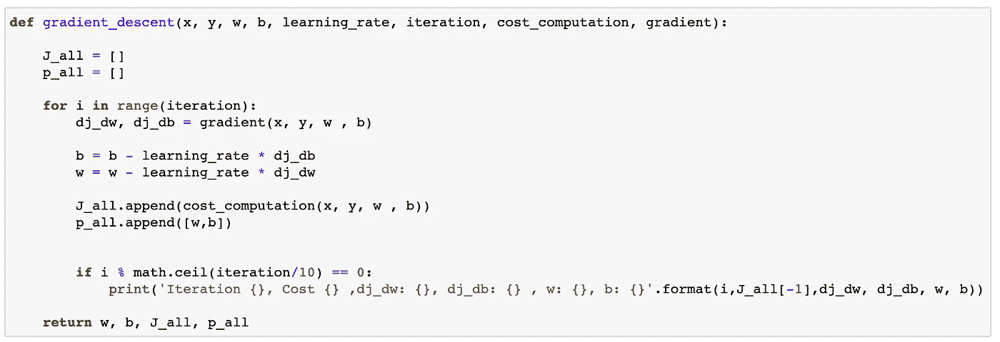*

*作者图片*

*当我们进入时我们的输出*

*迭代= 8000 次*

*学习率= 0.01*

*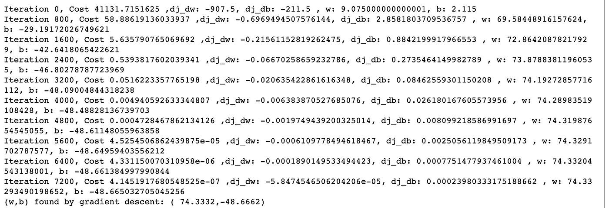*

*作者图片*

*现在在 sci-kit learn 中，你可以使用下面的方法。*

*另一方面，不要忘记重塑你的 x_train。*

*为什么？*

*因为你的 x_train 形状现在是那样的；*

*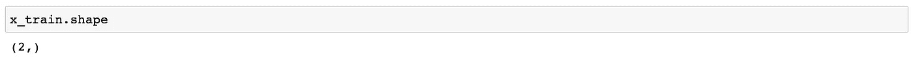*

*作者图片*

*但是你的 x_train.shape 应该[是](https://scikit-learn.org/stable/modules/generated/sklearn.linear_model.SGDRegressor.html)；*

> ***X*{阵列状，稀疏矩阵}，形状(n _ 样本，n _ 特征)****

*实现这一点的一种方法是:*

```
*n_samples = x.train.shape[0]*
```

**

*作者图片*

**符号**

**b =截距 _**

**W = coef_**

# *结论*

*从我的角度来看，学习机器学习数学和统计方面将是数据科学或任何与机器学习相关的职位必不可少的。然而，有许多数据科学家和机器学习工程师存在，他们并不完全了解机器学习的数学和统计方面，另一方面，他们擅长并成功地建立良好的机器学习模型。所以你不需要知道机器学习的每一个方面，但是我为自己选择了这种方式，我真的很高兴在我学习的时候能写出这样的系列文章。*

*现在，当然，我也将写另一篇关于这两个术语在分类中的用法的文章。就像我在简单解释分类时做的一样。*

*[](https://medium.com/mlearning-ai/classification-a-z-briefly-explained-25ca811ab4e4) [## 分类 A-Z 简要说明

### 人工智能大三大四学生提醒备忘单

medium.com](https://medium.com/mlearning-ai/classification-a-z-briefly-explained-25ca811ab4e4) 

非常感谢你对我之前文章的反应。

这真的激励我继续写作。

现在我花了更多的时间写了一篇文章，将向您解释机器学习、概念及其在 Python 中的实现。

当然，有太多关于机器学习的概念等着我为你写，但现在我也开始写关于深度学习的文章，这些文章也将很快为你准备好。

现在，如果你想继续阅读关于我的文章，并且你不是媒体的成员，这是我的推荐链接；

[](https://medium.com/@geencay/membership) [## 通过我的推荐链接加入 Medium-gen cay I。

### 阅读 Gencay I 的每一个故事(以及媒体上成千上万的其他作家)。您的会员费直接支持…

medium.com](https://medium.com/@geencay/membership) 

如果你想在我发表文章和一些免费的小抄和电子书后被关注，这里有链接；

下次见。

> “机器学习是人类需要做出的最后一项发明。”尼克·博斯特罗姆*