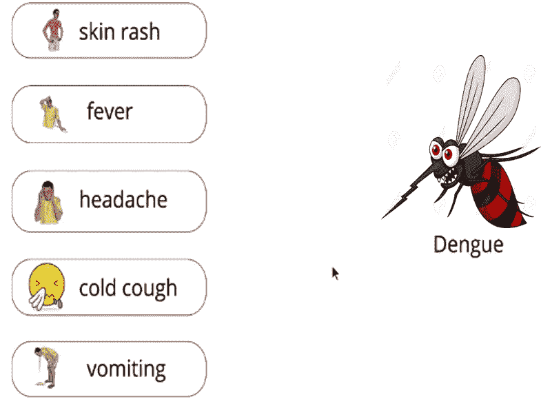
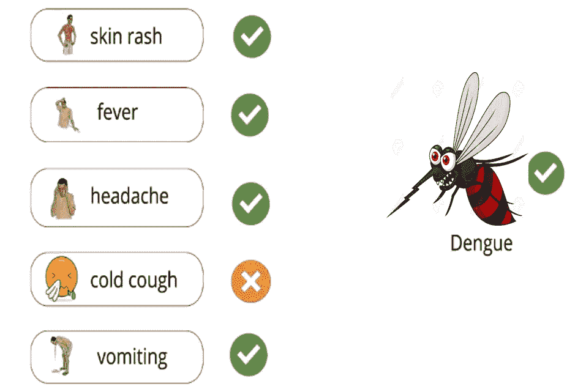
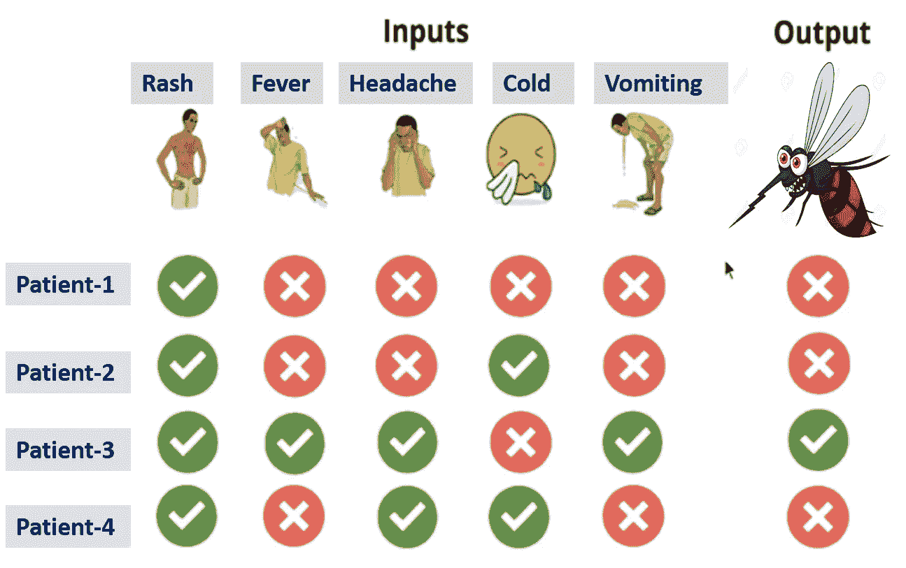
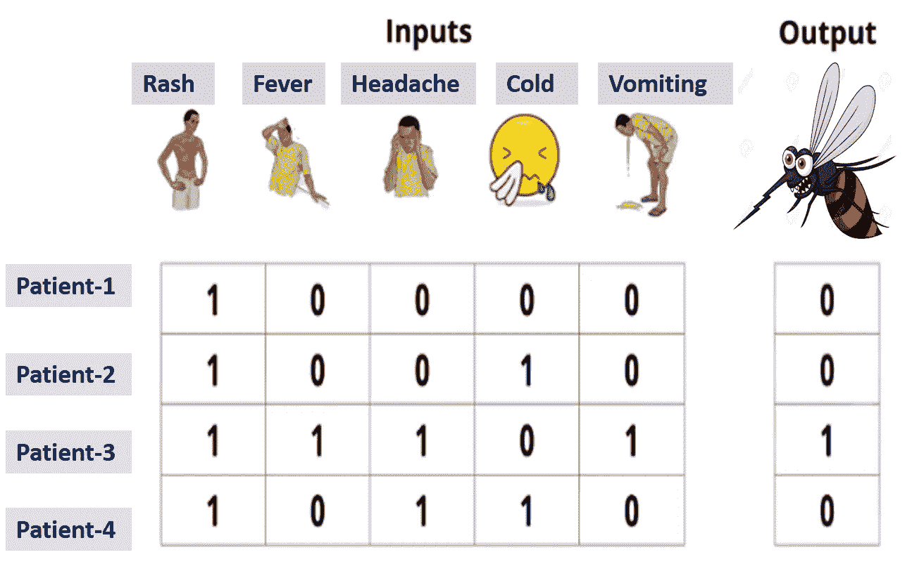
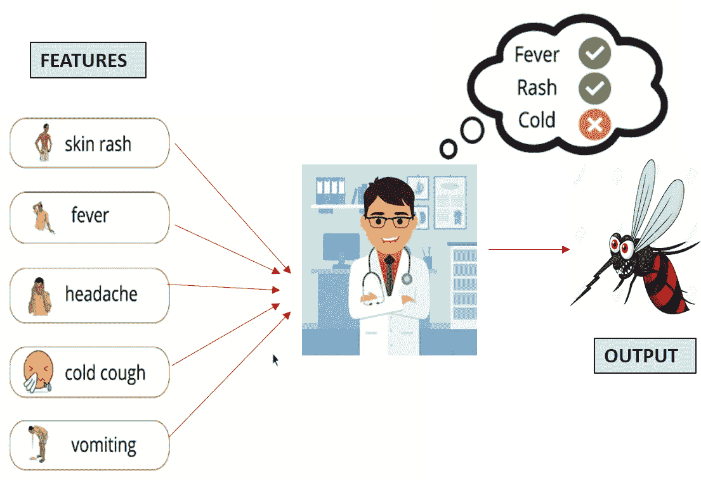
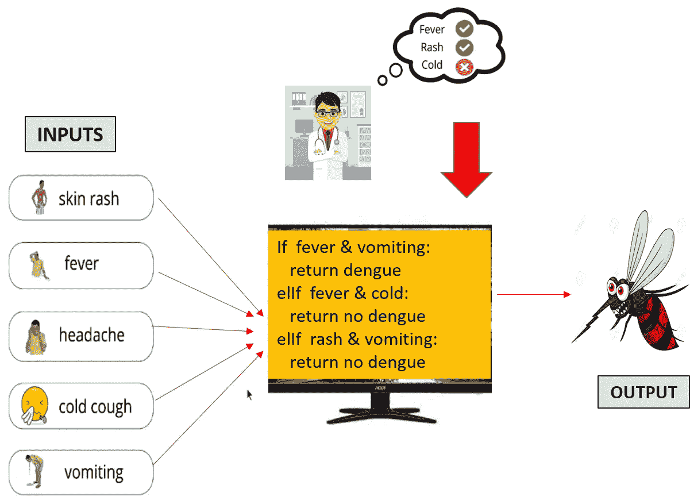
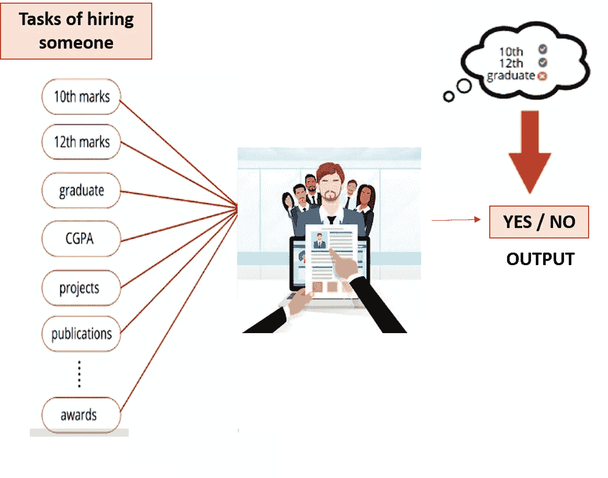
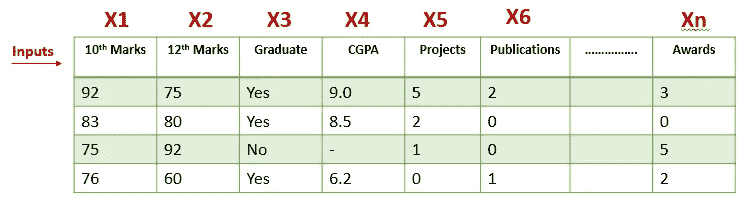

# 机器学习正在征服显式编程

> 原文：<https://pub.towardsai.net/machine-learning-conquering-explicit-programming-24f7e1db74cb?source=collection_archive---------4----------------------->

## [机器学习](https://towardsai.net/p/category/machine-learning)，[观点](https://towardsai.net/p/category/opinion)

## 机器比人类强吗？

照片由[卢卡斯](https://unsplash.com/@hauntedeyes?utm_source=medium&utm_medium=referral)在 [Unsplash](https://unsplash.com?utm_source=medium&utm_medium=referral) 上拍摄

在我们继续这篇文章之前，让我们先了解什么是二元分类。让我们通过一个简单的例子来理解这一点。你在家，现在是午饭时间，你妈妈过来问你是否饿了，想吃午饭，你的回答要么是“是”，要么是“不是”。你只有两个选择可以回答，即二进制选项。让我们再举一个例子，一个学生刚刚收到他 12 年级的成绩，结果将是“通过”或“不及格”。这两个例子属于二元分类，因为它们有两个选项。现在让我们看看专家系统或基于规则的系统是如何用于二进制分类的。

## 二元分类专家系统；

机器的任务是检查给机器的图像是否包含文本？

为了理解这一点，让我们看看人类是如何做决定的？

**考虑健康领域:**假设一名医生正在检查患者，他需要检查患者是否患有登革热？

医生会查看几个因素，如皮疹、发烧、头痛、感冒咳嗽、呕吐，并决定此人是否患有登革热。

**医生查找的因素-作者图片**

医生检查了一名有所示症状的患者，没有发现登革热。

**无登革热患者的症状-作者提供的图像**

医生随后检查了另一名患者，发现大多数症状都存在，足以让医生宣布该患者患有登革热。

**登革热患者的症状——图片由作者提供**

所以现在的问题是，医生是如何做出所有这些决定的？？

这个的答案是*史料*。这位医生已经遇到了几个病人，根据他的经验，他现在正在决定一个病人是否患有登革热。

下图包含四名患者的历史数据。

**患者历史记录-作者图片**

由于机器只理解数字，所以让我们将“叉”视为“0”，将“勾”视为“1”，因此历史数据将如下所示:

**用于机器理解的数字形式的历史数据-作者图片**

那么医生决策的语义是什么呢？

2 在那里起作用的东西:**特色**和**规则**。

> **特征**是我们正在接受的输入或症状——皮疹、发烧、头痛、感冒咳嗽和呕吐。
> 
> **规则**是医生头脑中正在进行的症状排列，决定是否存在登革热，即假设如果 2 个或更多症状呈阳性，或者 3 个或更多症状呈阳性，则此人患有登革热。

**功能和规则-作者图片**

现在我们想把这些规则以程序的形式外包给机器，这样机器就可以通过接受一些输入来执行程序，并给我们输出。我们将编写一个 if-else 条件，基于这些条件，程序将给出输出。

**作者通过程序镜像将规则外包给机器**

## 专家系统的局限性:

让我们来看一个例子:假设你有一家名为 **Data Science Arena** 的公司，你的公司要招聘一名员工。

因此，招聘人员时，招聘经理会查看各种参数，如第 10 分、第 12 分，如果他/她是毕业生，CGPA 是多少，所有项目都完成了什么，以及其他一些参数。招聘经理会在脑海中对任务进行不同的排列，然后决定是选择还是拒绝一个候选人。

**招聘场景-作者图片**

但如果招聘任务相对较大，那么任何人都很难对任务进行排列，公司将准备一个程序输入机器，让它进行处理并给出输出。

> 由此而来的是**第一个限制**——如果特性(这里的任务)的数量更多，那么就不可能很容易地提出不同的排列，因此很难很容易地提出一个 if-else 程序。

此外，还会有大量已雇佣员工和已离职员工的历史数据。因此，从大量的历史数据中寻找不同的场景，对于一个人来说，用这些数据编写一个程序并不容易。

数据显示如下:

**4 名员工的历史数据-作者图片**

从数据中可以看出，形成排列的规则过于复杂。

> 这样就出现了第二个限制——即使你想出了规则，但是不可能记住所有的规则，因为规则太复杂了。

有时规则是不可表达的，例如，假设招聘经理基于一个人的诚实雇佣了他。那么我们该如何将此表述为一条规则呢？

> 因为诚实不能用任何数量的形式来表达，因此成为第三个限制。

因此，为了解决上述限制，我们使用机器学习。它接受输入并形成一个函数 f(x1，x2，… xn)，该函数包括我们所有的排列，并基于所提供的输入，给出我们的输出。基于输入，所形成的函数可以是线性的或任意次的。

> 感谢阅读。希望这篇博客给你一些关于机器学习如何征服显式编程的见解。😃