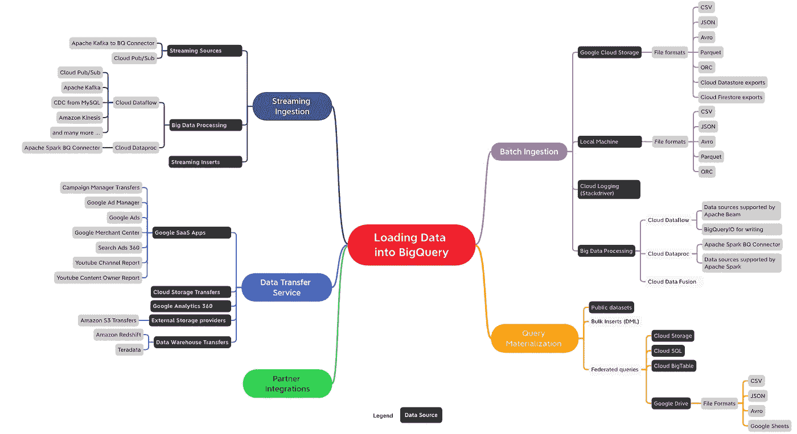

# 机器学习数据准备和处理

> 原文：<https://pub.towardsai.net/machine-learning-data-preparation-and-processing-27b63dc73133?source=collection_archive---------2----------------------->

## [云计算](https://towardsai.net/p/category/cloud-computing)

## 本文将重点介绍 GCP 专业机器学习工程师认证的[第三部分:数据准备和处理](https://cloud.google.com/certification/guides/machine-learning-engineer)。

[GCP:将数据加载到大查询中](https://cloud.google.com/blog/topics/developers-practitioners/bigquery-explained-data-ingestion)

如果你打算参加认证，这将是一个很好的起点。如果你没有，这将帮助你开发在快速发展的机器学习生态系统中取得成功所需的基本知识。

**这不是认证学习指南。**

本文的目的是对复杂的想法提供一个简单的解释，并给出一个广泛的主题观点。大纲模仿了 [GCP 专业机器学习工程师认证](https://cloud.google.com/certification/guides/machine-learning-engineer)指南。

我嵌入了有用阅读材料的链接，如果你愿意的话，可以深入研究一下。

# 数据摄取。

> 请记住，处理数据的目的是做出决策。

在考虑到数据的 ***多样性、速度&准确性*** 以及 ***它可以采取的各种路径*** 的同时建立联系，是做出明智决策所必需的。

## 多样化

*   逗号分隔值(CSV)、可扩展标记语言(XML)和 Javascript 对象表示法(JSON)文件是数据交换中常见的结构化数据格式。
*   随着社交媒体的快速增长，视频、文本和图像等非结构化数据的处理应该成为您设计的一部分。
*   数据的行和列存储是数据结构的另一个方面，您必须在数据摄取过程中加以考虑。
*   对 Hadoop 分布式文件系统(HDFS)的简要概述和理解将有助于培养对大数据和支持大规模处理的底层架构的理解。

 [## Apache Hadoop 小结:大数据问题的解决方案和来自 Google 的提示

### 欢迎学习大数据和 Hadoop 简介，我们将在这里讨论 Apache Hadoop 以及如此大的问题…

towardsdatascience.com](https://towardsdatascience.com/a-brief-summary-of-apache-hadoop-a-solution-of-big-data-problem-and-hint-comes-from-google-95fd63b83623) 

## 速度

*   传统和常见用例中的实时数据来自 OLTP 应用程序，这些应用程序涵盖订单处理、问题解决、会计、人力资源、工资单等业务案例。
*   社交互动和非结构化信息交换导致数据以不同的速度从各个方向涌入。
*   随着物联网设备在制造业、农业、汽车、电力使用、风力涡轮机、钻井等行业的采用。，实时数据的流动速度比传统应用程序快得多，因此需要精心的容错设计。

 [## 物联网大数据和物联网分析| OmniSci

### 物联网和大数据的融合为所有企业带来了巨大的新商业价值和机遇…

www.omnisci.com](https://www.omnisci.com/learn/vast-world-of-iot) 

## 诚实

*   建立决策解决方案的最大障碍是信任。
*   可靠的数据源、血统和质量，包括需要时的可验证性，是必须具备的。

 [## 数据真实性的 12 个例子

### 数据准确性是指数据准确、精确和可信的程度。数据通常被认为是确定的…

simplicable.com](https://simplicable.com/new/data-veracity) 

# 数据探索

> 关键的部分不是了解统计数据和可视化数据，而是解释数据以做出可操作的决策，但是你需要了解基础知识。

*   **可视化**:项目开始时的探索性数据分析(EDA)将有助于识别弱点。ML 解决方案涉及大规模的数据，因此不可能简单地读取数据，因此以图形方式将其可视化可以更直观地发现模式、行为和违反规范的情况。(关于[的好例子很有情节](https://plotly.com/python/))
*   **概率&统计基础:**你必须熟悉概率和基本统计概念，如均值、中位数、众数&标准差，包括其应用。(好读:[机器学习概率统计](https://towardsdatascience.com/machine-learning-probability-statistics-f830f8c09326))
*   **数据质量和可行性评估:**质量始于开始，而非结束。如果数据质量很差或不一致，无论您的整个解决方案多么复杂，都无法建立成功所需的信任度。

# 设计数据管道。

*   **批量处理和流式数据管道:**批量处理数据需要与处理流式数据不同的策略。对故障和修正的容忍度将决定工具的选择。
*   **数据隐私和合规:**应遵守数据隐私法，从个人的隐私权(如个人身份信息)( PII)到更广泛的合规性(如欧盟的一般数据保护法规(GDPR))。
*   **监控/更改已部署的管道:**在设计数据管道时，我们必须牢记业务活动的业务连续性和不断变化的性质。如果您有一个日志方法来监控管道的稳定性，那将是最好的。为了满足不断变化的需求，部署的管道必须具有灵活性和延展性。

# 构建数据管道。

*   **数据验证:**传入的数据必须被净化，以保持一致的高质量。
*   **处理缺失数据:**这是数据科学领域的一个经典问题。你采取的方法纯粹是上下文相关的，没有正确或错误的答案。然而，有些选项可能比其他选项更好。例如，在一组 x 行的样本中，如果 80%的行缺少出生日期(DOB ),那么为缺少的行假定任何值都没有意义。如果只有 20%的 DOB 缺失，那么可以基于数据集的某些共性来计算合理的缺失值。
*   **处理异常值:**一个有偏差的数据集会打乱你的分析。这在技术上是正确的，但实际上毫无用处。考虑一下:在一组 100 名员工中，如果其中 99 人的工资在 7.5 万美元到 10 万美元之间，平均值为 9 万美元。1 个员工的工资是 1.0 万美元，猜猜平均水平会怎么样？它倾向于离群值。在这种情况下，您必须忽略离群值，才能进行任何有意义的分析。但是，您应该记下处理异常值所采用的策略。

# 特征工程。

通常情况下，首先应用[特征工程](https://docs.microsoft.com/en-us/azure/machine-learning/team-data-science-process/create-features)来生成额外的相关特征，然后进行特征选择，以消除不相关、冗余或高度相关的特征，这些特征在预测中不起任何有意义的作用。

*   **特征工程**是从原始数据中创建新特征的过程，以提高学习算法的预测能力。工程特征应该捕获在原始特征集中不容易发现的附加信息。例如，如果您有出生日期，您可以将数据分组到 Age_Buckets 中。
*   **特征选择**是选择关键特征子集以降低训练问题维度的过程。如果你有你的雇员的街道地址以及他们的经验和资格，如果我预测一个新雇员的工资，我会排除街道地址。
*   **数据泄露和增加:**数据泄露不应与数据泄露相混淆。ML 上的数据泄漏是指用于开发模型的训练数据和用于进行预测的实际数据之间的不匹配或细微差异。基本上，如果您的模型在训练阶段使用信息，而预测环境中没有类似的信息，则您的预测将不会准确。处理数据泄漏的一种方法是数据扩充。这是一种通过应用随机(但真实)变换来增加训练集多样性的技术，这种变换更接近预测环境。

 [## 数据科学中的特征工程-团队数据科学过程

### 在本文中，您将了解特征工程及其在增强机器学习中的数据方面的作用。向…学习

docs.microsoft.com](https://docs.microsoft.com/en-us/azure/machine-learning/team-data-science-process/create-features) 

# 摘要

对数据接收、探索、管道和功能工程的重要性有了广泛的了解后，您应该阅读《数据生命周期指南》,以了解可用于解决个别用例的各种 GCP 组件。

每个用例都是不同的。一刀切的方法是行不通的。因此，在开始构建解决方案之前，您必须非常熟悉您的问题领域。

> 请记住，处理数据的目的是做出决策。

 [## 数据生命周期|解决方案|谷歌云

### 本文介绍了 Google 云服务，您可以使用它来管理数据的整个生命周期，从最初的…

cloud.google.com](https://cloud.google.com/solutions/data-lifecycle-cloud-platform) 

## 参考

[1]数据科学中的特征工程(2020 年 5 月 14 日)[https://docs . Microsoft . com/en-us/azure/machine-learning/team-data-science-process/create-features](https://docs.microsoft.com/en-us/azure/machine-learning/team-data-science-process/create-features)

[2]https://plotly.com/python/

[3]贾韦德·纳比，机器学习—概率与统计(2019 年 1 月 7 日)[https://towardsdatascience . com/Machine-Learning-Probability-Statistics-f830 f8c 09326](https://towardsdatascience.com/machine-learning-probability-statistics-f830f8c09326)