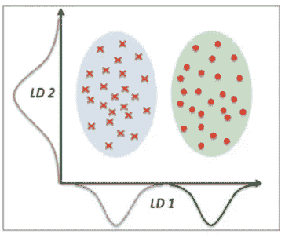

# 机器学习:通过线性判别分析进行降维

> 原文：<https://pub.towardsai.net/machine-learning-dimensionality-reduction-via-linear-discriminant-analysis-cc96b49d2757?source=collection_archive---------0----------------------->

## [机器学习](https://towardsai.net/p/category/machine-learning)

机器学习算法(如分类、聚类或回归)使用训练数据集来确定权重因子，这些权重因子可应用于未知数据以实现预测目的。在实现机器学习算法之前，有必要在训练数据集中仅选择相关特征。转换数据集以便只选择训练所需的相关特征的过程称为降维。降维非常重要，原因有三:

1.  **防止过度拟合**:拥有太多特征的高维数据集有时会导致过度拟合(模型捕捉真实和随机效果)。
2.  **简单性**:一个拥有太多特征的过于复杂的模型可能很难解释，尤其是当特征相互关联的时候。
3.  **计算效率**:在低维数据集上训练的模型在计算上是高效的(算法的执行需要较少的计算时间)。

因此，降维在数据预处理中起着至关重要的作用。

# 降维的实现

机器学习中有几种降维模型，如主成分分析(PCA)、线性判别分析(LDA)、逐步回归和正则化回归(如 LASSO)。我们在这里关注 PCA 和 LDA，它们被广泛用于分类问题。

PCA 和 LDA 是两种数据预处理线性变换技术，通常用于降维，以便选择可以在最终机器学习算法中使用的相关特征。PCA 是一种无监督算法，用于高维和相关数据中的特征提取。PCA 通过将特征转换为数据集中方差最大的正交分量轴来实现降维。**使用 iris 数据集的 PCA 实现可以在这里找到:**[https://github . com/bot 13956/principal _ component _ analysis _ iris _ dataset](https://github.com/bot13956/principal_component_analysis_iris_dataset)

LDA 的目标是找到优化类可分性和降维的特征子空间(见下图)。因此，LDA 是一种监督算法。在本文中，我们使用 iris 数据集来说明 LDA 的实现。关于 PCA 和 LDA 的深入描述可以在本书中找到:Sebastian Raschka 的 Python 机器学习，第 5 章。

**图 1: LDA 算法从旧的特征子空间转换到新的特征子空间，从而优化类别可分性并降低维数。图片改编自:《塞巴斯蒂安·拉什卡的 Python 机器学习》。**

**实现 LDA 的代码在这里找到:**[https://github . com/bot 13956/linear-discriminal-analysis-iris-dataset/blob/master/LDA _ iris dataset . ipynb](https://github.com/bot13956/linear-discriminant-analysis-iris-dataset/blob/master/LDA_irisdataset.ipynb)

使用 iris 数据集进行 LDA 计算的输出如下图 2 所示:

**图 LDA 子空间中虹膜类别的线性可分性。请注意，LD1 组件捕获了类的大部分可辨性。**

通过分析累积可辨性(**参见代码**:[https://github . com/bot 13956/linear-discriminant-analysis-iris-dataset/blob/master/LDA _ iris dataset . ipynb](https://github.com/bot13956/linear-discriminant-analysis-iris-dataset/blob/master/LDA_irisdataset.ipynb))，我们可以显示 LD1 和 LD2 分量捕获了 100%的总可辨性。因此，当我们在 LDA 子空间上执行分类(使用逻辑回归或支持向量机)时，我们可以在较低的二维 LDA 变换数据集上训练模型。由于原始虹膜数据集是四维的(4 个特征)，我们注意到 LDA 变换实现了类别可分性以及维数减少。

总之，为了说明的目的，我们已经展示了如何使用 iris 数据集实现 LDA 算法。在上一篇文章中，我们展示了如何使用 iris 数据集实现 PCA 算法。以下是两个链接:

**PCA 实施:**

[https://github . com/bot 13956/principal _ component _ analysis _ iris _ dataset](https://github.com/bot13956/principal_component_analysis_iris_dataset)

**LDA 实施:**

[https://github . com/bot 13956/linear-discriminant-analysis-iris-dataset](https://github.com/bot13956/linear-discriminant-analysis-iris-dataset)

感谢阅读。