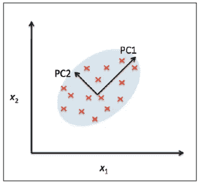
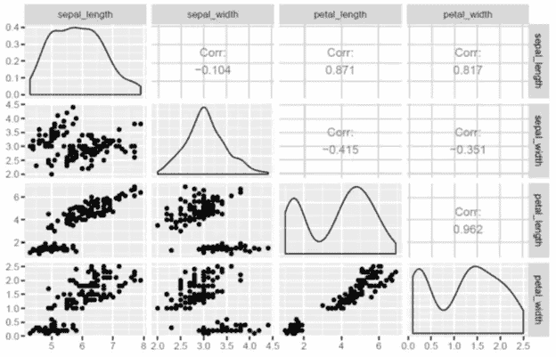
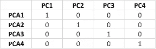

# 机器学习:通过主成分分析降维

> 原文：<https://pub.towardsai.net/machine-learning-dimensionality-reduction-via-principal-component-analysis-1bdc77462831?source=collection_archive---------1----------------------->

## 面向 AI 的降维|

在机器学习中，包含特征(预测器)和离散类别标签的数据集(用于逻辑回归等分类问题)；或特征和连续结果(对于线性回归问题),用于构建预测模型，该模型可以对看不见的数据进行预测。模型的预测能力在很大程度上取决于训练数据集的质量和大小。

一般来说，数据集越大越好，但是，在数据集的大小和训练所需的计算时间之间总会有一个折衷。事实证明，在一些非常大的数据集中，特征中可能存在大量冗余，或者数据集中可能存在大量不重要的特征，因此降维技术可以用于仅选择训练所需的有限数量的相关特征。

主成分分析(PCA)是一种用于特征提取的统计方法。PCA 用于高维和相关数据。PCA 的基本思想是将原始的特征空间转换到主成分空间，如下所示:

**图 1: PCA 算法从旧的特征空间转换到新的特征空间，以去除特征相关性。图片改编自:《塞巴斯蒂安·拉什卡的 Python 机器学习》**

PCA 变换实现了以下目标:

**a)** 通过只关注占数据集中方差大部分的成分，减少最终模型中使用的特征数量。

**b)** 去除特征之间的相关性。

## PCA 是如何工作的？

为了说明 PCA 是如何工作的，我们通过检查虹膜数据集来展示一个例子。

代码可以在 [GitHub](https://github.com/bot13956/principal_component_analysis_iris_dataset/blob/master/PCA_irisdataset.R) 上找到。

让我们看看协方差矩阵:

**该表显示了虹膜数据集中原始特征之间的强相关性。**

**该图是一个矩阵图，显示了原始特征之间的散点图、密度图和相关系数。注意原始特征之间的强相关性。**

现在让我们检查变换后的协方差矩阵:

**该表显示了变换特征之间的零相关性。**

**该图是一个矩阵图，显示了散点图、密度图和主成分之间的相关系数。我们看到特征之间的相关性已经被去除。**

以下是 PCA 计算中有用指标的总结:

**组件重要性汇总。**

基于这一总结，我们看到 99.5%的方差是由前三个主成分贡献的。这意味着在最终模型中，第四主成分 PC4 可以被丢弃，因为它对方差的贡献可以忽略不计。

总之，为了说明的目的，我们已经展示了如何使用 iris 数据集在 R 中实现 PCA 算法。你可以在 [GitHub](https://github.com/bot13956/principal_component_analysis_iris_dataset/blob/master/PCA_irisdataset.R) 上下载代码。

感谢阅读。