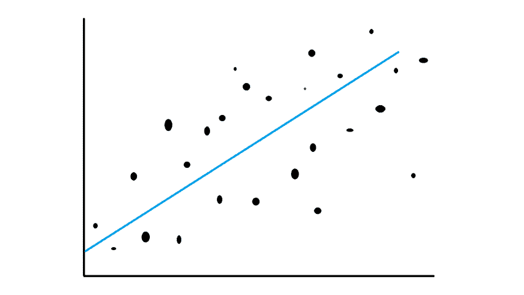
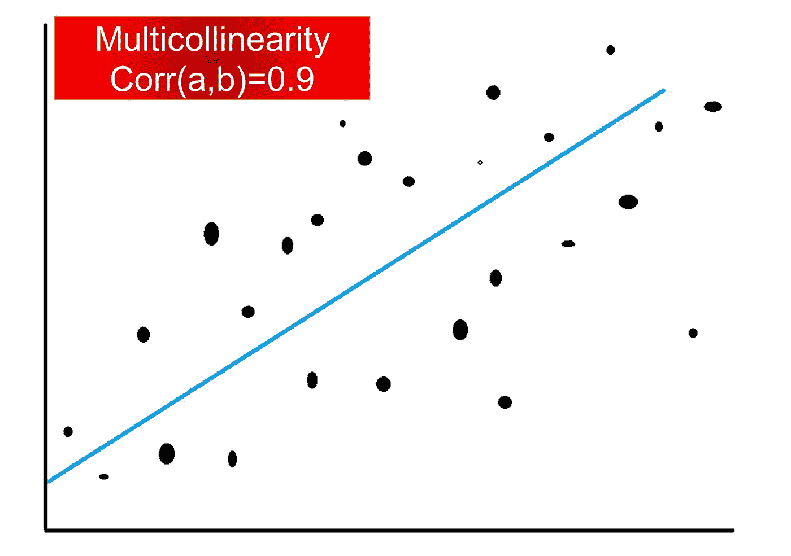
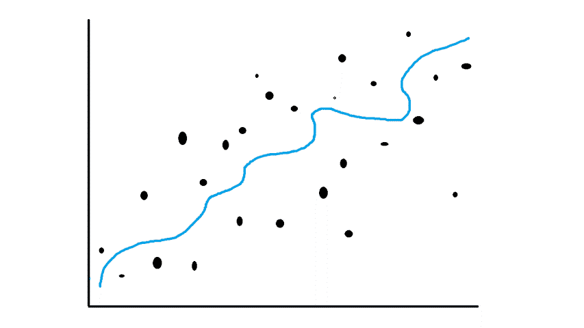
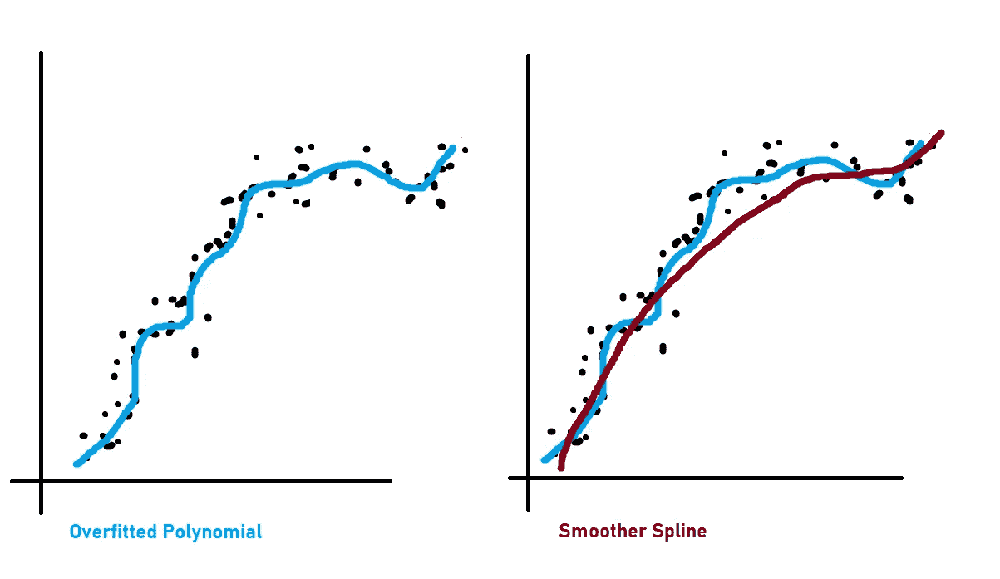
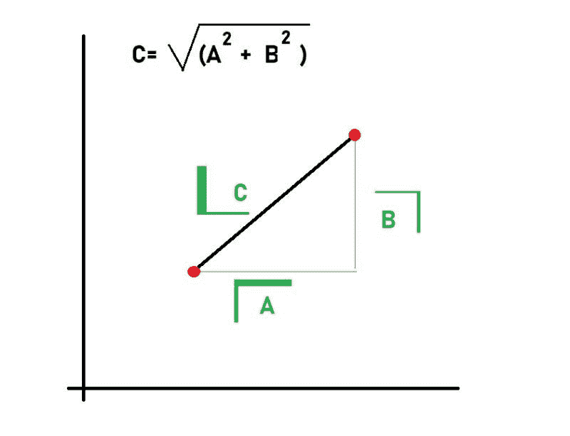
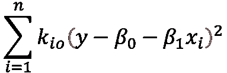
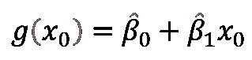

# 什么是过拟合，如何解决？

> 原文：<https://pub.towardsai.net/machine-learning-f940984ff3df?source=collection_archive---------2----------------------->

## [机器学习](https://towardsai.net/p/category/machine-learning):

除非规范化，否则装修可能会很危险。事实上，初级数据分析师往往倾向于减少训练数据集中的偏差，并获得尽可能准确的估计，而忽略模型的样本外使用。在这里，我们将回顾岭回归，黄土，Lowess，光滑样条根据正则化的技术。

## 介绍

作为一名**计量经济学家**或**数据科学家，**你的任务是开发稳健的模型，你需要掌握回归(我喜欢 J.Angrist 的说法)以及如何将其正规化。
例如，对于线性模型，尽管**线性回归**是建模的黄金标准，但在某些情况下可能不是最佳解决方案。简而言之，如果你的模型对于底层数据来说太复杂，而底层数据需要一个简单的模型，那么我们就面临**过度拟合**！

过度拟合

## 过度拟合以及如何解决？

过度拟合是危险的，因为当模型对变化的方差赋予太多权重时，它是敏感的，结果是我们的模型对数据集中甚至最轻微的变化都反应过度。在数据科学和机器学习中，我们模型的这种过度反应被称为过度拟合。在线性模型中，只要您的要素与其他要素高度相关(多重共线性)，您的模型就可能会过度拟合。
为了避免这种情况发生，你需要使用一种称为系数正则化(“收缩”)的技术，使模型变得健壮。换句话说，您需要通过减少将估计系数的系数推向零来正则化您的模型。
数据科学中的这种技术也被称为“回归的惩罚”。
根据具体情况，有几种方法可以使用这种技术。我们今天将看到**岭回归、平滑样条、局部回归和 Lowess(局部加权回归)。**

## 里脊回归

是计量经济学、工程学等中常用的模型之一。当在**线性回归**中观察到独立变量之间的**多重共线性**(高相关性)时，通常使用回归。

RR 比 OLS(通常是无偏的)具有更小的方差，并刺激模型对变化更稳健。

在上面的公式中，λ≥0 是一个调整参数，它实际上不利于回归以降低复杂性。

## **平滑样条**

当我们谈论平滑样条时，我们指的是非线性模型(例如多项式)。此外，当模型过于复杂时，非线性模型会遭受过度拟合。

在这种情况下，我们将像在岭回归中一样使用复杂度惩罚，以及我们的公式将会是什么样子。

正如您已经注意到的，它与 RR 模型相似，唯一的区别是 RR 中预测变量的函数是β0+β1X1+β2X2+e。在我们的情况下，g(x)可以是任何其他非线性函数，这会导致过度拟合(通常是多项式)。λ是一种平滑效果。λ越大，函数 g(x)越平滑。

正如你看到的，更平滑的样条模型是预测优化的。

## 局部加权回归(LOWESS)

该技术背后的主要思想是在每个邻域内使用 KNN 回归。这项技术也有助于模型的稳健性。KNN 的邻居是通过欧几里德距离找到的(但这不是我们今天的话题)

欧几里德距离

## 局部回归(黄土)

黄土是一种强大的技术，可用于线性或非线性最小二乘回归。黄土是一种非参数方法，因此它没有固定的公式。然而，为了计算 X=x0 的黄土，您需要遵循以下步骤。

*   收集 Xi 最接近 X0 的训练数据的 s= k/n
*   指定一个权重 Ki0=K(xi，x0 ),其中最近的邻居得到某个权重，最远的邻居得到 0。超出这些邻居的所有点的权重为零。
*   拟合加权最小二乘回归

*   x0 处的拟合值由下式给出

