# 线性回归与逻辑回归

> 原文：<https://pub.towardsai.net/machine-learning-fcf74f121167?source=collection_archive---------0----------------------->

## [机器学习](https://towardsai.net/p/category/machine-learning)

## 监督机器学习算法的比较研究

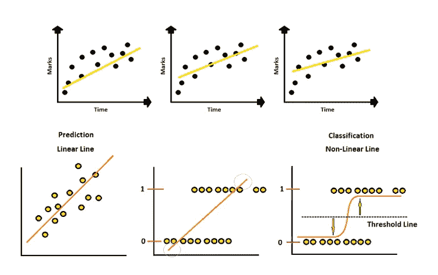

作者的照片

我写这篇文章是为了深入了解线性和逻辑回归算法之间的相似性和差异，以及它们在代码帮助下的工作。

> ***线性回归***

众所周知，线性回归是一种有监督的机器学习算法，是一种用来研究两个连续变量即因变量和自变量之间关系的统计方法。它还预测连续值，并找到描述变量的最佳拟合线。

**数学线性回归**

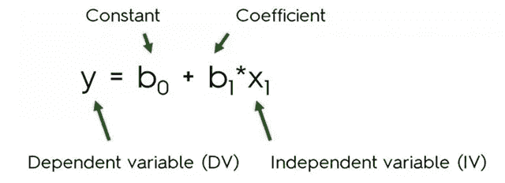

图片[来源](https://www.slideshare.net/KirillEremenko/deep-learning-az-regression-classification-module-7)

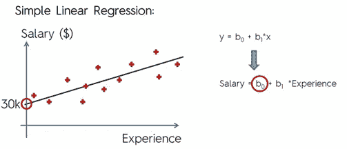

图像[来源](https://www.slideshare.net/KirillEremenko/deep-learning-az-regression-classification-module-7)

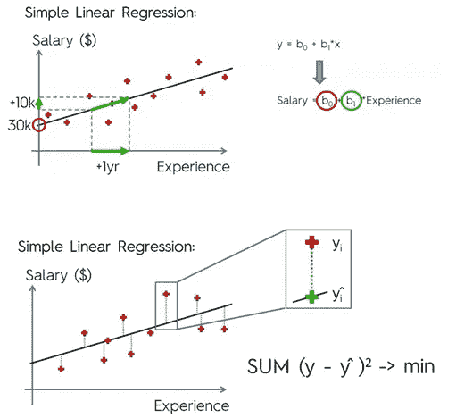

图像[来源](https://www.slideshare.net/KirillEremenko/deep-learning-az-regression-classification-module-7)

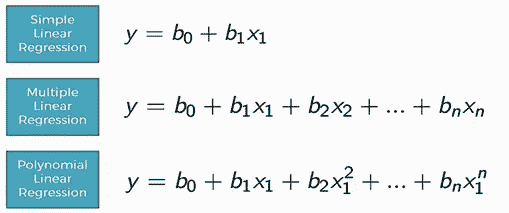

图像[来源](https://www.slideshare.net/KirillEremenko/deep-learning-az-regression-classification-module-7)

分类模型之一，线性模型，即逻辑回归，用于预测分类数据。

[](/fully-explained-linear-regression-with-python-fe2b313f32f3) [## 用 Python 全面解释线性回归

### 如何用一个真实的例子解决回归问题。

pub.towardsai.net](/fully-explained-linear-regression-with-python-fe2b313f32f3) 

> ***逻辑回归***

这是另一种受监督的机器学习算法，用于对数据集进行统计分析，其中有一个或多个决定结果的独立变量。用一个二分变量(两个可能的结果，即 1 (真、成功、怀孕等)来衡量结果。)或 0(假、失败、未怀孕等**。).**

此外，它使用概率的概念，即是事件发生的可能性或几率。

**逻辑回归 Vs 线性回归**

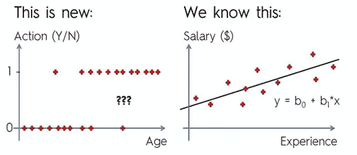

概率和 sigmoid 的概念将线性回归修改为逻辑回归。

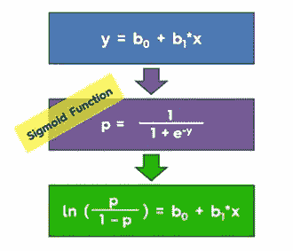

图片[来源](https://www.youtube.com/watch?v=yIYKR4sgzI8)

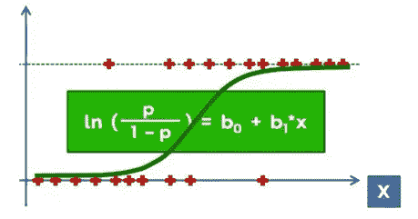

图片[来源](https://www.youtube.com/watch?v=yIYKR4sgzI8)

**借助概率进行逻辑回归**

让我们举一个有年龄和老年福利的数据集的例子。年龄在 35 岁或 35 岁以上的人可以得到老年津贴，年龄在 35 岁以下的人不能得到老年津贴。

我们将阈值设置为 0.5，以了解工作情况，在下图中，根据概率值，超过 0.5 的值有更高的机会获得给定的收益。

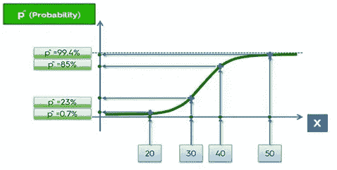

图像[来源](https://www.youtube.com/watch?v=yIYKR4sgzI8)

**线性回归和逻辑回归在以下方面相似。**

*   两者都是有监督的机器学习算法。
*   两个模型都是参数回归，这意味着两个模型都使用线性方程进行预测。

[](/fully-explained-logistic-regression-with-python-f4a16413ddcd) [## 用 Python 全面解释逻辑回归

### 机器学习算法中的统计非线性方法

pub.towardsai.net](/fully-explained-logistic-regression-with-python-f4a16413ddcd) 

**差异**

*   目标变量中的连续值由线性回归处理，而目标列中的二进制类由逻辑回归处理。
*   线性回归寻找最佳拟合直线，而逻辑回归将直线值拟合到 sigmoid 曲线。
*   线性回归中的损失函数可以用均方差法计算，而逻辑回归则用最大似然估计。

> ***用于线性回归的代码***

```
#import librariesimport numpy as np
import pandas as pd
import matplotlib.pyplot as pltdatafile=pd.read_csv("salaryData.csv")
print(datafile)
```

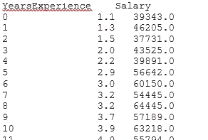

作者的照片

```
#visualisation usingh scatter plotx=datafile['YearsExperience']
y=datafile['Salary']plt.xlabel('YearsExperience')
plt.ylabel('Salary')
plt.scatter(x,y,color='red',marker='+')
plt.show()
```


作者的照片

```
#Splitting of data set in to testing and trainingx=datafile.iloc[:,:-1].values
y=datafile.iloc[:,1].valuesprint(x)
```

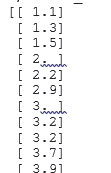

作者的照片

```
import sklearnfrom sklearn.model_selection import train_test_splitxtrain,xtest,ytrain,ytest=train_test_split(x,y,test_size=1/3,random_state=1)#creating simple linear modelx=datafile.iloc[:,:-1].valuesy=datafile.iloc[:,1].valuesfrom sklearn.linear_model import LinearRegressionmodel=LinearRegression()   #y=ax+b
model.fit(xtrain,ytrain)LinearRegression(copy_X=True, fit_intercept=True, n_jobs=None, normalize=False)#predictiony_pred=model.predict(xtest)
y_pred
```

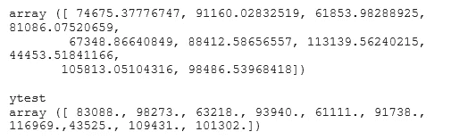

作者的照片

```
#plotting linear regressionplt.scatter(xtrain,ytrain,color='red')
plt.plot(xtrain,model.predict(xtrain))
plt.show()
```


作者的照片

> ***逻辑回归码***

```
# Importing Libraries and data setimport numpy as np
import pandas as pd
import matplotlib.pyplot as pltdatafile=pd.read_csv(‘LR.csv’)
datafile
```

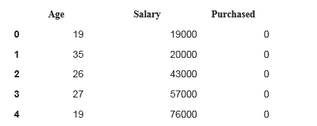

作者的照片

```
X=datafile.iloc[:,[0,1]].valuesY=datafile.iloc[:,2].values#training and testing datafrom sklearn.model_selection import train_test_splitX_train,X_test,Y_train,Y_test=train_test_split(X,Y,test_size=0.25,random_state=0)from sklearn.preprocessing import StandardScalersc=StandardScaler()X_train=sc.fit_transform(X_train)X_test =sc.transform(X_test)
```

逻辑回归在数据集训练部分的应用。

```
from sklearn.linear_model import LogisticRegressionclassifer=LogisticRegression(random_state=0)classifer.fit(X_train,Y_train)
```

预测值执行

```
Y_pred=classifer.predict(X_test)# Confusion matrix.from sklearn.metrics import confusion_matrixcm=confusion_matrix(Y_test,Y_pred)cm#output:
array([[65,  3],
      [ 8, 24]])
```

准确(性)

```
from sklearn.metrics import accuracy_scoreaccuracy_score(Y_test,Y_pred)**#output:**
0.89
```

我希望你喜欢这篇文章。通过我的 [LinkedIn](https://www.linkedin.com/in/data-scientist-95040a1ab/) 和 [twitter](https://twitter.com/amitprius) 联系我。

# 推荐文章

[1。NLP —零到英雄与 Python](https://medium.com/towards-artificial-intelligence/nlp-zero-to-hero-with-python-2df6fcebff6e?sk=2231d868766e96b13d1e9d7db6064df1)
2。 [Python 数据结构数据类型和对象](https://medium.com/towards-artificial-intelligence/python-data-structures-data-types-and-objects-244d0a86c3cf?sk=42f4b462499f3fc3a160b21e2c94dba6)3 .[Python 中的异常处理概念](/exception-handling-concepts-in-python-4d5116decac3?source=friends_link&sk=a0ed49d9fdeaa67925eac34ecb55ea30)
4。[为什么 LSTM 在深度学习方面比 RNN 更有用？](/deep-learning-88e218b74a14?source=friends_link&sk=540bf9088d31859d50dbddab7524ba35)
5。[神经网络:递归神经网络的兴起](/neural-networks-the-rise-of-recurrent-neural-networks-df740252da88?source=friends_link&sk=6844935e3de14e478ce00f0b22e419eb)
6。[用 Python](https://medium.com/towards-artificial-intelligence/fully-explained-linear-regression-with-python-fe2b313f32f3?source=friends_link&sk=53c91a2a51347ec2d93f8222c0e06402)
7 全面讲解了线性回归。[用 Python](https://medium.com/towards-artificial-intelligence/fully-explained-logistic-regression-with-python-f4a16413ddcd?source=friends_link&sk=528181f15a44e48ea38fdd9579241a78)
充分解释了 Logistic 回归 8。[concat()、merge()和 join()与 Python](/differences-between-concat-merge-and-join-with-python-1a6541abc08d?source=friends_link&sk=3b37b694fb90db16275059ea752fc16a)
的区别 9。[与 Python 的数据角力—第一部分](/data-wrangling-with-python-part-1-969e3cc81d69?source=friends_link&sk=9c3649cf20f31a5c9ead51c50c89ba0b)
10。[机器学习中的混淆矩阵](https://medium.com/analytics-vidhya/confusion-matrix-in-machine-learning-91b6e2b3f9af?source=friends_link&sk=11c6531da0bab7b504d518d02746d4cc)