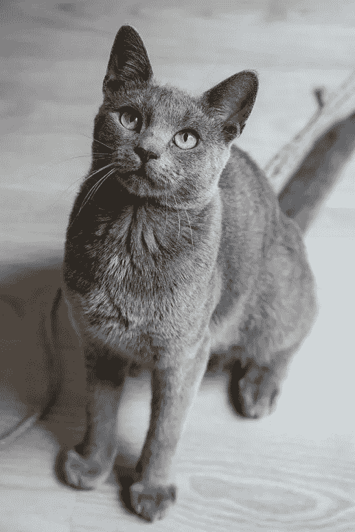
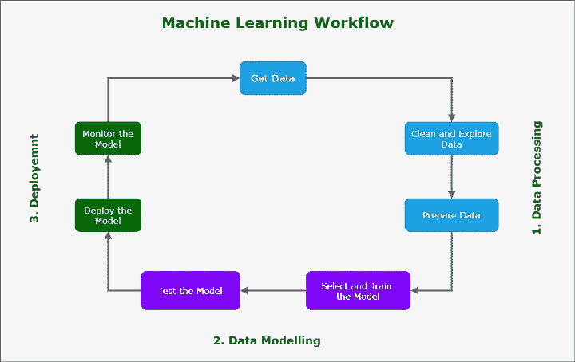

# 假人的机器学习:部署所有的东西🚀🚀

> 原文：<https://pub.towardsai.net/machine-learning-for-dummies-deploy-all-the-things-a9fb120c1407?source=collection_archive---------2----------------------->

## 数据科学家如何部署和监控他们的应用程序？

在这一系列文章中，我将通过看一个实际的项目来帮助你理解什么是机器学习！

如果你有一只猫，那么你知道它要求进出房子。在一个**理想世界**中，你在门上安装一个猫挡板，只有当是你的猫✨时，它**才会打开**

*唯一的是，一个主要检测你的猫的程序是不存在的！*

此外，它在夏天会失去一些皮毛，它会变老，从而改变它的外观。

这个问题似乎很难解决😞…

“我需要出去，人类，”照片由[米拉达·维杰罗娃](https://unsplash.com/@milada_vigerova?utm_source=unsplash&utm_medium=referral&utm_content=creditCopyText)拍摄

> *本文是三个系列的第二部分！
> 虽然这不是必需的，但是如果你愿意，你可以从头开始这个系列:*

 [## 假人的机器学习:数据处理

### 如何为机器学习应用准备数据，它与软件开发有何不同？

medium.com](https://medium.com/mlearning-ai/machine-learning-for-dummies-data-processing-74e23c51bea)  [## 虚拟机器学习:数据建模

### 如何选择和训练机器学习模型来解决软件开发人员无法解决的问题。

medium.datadriveninvestor.com](https://medium.datadriveninvestor.com/machine-learning-for-dummies-data-modeling-b1f644fd9a6) 

*   在本系列的第一篇文章中，我们探讨了如何**收集**、**研究**和**准备在机器学习应用程序中使用的数据**；
*   在下面的文章中，我们了解了一点关于数据科学的知识！我已经解释了当你**选择、训练、**和**评估一个机器学习模型的性能**时，什么是重要的；

现在是时候了解这种机器学习将如何用于提供价值了:你将最终看到一个真正的“机器学习驱动”的猫皮瓣在行动！

我特地为你写这篇文章。

在你阅读结束时，你会明白机器学习工程师和数据科学家是如何部署和监控你日常使用的应用程序的，而你甚至不会注意到！

对于没有读过前面文章的人，让我们回忆一下智能应用程序的生命周期:

机器学习工作流程，学分:[米卡·安德里欧](https://mickael-andrieu.medium.com/)

第一篇文章是关于**数据处理**，而第二篇是关于**数据建模**。现在我们将讨论机器学习模型的**部署**和**监控**。

## 如何部署机器学习模型

> 是时候设置你的猫皮瓣了！

这是你需要的设备:

*   一个非常适合夜视的网络摄像头，可以放在室外并连接到互联网；
*   一个控制你猫瓣开合的系统；
*   一个软件应用程序，读取网络摄像头提供的图像，并决定这是不是你的猫(我们刚刚意识到= >模型)；

> 机器学习本身并不能解决日常问题。

有必要调动其他技能为用户服务:

*   计算机科学；
*   电子学；
*   还有一些市场营销😉；

但是我想对你说实话。

有了正确的技能和大量的空闲时间，即使买一个更“划算”,也有可能制造出你的系统。

下面是一个人的视频反馈，他使用机器学习算法开发了他的系统，并解释了他的设置的组件！

特别是，我们了解到在探测一只猫时还有一个额外的问题要处理:如果它碰巧给你带来一只老鼠或一只小鸟呢？🤔

> **但这和谷歌云平台、亚马逊网络服务、微软 Azure 有什么关系呢？
> 所有这些技术都被要求部署机器学习应用*🤨***

让我们思考一下数据科学家展示的 cat flap 应用程序及其要求:

*   “合格”数据；
*   机器学习模型；
*   和执行机器学习模型的计算机；

谷歌、亚马逊和微软提供带有*预配置*机器学习模型的平台和高性能计算机来执行它们，并使它们可供最终用户使用(在这种情况下，你的猫，🐈).

这听起来像是一项容易的任务，但掌握部署机器学习应用程序的所有技术技能是很难的:这就是为什么数据工程师成为今年的新“天后”！

如果你想进一步了解技术细节，你可以阅读泰勒·福克曼的这篇精彩文章:

 [## 如何部署机器学习模型

### 逐步概述

towardsdatascience.com](https://towardsdatascience.com/how-to-deploy-machine-learning-models-ec50d3daf365) 

但是“工作”并没有就此结束！如你所知，应用程序根据用户的反馈而发展。机器学习应用与其他应用没有什么不同，你需要**监控你的应用**。

## 如何检查和更新你的猫皮瓣🕗

尼尔斯·雅各比的照片(免费)

一旦安装了 cat flap，您将最终进行“真实世界测试”

> 在初步测试中，cat flap 的性能可能不会像在真实世界中那样好。

有时候，就像一只猫试图给你带来食物一样，会有你没有想到的情况。

然后，您必须做出决定并重新培训您的计划，以考虑这种新情况:

*   展示你的猫和猎物的照片；
*   晚上展示你的猫的照片；
*   你可能不得不移动网络摄像头或购买一个运动跟踪的摄像头；

而且——记住机器学习的生命周期——你将不得不准备新获得的数据来再次训练你的机器学习模型。

你将不得不针对你试图解决的新问题来评估性能，同时在最常见的用例中保持良好的性能(如果你的猫和我的一样不擅长打猎🙃).

其他问题也可能发生。不是所有的都可以用机器学习来解决！

也许你的猫会变得足够胖或强壮，可以“强行”进入😱。

所有的精力都花在一只猫身上，它认为从一年中大部分时间都开着的厨房窗户出去更容易😜

## 结论

您已到达此(系列)文章的结尾！

感谢你读到这里，我希望它能帮助你理解什么是机器学习。

以下是所有步骤的总结:

**在第一篇文章**中，您了解了什么是机器学习，以及它与软件开发有何不同。

一个机器学习问题的解决分三个主要步骤:**数据处理**、**数据建模**、**部署**。

**你在第二篇文章**中学习了如何创建机器学习模型。

构建机器学习应用程序包括三个步骤:

*   **选择一个机器学习模型**(如果你是 rockstar 数据科学家，就创建一个！);
*   **将数据**呈现给机器学习模型**训练它解决你想要解决的问题**；
*   **评估性能**并调整模型，直到获得“足够好”的结果；

**在此(最后！)文章**，你学习了如何**部署**和**监视器**一个机器学习应用。

首先，你部署你的机器学习模型:它被集成为一个更复杂的软件应用程序的核心组件。这项任务如此复杂，我们需要数据专家:数据工程师！

最后，像其他应用程序一样，您必须检查性能 IRL("在现实生活中！").又因为现实生活充满了意想不到的事件(不是吗？)，您将不得不处理新的用例以及要解决的新问题。

如果你需要提高你的模型的性能，这将需要收集更多的数据和训练，并重新评估机器学习模型:机器学习生命周期循环已经完成！

**文末告白:可惜我没有猫瓣，因为我没有猫😲！**

我可耻地骗了你，打赌没有人会有耐心读到我这么远…

但是我爱这些毛球爱到可以在我的博客上发表最长的帖子！