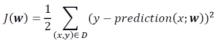
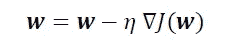
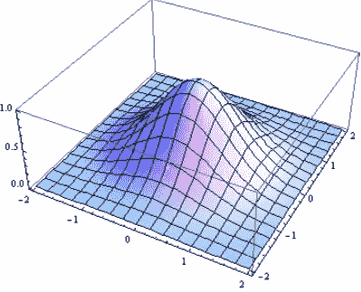
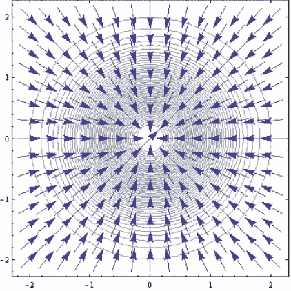
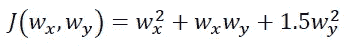
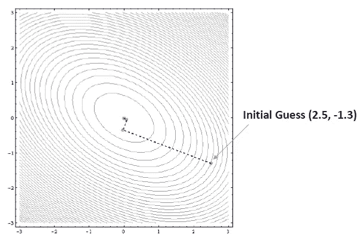

# 机器学习:梯度下降算法如何工作

> 原文：<https://pub.towardsai.net/machine-learning-how-the-gradient-descent-algorithm-works-61682d8570b6?source=collection_archive---------0----------------------->

## 梯度下降是如何工作的？| [走向 AI](https://towardsai.net)

大多数机器学习算法通过最小化目标函数来执行预测建模，从而学习为了获得预测标签而必须应用于测试数据的权重。最简单的目标(损失)函数是误差平方和(SSE)函数，我们将其表示为 J( **w** ):



这里，x 表示特征，y 表示标签，D 表示包含特征和标签的训练数据集， **w** 是通过最小化目标函数从模型中学习的权重。通常使用梯度下降(GD)算法来最小化目标函数。在 GD 方法中，权重根据以下程序更新:



即在与梯度相反的方向上。这里，eta 是一个小的正常数，称为学习率。

但是 GD 算法为什么会起作用呢？

# **为什么 GD 算法有效**

为了说明，我们考虑一个简单的例子，即 2D 高斯函数。我们使用 Mathematica 软件进行计算。

```
**Plot3D[Exp[-(x² + y²)], {x, -2, 2}, {y, -2, 2}, PlotRange -> All]**
```



**高斯函数的 3D 绘图。该函数在原点，即(0，0)处具有最大值。**

我们看到该函数在(0，0)处有一个最大值。现在让我们生成函数的等值线图，并在其上叠加梯度向量方向的单位向量:

```
**p1 = ContourPlot[Exp[-(x² + y²)], {x, -2, 2}, {y, -2, 2}];****p2 = VectorPlot[{-x/Sqrt[x² + y²] , -y/Sqrt[x² + y²]}, {x, -2,2}, {y, -2, 2}];****Show[p1, p2]**
```



**高斯函数的等高线图和梯度向量的矢量场。**

我们观察到梯度的单位向量(箭头)的向量场指向原点(0，0)，在这里函数达到其最大值。所以我们看到梯度向量总是指向函数最大值的方向。

因此，以下规则适用:

1.  为了最大化几个变量的函数，我们在梯度向量的方向上采取步骤。
2.  为了最小化几个变量的函数，我们采取与梯度向量相反的步骤。

# **GD 算法的例子**

假设我们想最小化目标函数:



显然，这个函数在该点(w_x =0，w_y = 0)有一个全局最小值 0。应用带有一些初始猜测(w_x = 2.5，w_y = -1.3)的 GD 算法，我们可以用几行代码表明该算法收敛到正确的最小值，即收敛到点(0，0)，如下所示:



**出于说明目的的简单目标函数的最小化。**

总之，我们用一个非常简单的例子展示了 GD 算法是如何工作的。如果你想看看 GD 算法在一个真实的机器学习分类算法中是如何使用的，请看下面的资源库:[https://github . com/bot 13956/LogisticRegression _ gradient _ descent](https://github.com/bot13956/LogisticRegression_gradient_descent)

有关 GD 算法的更多信息，请参见以下书籍:Sebastian Raschka 的《Python 机器学习》(第 2 章和第 3 章)。

感谢阅读。