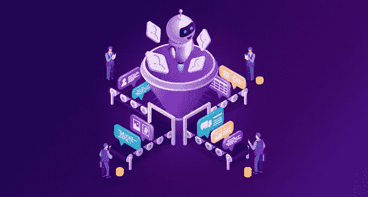
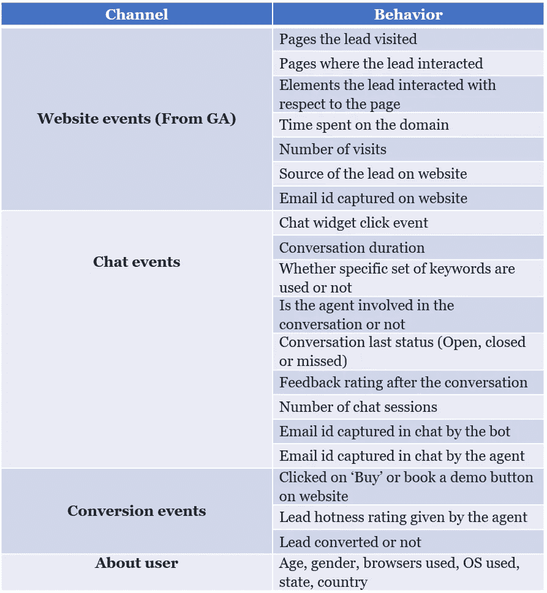

# 销售流程中的机器学习

> 原文：<https://pub.towardsai.net/machine-learning-in-sales-processes-3c4445e6ee3?source=collection_archive---------2----------------------->

根据不同公司提供的服务类型，销售漏斗流程和细分可能会有所不同，无论是对内销售还是对外销售。内容、活动和销售推介将根据您的角色或销售漏斗中的线索(购买者之旅)的状态进行调整。

市场上有很多工具可以帮助你自动完成这些任务。但是，在这个漏斗流程中，您如何利用从您的销售线索中收集的各种数据点来预测用户偏好或帮助您更好地销售呢？以下是我们自己的数据科学家在 Chatgen.ai 的一些例子。我们的工具已经帮助拥有结构化数据的公司缩短了销售响应周期并提高了保留率。

# 线索分类

一般来说，销售团队会避免追逐不合格的销售线索，这需要一个基于多个标准对销售线索进行评分和排序的耗时过程。销售线索排序是一种用于对单个销售线索的重要性进行排序的方法。这是一个按销售线索划分的行动要点示例

从电话、电子邮件等渠道获取额外数据。，将大大提高算法的准确性。有了来自上述行为点的线索的足够数据，机器学习算法可以通过预测性见解显著自动化整个线索评分和排序过程，而不是依赖于基于规则的手动筛选。

# 领先的重复数据消除

在当今的大数据世界中，我们从未有过如此多的可用信息。不幸的是，所有这些数据都是非结构化的，难以使用。在电子表格或数据库中找出谁是谁的简单任务可能是一项艰巨而耗时的任务。因此，通过使用机器学习算法，我们开发了最具动态性和可扩展性的解决方案来消除重复和链接数据集。

一些重要的使用案例包括:

1.消除重复的客户记录

2.合并地址或企业列表

3.主数据管理

4.合并不同的数据库系统

5.创建产品或零件的主列表

6.清理名单和电子邮件

# 自动化售前查询

可以研究大量有见地的售前销售线索查询数据，从中可以发现有用的模式。通过聊天机器人和自然语言处理(NLP)的使用，这些查询中的大部分可以自动化，并减轻您的售前负担。有关如何自动化您的支持查询的详细方法，请查看此[链接](https://medium.com/voice-tech-podcast/adopting-an-agile-approach-for-your-chatbot-investment-on-automation-d916db5f8243)

# 提高客户终身价值

分析一系列不同的因素，看看哪些客户将会流失或离开，哪些客户将会更新，这是人工智能和机器学习今天提供的最有价值的见解之一。通过能够预测每个客户的客户终身价值分析，公司可以优先考虑哪些客户关系健康状况良好，哪些需要关注。