# 使用 Azure ML Studio 在云中进行机器学习

> 原文：<https://pub.towardsai.net/machine-learning-in-the-cloud-using-azure-ml-studio-5948b1347bc6?source=collection_archive---------4----------------------->

## [云计算](https://towardsai.net/p/category/cloud-computing)

## 来自 Udacity 和微软的新纳米学位的模型训练和部署

照片由[马里乌斯·马萨拉尔](https://unsplash.com/@marius?utm_source=medium&utm_medium=referral)在 [Unsplash](https://unsplash.com?utm_source=medium&utm_medium=referral) 上拍摄

在完成了 7 月份推出的基础课程后，我成为了 10 月份获得纳米学位奖学金的 300 名学生之一，该课程在全球招收了大约 10，000 名学生。昨天完成顶点课程并毕业后，我写了这篇文章来记录我对 AzureML 机制的体验。这是我的项目[回购](https://github.com/Ranga2904/Final_Nanodegree_Proj)的链接。

# 语境

正如我在[之前的帖子中所提到的，](https://medium.com/@rangys3)我迄今为止的自学之旅侧重于使用 Python 的机器学习算法来构建预测器和可视化。我的界面是 Jupyter 笔记本，我的工作就在我的笔记本上。当我准备练习和学习部署模型时，我开始了 Nanodegree 在其他[概念](https://blog.udacity.com/2020/10/introducing-the-machine-learning-engineer-for-microsoft-azure-nanodegree-program-from-udacity.html)中——涵盖了 Azure 中的模型部署。

# 这篇文章是如何组织的

本文涵盖的关于 Nanodegree 顶点项目的主题有:

*   目的
*   为项目做准备。
*   开发—超光速引擎和汽车
*   部署
*   结论

在整篇文章中，我将讨论对我和我的同学来说是很好的学习机会的*点。*

# 目的

顶点项目是各种概念培训的高潮；因此，它测试了我们的能力:

*   运行超驱动实验，在超参数搜索空间中进行梳理，以找到在选择的问题上使预选 scikit-learn 算法的性能最大化的设置
*   使用 AutoML 寻找最佳算法，最大限度地提高上述问题的性能
*   将性能最佳的模型部署为任何人都可以查询的活动端点—将产品从我的笔记本电脑中取出，以便任何人都可以使用

# 为顶点工程做准备

第一步是选择一个问题和数据集:我选择了用来自 UCI 知识库的[自动 MPG 数据集预测车辆燃料效率的问题。由于我对之前](https://archive.ics.uci.edu/ml/datasets/Auto%2BMPG)[的帖子](https://towardsdatascience.com/predicting-vehicle-fuel-efficiency-c6065479a72f)中的数据集很熟悉，我可以专注于 Azure 的机器学习(ML)工作室的机制。

微软和 Udacity 为顶点提供了一个虚拟机:标准 DS3V2，具有 14 GB RAM，最多可提供 4 个 CPU 节点。启动使用该虚拟机的工作区后，下一步设置是上传和注册数据集，它目前是我桌面上的一个. csv 文件。

一旦完成，AzureML 为用户提供了消费注册数据集的必要代码，如下面的图 1 所示。声明实验的行是我自己的，不需要使用注册的数据集。

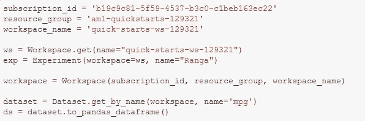

图 1:使用注册的数据集

随着数据集准备就绪，工作空间在正在运行的虚拟机“计算”上启动，我们准备好开发项目了。

# 发展——超光速引擎

在 Azure ML Studio 中为这个问题设置 HyperDrive 实验需要设置模型超参数的搜索空间——类似于 GridSearchCV——并选择一个早期停止策略，以便在达到某个性能因子时停止实验的运行。这两个因素，以及最大试验次数，提供了配置超空间驱动运行的方法，如图 2 所示。

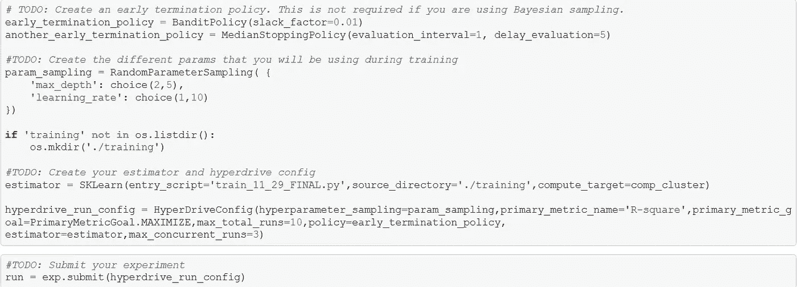

图 2:开发超光速引擎实验

配置 HyperDrive 运行所需的其他设置包括主要指标名称、我们的指标目标(即最大化或最小化)以及估计值。*max _ concurrent _ runs 的数量必须小于或等于可用计算可提供的最大节点数量，在本例中为 3 < 4。*

继续本文对 AzureML 机制的关注，让我们讨论一下估算器。正如你在上面看到的，它是使用 AzureML 的 SKLearn 类声明的，并使用一个入口脚本作为输入。该入口脚本是清理数据、将数据分成训练集和测试集、训练预先选择的 scikit-learn 算法以及在测试集上评估性能的实际代码。让我们看看下面图 3 中的部分进入脚本，完整的代码可以在 train_11_29_FINAL.py 脚本中找到，可以在项目 [repo](https://github.com/Ranga2904/Final_Nanodegree_Proj) 中找到。

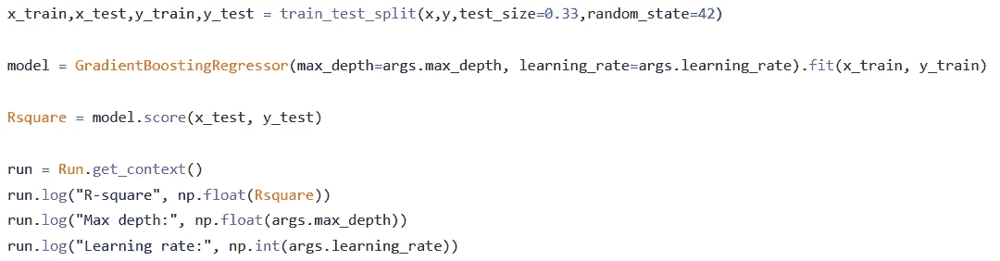

图 3:超空间引擎实验中使用的部分入口脚本。

如上所述，在搜索最佳模型时，我选择了不同的树深度和学习速率。

我还使用了 GradientBoosting 回归器使用的默认计分器，它返回一个 R 平方值。*该分数必须以与 HyperDriveConfig 中的 primary_scoring_metric 相同的名称记录在条目脚本中—比较图 2 和图 3。*

实验被“提交”以启动超空间引擎。当这些运行失败时，主控台返回的消息可能不足以进行诊断。用户打开具有超空间引擎运行列表的给定链接，点击失败的运行，并打开该失败运行的输出日志。这些日志指出了出现错误的具体行。

然后，可以从 HyperDrive 实验中检索性能最佳的运行，如下图 4 所示，在算法实例中指定相应的超参数设置，并使用 joblib 将其作为模型保存到 active directory 中。图 5 显示了最佳运行的 ID 和性能。

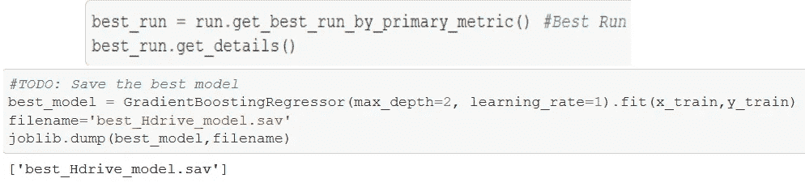

图 4:从 HyperDrive 实验中检索最佳运行，并使用相应的超参数值保存最佳模型

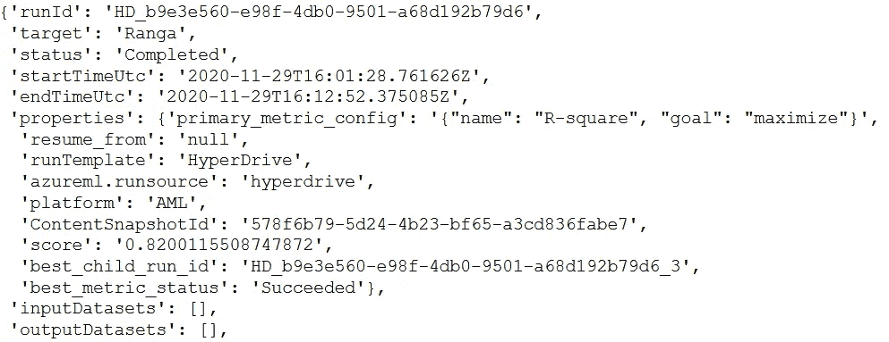

图 5:来自超驱动实验的最佳运行和运行 ID

超驱动优化梯度推进回归器的 **R 平方值为 0.82**

# 开发— AutoML

Azure ML Studio 中的 AutoML 需要清理数据集，通过 AutoMLConfig 指定配置设置，并提交带有这些设置的实验。下面的图 6 经历了这个过程— *因为没有使用 AutoML 提交的训练脚本，所以我们必须在将数据作为 training_data 输入之前对其进行净化。*

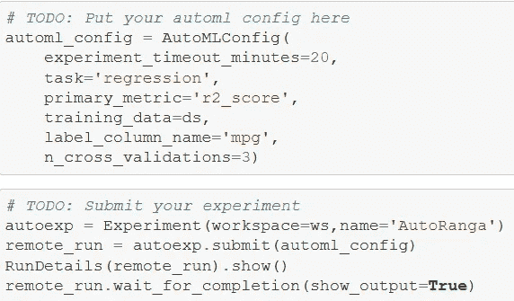

图 6:设置 AutoML 配置并运行实验

整个输出都在关联回购中——从 AutoML 实验中获得的最佳模型显示，它是一个 XGBoost 回归变量，产生 0.87 的 **R 平方值。**使用 joblib.dump 将这个性能最好的模型保存到活动目录中

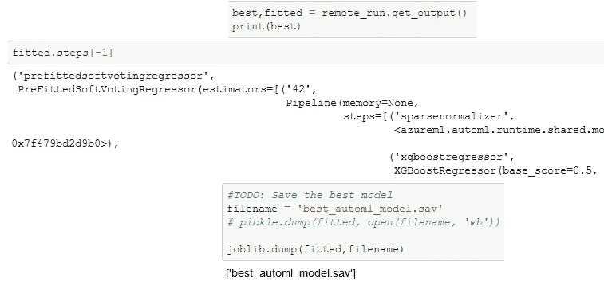

图 7:从 AutoML 中识别并保存性能最佳的模型

# 部署

将性能最好的 AutoML 保存到工作目录中，然后注册模型，并使用所需的包创建必要的环境，以将注册的模型部署为 web 服务。这个 web 服务是一个活动的 HTTP 端点，可以用数据查询它来接收模型的预测。

注册模型会创建一个“容器”,其中包含执行所需的应用程序和库/依赖项。注册的模型也保存在工作目录中，以备部署时使用。

这个项目中使用的模型类的 deploy 方法接受以下输入:工作区、注册的模型、推理配置和部署配置。让我们一次解决一个问题:

*   工作空间=之前已经定义
*   注册型号=涵盖以上内容
*   推理配置=表示用于部署的“计算机”的设置。使用了推理配置类，对于我们的目的，它接受两个输入:一个入口脚本和一个策划的环境。我们将涵盖这两个短
*   部署配置=配置托管注册模型和条目脚本的 web 服务。出于我们的目的，我们将使用 Azure 容器实例。

现在让我们讨论一下对推理配置类的输入:

*   入口脚本从用户那里获取数据，并将其传递给模型。从模型得到的预测作为入口脚本的输出被“返回”——参见下面 score.py 入口脚本的一个片段，它可以在这个项目的 repo 中找到。

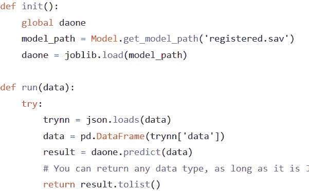

图 8:用于运行注册的 AutoML 模型的入口脚本 score.py

*   策划的环境应该支持模型使用的算法。在我的例子中，因为最好的 AutoML 模型是 XGBoost 回归器，所以我选择了‘azure ml-AutoML’包，它涵盖了这个算法。

下面的图 9 显示了环境的创建、推理配置和部署配置。这些创建与注册的模型一起被提供给模型类的 deploy 方法。

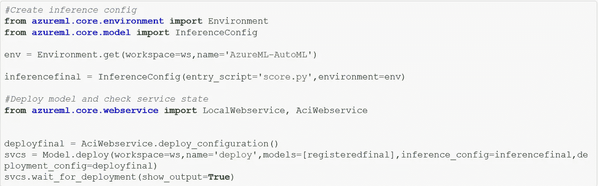

图 9:模型部署

如下所示，部署成功，端点运行正常。根据我的要求，AzureML 提供了用于查询模型的评分 URI。

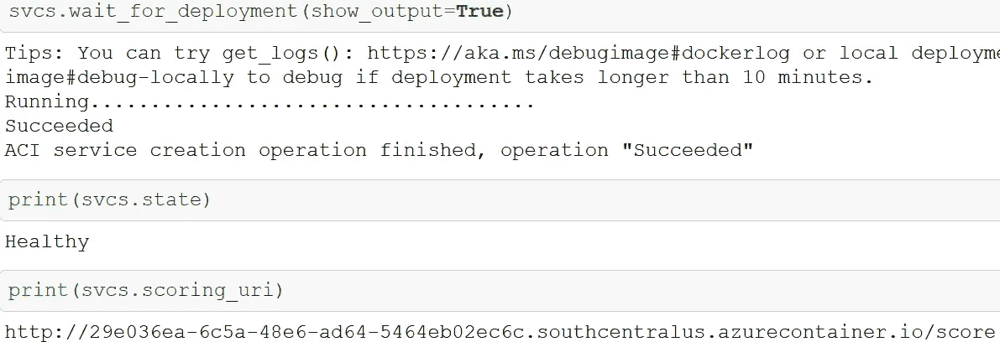

图 10:健康终点和评分 URI

向这个评分 URI 传递一个请求会运行入口脚本，该脚本会从 init()命令的工作目录中保存的主目录中启动注册的模型。然后执行 run()命令，实际生成对传递给活动端点的数据的预测。

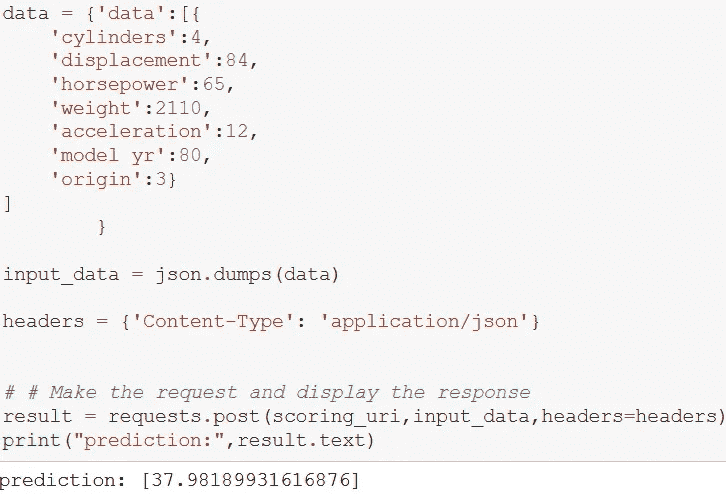

图 11:将请求传递给活动评分 URI 并获得结果预测

图 11 展示了在项目 [repo](https://github.com/Ranga2904/Final_Nanodegree_Proj) 中使用文件的任何用户都可以传递汽车数据并获得预测的里程。*该小组学到的关键知识是传递一个数据帧的重要性，该数据帧可以转储到一个 JSON 文件中，同时被传输到 score 脚本，然后该脚本解包，即转储 JSON 文件并将其传输回数据帧*。

# 结论

我进入这个纳米学位时没有部署模型的经验，但出来时却有一种介质的经验。虽然具有挑战性，但这种纳米学位令人愉快，我期待着学习使用其他工具进行部署。