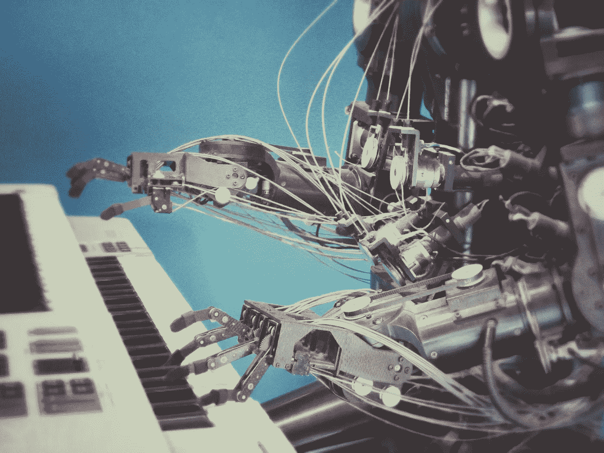
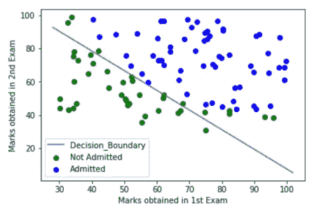

# 机器学习:它的真正本质

> 原文：<https://pub.towardsai.net/machine-learning-its-true-essence-836ffa5524eb?source=collection_archive---------1----------------------->

从概念上讲，机器学习(ML)是教授机器的艺术。现在，很明显教学是这样的，当一个学生被老师/导师教导时，他有能力面对和回答任何问题，无论是明确教授的还是没有教授的。

## **现实生活中的情况**

比如说，有一个题目涵盖了 ***m*** 数个可能的问题。一个学生被老师教出 ***n*** 出 ***m*** 题(其中*小于 ***m*** 为肯定)。现在，假设有一个考试，其中有 ***x*** 个问题。并且，发现在 ***x*** 问题中，有来自正在被教导的 ***n*** 问题的集合的*问题，并且剩余的问题( ***x-a*** 问题)是没有明确教导给学生的问题。**

## ****ML 与现实生活的关联性****

**所以，正如 ML 是教授机器的艺术一样，教学不能仅仅通过逻辑编程来完成。因为，如果机器是逻辑编程的，它们就不能面对一组未知的实例，这就好比上面例子中的学生会对 ***x-a*** 问题保持沉默。因此，汤姆·米切尔对 ML 的经典定义是合理的:**

**如果一个计算机程序在 T 上的性能(由 P 测量)随着经验 E 的增加而提高，则称该程序从经验 E 中学习某些任务 T 和某些性能测量 P**

**现在，机器是如何被教导的？教学生更容易，因为他们有头脑。但是机器呢？**

**是的，但曼梯·里的真正刺激之处仅在于此。它有能力教导无脑机器。但是怎么做呢？机器没有大脑怎么学习？**

**在机器学习中，机器被教授有或没有结果的各种数据。有输出的机器称为有监督的机器学习，没有输出的称为无监督的学习。现在，机器学习算法是以这样一种方式构建的，即机器可以通过理解美联储数据中的潜在模式来学习。这种模式识别过程是任何机器学习方法背后的最终大脑。在 ML 中，参考前面提到的学生被老师教导的情况，被明确教导的 ***n*** 问题被称为训练数据，而剩余的 ***m-n*** 问题是测试数据(学生未知，这里学生实际上是 ML 模型)。**

****

****根据训练数据预测可能录取的已训练机器学习模型的决策边界****

**在我自己的一些研究论文中，我直接部署了 ML 算法:**

*   **[***利用梯度推进分类器预测航班到达延误***](https://link.springer.com/chapter/10.1007/978-981-13-1498-8_57)**

**在这里，我构建了一个 ML 模型，可以预测美国航空公司航班的航班到达延迟。我使用了梯度推进分类器，这是一种基于决策树的集成机器学习算法。它观察数据中的匹配模式，并为集成中的每个决策树构造分类规则，并使用概率方法来组合它们。因此，最终的结果是一个智能系统，在预测航班到达延误方面有 79.7%的准确性。**

*   **[***一种成人普查收入水平预测的统计方法***](https://ieeexplore.ieee.org/document/8748528)**

**在这里，我构建了一个 ML 模型，它可以决定一个生活在美国的个人的收入是否大于 50，000 美元。此外，这里使用了梯度推进分类器以及像特征选择、一键编码和三重网格搜索交叉验证这样的技术。因此，最终产品是一个智能系统，在做出经济决策时有 88.16%的准确率。**

## ****为什么是机器学习？****

**有时候 ML 看起来“没什么大不了的”，因为它只是给出了可能正确也可能不正确的答案。但是，为了将自动化融入我们的日常生活，我们必须逐渐消除人工干预。有了 ML，我们正在实现这一目标。使用 ML，无需人工干预即可做出决策，因为只有训练有素的机器才能完成这项工作！！！此外，使用机器学习还可以实现对未来事件的预测分析，因此可以做出适当的决策。所以，通过 ML **预测智能**也可以传授给机器！！！**