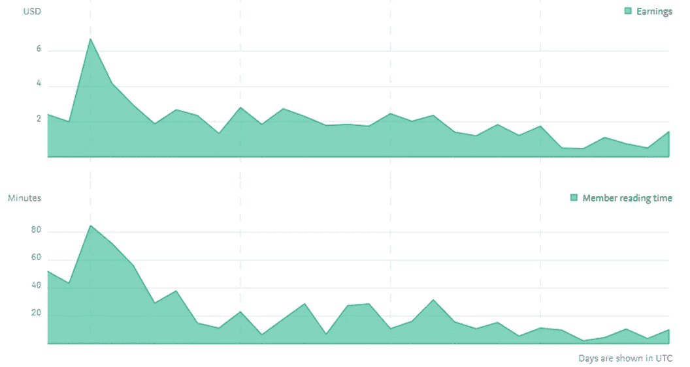
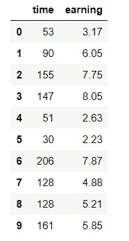
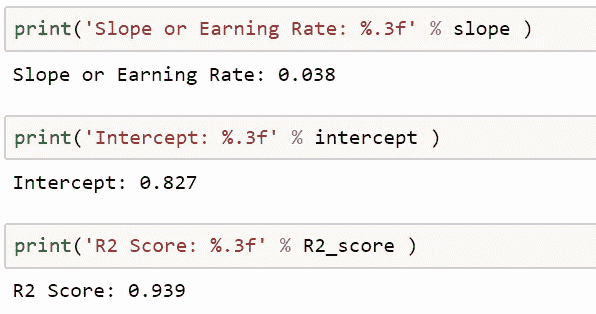
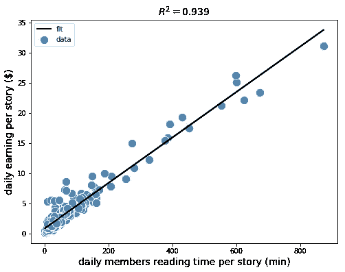
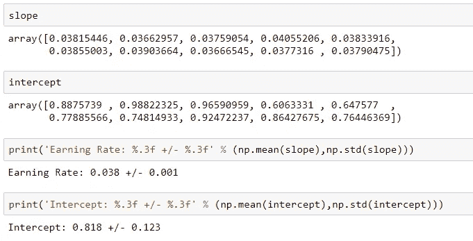
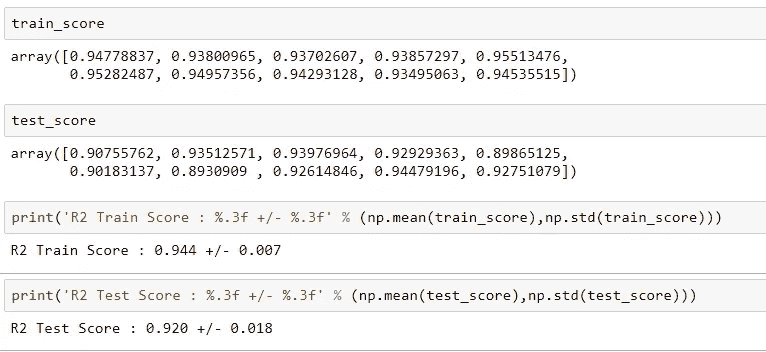

# 预测媒体作者收入的机器学习模型

> 原文：<https://pub.towardsai.net/machine-learning-model-for-predicting-medium-writer-earnings-5c400e4c9ca9?source=collection_archive---------1----------------------->



2019 年 10 月 22 日，Medium 公布了一个计算作家收入的新模型。根据这种新模式，**收益将根据媒介会员的*阅读时间*来计算。**你可以从这篇文章中找到更多关于新模式的信息: [**改进我们计算作家收入的方式**](https://blog.medium.com/improving-how-we-calculate-writer-earnings-d2d3f4329b26) 。

新模式自 2019 年 10 月 28 日起生效。在之前的一篇文章( [**Medium Partner Program 计算作家收入的新模型—线性回归分析**](https://towardsdatascience.com/medium-partner-programs-new-model-for-calculating-writer-s-earnings-using-basic-linear-regression-bddf8ef7e431) )中，我曾写过一个在新的 Partner Program 模型下作家收入的模型。但本文仅基于 5 天的数据(2019 年 10 月 28 日至 2019 年 11 月 2 日)。

由于新模式现在已经运行了 1 个月，我决定重新考虑在新的合作伙伴计划下估计作家收入的问题，这次使用 1 个月的数据(我 11 月的收入数据)。

在本文中，我们使用[**earnings _ data . CSV**](https://github.com/bot13956/ML_Model_to_predict_medium_writer_earnings)数据集构建了一个简单的模型，用于基于成员阅读时间预测作家的每日收入。本文分为以下六个部分:(1)必要库的导入；(2)数据集的导入；(3)回归模型的建立；(4)拟合回归线的可视化；(5)模型训练、测试和评估；以及(6)模型发现和结论的总结。

本文的数据集和代码可以从这个 [**github 存储库**](https://github.com/bot13956/ML_Model_to_predict_medium_writer_earnings) 下载。

# 1.导入必要的库

```
import numpy as np
import pandas as pd
import matplotlib.pyplot as plt
from sklearn.metrics import r2_score
from sklearn.model_selection import train_test_split
```

# 2.读取数据集并显示列

```
df=pd.read_csv("earnings_data.csv")
df.head(n=10)
```



**数据集有 2 个特征:时间(每日会员的阅读时间，以分钟为单位)和收入(每日每个故事的收入)。**

# 3.构建基本回归模型

```
X = df['time'].values
y = df['earning'].values
slope = np.polyfit(X,y,1)[0]
intercept = np.polyfit(X,y,1)[1]
y_pred = intercept + slope*X
R2_score = r2_score(y, y_pred)
```



# 4.拟合回归线的可视化

```
plt.figure(figsize=(8,6))
plt.scatter(X,y,label='data', c='steelblue', edgecolor='white', s=150)
plt.plot(X, y_pred,color='black', lw=2,label='fit')
plt.title('$ R^2 = 0.939 $',size=14)
plt.xlabel('daily members reading time per story (min)',size=14)
plt.ylabel('daily earning per story ($)',size=14)
plt.legend()
plt.show()
```



# 5.模型培训、测试和评估

在这里，我们执行模型训练、测试和评估(使用交叉验证)以确保模型是健壮和稳定的。为了进行交叉验证分析，我们生成了 10 个随机样本的训练集和测试集。

```
slope = []
intercept =  []
train_score = []
test_score = []for i in range(10):
    X_train, X_test, y_train, y_test = train_test_split( X, y, test_size=0.4, random_state=i)
    a = np.polyfit(X_train,y_train,1)[0]
    b = np.polyfit(X_train,y_train,1)[1]
    y_train_pred = a*X_train + b
    y_test_pred = a*X_test + b train_score = np.append(train_score, 
                            r2_score(y_train,y_train_pred)) test_score = np.append(test_score, r2_score(y_test,y_test_pred)) slope = np.append(slope, np.polyfit(X_train, y_train,1)[0]) intercept = np.append(intercept, 
                          np.polyfit(X_train, y_train,1)[1])
```



**观察:**查看上面的输出，我们看到这个模型非常健壮和稳定。我们还计算出回归线的平均斜率为 0.038，平均截距为 0.818。

# 6.模型结果和结论摘要

基于我们的机器学习模型，我们发现了每日每篇报道收入(美元)与每日成员阅读时间(分钟)之间的关系:

## **收益= 0.038 x 时间+ 0.818**

**注意:**这种关系仅适用于成员阅读时间在 1 分钟到 900 分钟的范围内，该范围用于训练模型。因为斜率是一个随机变量，用 **slope = 0.38 +/- 0.001、**来描述，我们预计模型在使用时，会在预测数据中产生小的变化。你可能期望这个模型产生大约**+/-1 美元的预测收益变化。**

总之，我们已经展示了如何使用合作伙伴计划的最新模型，使用简单的线性回归模型来预测作家的收入。随着越来越多的收入数据从新的媒体合作伙伴计划模型中获得，我们希望在未来扩展这种计算方法。同时，该模型可以作为一个可靠的模型来估计成员阅读时间的每日收入。