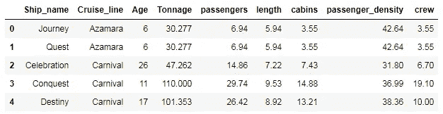
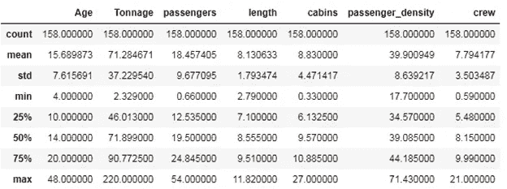
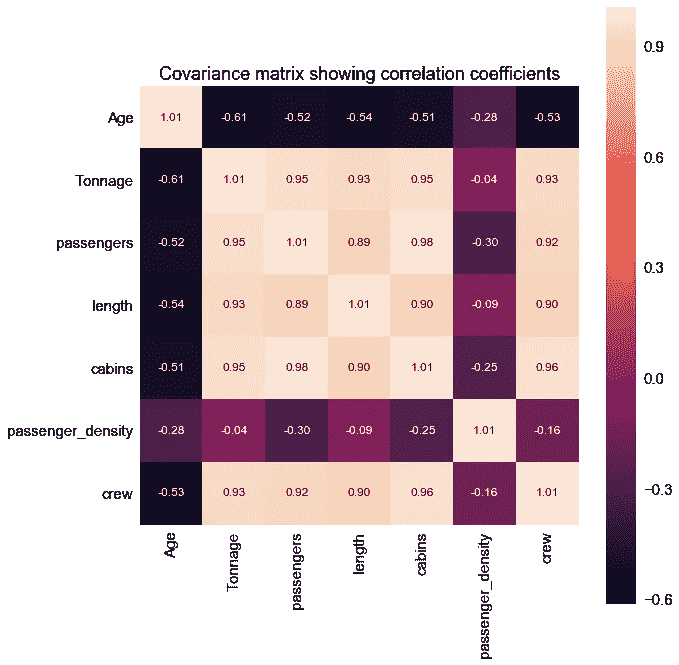
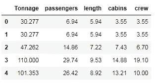
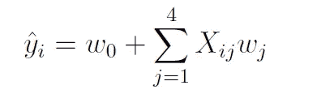
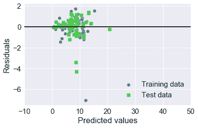
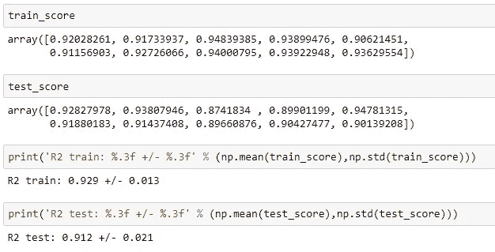
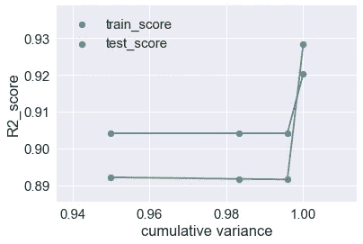
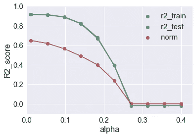

# 从头开始构建机器学习推荐模型

> 原文：<https://pub.towardsai.net/machine-learning-model-for-recommending-the-crew-size-for-cruise-ship-buyers-6dd478ad9900?source=collection_archive---------1----------------------->

## 用 Python 构建机器学习模型，为邮轮买家推荐船员规模


一艘嘉年华游轮。图片来源:[**https://www . kaleidoscope adventures . com/product/student-cruises/**](https://www.kaleidoscopeadventures.com/product/student-cruises/)**。**

在本教程中，我们使用 cruise_ship_info.csv [数据集](https://github.com/bot13956/ML_Model_for_Predicting_Ships_Crew_Size)构建一个回归模型，为潜在的游轮买家推荐船员数量。本教程将重点介绍重要的数据科学和机器学习概念，例如:

a)数据预处理和变量选择

b)基本回归模型构建

c)超参数调谐

b)模型评估

d)降维技术

构建这个推荐系统的代码可以在 [GitHub](https://github.com/bot13956/ML_Model_for_Predicting_Ships_Crew_Size) 上找到。

# 1.导入必要的库

```
import numpy as np
import pandas as pd
import matplotlib.pyplot as plt
import seaborn as sns
```

# 2.读取数据集并显示列

```
df=pd.read_csv("cruise_ship_info.csv")
df.head()
```



# 3.计算数据集的基本汇总统计数据

```
df.describe()
```



# 4.生成散点对图

```
cols = ['Age', 'Tonnage', 'passengers', 'length', 'cabins','passenger_density','crew']
sns.pairplot(df[cols], size=2.0)
```


**第四部分的观察结果:**

1)我们观察到变量在不同的尺度上，对于样本，年龄变量的范围从大约 16 岁到 48 岁，而吨位变量的范围从 2 到 220 岁。因此，当使用这些变量构建回归模型时，通过标准化或规范化数据使变量达到相同的范围是很重要的。

2)我们还观察到，目标变量“船员”与 4 个预测变量，即“吨位”、“乘客”、“长度”和“船舱”有很好的相关性。

# 5.预测“机组”规模的变量选择

## 5a。协方差矩阵的计算

```
cols = ['Age', 'Tonnage', 'passengers', 'length', 'cabins','passenger_density','crew']
from sklearn.preprocessing import StandardScaler
stdsc = StandardScaler()
X_std = stdsc.fit_transform(df[cols].iloc[:,range(0,7)].values)cov_mat =np.cov(X_std.T)
plt.figure(figsize=(10,10))
sns.set(font_scale=1.5)
hm = sns.heatmap(cov_mat,
                 cbar=True,
                 annot=True,
                 square=True,
                 fmt='.2f',
                 annot_kws={'size': 12},
                 yticklabels=cols,
                 xticklabels=cols)
plt.title('Covariance matrix showing correlation coefficients')
plt.tight_layout()
plt.show()
```



## 5b。选择预测值和目标变量

从上面的协方差矩阵图中，我们看到“机组人员”变量与 4 个预测变量密切相关:“吨位”、“乘客”、“长度”和“客舱”。

```
cols_selected = ['Tonnage', 'passengers', 'length', 'cabins','crew']df[cols_selected].head()
```



```
X = df[cols_selected].iloc[:,0:4].values    # features matrix 
y = df[cols_selected]['crew'].values        # target variable
```

# 6.将数据划分为训练集和测试集

```
from sklearn.model_selection import train_test_split
X = df[cols_selected].iloc[:,0:4].values     
y = df[cols_selected]['crew']
X_train, X_test, y_train, y_test = train_test_split( X, y, test_size=0.4, random_state=0)
```

# 7.构建多元回归模型

我们用于预测船只“船员”数量的机器学习回归模型可以表示为:



```
from sklearn.linear_model import LinearRegression
slr = LinearRegression()slr.fit(X_train, y_train)
y_train_pred = slr.predict(X_train)
y_test_pred = slr.predict(X_test)plt.scatter(y_train_pred,  y_train_pred - y_train,
            c='steelblue', marker='o', edgecolor='white',
            label='Training data')
plt.scatter(y_test_pred,  y_test_pred - y_test,
            c='limegreen', marker='s', edgecolor='white',
            label='Test data')
plt.xlabel('Predicted values')
plt.ylabel('Residuals')
plt.legend(loc='upper left')
plt.hlines(y=0, xmin=-10, xmax=50, color='black', lw=2)
plt.xlim([-10, 50])
plt.tight_layout()
plt.legend(loc='lower right')
plt.show()
```



## 7a。回归模型的评估

```
from sklearn.metrics import r2_score
from sklearn.metrics import mean_squared_errorprint('MSE train: %.3f, test: %.3f' % (
        mean_squared_error(y_train, y_train_pred),
        mean_squared_error(y_test, y_test_pred)))
print('R^2 train: %.3f, test: %.3f' % (
        r2_score(y_train, y_train_pred),
        r2_score(y_test, y_test_pred)))**MSE train: 0.955, test: 0.889
R^2 train: 0.920, test: 0.928**
```

## 7b。回归系数

```
slr.fit(X_train, y_train).intercept_**-0.7525074496158393**slr.fit(X_train, y_train).coef_**array([ 0.01902703, -0.15001099,  0.37876395,  0.77613801])**
```

# 8.功能标准化、交叉验证和超参数调整

```
from sklearn.metrics import r2_score
from sklearn.model_selection import train_test_split
X = df[cols_selected].iloc[:,0:4].values     
y = df[cols_selected]['crew']  
from sklearn.preprocessing import StandardScaler
sc_y = StandardScaler()
sc_x = StandardScaler()
y_std = sc_y.fit_transform(y_train[:, np.newaxis]).flatten()train_score = []
test_score = []for i in range(10):
    X_train, X_test, y_train, y_test = train_test_split( X, y, test_size=0.4, random_state=i)
    y_train_std = sc_y.fit_transform(y_train[:, np.newaxis]).flatten()
    from sklearn.preprocessing import StandardScaler
    from sklearn.decomposition import PCA
    from sklearn.linear_model import LinearRegression
    from sklearn.pipeline import Pipeline
    pipe_lr = Pipeline([('scl', StandardScaler()),('pca', PCA(n_components=4)),('slr', LinearRegression())])
    pipe_lr.fit(X_train, y_train_std)
    y_train_pred_std=pipe_lr.predict(X_train)
    y_test_pred_std=pipe_lr.predict(X_test)
    y_train_pred=sc_y.inverse_transform(y_train_pred_std)
    y_test_pred=sc_y.inverse_transform(y_test_pred_std)
    train_score = np.append(train_score, r2_score(y_train, y_train_pred))
    test_score = np.append(test_score, r2_score(y_test, y_test_pred))
```



# 9.降维技术

## 9a。主成分分析

```
train_score = []
test_score = []
cum_variance = []for i in range(1,5):
    X_train, X_test, y_train, y_test = train_test_split( X, y, test_size=0.4, random_state=0)
    y_train_std = sc_y.fit_transform(y_train[:, np.newaxis]).flatten()
    from sklearn.preprocessing import StandardScaler
    from sklearn.decomposition import PCA
    from sklearn.linear_model import LinearRegression
    from sklearn.pipeline import Pipeline
    pipe_lr = Pipeline([('scl', StandardScaler()),('pca', PCA(n_components=i)),('slr', LinearRegression())])
    pipe_lr.fit(X_train, y_train_std)
    y_train_pred_std=pipe_lr.predict(X_train)
    y_test_pred_std=pipe_lr.predict(X_test)
    y_train_pred=sc_y.inverse_transform(y_train_pred_std)
    y_test_pred=sc_y.inverse_transform(y_test_pred_std)
    train_score = np.append(train_score, r2_score(y_train, y_train_pred))
    test_score = np.append(test_score, r2_score(y_test, y_test_pred))
    cum_variance = np.append(cum_variance, np.sum(pipe_lr.fit(X_train, y_train).named_steps['pca'].explained_variance_ratio_))plt.scatter(cum_variance,train_score, label = 'train_score')
plt.plot(cum_variance, train_score)
plt.scatter(cum_variance,test_score, label = 'test_score')
plt.plot(cum_variance, test_score)
plt.xlabel('cumulative variance')
plt.ylabel('R2_score')
plt.legend()
plt.show()
```



**第 9a 部分的观察结果:**

我们观察到，通过将主成分的数量从 1 增加到 4，训练和测试分数提高了。这是因为，在组件较少的情况下，模型中存在较高的偏置误差，因为模型过于简化。随着主成分数量的增加，偏差误差会减小，但模型的复杂性会增加。

## 9b。正则化回归:套索

```
from sklearn.model_selection import train_test_split
X_train, X_test, y_train, y_test = train_test_split( X, y, test_size=0.4, random_state=0)
y_train_std = sc_y.fit_transform(y_train[:, np.newaxis]).flatten()
X_train_std = sc_x.fit_transform(X_train)
X_test_std = sc_x.transform(X_test)alpha = np.linspace(0.01,0.4,10) #lasso parametersfrom sklearn.linear_model import Lasso
lasso = Lasso(alpha=0.7)r2_train=[]
r2_test=[]
norm = []
for i in range(10):
    lasso = Lasso(alpha=alpha[i])
    lasso.fit(X_train_std,y_train_std)
    y_train_std=lasso.predict(X_train_std)
    y_test_std=lasso.predict(X_test_std)
    r2_train=np.append(r2_train,r2_score(y_train,sc_y.inverse_transform(y_train_std)))
    r2_test=np.append(r2_test,r2_score(y_test,sc_y.inverse_transform(y_test_std)))
    norm= np.append(norm,np.linalg.norm(lasso.coef_))plt.scatter(alpha,r2_train,label='r2_train')
plt.plot(alpha,r2_train)
plt.scatter(alpha,r2_test,label='r2_test')
plt.plot(alpha,r2_test)
plt.scatter(alpha,norm,label = 'norm')
plt.plot(alpha,norm)
plt.ylim(-0.1,1)
plt.xlim(0,.43)
plt.xlabel('alpha')
plt.ylabel('R2_score')
plt.legend()
plt.show()
```



**来自第 9b 部分的观察:**

我们观察到，随着正则化参数α的增加，回归系数的范数变得越来越小。这意味着更多的回归系数被强制为零，这将增加偏差误差(过度简化)。平衡偏差-方差权衡的最佳值是当 alpha 保持较低时，比如 alpha = 0.1 或更低。

# 摘要

总之，我们已经展示了如何使用 cruise_ship_info.csv [数据集](https://github.com/bot13956/ML_Model_for_Predicting_Ships_Crew_Size)构建一个简单的回归模型，为潜在的船舶买家预测船员数量。这个推荐系统的代码可以在 [GitHub](https://github.com/bot13956/ML_Model_for_Predicting_Ships_Crew_Size.) 上找到。

# **参考文献**

1.  拉什卡、塞巴斯蒂安和瓦希德·米尔贾利利**。** *Python 机器学习，第二版*。帕克特出版社，2017 年。
2.  Benjamin O. Tayo，*预测船只船员规模的机器学习模型*，[https://github . com/bot 13956/ML _ Model _ for _ Predicting _ Ships _ Crew _ Size](https://github.com/bot13956/ML_Model_for_Predicting_Ships_Crew_Size)。