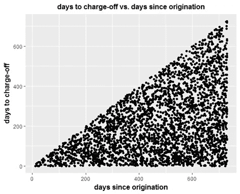
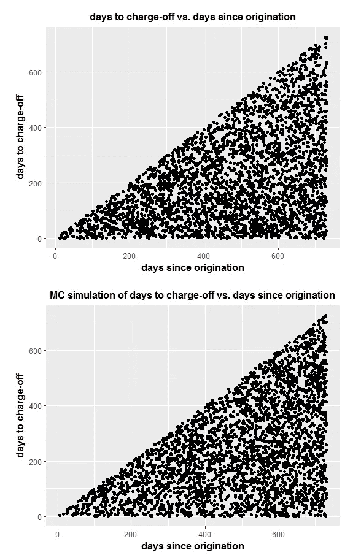

# 随机过程的机器学习模型

> 原文：<https://pub.towardsai.net/machine-learning-model-for-stochastic-processes-c65a96f0b8c5?source=collection_archive---------0----------------------->

## [机器学习](https://towardsai.net/p/category/machine-learning)

## **利用蒙特卡罗模拟预测贷款状况**


**摘要:**使用所提供的 loan_timing.csv 数据集，我们使用蒙特卡洛模拟建立了一个简单的模型，用于预测 3 年贷款期限后将违约的贷款比例。我们的模型揭示了 N = 1000 个数据集复制副本的蒙特卡罗模拟的 95%置信区间为 14.8% +/- 0.2%。根据这些分析，如果发放 50，000 笔贷款，贷款期限为 3 年，则这些贷款中大约有 15%将在贷款期限内违约。

**简介:**预测贷款状况是风险评估中的一个重要问题。银行或金融机构在向客户发放贷款之前，必须能够估计所涉及的风险。数据科学和预测分析在构建可用于预测贷款违约概率的模型中发挥着重要作用。在这个项目中，我们获得了包含 50000 个数据点的 loan_timing.csv 数据集。每个数据点代表一笔贷款，提供两个特征如下:

1.  标题为“ **days since origination** ”的列表示从 origination 到收集数据的日期之间经过的天数。
2.  对于在收集数据之前销账的贷款，标题为“**从发起到销账**的天数”的列表示发起和销账之间经过的天数。对于所有其他贷款，此栏为空白。

**技术术语的定义**

1.  **发放:**借款人收到贷款人贷款的日期。
2.  **冲销(贷款违约)状态:**借款人定期还款，直到借款人在贷款期限结束前停止还款，通常是由于财务困难。这一事件被称为冲销，然后贷款被称为已冲销或处于违约状态。
3.  **当前或活动状态**:借款人在整个贷款期限内继续还款。至此，债务已全部还清。
4.  **贷款期限**:贷款协议生效的期限，在此期限之前或结束时，贷款应得到偿还或重新协商下一个期限。在这个例子中，我们考虑一笔期限为 3 年的贷款。

**项目目标:**该项目的目标是使用数据科学的技术来估计这些贷款( [**loan_timing.csv**](https://github.com/bot13956/Monte_Carlo_Simulation_Loan_Status) 数据集中的 50，000 条客户记录)在 3 年贷款期限内将被冲销的比例。

本文的数据集和 R 代码可以从这个资源库下载:[https://github . com/bot 13956/Monte _ Carlo _ Simulation _ Loan _ Status](https://github.com/bot13956/Monte_Carlo_Simulation_Loan_Status)。

# 使用 R 的模型实现

**导入必要的库**

```
library(readr)
library(tidyverse)
library(broom)
library(caret)
```

**导入数据集**

```
df<-read_csv("loan_timing.csv",na="NA")names(df)=c("origination","chargeoff")**# partition data set into two: default (charged off ) and current**index<-which(!(df$chargeoff=="NA"))default<-df%>%slice(index)current<-df%>%slice(-index)
```

**探索性数据分析**

```
**# Figure 1: Histogram of days since origination for current loans**current%>%ggplot(aes(origination))+geom_histogram(color="white",fill="skyblue")+xlab('days since origination')+ylab('count')+ggtitle("Histogram of days since origination for current loans")+theme(plot.title = element_text(color="black", size=12, hjust=0.5, face="bold"),axis.title.x = element_text(color="black", size=12, face="bold"),axis.title.y = element_text(color="black", size=12, face="bold"),legend.title = element_blank())
```


**图 1:当前贷款发放以来的天数直方图。**

```
**# Figure 2: Histogram of days to charge-off for defaulted loans**default%>%ggplot(aes(chargeoff))+geom_histogram(color="white",fill="skyblue")+xlab('days to charge-off')+ylab('count')+ggtitle("Histogram of days to charge-off for defaulted loans")+theme(plot.title = element_text(color="black", size=12, hjust=0.5, face="bold"),axis.title.x = element_text(color="black", size=12, face="bold"),axis.title.y = element_text(color="black", size=12, face="bold"),legend.title = element_blank())
```


**图 2:违约贷款销账天数柱状图。**

```
**# Figure 3: Histogram of days since origination for defaulted loans**default%>%ggplot(aes(origination))+geom_histogram(color="white",fill="skyblue")+xlab('days since origination')+ylab('count')+ggtitle("Histogram of days since origination for defaulted loans")+theme(plot.title = element_text(color="black", size=12, hjust=0.5, face="bold"),axis.title.x = element_text(color="black", size=12, face="bold"),axis.title.y = element_text(color="black", size=12, face="bold"),legend.title = element_blank())
```


**图 3:违约贷款发放以来的天数直方图。**

图 1 显示了活动贷款的直方图，这些贷款自发放以来均匀分布。

从图 2 中，我们看到，从发放到核销的贷款比例随着天数的增加而减少。这说明越年轻的贷款违约概率越大。它还显示，自发放之日起两年内，100%的贷款违约。

图 3 显示了从发放贷款到收集贷款状态数据之间的违约贷款分布。违约贷款中有很大一部分(71%)是一年或一年以上的贷款。与年轻贷款相比，这些贷款不太可能违约。

```
**# Figure 4: Plot of days to charge-off vs. days since origination for defaulted loans**default%>%ggplot(aes(origination,chargeoff))+geom_point()+xlab('days since origination')+ylab('days to charge-off')+ggtitle("days to charge-off vs. days since origination")+theme(plot.title = element_text(color="black", size=12, hjust=0.5, face="bold"),axis.title.x = element_text(color="black", size=12, face="bold"),axis.title.y = element_text(color="black", size=12, face="bold"),legend.title = element_blank())
```



**图 4:违约贷款的冲销天数与发放后天数的关系图。**

**模型选择:**我们的数据集只有 2 个特征或预测器，并且存在普遍性问题:93%的贷款处于活跃状态，而 7%处于违约状态。使用线性回归来预测 3 年贷款期限后已冲销的贷款比例，会产生一个偏向于活跃贷款的模型。

图 4 显示了可以使用蒙特卡罗(MC)模拟来模拟违约贷款的冲销天数和发放天数之间的关系。因此，我们选择 MC 模拟作为我们预测贷款违约比例的模型。

**模型计算:**我们生成了违约贷款的 MC 模拟，并将其与原始数据进行了比较。

```
**# Monte Carlo Simulation of Defaulted Loans**set.seed(2)N <- 3*365 # loan duration in daysdf_MC<-data.frame(u=round(runif(15500,0,N)),v=round(runif(15500,0,N)))df_MC<-df_MC%>%filter(v<=u)df_MC<-df_MC%>%filter(u<=730 & v<=730) #select loans within first 2 yearsdf_MC[1:nrow(default),]%>%ggplot(aes(u,v))+geom_point()+xlab('days since origination')+ylab('days to charge-off')+ggtitle("MC simulation of days to charge-off vs. days since origination")+theme(plot.title = element_text(color="black", size=12, hjust=0.5, face="bold"),axis.title.x = element_text(color="black", size=12, face="bold"),axis.title.y = element_text(color="black", size=12, face="bold"),legend.title = element_blank())
```



**图 5:原始和 MC 模拟的销账天数与自发起以来的天数。**

因为存在与贷款冲销相关的随机性，我们看到 MC 模拟为违约贷款的分布提供了一个很好的近似。

**预测:**由于我们已经证明，在最初 2 年(即 0 至 730 天)中，可以使用 MC 模拟来近似计算待核销天数和自发放起的天数之间的关系，因此我们可以使用 MC 模拟来预测在所有 3 年期限结束时将被核销的贷款比例。

我们数据集中冲销贷款的总数是 3，305。这意味着目前有 46，695 笔贷款处于活跃状态。在这些活跃的贷款中，一定比例的贷款将在 3 年内违约。为了估计违约贷款的总比例，我们模拟了涵盖整个贷款期限(即 0 至 1095 天)的违约贷款的冲销和自发放以来的天数，然后通过适当的缩放，我们计算了在 3 年期限(即 1095 天)后将冲销的贷款比例。

```
**# Predicting fraction of these loans will have charged off by the time all of their 3-year term is finished.**set.seed(2)B<-1000fraction<-replicate(B, {df2<-data.frame(u=round(runif(50000,0,N)),v=round(runif(50000,0,N)))df2<-df2%>%filter(v<=u)b2<-(df2%>%filter(u<=730 & v<=730))total<-(nrow(df2)/nrow(b2))*nrow(default)100.0*(total/50000.0)})mean(fraction)**# Histogram of total fraction of charged off loans**fdf<-data.frame(fraction=fraction)fdf%>%ggplot(aes(fraction))+geom_histogram(color="white",fill="skyblue")+xlab('fraction of charged off loans after 3-year term')+ylab('count')+ggtitle("Histogram of total fraction of charged off loans")+theme(plot.title = element_text(color="black", size=12, hjust=0.5, face="bold"),axis.title.x = element_text(color="black", size=12, face="bold"),axis.title.y = element_text(color="black", size=12, face="bold"),legend.title = element_blank())**# Calculate Confidence Interval of Percentage of Defaulted Loans after 3-year term**mean<-mean(fraction)sd<-sd(fraction)confidence_interval<-c(mean-2*sd, mean+2*sd)confidence_interval
```

通过创建 1000 个随机试验，我们获得了 3 年期违约贷款比例的以下分布:


**图 6:使用 N = 1000 个样本的 3 年期后冲销贷款比例直方图。**

根据我们的计算，3 年贷款期限后将被冲销的贷款部分的 95%置信区间相应地为 14.8% +/- 0.2%。因此，如果发放贷款期限为 3 年的 50，000 笔贷款，这些贷款中大约有 15%将会违约。

**结论:**我们提出了一个基于 MC 模拟的简单模型，用于预测在 3 年贷款期限结束时违约的贷款比例。蒙特卡洛模拟是一种重要的方法，可用于规定分析中，规定在数据集本质上非常随机的情况下要采取的行动过程。

本文的数据集和 R 代码可以从这个资源库下载:[https://github . com/bot 13956/Monte _ Carlo _ Simulation _ Loan _ Status](https://github.com/bot13956/Monte_Carlo_Simulation_Loan_Status)。