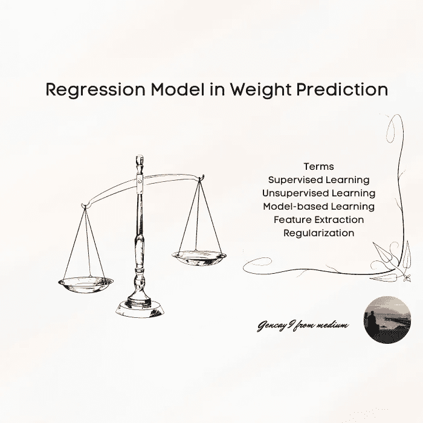
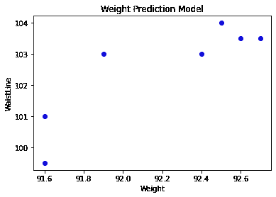
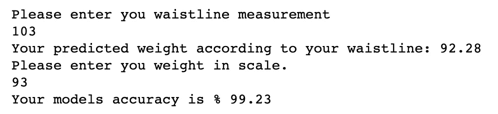
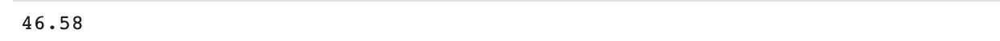
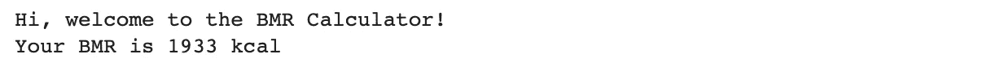
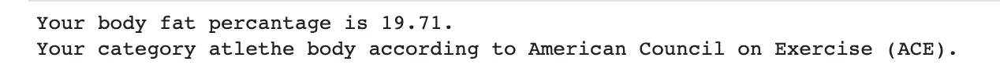

# 体重预测中的回归模型

> 原文：<https://pub.towardsai.net/machine-learning-model-in-weight-prediction-b22a4cb77e2c?source=collection_archive---------0----------------------->

机器学习模型预测



作者图片

# 介绍

ata 科学家已经知道太多机器学习的工业应用。但是现实生活中的问题呢，比如减肥或者保持健康？时不时地，许多人都在为减肥或保持身材而挣扎。有无尽的饮食，补充，和膳食替代计划，确保减肥。这些有科学依据的策略确实对体重管理有影响。

但是我们如何确保达到我们的目标呢？

对我来说，像许多其他问题一样，这是一个数字游戏。

> 你不能改进你没有测量的东西。

这就是为什么，我一直在记录我的尺寸，比如腰围和体重。

顺便说一句，你可以跳进任何你喜欢的地方；

[简介](#2e9f)
∘ [简单线性回归预测体重](#0b2d)
∘ [剔除异常值](#96b5)
∘ [应用线性模型](#787e)
∘ [评估](#9c33)
[body cal](#5c0a)
∘[安装](#47c4)
∘ [BMI —体重](#d2be)
∘ [BMR —基础代谢率](#40aa)

有一天，在测量了我的腰围后，我想知道，我是否可以据此预测我的体重。

当然作为一个数据科学家和机器学习工程师，很明显这是一个简单的线性回归问题。

所以我试着编码我的问题。

(这里是我完整的[代码](https://github.com/gncll/body-calculator/blob/main/Simple%20Linear%20Regression%20in%20Weight%20Prediction.ipynb))

首先我上传必要的库，我会一步一步给你解释。

## 简单的线性回归来预测你的体重

```
import pandas as pd
import numpy as np
from sklearn import linear_model
import bodycal
import matplotlib.pyplot as plt
```

就这么简单，之后我写下我之前的测量值来填充我的模型。

```
df1 = pd.DataFrame({'Weight': [90.9, 91.6 , 91.6, 92.4, 92.6, 91.9, 92.5, 92.7],
                    'WaistLine': [100, 99.5, 101, 103, 103.5, 103,104, 103.5]},
                        index=[0, 1, 2, 3, 4 , 5, 6,7 ])
```

在创建我的数据框架后，重要的是要看看是否有离群值，这可能会超过我的模型的效率。

一种方法是

```
plt.scatter(df1['Weight'],df1['WaistLine'] ,  color='blue')
plt.title("Weight Prediction Model")
plt.xlabel('Weight')
plt.ylabel('WaistLine')
plt.show()
```


来源:图片由作者提供。

## 移除异常值

如果你想去除那个异常值，一个奇特的方法是:

```
df2 = df1[df1['Weight'] > 91.00]
plt.scatter(df2['Weight'],df2['WaistLine'] ,  color='blue')
plt.title("Weight Prediction Model")
plt.xlabel('Weight')
plt.ylabel('WaistLine')
plt.show()
```



来源:图片由作者提供。

## 应用线性模型

现在是时候应用我们的线性模型了。

```
regr = linear_model.LinearRegression()
y = np.asanyarray(df1['Weight'])
x = np.asanyarray(df1['WaistLine'])
regr.fit(x.reshape(-1, 1), y)
```

我们确实改变了 x 值，因为这是一个简单的线性回归模型。

如果要添加额外的测量值，如臀部的测量值，以使模型更清晰，请应用多元线性回归模型。

看起来是这样的。

```
regr = linear_model.LinearRegression()
y = np.asanyarray(df1['Weight'])
x = np.asanyarray(df1['WaistLine'],['Hip'])
regr.fit(x.reshape(-1, 1), y)
```

## 估价

现在，让我们把模型变得更好。

为此，首先，我们将通过输入我们的腰围尺寸来预测我们的体重。

这将是很好的输入它浮动，因为你的腰围测量可以有一个小数。

```
print("Please enter you waistline measurement")
d = float(input())
```

现在是时候用它来做一个预测了，看看输出是不是很好，用 2 个小数来舍入是个好主意，并相应地打印出来。

```
b  = regr.predict([[d]])[0]
b = round(b,2)
print("Your predicted weight according to your waistline: {}".format(b))
```

现在是时候在现实中评估我们的模型了。

```
print("Please enter you weight in scale.")
c = float(input())
a = (1- abs((b - c) / c)) * 100
a = round(a,2)
print("Your models accuracy is % {}".format(a))
```

现在你明白代码了。所以你可以完整地运行它。

```
print("Please enter you waistline measurement")
d = float(input())
b  = regr.predict([[d]])[0]
b = round(b,2)
print("Your predicted weight according to your waistline: {}".format(b))
print("Please enter you weight in scale.")
c = float(input())
a = (1- abs((b - c) / c)) * 100
a = round(a,2)
print("Your models accuracy is % {}".format(a))
```

运行脚本后，您的输出应该是这样的；



# bodycal


来源:作者图片[。](https://github.com/gncll/body-calculator)

深入研究之后，我做了一些关于人体测量的研究。

从那以后，我的研究变成了我的热情，我尝试用 Python 写一个库，它主要包括 3 个函数(身体质量指数，BMR，脂肪百分比),并根据你的公制和性别而不同。

[bodycal](https://github.com/gncll/body-calculator)

## 装置

```
pip install bodycal
```

## 身体质量指数—身体质量

在计算身体质量指数时，重要的是要看到你必须保持健康的范围。

如果你不在这个范围内，那么知道你要减掉多少体重是至关重要的。

此外，bmi_kg 函数有两个参数，它们是您的测量值；

*   重量
*   高度

```
bodycal**.**bmi_kg(100,185)
```



另外，你可以找到这个函数的解释

这又回到了你的身体质量指数范畴，理想的体重范围，也就是你必须减肥的公斤数

```
bodycal**.**bmi_kg_exp(100,185)
```


这又回到了你的身体质量指数范畴，理想的体重范围，也就是你必须减肥的公斤数。

## 基础代谢率

它测量了你的身体保持活力和正常运转所需的能量——‌in 卡路里。

该函数有 3 个参数，分别是:

*   重量
*   高度
*   年龄

```
bodycal**.**bmr_male_cm_exp(85,185,32)
```



## 体脂百分比-

这是美国海军使用的体脂百分比计算公式。

男女之间的计算方式不同。

对于男性，此函数有三个参数:

的测量；

*   腹部
*   脖子
*   高度

让我给你举个例子

```
bodycal**.**fat_perc_male_cm(100,38,93)
```

但是如果你想深入挖掘并得到一个解释:


```
bodycal**.**fat_perc_female_cm_exp(70,100,38,185)
```



脂肪百分比公式对女性进行了 4 次测量

*   腹部
*   臀部
*   脖子
*   高度

# 结论

所以正如我之前所说，我相信在生活中我们可以通过衡量并据此制定计划来实现我们的大部分目标，并在此之后继续衡量。

如果你想查找更多关于 bodycal 的信息，这里是[链接](https://github.com/gncll/body-calculator)

谢谢！