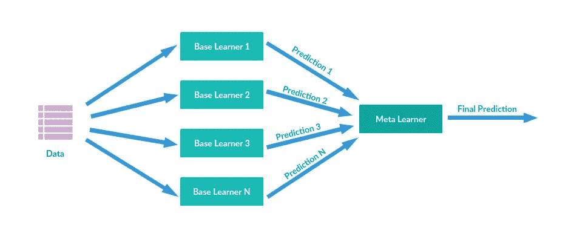

# Python 中的机器学习模型堆栈

> 原文：<https://pub.towardsai.net/machine-learning-model-stacking-in-python-f7c7068efe3f?source=collection_archive---------1----------------------->

## [机器学习](https://towardsai.net/p/category/machine-learning)

## 了解如何使用堆叠来提高模型性能

> 堆叠是一种集成学习，其中多层模型用于最终预测。更具体地说，我们使用一些第一级模型预测训练集(以类似 CV 方式)和测试集，然后使用这些预测作为第二级模型的特征。

我们可以在 python 中使用一个名为“Vecstack”的库来实现。该库由 Igor Ivanov 开发，于 2016 年发布。在这篇文章中，我们将看看这个库对于一个分类问题的基本实现。



将多个模型的输出合并为一个

可以使用以下方式安装该库:

```
pip install vecstack
```

接下来，我们导入它:

```
from vecstack import stacking
```

首先，我们将创建单独的模型并执行超参数调整，以找出所有模型的最佳参数。为了避免过度拟合，我们应用交叉验证将数据分成 5 份，并计算 roc_auc 得分的平均值。

1.  决策树分类器:

```
#Hyperparameter tuning for decision tree classifierclf = DecisionTreeClassifier()
parameters={'min_samples_split' : np.arange(10,100,10),'max_depth': np.arange(1,20,2)}
clf_random = RandomizedSearchCV(clf,parameters,n_iter=15 , scoring = 'roc_auc' , cv =5 , verbose = True)
clf_random.fit(x_train, y_train)#Best parameters 
{'min_samples_split': 70, 'max_depth': 9}#mean roc_auc score
0.8142247920534071
```

*同样，*

2.随机森林分类器:

```
#Best parameters
{'min_samples_split': 90, 'max_depth': 9}#mean roc_auc score
0.8051500705643935
```

3.多层感知器分类器；

```
#Best parameters
{'max_iter': 100, 'learning_rate': 'constant', 'hidden_layer_sizes': (20, 7, 3), 'activation': 'tanh'}#mean roc_auc score0.8017714839042659
```

4.KNeighbours 分类器:

```
#Best parameters
{'weights': 'distance', 'n_neighbors': 7}#mean roc_auc score
0.7013120709379057
```

5.支持向量机分类器；

```
#Best parameters
{'max_iter': 700}#mean roc_auc score
0.8672302452275072
```

接下来，我们为堆叠模型创建一个基础层，绕过上面提到的所有模型。我们希望用一些第一级模型预测训练集和测试集，然后使用这些预测作为第二级模型的特征。任何模型都可以用作一级模型或二级模型。

```
# 1st level modelsmodels = [KNeighborsClassifier(n_neighbors= 3) ,  
          DecisionTreeClassifier(min_samples_split= 70,max_depth=9), 
          RandomForestClassifier(min_samples_split= 90,max_depth=9),
          MLPClassifier(max_iter= 100, learning_rate='constant',hidden_layer_sizes= (20, 7, 3), activation= 'tanh') , 
          LinearSVC(max_iter= 700) ]

S_Train, S_Test = stacking(models,                   
                           x_train, y_train ,x_test ,   
                           regression=False, 

                           mode='oof_pred_bag', 

                           needs_proba=False,

                           save_dir=None, 

                           metric= roc_auc_score, 

                           n_folds=4, 

                           stratified=True,

                           shuffle=True,  

                           random_state=0,    

                           verbose=2)
```

接下来，我们将这些模型的预测作为输入传递给我们的第 2 层模型，在这种情况下是 MLP 分类器。我们还对这个模型进行了超参数调整和交叉验证。

```
mlp = MLPClassifier()
parameters = {'hidden_layer_sizes':[(10,5,3), (20,7,3)], 'activation':['tanh', 'relu'], 'learning_rate':['constant', 'adaptive'], 'max_iter' :[100, 150]}
mlp_random = RandomizedSearchCV(mlp,parameters,n_iter=15 , scoring = 'roc_auc' , cv =5 , verbose = True)
mlp_random.fit(S_Train , y_train)
grid_parm=mlp_random.best_params_
print(grid_parm)
print(mlp_random.best_score_)
```

最终模型的 Roc_Auc 得分的平均值是**0.93065863861**

**结论:**

因此，使用堆叠，我们能够将模型的性能提高至少 7%！堆叠是一种将多个模型的优势结合成一个强大模型的方法。话虽如此，堆叠可能并不总是最好的做法，因为它涉及大量使用计算资源，并且必须根据业务案例、时间和资金来决定是否使用它。对这个库的开发者伊戈尔·伊万诺夫来说，这是一个非常棒的工作。