# 使用 Python 对数据进行机器学习建模

> 原文：<https://pub.towardsai.net/machine-learning-modeling-data-with-python-92bfebfe4052?source=collection_archive---------0----------------------->

## [机器学习](https://towardsai.net/p/category/machine-learning)

## 回归和分类算法

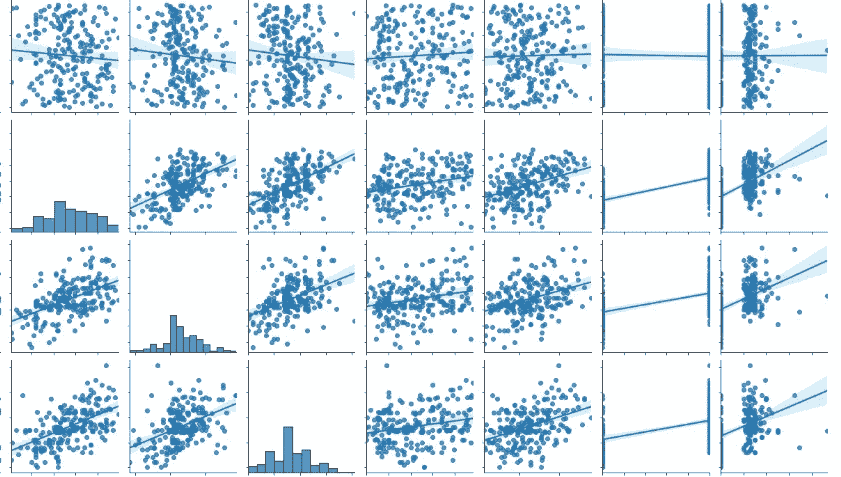

作者的照片

在本文中，我们将分析校园安置数据，以深入了解数据中学生被安置的因素。由于数据非常少，有点不平衡，我们尝试做 EDA 和机器学习建模，以获得更好的结果。

数据集包含百分比、分数、课程专业、经验等。有两个输出列，即对于回归，我们可以将工资作为输出，对于分类，我们可以将状态作为输出。

让我们导入所有需要的库。

```
*# Import Libraries*

**import** **pandas** **as** **pd**

**import** **matplotlib.pyplot** **as** **plt**
**import** **numpy** **as** **np**
**from** **sklearn.metrics** **import** log_loss, confusion_matrix
**import** **seaborn** **as** **sns**

**from** **sklearn.neighbors** **import** KNeighborsClassifier

**from** **sklearn.metrics** **import** roc_curve, auc , precision_score , classification_report

**from** **sklearn.tree** **import** DecisionTreeClassifier

**import** **warnings**
warnings.filterwarnings('ignore')

**from** **sklearn.metrics** **import** confusion_matrix

**from** **sklearn.multiclass** **import** OneVsRestClassifier
```

阅读并查看数据集。

```
df = pd.read_csv('Placement_Data_Full_Class.csv')
df
```

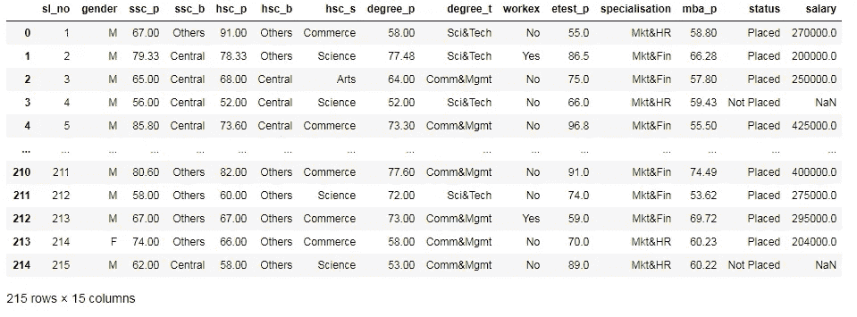

作者的照片

现在，我们将做一些探索性的数据分析。

```
df.info()#output:
<class 'pandas.core.frame.DataFrame'>
RangeIndex: 215 entries, 0 to 214
Data columns (total 15 columns):
 #   Column          Non-Null Count  Dtype  
---  ------          --------------  -----  
 0   sl_no           215 non-null    int64  
 1   gender          215 non-null    object 
 2   ssc_p           215 non-null    float64
 3   ssc_b           215 non-null    object 
 4   hsc_p           215 non-null    float64
 5   hsc_b           215 non-null    object 
 6   hsc_s           215 non-null    object 
 7   degree_p        215 non-null    float64
 8   degree_t        215 non-null    object 
 9   workex          215 non-null    object 
 10  etest_p         215 non-null    float64
 11  specialisation  215 non-null    object 
 12  mba_p           215 non-null    float64
 13  status          215 non-null    object 
 14  salary          148 non-null    float64
dtypes: float64(6), int64(1), object(8)
memory usage: 25.3+ KB
```

映射集群的状态列

```
#replacing status column categories to 0 and 1
df['status'] = df['status'].map({"Placed":1, "Not Placed":0})

#filling null values in salary with 0
df.salary.fillna(0,inplace=**True**)

df.head()
```

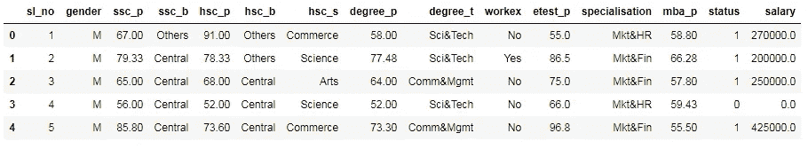

作者的照片

检查数据集中缺失的值

```
*#missing values*
df.isna().sum()#output:
sl_no             0
gender            0
ssc_p             0
ssc_b             0
hsc_p             0
hsc_b             0
hsc_s             0
degree_p          0
degree_t          0
workex            0
etest_p           0
specialisation    0
mba_p             0
status            0
salary            0
dtype: int64
```

检查分类的状态列

```
sns.countplot(x="status", palette="dark", data=df);
```

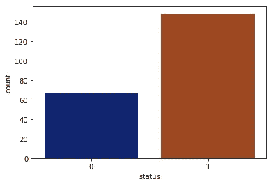

作者的照片

使用 seaborn 库的 pairplot 对数据进行可视化检查

```
sns.pairplot(data=df, kind="reg");
```

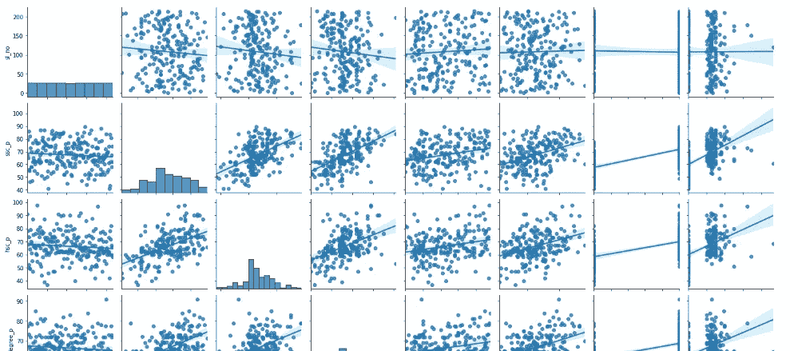

作者的照片

基于性别检查工资

```
placed = df[df["status"]==1][["gender","salary", "workex"]]

sns.catplot(y="salary", x="gender", kind="swarm", palette="dark"
                                                  ,data=placed);
```

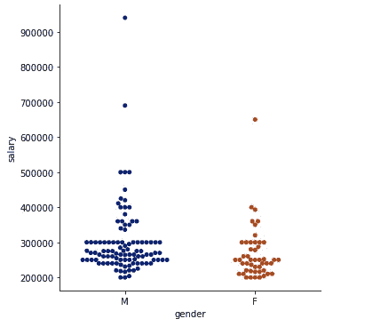

猫图。作者的照片

男性似乎比女性更倾向于高薪。

[](/machine-learning-16c8ccc2c7b8) [## 无监督学习中不同类型的聚类方法

pub.towardsai.net](/machine-learning-16c8ccc2c7b8) 

## 数据预处理

需要对分类特征进行标签编码

```
**from** **sklearn.preprocessing** **import** LabelEncoder
le=LabelEncoder()
**for** i **in** categorical:
    df[i]=le.fit_transform(df[i])df
```

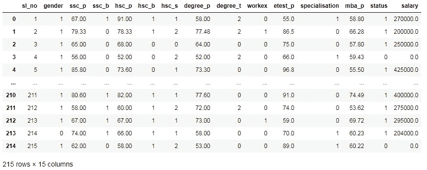

作者的照片

我们可以在上面的数据中看到，特征已经被标注，准备进入机器学习建模。

## 回归

```
df_reg_x = df.drop(['sl_no','salary'],1)
df_reg_y = df.salary**from** **sklearn.model_selection** **import** train_test_split
X_train, X_test, y_train, y_test = train_test_split(df_reg_x, df_reg_y, test_size = 0.15)**from** **sklearn.preprocessing** **import** StandardScaler
sc = StandardScaler()
X_train = sc.fit_transform(X_train)
X_test = sc.transform(X_test)sc_y = StandardScaler()y_train = sc_y.fit_transform(np.array(y_train).reshape(-1,1))y_test = sc_y.transform(np.array(y_test).reshape(-1,1))
```

1.  线性回归

```
**from** **sklearn.linear_model** **import** LinearRegressionmodel1 = LinearRegression()
model1.fit(X_train,y_train)
y_pred = model1.predict(X_test)**from** **sklearn.metrics** **import** mean_squared_error, r2_scoreprint('MSE of Linear Regressor Model--->' ,
                             mean_squared_error(y_test,y_pred))
print('r2_score of Linear Model--->' , r2_score(y_test,y_pred))#output:
MSE of Linear Regressor Model---> 0.06942385507687932
r2_score of Linear Model---> 0.9073385898967523
```

2.近邻回归量

```
**from** **sklearn.neighbors** **import** KNeighborsRegressorneigh = KNeighborsRegressor(n_neighbors=11)
neigh.fit(X_train, y_train)
y_pred = neigh.predict(X_test)**from** **sklearn.metrics** **import** mean_squared_error, r2_scoreprint('MSE of KNeighbors Regressor Model--->' ,
                       mean_squared_error(y_test,y_pred))
print('r2_score of Linear Model--->' , r2_score(y_test,y_pred))#output:
MSE of KNeighbors Regressor Model---> 0.29273900427438526
r2_score of Linear Model---> 0.6092753867061032
```

3.决策树回归器

```
**from** **sklearn.tree** **import** DecisionTreeRegressorregressor = DecisionTreeRegressor()
regressor.fit(X_train, y_train)
y_pred = regressor.predict(X_test)print('MSE of DecisionTree Regressor Model--->' , 
                     mean_squared_error(y_test,y_pred))
print('r2_score of Linear Model--->' , r2_score(y_test,y_pred))#output:
MSE of DecisionTree Regressor Model---> 0.13344250885495113
r2_score of Linear Model---> 0.8218916102466214
```

## 分类

```
df_class_x = df.drop(['salary','sl_no','status'],1)
df_class_y = df.status**from** **sklearn.model_selection** **import** train_test_split
X_train, X_test, y_train, y_test = train_test_split(df_class_x,
           df_class_y, stratify=df_class_y, test_size = 0.15)
```

1.  逻辑回归

```
**from** **sklearn.linear_model** **import** LogisticRegression
**from** **sklearn.metrics** **import** roc_auc_score
**from** **sklearn.model_selection** **import** GridSearchCVparameters = [{'C': [10**x **for** x **in** range(-4,5)]}]
K =[10**x **for** x **in** range(-4,5)]
K = np.log10(K)

log= LogisticRegression(penalty='l2')
clf = GridSearchCV(log, parameters, cv=5, scoring='roc_auc',return_train_score=**True**)
clf.fit(X_train, y_train)

train_auc= clf.cv_results_['mean_train_score']
train_auc_std= clf.cv_results_['std_train_score']
cv_auc = clf.cv_results_['mean_test_score'] 
cv_auc_std= clf.cv_results_['std_test_score']
lamb= clf.best_params_
lamb = list(lamb.values())[0]
plt.figure(figsize=(10, 7))

plt.plot(K, train_auc, label='Train AUC')

plt.gca().fill_between(K,train_auc - train_auc_std,train_auc + train_auc_std,alpha=0.2,color='darkblue')

plt.plot(K, cv_auc, label='CV AUC')

plt.gca().fill_between(K,cv_auc - cv_auc_std,cv_auc + cv_auc_std,alpha=0.2,color='darkorange')
plt.scatter(K, train_auc, label='Train AUC points')
plt.scatter(K, cv_auc, label='CV AUC points')
plt.grid(**True**)
plt.legend()
plt.xlabel("C: hyperparameter")
plt.ylabel("AUC")
plt.title("ERROR PLOTS")
plt.show()
print('The best value of C is : ' , lamb)
```

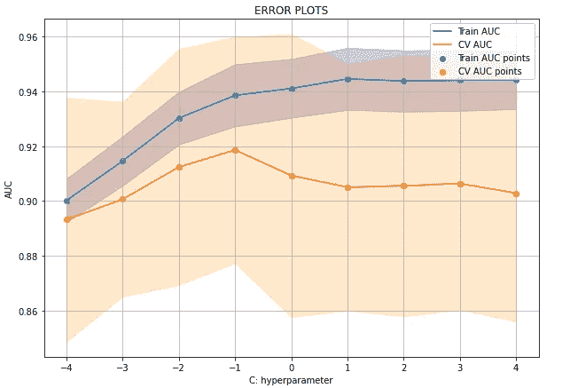

训练和测试 AUR 曲线。作者的照片

C 的最佳值是:0.1

最佳超参数拟合模型

```
log= LogisticRegression(penalty='l2',C = 0.001)
log.fit(X_train,y_train)
train_fpr, train_tpr, thresholds = roc_curve(y_train, 
                             log.predict_proba(X_train)[:,1])
test_fpr, test_tpr, thresholds = roc_curve(y_test,
                             log.predict_proba(X_test)[:,1])
plt.plot(train_fpr, train_tpr, label="train AUC 
                      ="+str(auc(train_fpr, train_tpr)))
plt.plot(test_fpr, test_tpr, label="test AUC ="+str(auc(test_fpr,
                                      test_tpr)))
plt.legend()
plt.grid(**True**)
plt.xlabel("False Positive Rate")
plt.ylabel("True Positive Rate")
plt.title("ROC Curve")
plt.plot([0, 1], [0, 1],'r--')
plt.xlim([0, 1])
plt.ylim([0, 1])
plt.show()
```

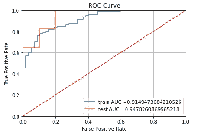

ROC 曲线。作者的照片

打印分类报告

```
y_pred = log.predict(X_test)
print (classification_report(y_test,y_pred))
```

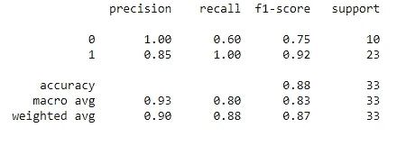

作者的照片

混淆矩阵

```
heatmap(confusion_matrix(y_test,y_pred),
                         annot=**True**,fmt="d",cmap='Blues')
```

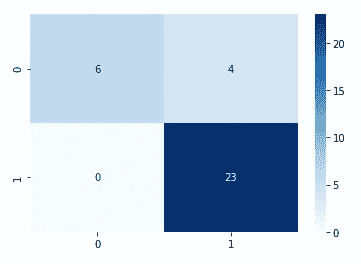

作者的照片

## 结论:

在校正不平衡的数据集之后，可以应用回归和分类算法。

我希望你喜欢这篇文章。通过我的 [LinkedIn](https://www.linkedin.com/in/data-scientist-95040a1ab/) 和 [twitter](https://twitter.com/amitprius) 联系我。

# 推荐文章

[1。NLP —零到英雄与 Python](https://medium.com/towards-artificial-intelligence/nlp-zero-to-hero-with-python-2df6fcebff6e?sk=2231d868766e96b13d1e9d7db6064df1)
2。 [Python 数据结构数据类型和对象](https://medium.com/towards-artificial-intelligence/python-data-structures-data-types-and-objects-244d0a86c3cf?sk=42f4b462499f3fc3a160b21e2c94dba6)3 .[Python 中的异常处理概念](/exception-handling-concepts-in-python-4d5116decac3?source=friends_link&sk=a0ed49d9fdeaa67925eac34ecb55ea30)
4。[为什么 LSTM 在深度学习方面比 RNN 更有用？](/deep-learning-88e218b74a14?source=friends_link&sk=540bf9088d31859d50dbddab7524ba35)
5。[神经网络:递归神经网络的兴起](/neural-networks-the-rise-of-recurrent-neural-networks-df740252da88?source=friends_link&sk=6844935e3de14e478ce00f0b22e419eb)
6。[用 Python](https://medium.com/towards-artificial-intelligence/fully-explained-linear-regression-with-python-fe2b313f32f3?source=friends_link&sk=53c91a2a51347ec2d93f8222c0e06402)
7 全面讲解了线性回归。[用 Python](https://medium.com/towards-artificial-intelligence/fully-explained-logistic-regression-with-python-f4a16413ddcd?source=friends_link&sk=528181f15a44e48ea38fdd9579241a78)
充分解释了 Logistic 回归 8。[concat()、merge()和 join()与 Python](/differences-between-concat-merge-and-join-with-python-1a6541abc08d?source=friends_link&sk=3b37b694fb90db16275059ea752fc16a)
的区别 9。[与 Python 的数据角力—第一部分](/data-wrangling-with-python-part-1-969e3cc81d69?source=friends_link&sk=9c3649cf20f31a5c9ead51c50c89ba0b)
10。[机器学习中的混淆矩阵](https://medium.com/analytics-vidhya/confusion-matrix-in-machine-learning-91b6e2b3f9af?source=friends_link&sk=11c6531da0bab7b504d518d02746d4cc)