# Python 之前的机器学习第 1 部分&数据可视化

> 原文：<https://pub.towardsai.net/machine-learning-prior-part-1-data-visualization-ba6155bf118?source=collection_archive---------4----------------------->

## Matplotlib 和 Seaborn 进行了简单的解释和比较

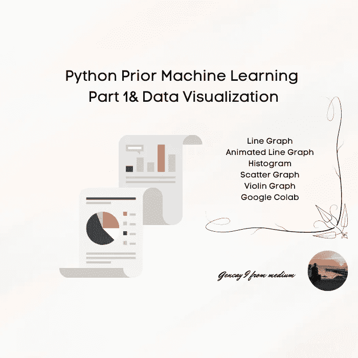

作者图片

```
**Content Table
·** [**Introduction**](#a7a3)
**·** [**Line Graph**](#4316)
  ∘ [Matplotlib](#e46c)
  ∘ [Seaborn](#7084)
  ∘ [Animated Line Graph](#f3cc)
**·** [**Histogram**](#821a)
  ∘ [Matplotlib](#1c24)
  ∘ [Seaborn](#cd45)
**·** [**Scatter Graph**](#0696)
  ∘ [Matplotlib](#4aa6)
  ∘ [Seaborn](#b906)
·[**Violin Graph**](#7b0e)
  ∘ [Matplotlib](#c977)
  ∘ [Seaborn](#cf96)
**·** [**Conclusion**](#9b07)
```

# 介绍

大家好。

在我的机器学习系列中，我试图向你们解释机器学习背后的逻辑。

[](/machine-learning-a-z-briefly-explained-4ff86bd81e3a) [## 机器学习 A-Z 简要说明

### 在这篇文章中，我试着向你简单解释一下机器学习 A-Z。

pub.towardsai.net](/machine-learning-a-z-briefly-explained-4ff86bd81e3a) [](/machine-learning-a-z-briefly-explained-part-2-61191a01c235) [## 机器学习 A-Z 简要解释了第 2 部分

### 提神和快速回忆

pub.towardsai.net](/machine-learning-a-z-briefly-explained-part-2-61191a01c235) 

显而易见，我也总是说，机器学习是不同文化的结合。

主要是；

*   统计数字
*   编程；编排
*   结石

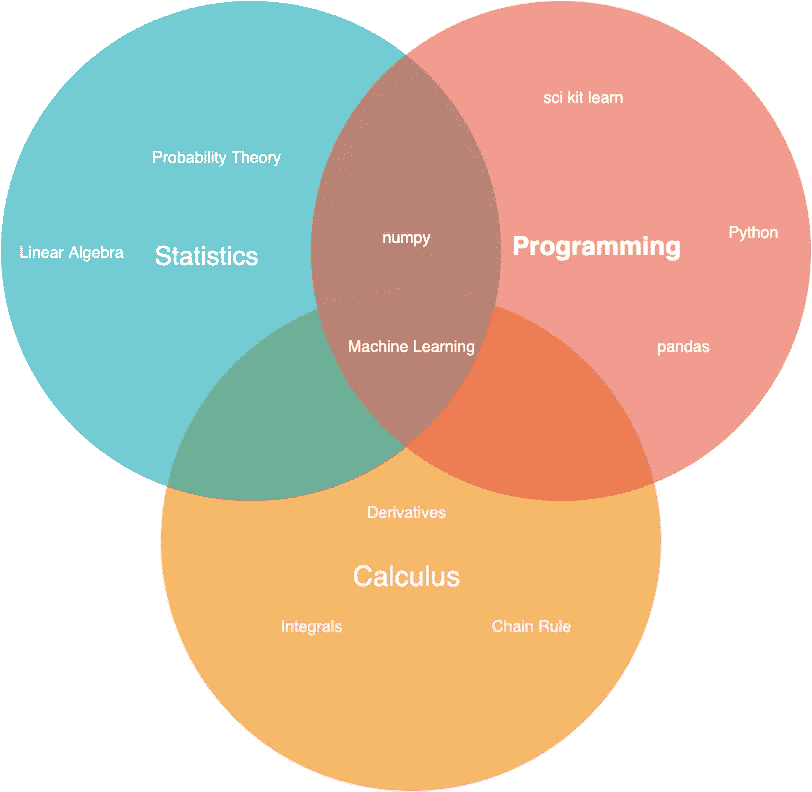

作者图片

在下面的文章中，我解释了机器学习中使用的大多数统计术语。

[](/statistics-for-machine-learning-a-z-66a82fbf2622) [## 机器学习统计学 A-Z

### 简要说明

pub.towardsai.net](/statistics-for-machine-learning-a-z-66a82fbf2622) [](/statistics-for-machine-learning-a-z-part-2-fef63089b09d) [## 机器学习统计学 A-Z 第 2 部分

### 简要说明

pub.towardsai.net](/statistics-for-machine-learning-a-z-part-2-fef63089b09d) 

现在在这个简短的课程中，我试着向你们解释 Python 中机器学习的编码过程。

在 Python 中，我把这个过程分为四个部分。

*   数据可视化-***Matplotlib&Seaborn***
*   数据分析- ***熊猫***
*   熟悉数据类型- ***Numpy***
*   建筑模型-***Scikit-学习***

还有，我把模型类型分为三种，分别是；

*   回归
*   分类
*   使聚集

[](/regression-a-z-briefly-explained-618e5d5c89f8) [## 回归 A-Z 简要说明

### 快速和提醒的备忘单，用于刷新

pub.towardsai.net](/regression-a-z-briefly-explained-618e5d5c89f8) [](https://medium.com/mlearning-ai/classification-a-z-briefly-explained-25ca811ab4e4) [## 分类 A-Z 简要说明

### 人工智能大三大四学生提醒备忘单

medium.com](https://medium.com/mlearning-ai/classification-a-z-briefly-explained-25ca811ab4e4) 

*一篇聚类文章即将面世**

现在，数据可视化和图表类型可以有很多种，但我决定向您解释最常见的类型，因为这是一篇简要的解释文章。

我还会用 Matplotlib 和 Seaborn 编写这个图表，它们是 Python 中最常见的可视化工具。

# 线图

线形图通常用于观察时间上的变化。

## Matplotlib

首先，通过 loading 和 seaborn 下载数据，并使用 load_dataset 方法。

然后删除分类列，并相应地绘制一个图表。

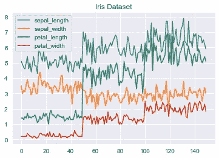

作者图片

## 海生的

就像后一段代码一样，

*   通过 loading 和 seaborn 下载数据
*   Load_dataset 方法，删除分类列并
*   通过选择 x 和 y 绘制相应的线图。
*   [求更](https://seaborn.pydata.org/generated/seaborn.lineplot.html)

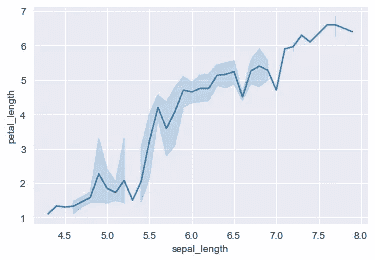

作者图片

## 动画线图

如果你想看一个动画图表；

*   加载库
*   对值进行排序
*   设置 png 的数量大小，这将创建你的动画线图的 gif。
*   写一个循环。
*   保存你的 gif。

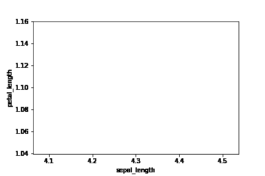

作者图片

# 柱状图

看数据密度和分布的重要图形。

## Matplotlib

现在让我们一步一步来解释

*   下载并加载数据
*   定义 fig 和 ax。
*   定义直方图和柱形图。
*   设置标题、x 和 y 标签
*   定义阈值，并相应地画线。
*   更多[论据](https://matplotlib.org/stable/api/_as_gen/matplotlib.pyplot.axhline.html)。

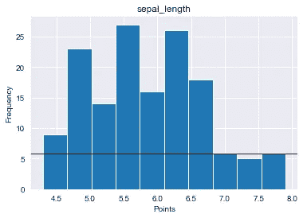

作者图片

## 海生的

这里是[的源头 *distplot。*](https://seaborn.pydata.org/generated/seaborn.distplot.html)

*   导入库。
*   加载数据集
*   定义列名
*   ***kde-*** 绘制高斯核密度与否。
*   ***面元-*** 直方图面元宽度

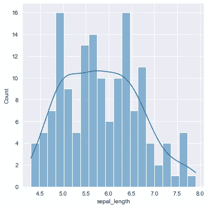

作者图片

# 发散图

要将数据点视为文字点，散点图是一种有用的图表类型。

## Matplotlib

*   下载必要的库和数据集。
*   设置标题和网格选项
*   有关散点图的更多信息，请参见 [matplotlib](https://matplotlib.org/stable/api/_as_gen/matplotlib.pyplot.scatter.html) 。

## 海生的

*   下载必要的库和数据集。
*   设置背景[样式。](https://seaborn.pydata.org/generated/seaborn.set_style.html)
*   设定图例等，求[更求](https://seaborn.pydata.org/generated/seaborn.FacetGrid.html)

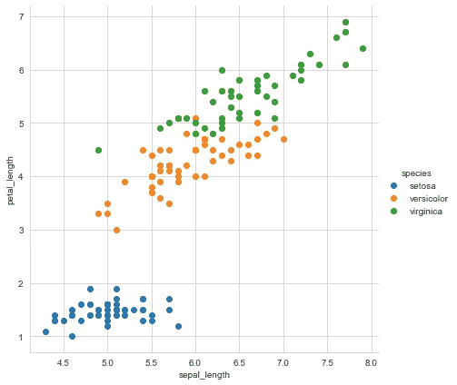

作者图片

# 小提琴图

这是小提琴图的快速汇总。

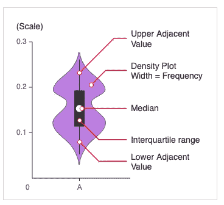

[参考](https://datavizcatalogue.com/methods/violin_plot.html)

## Matplotlib

*   加载库和下载数据
*   选择虹膜萼片长度列并观察。
*   求[更求](https://matplotlib.org/stable/api/_as_gen/matplotlib.axes.Axes.violinplot.html)。

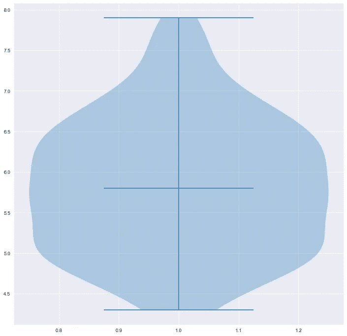

作者图片

## 海生的

*   导入 Seaborn 和数据集。
*   选择前 100 列来比较 setosa 和 versicolor。
*   选择萼片和花瓣长度。
*   求[更。](https://seaborn.pydata.org/generated/seaborn.violinplot.html)

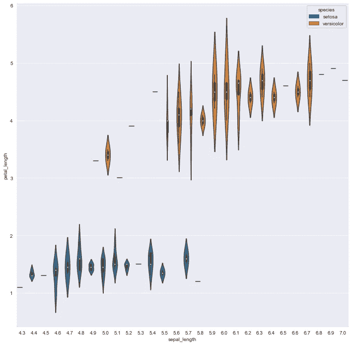

作者图片

# 结论

如你所见，现在有很多不同的方法来可视化你的数据。

数据可视化是机器学习中 ETL 过程的一个重要步骤。

它有助于您了解数据的分布、异常值，并让您深入了解数据。

事实上，它用一种不同的语言和你说话，更好地了解这种语言，有助于你在机器学习中成为一台真正的机器。

> “机器学习是人类需要做出的最后一项发明。”尼克·博斯特罗姆

为我订阅更多；

[](https://medium.com/subscribe/@geencay) [## 每当 Gencay I .发表文章时都收到电子邮件。

### 每当 Gencay I .发表文章时都收到电子邮件。通过注册，您将创建一个中型帐户，如果您还没有…

medium.com](https://medium.com/subscribe/@geencay)