# Python 中的机器学习项目-逐步预测员工流失

> 原文：<https://pub.towardsai.net/machine-learning-project-in-python-step-by-step-predicting-employee-attrition-eef6afc0959b?source=collection_archive---------0----------------------->

## 人工智能在人力资源中的应用:使用机器学习预测有价值员工的流失


由 [Marvin Meyer](https://unsplash.com/@marvelous?utm_source=medium&utm_medium=referral) 在 [Unsplash](https://unsplash.com?utm_source=medium&utm_medium=referral) 上拍摄的照片

# 人力资源和人工智能

一个组织的人力资源职能处理最有价值的资产:人。人力资源对企业的成功起着重要的作用。人力资源面临许多挑战，AI 可以帮助自动化和解决其中的一些挑战。

人工智能可以帮助人力资源完成几项任务。在人才获取方面，人工智能可以通过过滤最符合职位描述的简历来提供帮助，并通过推荐适合每个员工技能和目标的计划来促进人才发展。

另一方面，人工智能可能会在人力资源方面面临很多挑战，如低量的历史数据，员工的隐私问题，以及人工智能项目的低优先级。

# 预测员工流失

员工流失是人力资源组织主要关注的问题之一，因为它会导致专业知识的损失、生产力的损失、客户信誉的损失、雇佣成本、培训成本等等。员工因各种原因离职，如薪酬、工作满意度、绩效、主管等。

首先，人力资源需要收集一名员工的全面数据，如教育、工资、经验…我们还需要来自主管的数据，如绩效、关系、晋升…

之后，人力资源可以利用这些信息来预测员工的离职倾向，并采取预防措施。

# 探索性数据分析

深入的 EDA 可以在完整的笔记本中找到: [IBM HR Analytics💼员工流失&绩效](https://www.kaggle.com/faressayah/ibm-hr-analytics-employee-attrition-performance)

```
<class 'pandas.core.frame.DataFrame'>
RangeIndex: 1470 entries, 0 to 1469
Data columns (total 35 columns):
 #   Column                    Non-Null Count  Dtype 
---  ------                    --------------  ----- 
 0   Age                       1470 non-null   int64 
 1   Attrition                 1470 non-null   object
 2   BusinessTravel            1470 non-null   object
 3   DailyRate                 1470 non-null   int64 
 4   Department                1470 non-null   object
 5   DistanceFromHome          1470 non-null   int64 
 6   Education                 1470 non-null   int64 
 7   EducationField            1470 non-null   object
 8   EmployeeCount             1470 non-null   int64 
 9   EmployeeNumber            1470 non-null   int64 
 10  EnvironmentSatisfaction   1470 non-null   int64 
 11  Gender                    1470 non-null   object
 12  HourlyRate                1470 non-null   int64 
 13  JobInvolvement            1470 non-null   int64 
 14  JobLevel                  1470 non-null   int64 
 15  JobRole                   1470 non-null   object
 16  JobSatisfaction           1470 non-null   int64 
 17  MaritalStatus             1470 non-null   object
 18  MonthlyIncome             1470 non-null   int64 
 19  MonthlyRate               1470 non-null   int64 
 20  NumCompaniesWorked        1470 non-null   int64 
 21  Over18                    1470 non-null   object
 22  OverTime                  1470 non-null   object
 23  PercentSalaryHike         1470 non-null   int64 
 24  PerformanceRating         1470 non-null   int64 
 25  RelationshipSatisfaction  1470 non-null   int64 
 26  StandardHours             1470 non-null   int64 
 27  StockOptionLevel          1470 non-null   int64 
 28  TotalWorkingYears         1470 non-null   int64 
 29  TrainingTimesLastYear     1470 non-null   int64 
 30  WorkLifeBalance           1470 non-null   int64 
 31  YearsAtCompany            1470 non-null   int64 
 32  YearsInCurrentRole        1470 non-null   int64 
 33  YearsSinceLastPromotion   1470 non-null   int64 
 34  YearsWithCurrManager      1470 non-null   int64 
dtypes: int64(26), object(9)
memory usage: 402.1+ KB
```

我们注意到'`EmployeeCount`'、`Over18`'、`StandardHours`只有一个唯一值，而'`EmployeeNumber`有`1470`个唯一值。这些功能对我们没有用，所以我们将删除这些列。

## 结论:

*   `JobLevel`、`MonthlyIncome`、`YearAtCompany`、`TotalWorkingYears`低的员工更容易辞职。
*   经常出差的员工比其他员工更容易辞职。
*   `Research & Development`部门的员工比其他部门的员工更有可能留下来。
*   `EducationField`:拥有`Human Resources`和`Technical Degree`的员工比其他教育领域的员工更有可能辞职。
*   `Gender`:`Male`更有可能退出。
*   `JobRole`:在`Laboratory Technician`、`Sales Representative`、`Human Resources`岗位的工人更容易辞掉其他岗位的工人。
*   `MaritalStatus`:有`Single`婚姻状况的员工更有可能退出`Married`和`Divorced`。
*   工作时间越长的员工比其他人更容易辞职。

# 相关矩阵

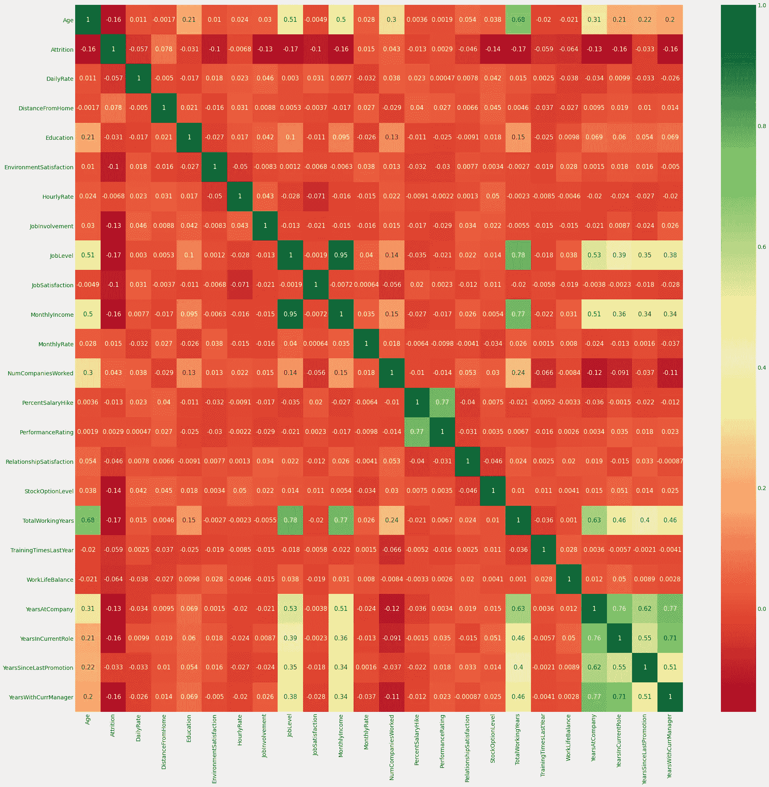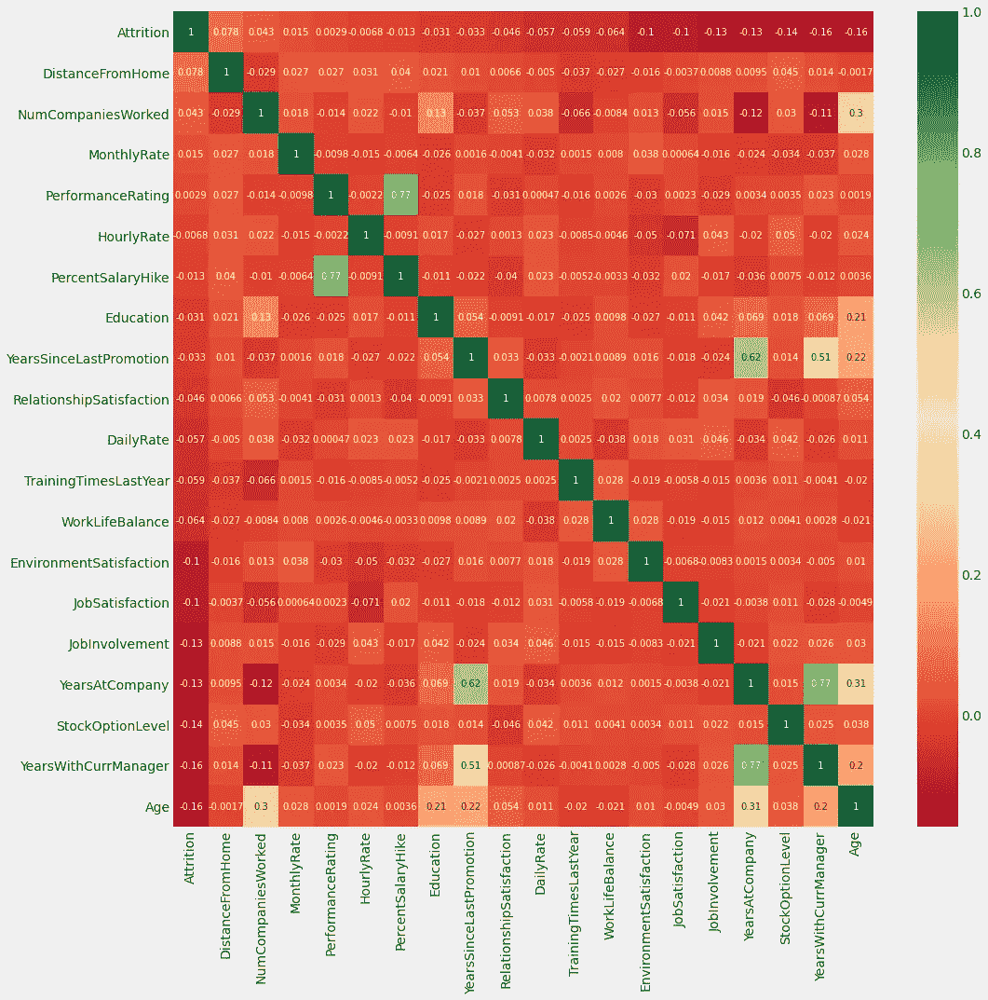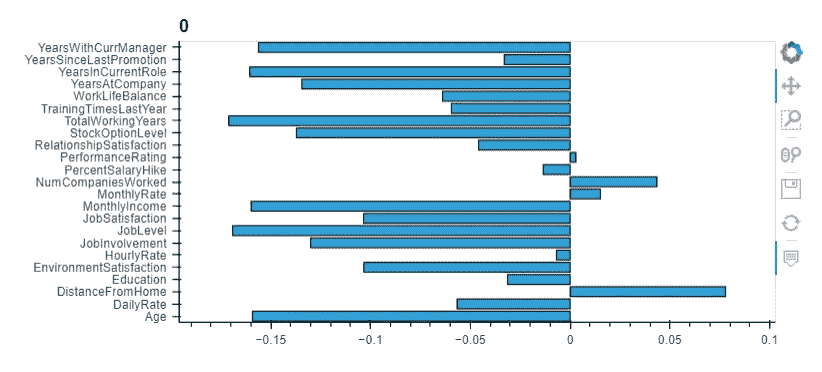

## 相关结果分析(样本分析):

*   月收入与工作级别高度相关。
*   工作级别与总工作时间高度相关。
*   月收入与总工作时间高度相关。
*   年龄也与总工作时间呈正相关。
*   婚姻状况与股票期权水平负相关

# 数据处理

将分类特征转换为机器可读数据

```
<class 'pandas.core.frame.DataFrame'>
RangeIndex: 1470 entries, 0 to 1469
Columns: 136 entries, Age to YearsWithCurrManager_17
dtypes: int64(9), uint8(127)
memory usage: 285.8 KB
```

检查重复记录和要素

```
(1470, 136)
(1470, 136)
```

```
92
```

# 应用机器学习算法

## 成功的定义是什么？

```
0.8390022675736961
```

我们有不平衡的数据，所以如果我们预测我们所有的员工都会留下来，我们就有了`83.90%`的准确性。

```
===============TRAIN=================
Staying Rate: 83.87%
Leaving Rate: 16.13%
===============TEST=================
Staying Rate: 83.90%
Leaving Rate: 16.10%
```

## 逻辑回归

```
TRAINIG RESULTS: 
===============================
CONFUSION MATRIX:
[[849  14]
 [ 59 107]]
ACCURACY SCORE:
0.9291
CLASSIFICATION REPORT:
               0      1  accuracy  macro avg  weighted avg
precision   0.94   0.88      0.93       0.91          0.93
recall      0.98   0.64      0.93       0.81          0.93
f1-score    0.96   0.75      0.93       0.85          0.92
support   863.00 166.00      0.93    1029.00       1029.00
TESTING RESULTS: 
===============================
CONFUSION MATRIX:
[[348  22]
 [ 43  28]]
ACCURACY SCORE:
0.8526
CLASSIFICATION REPORT:
               0     1  accuracy  macro avg  weighted avg
precision   0.89  0.56      0.85       0.73          0.84
recall      0.94  0.39      0.85       0.67          0.85
f1-score    0.91  0.46      0.85       0.69          0.84
support   370.00 71.00      0.85     441.00        441.00
```

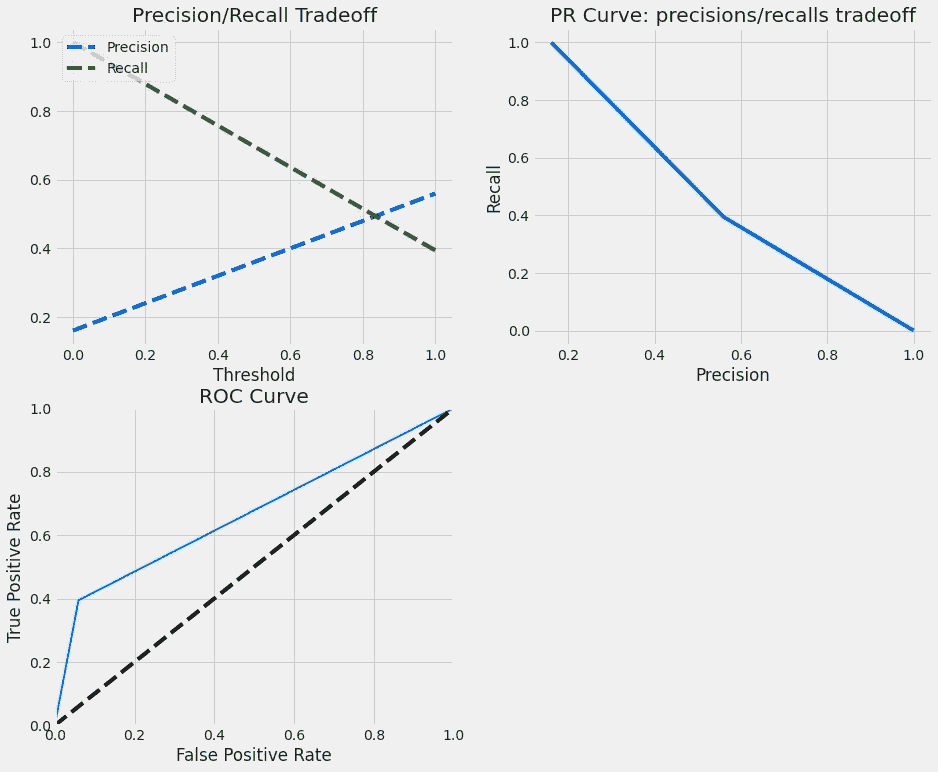

## 随机森林分类器

```
TRAINIG RESULTS: 
===============================
CONFUSION MATRIX:
[[863   0]
 [  0 166]]
ACCURACY SCORE:
1.0000
CLASSIFICATION REPORT:
               0      1  accuracy  macro avg  weighted avg
precision   1.00   1.00      1.00       1.00          1.00
recall      1.00   1.00      1.00       1.00          1.00
f1-score    1.00   1.00      1.00       1.00          1.00
support   863.00 166.00      1.00    1029.00       1029.00
TESTING RESULTS: 
===============================
CONFUSION MATRIX:
[[362   8]
 [ 63   8]]
ACCURACY SCORE:
0.8390
CLASSIFICATION REPORT:
               0     1  accuracy  macro avg  weighted avg
precision   0.85  0.50      0.84       0.68          0.80
recall      0.98  0.11      0.84       0.55          0.84
f1-score    0.91  0.18      0.84       0.55          0.79
support   370.00 71.00      0.84     441.00        441.00
```

```
Fitting 5 folds for each of 648 candidates, totalling 3240 fits [Parallel(n_jobs=-1)]: Using backend LokyBackend with 4 concurrent workers.
[Parallel(n_jobs=-1)]: Done  42 tasks      | elapsed:   16.8s
[Parallel(n_jobs=-1)]: Done 192 tasks      | elapsed:  1.1min
[Parallel(n_jobs=-1)]: Done 442 tasks      | elapsed:  2.6min
[Parallel(n_jobs=-1)]: Done 792 tasks      | elapsed:  4.8min
[Parallel(n_jobs=-1)]: Done 1242 tasks      | elapsed:  8.2min
[Parallel(n_jobs=-1)]: Done 1792 tasks      | elapsed: 11.8min
[Parallel(n_jobs=-1)]: Done 2442 tasks      | elapsed: 15.3min
[Parallel(n_jobs=-1)]: Done 3192 tasks      | elapsed: 20.9min
[Parallel(n_jobs=-1)]: Done 3240 out of 3240 | elapsed: 21.3min finished TRAINIG RESULTS: 
===============================
CONFUSION MATRIX:
[[863   0]
 [ 15 151]]
ACCURACY SCORE:
0.9854
CLASSIFICATION REPORT:
               0      1  accuracy  macro avg  weighted avg
precision   0.98   1.00      0.99       0.99          0.99
recall      1.00   0.91      0.99       0.95          0.99
f1-score    0.99   0.95      0.99       0.97          0.99
support   863.00 166.00      0.99    1029.00       1029.00
TESTING RESULTS: 
===============================
CONFUSION MATRIX:
[[360  10]
 [ 63   8]]
ACCURACY SCORE:
0.8345
CLASSIFICATION REPORT:
               0     1  accuracy  macro avg  weighted avg
precision   0.85  0.44      0.83       0.65          0.79
recall      0.97  0.11      0.83       0.54          0.83
f1-score    0.91  0.18      0.83       0.54          0.79
support   370.00 71.00      0.83     441.00        441.00
```

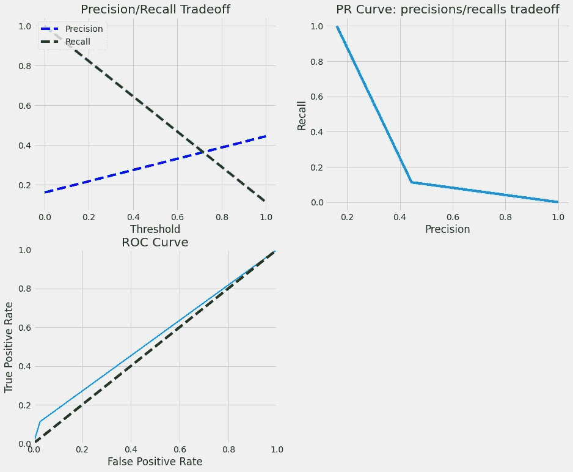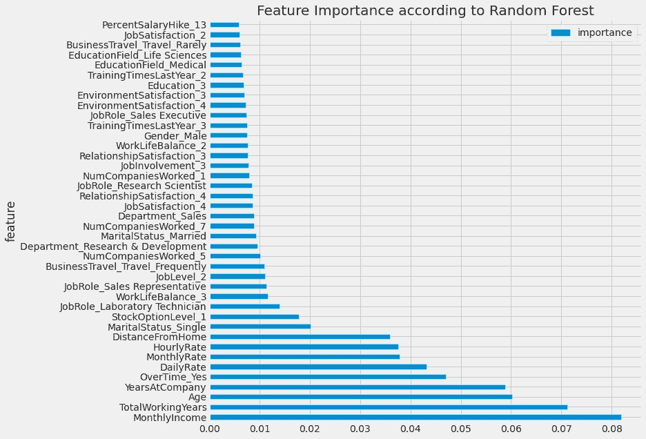

## 支持向量机

```
TRAINIG RESULTS: 
===============================
CONFUSION MATRIX:
[[855   8]
 [ 47 119]]
ACCURACY SCORE:
0.9466
CLASSIFICATION REPORT:
               0      1  accuracy  macro avg  weighted avg
precision   0.95   0.94      0.95       0.94          0.95
recall      0.99   0.72      0.95       0.85          0.95
f1-score    0.97   0.81      0.95       0.89          0.94
support   863.00 166.00      0.95    1029.00       1029.00
TESTING RESULTS: 
===============================
CONFUSION MATRIX:
[[345  25]
 [ 44  27]]
ACCURACY SCORE:
0.8435
CLASSIFICATION REPORT:
               0     1  accuracy  macro avg  weighted avg
precision   0.89  0.52      0.84       0.70          0.83
recall      0.93  0.38      0.84       0.66          0.84
f1-score    0.91  0.44      0.84       0.67          0.83
support   370.00 71.00      0.84     441.00        441.00
```

```
Fitting 3 folds for each of 12 candidates, totalling 36 fits [Parallel(n_jobs=1)]: Using backend SequentialBackend with 1 concurrent workers.
[Parallel(n_jobs=1)]: Done  36 out of  36 | elapsed:  6.6min finished GridSearchCV(cv=3, estimator=SVC(random_state=42),
             param_grid=[{'C': [1, 10, 100, 1000], 'kernel':['linear']},
             {'C': [1, 10, 100, 1000], 'gamma': [0.001, 0.0001],
                          'kernel': ['rbf']}],
             scoring='roc_auc', verbose=1)TRAINIG RESULTS: 
===============================
CONFUSION MATRIX:
[[862   1]
 [  6 160]]
ACCURACY SCORE:
0.9932
CLASSIFICATION REPORT:
               0      1  accuracy  macro avg  weighted avg
precision   0.99   0.99      0.99       0.99          0.99
recall      1.00   0.96      0.99       0.98          0.99
f1-score    1.00   0.98      0.99       0.99          0.99
support   863.00 166.00      0.99    1029.00       1029.00
TESTING RESULTS: 
===============================
CONFUSION MATRIX:
[[346  24]
 [ 42  29]]
ACCURACY SCORE:
0.8503
CLASSIFICATION REPORT:
               0     1  accuracy  macro avg  weighted avg
precision   0.89  0.55      0.85       0.72          0.84
recall      0.94  0.41      0.85       0.67          0.85
f1-score    0.91  0.47      0.85       0.69          0.84
support   370.00 71.00      0.85     441.00        441.00
```

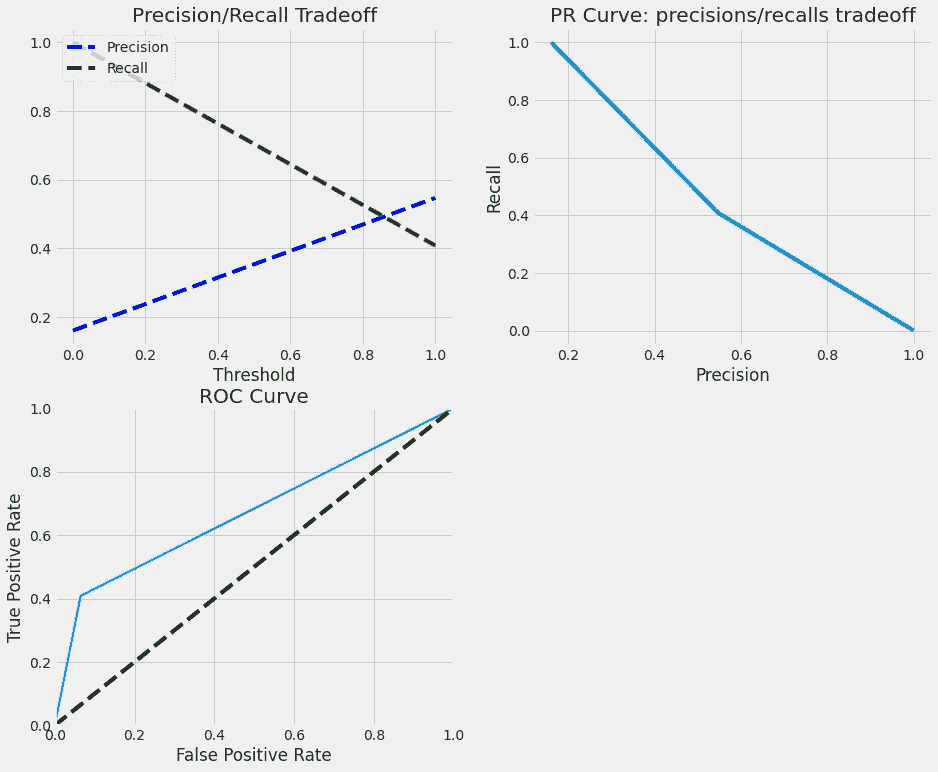

## XGBoost 分类器

```
TRAINIG RESULTS: 
===============================
CONFUSION MATRIX:
[[863   0]
 [  0 166]]
ACCURACY SCORE:
1.0000
CLASSIFICATION REPORT:
               0      1  accuracy  macro avg  weighted avg
precision   1.00   1.00      1.00       1.00          1.00
recall      1.00   1.00      1.00       1.00          1.00
f1-score    1.00   1.00      1.00       1.00          1.00
support   863.00 166.00      1.00    1029.00       1029.00
TESTING RESULTS: 
===============================
CONFUSION MATRIX:
[[360  10]
 [ 52  19]]
ACCURACY SCORE:
0.8594
CLASSIFICATION REPORT:
               0     1  accuracy  macro avg  weighted avg
precision   0.87  0.66      0.86       0.76          0.84
recall      0.97  0.27      0.86       0.62          0.86
f1-score    0.92  0.38      0.86       0.65          0.83
support   370.00 71.00      0.86     441.00        441.00
```

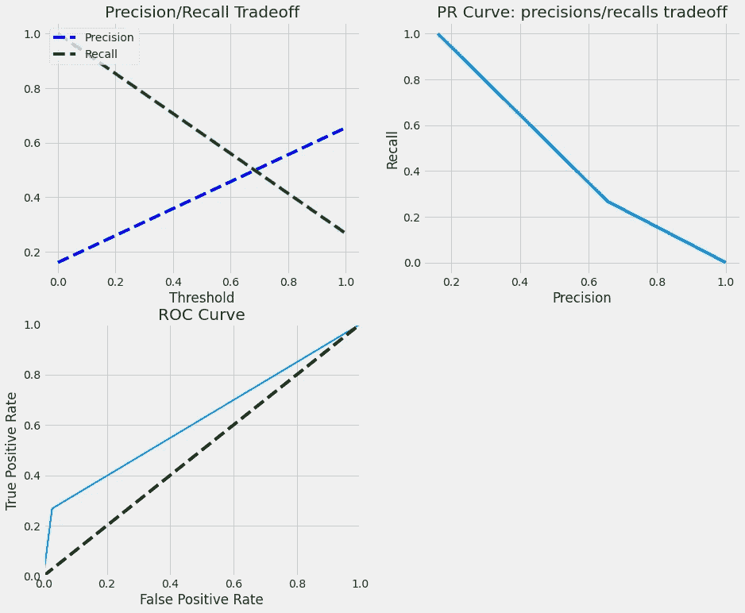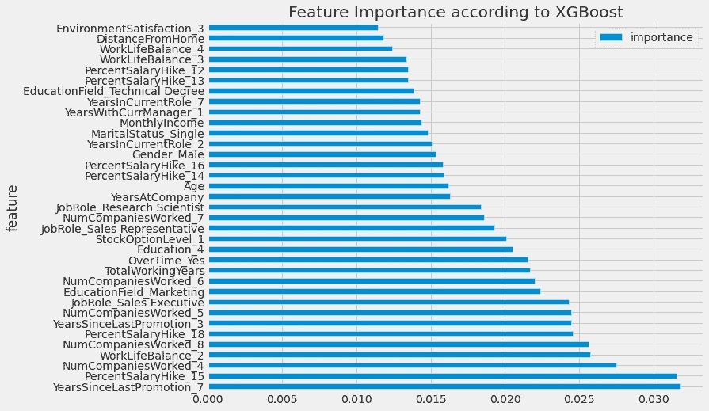

## LightGBM

```
TRAINIG RESULTS: 
===============================
CONFUSION MATRIX:
[[863   0]
 [  0 166]]
ACCURACY SCORE:
1.0000
CLASSIFICATION REPORT:
               0      1  accuracy  macro avg  weighted avg
precision   1.00   1.00      1.00       1.00          1.00
recall      1.00   1.00      1.00       1.00          1.00
f1-score    1.00   1.00      1.00       1.00          1.00
support   863.00 166.00      1.00    1029.00       1029.00
TESTING RESULTS: 
===============================
CONFUSION MATRIX:
[[357  13]
 [ 53  18]]
ACCURACY SCORE:
0.8503
CLASSIFICATION REPORT:
               0     1  accuracy  macro avg  weighted avg
precision   0.87  0.58      0.85       0.73          0.82
recall      0.96  0.25      0.85       0.61          0.85
f1-score    0.92  0.35      0.85       0.63          0.82
support   370.00 71.00      0.85     441.00        441.00
```

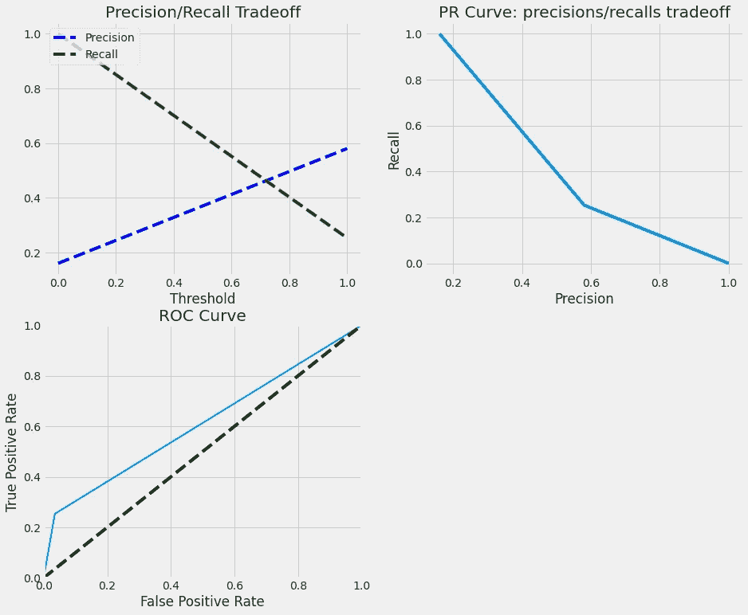

## CatBoost

```
TRAINIG RESULTS: 
===============================
CONFUSION MATRIX:
[[863   0]
 [ 17 149]]
ACCURACY SCORE:
0.9835
CLASSIFICATION REPORT:
               0      1  accuracy  macro avg  weighted avg
precision   0.98   1.00      0.98       0.99          0.98
recall      1.00   0.90      0.98       0.95          0.98
f1-score    0.99   0.95      0.98       0.97          0.98
support   863.00 166.00      0.98    1029.00       1029.00
TESTING RESULTS: 
===============================
CONFUSION MATRIX:
[[361   9]
 [ 58  13]]
ACCURACY SCORE:
0.8481
CLASSIFICATION REPORT:
               0     1  accuracy  macro avg  weighted avg
precision   0.86  0.59      0.85       0.73          0.82
recall      0.98  0.18      0.85       0.58          0.85
f1-score    0.92  0.28      0.85       0.60          0.81
support   370.00 71.00      0.85     441.00        441.00
```

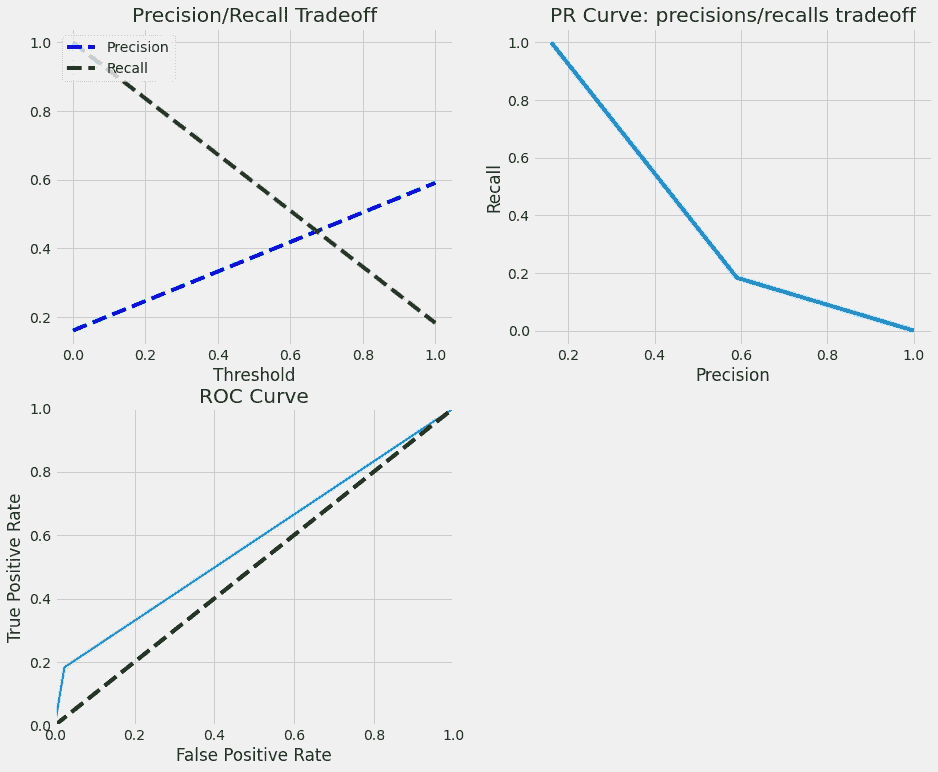

## adaboost 算法

```
TRAINIG RESULTS: 
===============================
CONFUSION MATRIX:
[[843  20]
 [ 88  78]]
ACCURACY SCORE:
0.8950
CLASSIFICATION REPORT:
               0      1  accuracy  macro avg  weighted avg
precision   0.91   0.80      0.90       0.85          0.89
recall      0.98   0.47      0.90       0.72          0.90
f1-score    0.94   0.59      0.90       0.77          0.88
support   863.00 166.00      0.90    1029.00       1029.00
TESTING RESULTS: 
===============================
CONFUSION MATRIX:
[[344  26]
 [ 52  19]]
ACCURACY SCORE:
0.8231
CLASSIFICATION REPORT:
               0     1  accuracy  macro avg  weighted avg
precision   0.87  0.42      0.82       0.65          0.80
recall      0.93  0.27      0.82       0.60          0.82
f1-score    0.90  0.33      0.82       0.61          0.81
support   370.00 71.00      0.82     441.00        441.00
```

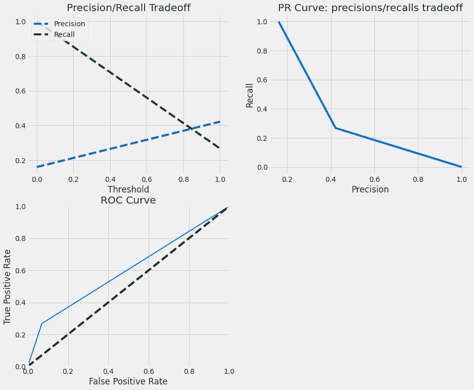

# 比较模型性能

```
RANDOM FOREST                  roc_auc_score: 0.543
XGBOOST                        roc_auc_score: 0.620
LOGISTIC REGRESSION            roc_auc_score: 0.546
SUPPORT VECTOR MACHINE         roc_auc_score: 0.500
LIGHTGBM                       roc_auc_score: 0.609
CATBOOST                       roc_auc_score: 0.579
ADABOOST                       roc_auc_score: 0.599
```


# 结论

在本文中，我们学习了如何开发一个机器学习模型来预测员工流失。我们使用了各种 ML 算法，包括人工神经网络和基于树的模型。由于问题的复杂性和少量的数据，模型倾向于过度拟合训练数据。